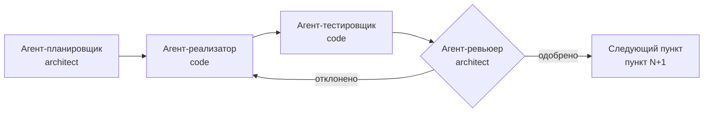

# Workflow: Последовательные архитектурные улучшения по агентам

Назначение — многоразовый конвейер, в котором **каждый пункт улучшений выполняет отдельный агент в своём режиме**, а агенты работают **строго последовательно** (следующий начинается только после того, как предыдущий вернул результат и ревью пройдено).

## Важные правила

1. **Последовательность обязательна.** Агенты никогда не запускаются параллельно. Один пункт завершён (включая ревью) → только тогда запускается следующий.
2. **Каждая роль — отдельный запуск агента** через механизм делегирования (новый режим/подзадача). Не смешивай роли в одном запуске.
3. Если ревью не пройдено — **не переходи к следующему пункту**. Возвращай управление на реализатора (правка) или планировщика (переплан) до тех пор, пока ревью не закроет пункт.
4. Перед любым нетривиальным изменением кода создавай/обновляй план в `workflow_plans/*.md`.
5. Всё логируй: каждый пункт, статус, решения ревьюера — в общий журнал прогресса (см. Фаза 0).

---

## Фаза 0. Аудит и формирование списка пунктов

Выполняется **одним агентом в режиме `architect`** (планировщик-аудитор).

1. Проведи архитектурный обзор проекта: зависимости `.csproj`, `using` между слоями, наличие мёртвого кода, «протекающие» интерфейсы, запутанность и сложность кода.
2. Опирайся на существующие отчёты (если актуальны):
   - `plans/architecture-review-report.md`
   - `plans/architecture-fix-execution-plan.md`
   - любые свежие `plans/code-review-*.md`
3. Составь **нумерованный список пунктов** улучшений (формат — см. ниже). Сохрани его в `workflow_plans/architecture-workflow-items.md`.
4. Создай **журнал прогресса** `workflow_plans/architecture-workflow-progress.md` со структурой:

   ```
   | Пункт | Роль | Статус | Результат | Ревью | Комментарий |
   ```

   Каждая строка обновляется по мере выполнения пунктов. Это единственный источник истины о состоянии конвейера.

### Формат пункта
```
## Пункт N. <краткое название>
- Проблема: <что не так / что упростить / что улучшить>
- Целевой результат (DoD): <конкретно, проверяемо>
- Затрагиваемые файлы: <пути, если известны>
- Риски: <что может сломаться>
```

---

## Фаза 1. Конвейер для каждого пункта (последовательно)

Для **каждого пункта** `N` из списка выполняется ровно 4 шага, каждый — **отдельный агент** в своём режиме.



> Порядок агентов внутри пункта не нарушается. Переход к `N+1` происходит **только** после одобрения ревьюера пункта `N`.

### Шаг 1. Агент-планировщик (режим `architect`)

Задача: составить детальный план улучшения **только для пункта `N`**.

- Создай план `workflow_plans/architecture-item-N-<slug>.md`:
  - текущее состояние и проблема;
  - пошаговые изменения (файлы, методы, сигнатуры);
  - метрика завершения (DoD) — проверяемо;
  - план обновления/добавления тестов;
  - риски и как проверить, что ничего не сломалось.
- **Стоп-условие:** план не переходит дальше, пока не согласован (утверждён). Верни результат с готовым планом.
- Не пишешь код реализации — только план.

### Шаг 2. Агент-реализатор (режим `code`)

Задача: реализовать план пункта `N` в коде.

- Получает утверждённый план `workflow_plans/architecture-item-N-*.md`.
- Вносит изменения строго по плану. Соблюдает правила проекта (`CLAUDE.md`): `async/await`, `using` явно, `dotnet format` перед завершением.
- Не запускает полный прогон тестов — это задача тестировщика (может сделать локальную сборку для самопроверки).
- Верни результат: список изменённых файлов + подтверждение, что план исполнен по DoD.

### Шаг 3. Агент-тестировщик (режим `code`)

Задача: проверить, что изменения пункта `N` не сломали проект.

- Запусти сборку решения: `dotnet build MarketDataCollector.sln`.
- Обнови/добавь тесты по плану (если требуется).
- Запусти полный прогон тестов: `dotnet test MarketDataCollector.sln`.
- Верни результат: вывод `dotnet test` (кол-во пройдено/провалено) + список тестов, добавленных/изменённых.
- **Стоп-условие:** при падении тестов — верни ошибку реализатору (Шаг 2) для исправления, не передавая пункт ревьюеру.

### Шаг 4. Агент-ревьюер (режим `architect` или `code`)

Задача: провести код-ревью пункта `N`.

- Проверь: изменения соответствуют плану и DoD, нет регрессий в тестах, код соответствует стилю проекта и не добавляет новой запутанности.
- **Вердикт:**
  - `Одобрено` → обнови журнал прогресса, верни результат, переходи к пункту `N+1` (Шаг 1).
  - `Отклонено` → верни реализатору (Шаг 2) с конкретными замечаниями. При крупных замечаниях — верни планировщику (Шаг 1) для переплана.
- Замечания фиксируй в журнале прогресса.

---

## Фаза 2. Завершение

После прохождения всех пунктов списка:

1. Финальная сборка и полный прогон тестов.
2. Итоговый отчёт: обнови `workflow_plans/architecture-workflow-progress.md`, отметь все пункты, собери сводку изменений.
3. Если в ходе конвейера обнаружены новые пункты — они добавляются в конец списка и проходят тот же цикл.

---

## Переменные (уточни у пользователя, если не заданы)

- `ITEMS_FILE` — путь к списку пунктов (по умолчанию `workflow_plans/architecture-workflow-items.md`)
- `PROGRESS_FILE` — путь к журналу прогресса (по умолчанию `workflow_plans/architecture-workflow-progress.md`)
- `START_ITEM` — с какого пункта начинать (по умолчанию с первого невыполненного)

## Готовый к использованию стартовый список пунктов

На основе `plans/architecture-review-report.md`:

1. **Вынести Kafka за абстракцию `ICandlePublisher` и убрать `Application → Infrastructure`** — `TickAggregator` использует конкретный `KafkaCandleProducer` (см. `architecture-fix-execution-plan.md`, Задача 1).
2. **Очистить Domain от EF-атрибутов и Npgsql, перенести маппинг в Fluent API** — сущности `RawTick`, `ConnectionLog`, `AggregatedData` (Задача 2).
3. **Убрать Npgsql-специфичную обработку из Application** — `MarketDataProcessor` ловит `NpgsqlException` (Задача 3).
4. **Убрать технологическую лексику из интерфейсов Core** — `IRawTickRepository.BulkCopyAsync` (Npgsql COPY-семантика).
5. **Удалить или подключить мёртвый `DataStorageService`** — не зарегистрирован в DI.
