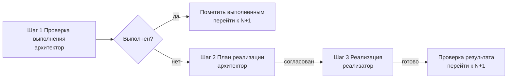

# Workflow: Последовательное выполнение пунктов

Назначение — универсальный конвейер, который проходит по **внешнему списку пунктов строго по одному**, и для каждого пункта выполняет цикл из трёх шагов: **проверка → план → реализация**. Воркфлоу не привязан к конкретной предметной области (не только архитектура) — подходит для любых списков задач, рефакторингов, оптимизаций, исправлений.

## Важные правила

1. **Последовательность обязательна.** Пункты никогда не выполняются параллельно и не переставляются. Переход к пункту `N+1` происходит **только** после завершения пункта `N`.
2. **Каждый пункт проходит ровно 3 шага:** проверка выполнения → план реализации → реализация. Порядок шагов не нарушается.
3. **Проверка выполнения — первична.** Если пункт уже выполнен (соответствует DoD) — он помечается выполненным, и реализация **пропускается**. Ничего не делаем с уже сделанным.
4. **План перед нетривиальной реализацией обязателен.** Для простых/точечных правок план может быть кратким, но перед любым нетривиальным изменением создавай/обновляй план в `workflow_plans/*.md`.
5. **Перед реализацией план должен быть согласован (утверждён).** Если пункт нетривиальный — остановись и согласуй план, прежде чем писать код.
6. **Всё логируй:** каждый пункт, его статус и результат — в общий журнал прогресса (см. Фазу 0).

---

## Фаза 0. Подготовка

Выполняется один раз при запуске воркфлоу.

1. Определи **список пунктов** — путь к файлу `workflow_plans/*-workflow-items.md` (переменная `ITEMS_FILE`). Если файл не задан — спроси у пользователя.
2. Создай **журнал прогресса** `workflow_plans/*-workflow-progress.md` (переменная `PROGRESS_FILE`) со структурой:

   ```
   | Пункт | Статус | Результат | Комментарий |
   ```

   Это единственный источник истины о состоянии конвейера.

### Формат пункта в списке

Каждый пункт описывается одинаково:

```
## Пункт N. <краткое название>
- Описание/Проблема: <что нужно сделать / что не так>
- Целевой результат (DoD): <конкретно, проверяемо>
- Затрагиваемые файлы: <пути, если известны>
- Риски: <что может сломаться>
```

Статус пункта в списке: `[ ]` — не выполнен, `[x]` — выполнен (реализован и подтверждён).

---

## Фаза 1. Конвейер для каждого пункта (последовательно)

Для **каждого пункта** `N` из списка выполняется цикл из 3 шагов строго по порядку.



> Переход к `N+1` происходит **только** после того, как пункт `N` реализован (или признан уже выполненным) и результат подтверждён.

### Шаг 1. Проверка выполнения пункта `N`

Роль: планировщик (режим `architect`).

1. Изучи описание пункта и его **DoD** (целевой результат).
2. Проверь текущее состояние кода/файлов/конфигурации — соответствует ли оно DoD?
3. **Вердикт:**
   - Пункт **уже выполнен** → обнови журнал прогресса (статус `✅`, комментарий «уже выполнено, реализация не требуется»), отметь пункт `[x]` в списке и переходи к пункту `N+1` (Шаг 1).
   - Пункт **не выполнен** → переходи к Шагу 2 (план реализации).

### Шаг 2. План реализации пункта `N`

Роль: планировщик (режим `architect`).

1. Составь детальный план реализации **только для пункта `N`**: пошаговые изменения, затрагиваемые файлы, сигнатуры, порядок действий.
2. Опиши, как проверить результат (DoD) — что должно подтвердить выполнение.
3. Опиши риски и как убедиться, что ничего не сломается.
4. **Стоп-условие:** план не переходит к реализации, пока не согласован (утверждён). Для простых правок — верни краткий план сразу; для нетривиальных — создай файл плана `workflow_plans/*-item-N-<slug>.md` и согласуй.
5. Не пишешь код реализации — только план.

### Шаг 3. Реализация пункта `N`

Роль: реализатор (режим `code`).

1. Получает согласованный план (Шаг 2).
2. Вносит изменения **строго по плану**. Соблюдает правила проекта: `async/await`, `using` явно, логирование через `ILogger<T>`, `ArgumentNullException.ThrowIfNull()`, `dotnet format` перед завершением.
3. После внесения изменений **проверь результат** по DoD: собери проект, при необходимости запусти затронутые тесты.
4. Верни результат: список изменённых файлов + подтверждение, что DoD выполнен.
5. Обнови журнал прогресса (статус `✅`) и отметь пункт `[x]` в списке.

> Если в ходе реализации выяснилось, что план неверен или неполон — вернись на Шаг 2 (пересогласование плана), а не «додумывай» по ходу.

---

## Фаза 2. Завершение

После прохождения всех пунктов списка:

1. Финальная сборка и (при необходимости) полный прогон тестов.
2. Итоговый отчёт: обнови `workflow_plans/*-workflow-progress.md`, отметь все пункты, собери сводку изменений.
3. Если в ходе конвейера обнаружены новые пункты — они добавляются в конец списка и проходят тот же цикл.

---

## Переменные (уточни у пользователя, если не заданы)

- `ITEMS_FILE` — путь к списку пунктов (по умолчанию `workflow_plans/<slug>-workflow-items.md`)
- `PROGRESS_FILE` — путь к журналу прогресса (по умолчанию `workflow_plans/<slug>-workflow-progress.md`)
- `START_ITEM` — с какого пункта начинать (по умолчанию с первого невыполненного)

## Применение

Воркфлоу универсален. Подходит, например, для:
- списка архитектурных улучшений;
- списка оптимизаций производительности;
- списка исправлений багов;
- списка задач рефакторинга.

Для каждого конкретного применения создаётся свой файл-список и свой журнал прогресса (например, `optimization-workflow-items.md` и `optimization-workflow-progress.md`), а сам воркфлоу остаётся неизменным.
