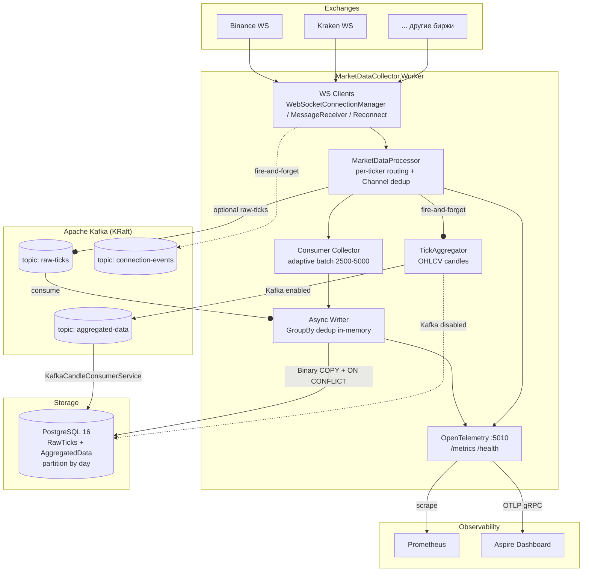
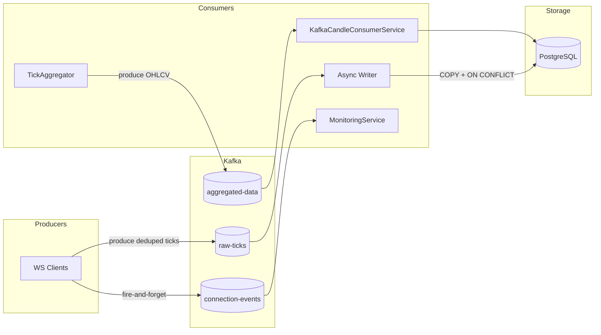

# Системный дизайн: Market Data Collector

> **Формат:** ответ на собеседовании по системному дизайну.
> **Тема:** высоконагруженная система сбора, обработки и хранения рыночных (тиковых) данных с криптобирж в реальном времени.
> **Стек (реальный проект):** .NET 8, PostgreSQL 16, Kafka, OpenTelemetry/Prometheus, WebSocket, Docker.
> **Фактические результаты нагрузки:** ~25 000 msg/s на входе, запись ~21–28K ticks/sec, ~265 Б аллокаций на тик, dropped = 0, ~97% тиков записано в БД.

---

## Оглавление

1. [Постановка задачи и требования](#1-постановка-задачи-и-требования)
2. [Оценка нагрузки и ёмкости (Capacity Estimation)](#2-оценка-нагрузки-и-ёмкости-capacity-estimation)
3. [Высокоуровневая архитектура](#3-высокоуровневая-архитектура)
4. [Детальный дизайн: горячий путь (Hot Path)](#4-детальный-дизайн-горячий-путь-hot-path)
5. [Дедупликация данных](#5-дедупликация-данных)
6. [Схема данных PostgreSQL](#6-схема-данных-postgresql)
7. [Агрегация OHLCV-свечей](#7-агрегация-ohlcv-свечей)
8. [Отказоустойчивость и надёжность](#8-отказоустойчивость-и-надёжность)
9. [Масштабирование](#9-масштабирование)
10. [Наблюдаемость (Observability)](#10-наблюдаемость-observability)
11. [Ключевые компромиссы и решения](#11-ключевые-компромиссы-и-решения)
12. [Что бы я сделал дальше](#12-что-бы-я-сделал-дальше)

---

## 1. Постановка задачи и требования

### Функциональные требования
- **Сбор данных:** непрерывно подключаться к криптобиржам через WebSocket и получать тики (сделки) по нескольким торговым парам/символам одновременно.
- **Нормализация:** приводить разнородные форматы разных бирж к единому внутреннему представлению `TickData` (иммутабельный value-type).
- **Дедупликация:** исключать повторную запись одних и тех же тиков (сеть, реконнекты, переподписка).
- **Хранение:** сохранять сырые тики в PostgreSQL, поддерживая высокую скорость записи.
- **Агрегация (опционально):** строить OHLCV-свечи (open/high/low/close/volume) за заданный интервал и публиковать их через Kafka или писать в БД.
- **Мониторинг:** метрики производительности, health-check, трейсинг.

### Нефункциональные требования
- **Производительность:** обрабатывать десятки тысяч сообщений в секунду с минимальным аллокациями (low GC-давление).
- **Надёжность:** не терять данные при graceful shutdown; переживать обрывы WebSocket и сбои БД.
- **Масштабируемость:** вертикально и горизонтально масштабироваться при росте числа бирж/символов.
- **Наблюдаемость:** метрики, трейсы и структурированные логи в проде.
- **Целостность:** отсутствие дубликатов на уровне БД в конечном итоге.

### Ключевые вызовы (challenges)
1. **High throughput + low latency:** тики приходят очень быстро, каждый обрабатывается в «горячем пути».
2. **GC-давление:** аллокации на тик напрямую бьют по пропускной способности.
3. **Дубликаты:** протоколы бирж не гарантируют exactly-once.
4. **Lock contention и deadlock'и БД** при параллельной записи.
5. **Backpressure:** что делать, когда БД не успевает за входящим потоком.

---

## 2. Оценка нагрузки и ёмкости (Capacity Estimation)

### Входной поток
- Средняя биржа по одному символу даёт порядка **5–25 тыс. сделок/сек** (BTC/USDT на Binance в пике).
- Возьмём целевую проектировочную цифру: **~25 000 msg/s** на узел.

### Расчёт по времени
| Метрика | Значение | Оценка |
|---------|----------|--------|
| RPS на входе | 25 000 msg/s | Реальная нагрузка FakeTickServer |
| Сообщений в час | 25 000 × 3600 = **90 млн msg/h** |
| Сообщений в сутки | 90 млн × 24 = **~2,16 млрд msg/day** |
| Размер тика | ~150–250 Б (JSON) / ~70–100 Б (бинарный, нормализованный) | Поле `timestamp`, `ticker`, `exchange`, `price`, `quantity` |
| Сырой трафик входа | 25 000 × 200 Б ≈ **5 МБ/с (~40 Мбит/с)** |
| Рост БД в сутки (1 узел) | 2,16 млрд × ~0,1 КБ ≈ **~200–250 ГБ/день** (без партиционирования и TTL это много) | → требуется партиционирование и retention |

### Запись в БД
- Реальная пропускная способность записи одного Writer'а: **~21–28K ticks/sec** при входе 23–25K msg/s.
- Это означает, что **один узел** (1 consumer + 1 writer) работает впритык к входящему потоку — что и мотивирует режим Multiple Consumers и/или горизонтальное масштабирование при росте.

### Итоговая оценка
> Система должна быть спроектирована так, чтобы один узел переваривал **~25K msg/s**, а при превышении этого порога — масштабироваться добавлением consumer'ов/узлов. Объём данных большой → нужны партиционирование по дням и политика retention.

---

## 3. Высокоуровневая архитектура

### Слоистая архитектура (Clean Architecture + SOLID)

```
┌──────────────────────────────────────────────────────────────────────────┐
│  MarketDataCollector.Worker (background service, HTTP :5010)            │
│  /health, /metrics, DI-контейнер, OpenTelemetry                         │
└──────────┬───────────────────────────────────────────────────────────────┘
           │
┌──────────▼───────────────────────────────────────────────────────────────┐
│  Application layer (бизнес-логика)                                       │
│  MarketDataProcessor  DeduplicationCache  TickAggregator  Monitoring    │
└──────────┬───────────────────────────────────────────────────────────────┘
           │ реализует интерфейсы
┌──────────▼───────────────────────────────────────────────────────────────┐
│  Infrastructure layer (реализации)                                       │
│  BinanceWebSocketClient  RawTickRepository  Kafka*  DbContext           │
└──────────┬───────────────────────────────────────────────────────────────┘
           │
┌──────────▼───────────────────────────────────────────────────────────────┐
│  Core layer (интерфейсы) + Domain (сущности)                            │
│  I*  BaseWebSocketClient  MarketDataTelemetry                           │
└──────────────────────────────────────────────────────────────────────────┘
```

**Принципы:**
- **Dependency Inversion:** все межслойные связи через интерфейсы (`IWebSocketClient`, `IMarketDataProcessor`, `IRawTickRepository` и др.) — 14 раздельных интерфейсов вместо монолита (ISP).
- **Open/Closed:** новая биржа добавляется наследованием от `BaseWebSocketClient`, не трогая ядро.
- **Single Responsibility:** соединение, приём, переподключение, подписка — отдельные компоненты (Bridge pattern).

### Компонентная диаграмма (Production view)

```
                        ┌─────────────┐
                        │   Binance   │  (и др. биржи)
                        └──────┬──────┘
                               │ WebSocket (ws://)
                    ┌──────────▼──────────┐
                    │  MarketDataCollector│
                    │       Worker        │
                    │ ┌─────────────────┐ │
                    │ │  WS Clients     │ │  ← N клиентов, per-symbol подписки
                    │ │  (Channel-based)│ │
                    │ └────────┬────────┘ │
                    │ ┌────────▼────────┐ │
                    │ │  Processor      │ │  ← Channel<TickData> + batch + dedup
                    │ └────────┬────────┘ │
                    │ ┌────────▼────────┐ │
                    │ │  Async Writer   │ │  ← Channel<CollectedBatch> (backpressure)
                    │ └────────┬────────┘ │
                    └──────────┼──────────┘
                        POSTGRES│   │Kafka (опционально)
                     ┌──────────▼── ▼───────────┐
                     │ PostgreSQL 16            │  ← RawTicks, AggregatedData
                     │ (Binary COPY, partitions)│
                     └──────────────────────────┘
```

### Поток данных (end-to-end)

```
Binance WS (JSON)
   │  BinanceWebSocketClient.ProcessMessageAsync()
   │  └  парсинг → TickData; метрика ws.messages.received
   ▼
IWebSocketMessageReceiver (цикл приёма)
   ▼
IMarketDataProcessor.ProcessTickAsync()
   │  per-ticker routing: hash(ticker) % consumerCount
   │  метрика ticks.incoming
   ▼
Channel<TickData> (SingleReader=true, DropOldest; или N каналов)
   ▼
Consumer (Collector)
   │  накопление батча (adaptive 2500–5000)
   │  дедупликация через DeduplicationCache
   │  метрики ticks.received, backlog, channel fill
   ▼
Channel<CollectedBatch> (Async Writer, FullMode=Wait → backpressure)
   ▼
Async Writer
   │  GroupBy (ticker, exchange, timestamp) в памяти
   ▼
RawTickRepository.BulkCopyAsync()
   │  Binary COPY → temp table → INSERT ON CONFLICT DO NOTHING
   │  метрики ticks.processed, batch.size, write.duration
   ▼
PostgreSQL (RawTicks, partition by day)
```

> **Kafka здесь — явный транспорт/буфер**, а не дедупликатор. Он используется в двух местах:
> 1. **`raw-ticks`** — (опционально) буферизация сырых тиков, развязывающая нагрузку от пиков входа и консьюминга.
> 2. **`aggregated-data`** — публикация OHLCV-свечей агрегатором → независимые потребители (`KafkaCandleConsumerService`) → PostgreSQL.
>
> Гарантированную дедупликацию по ключу Kafka сама не даёт (см. [§11 «Почему не дедуплицируем в Kafka»](#11-ключевые-компромиссы-и-решения)) — поэтому строгая точка отсечки — unique-индекс в БД.

### Mermaid: полный пайплайн с явным Kafka



### Mermaid: компоненты с Kafka-топиками



---

## 4. Детальный дизайн: горячий путь (Hot Path)

Главная инженерная задача — обработать **~25K msg/s** с минимальными аллокациями и без блокировок на медленных операциях.

### 4.1 WebSocket-клиент (Bridge-декомпозиция)

Монолитный клиент разделён на 4 связанные, но независимые сущности:
- `WebSocketConnectionManager` — жизненный цикл соединения.
- `WebSocketMessageReceiver` — цикл чтения сообщений (держит присоединённую задачу).
- `SubscriptionManager` — подписка на символы с retry.
- `ExponentialReconnectStrategy` — стратегия переподключения (backoff + jitter).

**Почему:** каждая ответственность переиспользуема и тестируется отдельно; добавление новой биржи не дублирует логику.

### 4.2 Единый value-type `TickData`

`TickData` — иммутабельный `record struct` (value type).
- **Плюс:** передаётся по значению, не аллоцирует на куче, дружелюбен к GC.
- **Ключ к низким аллокациям** — ~265 Б/тик суммарно.

### 4.3 Канал + Single Reader

```
ProcessTickAsync ──(TryWrite/Write)──► Channel<TickData> ──(drain)──► Collector
```

- **`SingleReader=true`** — канал читается ровно одним consumer'ом → **нет lock contention**, нет deadlock'ов.
- **`DropOldest`** (или `TryWrite` + счётчик дропов) — защита от OOM, если потребление отстаёт.
- **Backpressure в Batch Channel:** writer-канал использует режим **Wait** → при заполнении Producer блокируется, «тормозя» весь конвейер синхронно, но не теряя данные.

Это решает проблему «БД не успевает»: вместо потери данных — обратное давление на источник.

### 4.4 Adaptive Batch Size

Размер батча подстраивается под текущую ситуацию:
- Линейная интерполяция между `MinBatchSize` и `MaxBatchSize` по диапазону backlog (`BacklogLowThreshold`..`BacklogHighThreshold`).
- При замедлении записи (`WriteDurationWarningMs`) размер батча дополнительно снижается на 20%.
- `MinPartialBatchSize` — защита от микробатчей при flush по таймеру.

**Почему важно:** крупные батчи = меньше round-trip'ов к БД и выше throughput COPY; но слишком крупные = выше латентность и больше пик памяти. Адаптация балансирует оба фактора.

### 4.5 Async Writer как отдельный канал

- Collector **не пишет в БД** синхронно — он формирует `CollectedBatch` и отправляет его Async Writer'у через отдельный `Channel<CollectedBatch>`.
- Это **развязывает скорость накопления и скорость записи**, предотвращая блокировку горячего пути.

**Схема каналов:**
```
Channel<TickData>        (вход, SingleReader)
        │
        ▼
Collector ───► Channel<CollectedBatch> (async write, FullMode=Wait)
                  │
                  ▼
              Async Writer ──► PostgreSQL (Binary COPY)
```

### 4.6 Single Consumer vs Multiple Consumers

| Режим | Когда использовать | Как работает |
|-------|--------------------|--------------|
| **Single Consumer** (default) | throughput ≤ ~25K ticks/sec, приоритет — простота и отсутствие deadlock'ов | 1 consumer + 1 writer, `SingleReader=true` |
| **Multiple Consumers** | throughput > 25K ticks/sec, нужно горизонтальное наращивание | N consumer'ов, **per-ticker routing** `hash(ticker)%N`, disjoint наборы тикеров |

**Ключевой приём в Multiple Consumers:** каждый consumer получает непересекающийся набор тикеров → **B-tree страницы unique-индекса БД не пересекаются** → параллельная запись **не создаёт deadlock'ов (40P01)**.

---

## 5. Дедупликация данных

Проблема: биржи не дают exactly-once. Система применяет **трёхуровневую дедупликацию** — от самой быстрой и локальной к самой строгой и глобальной.

| Уровень | Где | Механизм | Стоимость | Гарантия |
|---------|-----|----------|-----------|----------|
| **1. In-memory `DeduplicationCache`** | in-process, в горячем пути | FIFO-кэш на 10 000 записей, batch-эвикция 10% | Наносекунды, без БД | Быстрая, but неполная |
| **2. GroupBy-дедупликация** | внутри батча в памяти | группировка `(ticker, exchange, timestamp)` | Дёшево, до сети | Частичная за окно |
| **3. Unique-индекс БД** | PostgreSQL | `ON CONFLICT DO NOTHING` + unique index | Дороже (round-trip) | **Финальная, строгая** |

**Поток:**
```
Входящий тик
  │
  ├─► DeduplicationCache (уже видели? → отбросить)
  │
  ├─► Batch → GroupBy (дубликат в батче? → отбросить)
  │
  └─► INSERT ON CONFLICT DO NOTHING (дубликат? → игнор)
```

> **«Почему не один уровень?»** In-memory кэш покрывает подавляющий объём дублей с минимальной задержкой, а БД — страховочная финальная гарантия на случай промахов кэша (например, из-за эвикции или реконнекта).

---

## 6. Схема данных PostgreSQL

### Таблица RawTicks
```sql
CREATE TABLE RawTicks (
    id          BIGSERIAL,
    ticker      TEXT      NOT NULL,
    exchange    TEXT      NOT NULL,
    ts          TIMESTAMPTZ NOT NULL,   -- timestamp сделки
    price       NUMERIC   NOT NULL,
    quantity    NUMERIC   NOT NULL,
    PRIMARY KEY (id)
)
-- классический вариант с raw-строкой и партиционированием по ts
```

- **Unique-индекс:** `(ticker, exchange, ts)` — основа трёхуровневой дедупликации.
- **Партиционирование по дням** (`init-partitioned.sql`, `PartitionMaintenanceService`) — критично для объёмов ~2 млрд тиков/день: быстрая очистка по retention = DROP partition.
- `PartitionMaintenanceService` автоматически создаёт новые партиции.

### Bulk-запись: Binary COPY protocol
Вместо обычного `INSERT` / `AddRangeAsync` (медленно для массовых вставок) используется **Binary COPY** Npgsql:
```
temp table ← COPY binary (быстрая загрузка)
   │
   ▼
INSERT INTO RawTicks SELECT ... ON CONFLICT DO NOTHING
   │  (merge, дедупликация на уровне БД)
   ▼
posted
```
**Результат:** массовая вставка **в 10–100 раз быстрее**, чем построчный `INSERT`, и даёт «бесплатную» глобальную дедупликацию.

### Retry как safety net
Даже с правильной схемой допускаются транзиентные ошибки БД → **5 попыток с exponential backoff + jitter**.

---

## 7. Агрегация OHLCV-свечей

Параллельный конвейер для построения свечей (не блокирует горячий путь):
```
ProcessTickAsync ──(fire-and-forget)──► TickAggregator.OnTickAsync()
   │
   ▼
Channel<TickData> (DropOldest — свечи терпимы к дропу)
   │
   ▼
Фоновая задача ProcessChannelAsync
   │  OHLCV-агрегация в ConcurrentDictionary<key, InMemoryCandle>
   │
   ▼
Таймер FlushCompletedCandlesAsync (каждые N сек)
   │
   ├─ Kafka enabled  ► KafkaCandleProducer ► topic aggregated-data ► KafkaCandleConsumerService ► PostgreSQL
   └─ Kafka disabled ► IAggregatedDataRepository.AddRangeAsync() ► PostgreSQL
```

**Почему Kafka:** развязывает *агрегатор* и *потребителей* свечей; агрегатор не зависит от доступности/скорости конечного хранилища. Потребители подключаются через свой собственный consumer-group.

---

## 8. Отказостойчивость и надёжность

| Сценарий | Решение |
|----------|---------|
| Обрыв WebSocket | Авто-переподключение с экспоненциальным backoff + jitter |
| Мёртвый клиент | Фоновый health-check каждые 10с + перезапуск отключённых |
| Стартовый пик backlog | Staggered startup (клиенты стартуют с интервалом 2с) |
| БД недоступна | Async Writer + backpressure канала; retry (5 попыток + jitter) |
| Deadlock'и (40P01) | Single Consumer по умолчанию; в Multiple — per-ticker routing (непересекающиеся B-tree страницы) |
| Data loss при shutdown | Graceful drain (`CleanupAsync` через `POST /shutdown`), `_internalCts` гарантирует 0 потерь |
| OOM из-за падения потребления | `DropOldest` в incoming-канале + метрика дропов |
| Критическая ошибка | Остановка Worker для внешнего перезапуска (Docker/K8s) через `/health` реакцию |

**Graceful shutdown (важное достижение):**
- Оркестратор отправляет `POST /shutdown`.
- Worker вызывает `CleanupAsync` — **drain очереди до конца** перед выходом.
- Итог: **потери уникальных данных при graceful shutdown = 0**.

---

## 9. Масштабирование

### Вертикальное (сейчас в проде)
- Большие `ChannelCapacity` (150 000) для буферизации пиков.
- Низкие аллокации (~265 Б/тик) → меньше пауз GC.
- `GCLatencyMode.SustainedLowLatency` + periodical LOH compaction каждые 5 мин (для высокого throughput).

### Горизонтальное (план роста)
- **Узел-скейл:** несколько Worker'ов, каждый берёт свой набор тикеров (partition/shard по тикерам).
- **База:** партиционирование по дням уже внедрено; далее — шардинг или кластер Postgres (Citus) при превышении возможностей одного узла.
- **Kafka как демаркационная линия:** позволяет расставить несколько worker'ов-агрегаторов и независимых потребителей свечей.

### Режим как стратегия масштабирования
- **Single Consumer** — оптимален до ~25K msg/s (простота, 0 deadlock'ов).
- **Multiple Consumers (N)** — включается автоматически при росте (routing распределяет тикеры, disjoint страницы БД).

---

## 10. Наблюдаемость (Observability)

Три канала: метрики, трейсы, логи.

### Метрики (OpenTelemetry, экспорт в Prometheus + OTLP/Aspire)
| Метрика | Что показывает |
|---------|----------------|
| `ticks.incoming` / `ticks.received` | нагрузка на входе против фактически извлечённых |
| `ticks.processed` / `ticks.dropped` | успешная запись vs потери канала |
| `ticks.deduped.cache` / `ticks.deduped.db` | эффективность уровней дедупликации |
| `processor.channel.backlog`, `fill` | загрузка буферов (ранний сигнал проблем) |
| `ticks.batch.size`, `adaptive_size`, `write.duration` | поведение батчинга и скорость записи |
| `ws.active_connections` | здоровье соединений |
| `exceptions_total` | ошибки по типам/кодам SQL |

**Важная оптимизация:** горячие счётчики инкрементируются через `CounterBatcher` (`Interlocked.Increment`, без аллокаций и без внутреннего lock OTel-контейнера), а реальный `Counter.Add` выполняется **один раз за батч** через `FlushMetricBatchers()`. Так метрики не становятся бутылочным горлышком.

### Health-check (`/health`)
- Проверка PostgreSQL и Kafka.
- RPS через `SlidingWindowCounter` (lock-free, 60с окно).
- Per-channel fill, backlog, оценка дропов.
- Реагирует остановкой Worker при критической ошибке.

### Трейсинг
- Автоматический трейсинг всех запросов EF Core.
- Бизнес-операции через собственный `ActivitySource` в `MarketDataTelemetry`.
- Экспорт через OTLP в Aspire Dashboard.

---

## 11. Ключевые компромиссы и решения

### Почему НЕ дедуплицируем в Kafka

Частый вопрос на собеседовании: «А нельзя ли дедуплицировать прямо в Kafka по ключу?». Ответ — нет, "из коробки" Kafka не гарантирует дедупликацию по бизнес-ключу, поэтому здесь она распределена по слоям.

| Механизм Kafka | Что даёт | Чего НЕ даёт |
|-----------------|----------|--------------|
| **Idempotent Producer** (`enable.idempotence=true`) | Защита от дублей **при сетевом retry одного producer'а** (один и тот же батч не запишется дважды) | Не связывает **независимо пришедшие** одинаковые тики (например, биржа заново прислала тик после реконнекта) |
| **Compaction** (`cleanup.policy=compact`) | Асинхронно схлопывает топик, оставляя финальное значение по ключу | Не мешает записи дублей, чистит их позже при консьюминге/хранении |
| **Сторонние плагины / новые функции брокера** | Специфичная дедупликация | Не стандарт, требует особого брокера |

**Суть ограничения:** Idempotent Producer решает лишь «один и тот же producer повторил один и тот же батч». Если по смыслу пришли **два разных сообщения с одинаковым `(ticker, exchange, timestamp)`** — Kafka об этом ничего не знает и честно запишет оба.

**Вывод для дизайна:**
- Kafka в этой схеме — **транспорт/буфер** (`raw-ticks`, `aggregated-data`, `connection-events`), а **не дедупликатор**.
- Самую дешёвую фильтрацию делают **в памяти** (`DeduplicationCache` → ~99% дублей, наносекунды, без БД), а **строгую финальную гарантию** — на unique-индексе Postgres через `ON CONFLICT DO NOTHING`.

### Таблица компромиссов

| Решение | Альтернатива | Почему выбрано | Компромисс |
|---------|--------------|----------------|------------|
| **Single Reader-канал** | concurrent-очередь | Нет lock contention, нет deadlock'ов | Один потребитель — ограниченный параллелизм чтения (решается Multiple Consumers) |
| **Async Writer** | синхронная запись в Collector | Развязка скорости накопления и записи | Дополнительная задержка/буфер между ступенями |
| **Adaptive batch size** | фиксированный батч | Адаптация к нагрузке и скорости БД | Небольшая сложность логики настройки |
| **Binary COPY + temp table + ON CONFLICT** | обычный INSERT / пакетный INSERT | 10–100× быстрее, бесплатная дедупликация | Временная таблица = доп. ресурс на stg-загрузку |
| **Трёхуровневая дедупликация** | один уровень (только БД) | in-memory снимает 99% дублей дёшево | Кэш не идеален, но БД страхует |
| **Backpressure (Wait) в batch-канале** | DropOldest везде | Не теряем данные при отставании БД | Тормозит источник при проблемах БД |
| **DropOldest в incoming-канале** | строгий backpressure до биржи | Защита от OOM; тики терпимы к дропу | Возможна потеря свежих тиков в пик |
| **Kafka для свечей** | прямая запись в БД | Развязка агрегатора и потребителей | Доп. инфраструктура и латентность |
| **`.NET/record struct`** | обычные объекты/классы | Минимум аллокаций в hot path (~265 Б/тик) | Менее привычно для value semantics |

### Главный trade-off в одном предложении
> **Single Consumer + Async Writer + Backpressure** жертвуют максимальной пропускной способностью и архитектурной «простотой роспуска» ради детерминированной записи без потерь и без deadlock'ов; при росте нагрузки включается режим Multiple Consumers с per-ticker routing, расширяющий throughput без конфликтов в БД.

---

## 12. Что бы я сделал дальше

- **Горизонтальное масштабирование:** разнести Workers по тикер-шардам, добавить балансировку подписки.
- **Шардирование БД** (Citus) или кластер Postgres после исчерпания возможностей партиционирования.
- **Фильтры/обогащение потока:** добавить стриминговую обработку (Kafka Streams-стиль) до записи.
- **Ретрополнительная докачка:** обработка истории за прошлые окна.
- **Усиление SLO:** автоматические алёрты на `ticks.dropped` и backlog (Prometheus rules + Alertmanager уже в docker).
- **Дальнейшее снижение аллокаций** (пулы переиспользуемых массивов батчей) — в базе уже есть планы `arraypool-for-batch-arrays-plan.md`.

---

## Приложение: термины/аббревиатуры

| Термин | Значение |
|--------|----------|
| Tick | Единичная сделка на бирже (цена/объём/время) |
| OHLCV | Open / High / Low / Close / Volume — свеча агрегации |
| COPY protocol | Библиотечный массовый протокол PostgreSQL (потоковый binary bulk) |
| SingleReader | Признак канала: ровно один потребитель (lock-free чтение) |
| Backpressure | Обратное давление: источник блокируется при переполнении буфера потребителя |
| ON CONFLICT DO NOTHING | Обработка unique-индекса: пропустить дубликат без ошибки |
| Retention | Политика хранения данных (срок жизни партиций) |