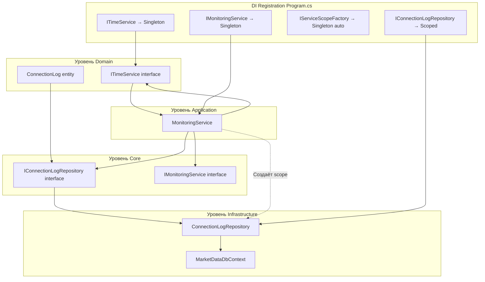
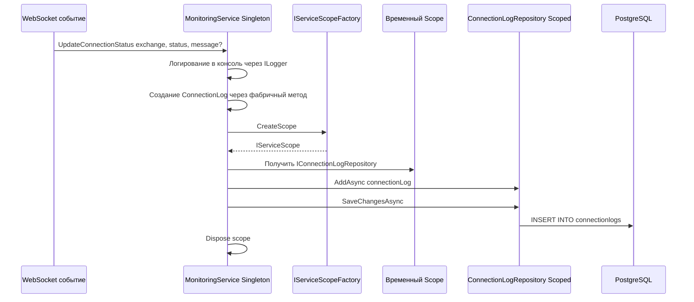

# План: Добавление записи логов подключений в БД (ConnectionLogs)

## Текущая ситуация

- Таблица `connectionlogs` **есть** в PostgreSQL (через `docker/init.sql`)
- EF Core `DbSet<ConnectionLog> ConnectionLogs` **есть** в `MarketDataDbContext`
- Сущность `ConnectionLog` **есть** с фабричными методами `CreateConnected`, `CreateDisconnected`, `CreateError`
- `MonitoringService` логирует смену статусов **только в консоль** (`ILogger`) — в БД **ничего не пишется**
- `MonitoringService` **не имеет** `ITimeService` (нужен для создания `ConnectionLog`)
- `MonitoringService` зарегистрирован как **Singleton**

## Архитектура решения



## Поток вызова при смене статуса подключения



## Пошаговый план реализации

### Шаг 1: Создать интерфейс IConnectionLogRepository

**Файл:** `src/MarketDataCollector.Core/Interfaces/IConnectionLogRepository.cs`

```csharp
namespace MarketDataCollector.Core.Interfaces;

public interface IConnectionLogRepository
{
    Task AddAsync(ConnectionLog log, CancellationToken cancellationToken = default);
    Task SaveChangesAsync(CancellationToken cancellationToken = default);
}
```

- Размещается в Core/Interfaces (как `IRawTickRepository`)
- Принимает готовую сущность `ConnectionLog` (из Domain)

### Шаг 2: Реализовать ConnectionLogRepository

**Файл:** `src/MarketDataCollector.Infrastructure/Repositories/ConnectionLogRepository.cs`

```csharp
namespace MarketDataCollector.Infrastructure.Repositories;

public class ConnectionLogRepository : IConnectionLogRepository
{
    private readonly MarketDataDbContext _context;
    private readonly DbSet<ConnectionLog> _dbSet;

    public ConnectionLogRepository(MarketDataDbContext context)
    {
        _context = context;
        _dbSet = context.Set<ConnectionLog>();
    }

    public async Task AddAsync(ConnectionLog log, CancellationToken ct = default)
    {
        await _dbSet.AddAsync(log, ct);
    }

    public async Task SaveChangesAsync(CancellationToken ct = default)
    {
        await _context.SaveChangesAsync(ct);
    }
}
```

### Шаг 3: Добавить ITimeService + IServiceScopeFactory в MonitoringService

**Файл:** `src/MarketDataCollector.Application/Services/MonitoringService.cs`

**Изменения:**
1. Добавить поля `_timeService` (ITimeService) и `_scopeFactory` (IServiceScopeFactory)
2. Обновить конструктор:
   ```csharp
   public MonitoringService(
       ILogger<MonitoringService> logger,
       ITimeService timeService,
       IServiceScopeFactory scopeFactory)
   ```
3. Добавить приватный метод для асинхронной записи в БД:
   ```csharp
   private async Task SaveConnectionLogAsync(
       string exchange, string eventType, string message)
   {
       try
       {
           using var scope = _scopeFactory.CreateScope();
           var repo = scope.ServiceProvider
               .GetRequiredService<IConnectionLogRepository>();
           
           var log = new ConnectionLog(exchange, eventType, message, _timeService);
           await repo.AddAsync(log);
           await repo.SaveChangesAsync();
       }
       catch (Exception ex)
       {
           _logger.LogError(ex, "Failed to save connection log to database");
       }
   }
   ```
4. В методе `UpdateConnectionStatus` — после существующего `ILogger`-логирования, запустить fire-and-forget запись в БД:
   ```csharp
   public void UpdateConnectionStatus(string exchange, 
       ConnectionStatus status, string? message = null)
   {
       // ... существующий код с ILogger ...

       // Сохраняем в БД fire-and-forget
       var eventType = status switch
       {
           ConnectionStatus.Connected => "Connected",
           ConnectionStatus.Disconnected => "Disconnected",
           ConnectionStatus.Error => "Error",
           _ => status.ToString()
       };
       var logMessage = status switch
       {
           ConnectionStatus.Connected => $"Connected to {exchange}",
           ConnectionStatus.Disconnected => $"Disconnected from {exchange}",
           ConnectionStatus.Error => message ?? $"Error on {exchange}",
           _ => $"{status} on {exchange}"
       };
       
       _ = SaveConnectionLogAsync(exchange, eventType, logMessage);
   }
   ```

**Важно:** Fire-and-forget с `_ = SaveConnectionLogAsync(...)` — это осознанный выбор, т.к.:
- `UpdateConnectionStatus` вызывается из синхронных event-handler-ов
- Блокировка event-цепочки для ожидания БД неприемлема
- Ошибки перехватываются внутри `SaveConnectionLogAsync` и логируются

### Шаг 4: Обновить DI-регистрацию в Program.cs

**Файл:** `src/MarketDataCollector.Workers/MarketDataCollector.Worker/Program.cs`

Добавить:
```csharp
builder.Services.AddScoped<IConnectionLogRepository, ConnectionLogRepository>();
```

`ITimeService` уже зарегистрирован как Singleton. `IServiceScopeFactory` автоматически доступен в контейнере.

### Шаг 5: Обновить тесты MonitoringService

**Файл:** `tests/MarketDataCollector.Tests/Application/Services/MonitoringServiceTests.cs`

**Изменения:**
1. Добавить поля:
   ```csharp
   private readonly Mock<ITimeService> _timeServiceMock;
   private readonly Mock<IServiceScopeFactory> _scopeFactoryMock;
   private readonly Mock<IConnectionLogRepository> _connectionLogRepoMock;
   ```
2. В конструкторе тестового класса — настроить моки:
   ```csharp
   _timeServiceMock = new Mock<ITimeService>();
   _timeServiceMock.Setup(x => x.UtcNow).Returns(new DateTime(2025, 1, 1, 12, 0, 0, DateTimeKind.Utc));
   
   _scopeFactoryMock = new Mock<IServiceScopeFactory>();
   var scopeMock = new Mock<IServiceScope>();
   var serviceProviderMock = new Mock<IServiceProvider>();
   
   _connectionLogRepoMock = new Mock<IConnectionLogRepository>();
   serviceProviderMock.Setup(x => x.GetService(typeof(IConnectionLogRepository)))
       .Returns(_connectionLogRepoMock.Object);
   scopeMock.Setup(x => x.ServiceProvider).Returns(serviceProviderMock.Object);
   _scopeFactoryMock.Setup(x => x.CreateScope()).Returns(scopeMock.Object);
   ```
3. Обновить конструктор `MonitoringService` в тестах:
   ```csharp
   var service = new MonitoringService(
       _loggerMock.Object, 
       _timeServiceMock.Object, 
       _scopeFactoryMock.Object);
   ```
4. Добавить проверки для существующих тестов (проверяют ILogger — остаются):
   - Тест `UpdateConnectionStatus_LogsConnectedEvent` → дополнительно проверить вызов `_connectionLogRepoMock`
   - Тест `UpdateConnectionStatus_LogsDisconnectedEvent`
   - Тест `UpdateConnectionStatus_LogsErrorEvent`
5. Добавить флаг `x => x.Provisional` или аналогично — так как это fire-and-forget, нужно проверить что метод `AddAsync` и `SaveChangesAsync` вызываются хотя бы раз в определённый промежуток времени.

**Рекомендация по тестированию fire-and-forget:** Заменить `_ = SaveConnectionLogAsync(...)` на вызов через `Func<...>` или сделать метод virtual, чтобы в тестах можно было замокать. Либо просто проверить что `AddAsync` был вызван — т.к. задача запустится почти сразу (в том же синхронном контексте, async void-like), можно сделать небольшой `await Task.Delay` или `await task`.

## Риски и компромиссы

| Риск | Решение |
|------|---------|
| Fire-and-forget может потерять логи при падении процесса | Это приемлемо — ConnectionLogs не критичны для бизнес-логики, дублируются в console-логах |
| MonitoringService (Singleton) разрешает Scoped-зависимости | Используется `IServiceScopeFactory` для создания временных scope-ов |
| Нагрузка на БД при частых реконнектах | Каждое событие подключения — отдельный INSERT. При нормальной работе это редкие события (раз в минуты/часы) |
| Утечка scope-ов | Конструкция `using var scope` гарантирует освобождение |

## Что НЕ меняется

- `ConnectionLog` entity — остаётся без изменений (уже есть всё необходимое)
- `MarketDataDbContext` — остаётся без изменений (уже есть `DbSet<ConnectionLog>`)
- `docker/init.sql` — остаётся без изменений (таблица уже создаётся)
- `WebSocketClientFactory` — остаётся без изменений (продолжает вызывать `MonitoringService.UpdateConnectionStatus`)
- `BaseWebSocketClient` и все Core-клиенты — без изменений
- Console-логирование (`ILogger`) — сохраняется полностью
