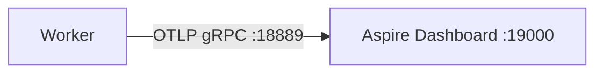
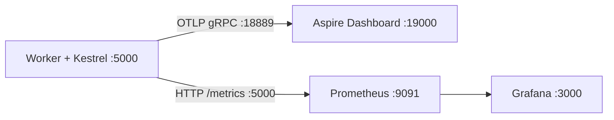

# План: Подключение Prometheus к OpenTelemetry в MarketDataCollector

## Контекст

Текущая архитектура телеметрии:



Worker использует `Host.CreateApplicationBuilder` — Generic Host без веб-сервера. Все метрики, трейсы и логи экспортируются через OTLP в Aspire Dashboard.

**Цель:** добавить Prometheus как второй источник метрик, чтобы потом подключить Grafana.

---

## Архитектурное решение

### Почему нельзя просто добавить Prometheus exporter

Пакет `OpenTelemetry.Exporter.Prometheus.AspNetCore` требует ASP.NET Core (Kestrel), потому что Prometheus скрейпинг работает по HTTP. Текущий Worker — Generic Host, у него нет Kestrel.

### Выбранный подход: миграция на WebApplicationBuilder

Замена `Host.CreateApplicationBuilder` → `WebApplication.CreateBuilder`. Это минимальное изменение:
- Worker продолжает работать как BackgroundService через `.AddHostedService<Worker>()`
- Kestrel поднимается автоматически и отдаёт `/metrics`
- OTLP-экспортёр в Aspire Dashboard продолжает работать без изменений

### Итоговая архитектура



---

## Шаг 1: Добавить NuGet-пакет

Файл: [`src/MarketDataCollector.Workers/MarketDataCollector.Worker/MarketDataCollector.Worker.csproj`](src/MarketDataCollector.Workers/MarketDataCollector.Worker/MarketDataCollector.Worker.csproj)

Добавить пакет:

| Пакет | Версия | Назначение |
|-------|--------|------------|
| `OpenTelemetry.Exporter.Prometheus.AspNetCore` | `1.11.2` | Prometheus HTTP exporter (требует Kestrel) |

---

## Шаг 2: Мигрировать Program.cs на WebApplicationBuilder

Файл: [`src/MarketDataCollector.Workers/MarketDataCollector.Worker/Program.cs`](src/MarketDataCollector.Workers/MarketDataCollector.Worker/Program.cs)

### 2.1. Замена хоста

Было:
```csharp
var builder = Host.CreateApplicationBuilder(args);
```

Стало:
```csharp
var builder = WebApplication.CreateBuilder(args);
```

### 2.2. Добавить Prometheus exporter в цепочку Metrics

Было (строка 27-30):
```csharp
.WithMetrics(metrics => metrics
    .AddRuntimeInstrumentation()
    .AddMeter(MarketDataCollector.Core.Telemetry.MarketDataTelemetry.MeterName)
    .AddOtlpExporter(options => options.Endpoint = new Uri(otlpEndpoint)))
```

Стало:
```csharp
.WithMetrics(metrics => metrics
    .AddRuntimeInstrumentation()
    .AddMeter(MarketDataCollector.Core.Telemetry.MarketDataTelemetry.MeterName)
    .AddPrometheusExporter()
    .AddOtlpExporter(options => options.Endpoint = new Uri(otlpEndpoint)))
```

### 2.3. Добавить endpoint для скрейпинга Prometheus

После `var app = builder.Build();` и перед `app.Run();`:

```csharp
var app = builder.Build();

// Prometheus scrape endpoint
app.MapPrometheusScrapingEndpoint("/metrics");

// Health check endpoint (опционально)
app.MapHealthChecks("/healthz");

app.Run();
```

### 2.4. Замена `builder.Build()` и `host.Run()`

Было (строки 129-130):
```csharp
var host = builder.Build();
host.Run();
```

Стало:
```csharp
var app = builder.Build();

// ===== Endpoints =====
app.MapPrometheusScrapingEndpoint("/metrics");

app.Run();
```

### 2.5. Добавить using-директиву

```csharp
using OpenTelemetry.Exporter.Prometheus.AspNetCore;
```

---

## Шаг 3: Обновить конфигурацию Kestrel

Файл: [`src/MarketDataCollector.Workers/MarketDataCollector.Worker/appsettings.json`](src/MarketDataCollector.Workers/MarketDataCollector.Worker/appsettings.json)

Добавить секцию Kestrel для привязки к порту:

```json
{
  "Kestrel": {
    "Endpoints": {
      "Http": {
        "Url": "http://0.0.0.0:5000"
      }
    }
  }
}
```

> Порт 5000 используется для Prometheus-скрейпинга. Если порт занят — изменить на свободный.

---

## Шаг 4: Обновить Docker Compose

Файл: [`docker/docker-compose.yml`](docker/docker-compose.yml)

### 4.1. Добавить контейнер Prometheus

```yaml
  prometheus:
    image: prom/prometheus:v2.53.0
    container_name: marketdata-prometheus
    ports:
      - "9091:9090"
    volumes:
      - ./prometheus/prometheus.yml:/etc/prometheus/prometheus.yml:ro
      - prometheus_data:/prometheus
    command:
      - '--config.file=/etc/prometheus/prometheus.yml'
      - '--storage.tsdb.retention.time=7d'
    networks:
      - marketdata-network
    restart: unless-stopped
```

### 4.2. Добавить том для данных Prometheus

В секцию `volumes`:
```yaml
  prometheus_data:
```

### 4.3. Пробросить порт Worker'а (если запускается в Docker)

В 서비스 Worker добавить порт:
```yaml
    ports:
      - "5000:5000"
```

---

## Шаг 5: Создать конфигурацию Prometheus

Новый файл: `docker/prometheus/prometheus.yml`

```yaml
global:
  scrape_interval: 5s
  evaluation_interval: 5s

scrape_configs:
  - job_name: 'marketdata-worker'
    static_configs:
      - targets: ['host.docker.internal:5000']
    metrics_path: '/metrics'
    scrape_interval: 5s
```

> `host.docker.internal` работает если Worker запущен на хосте. Если Worker тоже в Docker — заменить на имя сервиса (например `worker:5000`).

---

## Шаг 6: Создать Grafana datasource (опционально)

Если планируется Grafana, создать `docker/prometheus/grafana/provisioning/datasources/prometheus.yml`:

```yaml
apiVersion: 1
datasources:
  - name: Prometheus
    type: prometheus
    access: proxy
    url: http://prometheus:9090
    isDefault: true
```

---

## Файлы, которые будут изменены

| Файл | Действие |
|------|----------|
| [`MarketDataCollector.Worker.csproj`](src/MarketDataCollector.Workers/MarketDataCollector.Worker/MarketDataCollector.Worker.csproj) | Добавить NuGet-пакет |
| [`Program.cs`](src/MarketDataCollector.Workers/MarketDataCollector.Worker/Program.cs) | Миграция на WebApplicationBuilder + Prometheus exporter |
| [`appsettings.json`](src/MarketDataCollector.Workers/MarketDataCollector.Worker/appsettings.json) | Добавить Kestrel endpoint |
| [`docker-compose.yml`](docker/docker-compose.yml) | Добавить контейнер Prometheus |
| `docker/prometheus/prometheus.yml` | **Новый файл** — конфигурация Prometheus |

---

## Метрики, доступные в Prometheus

| Prometheus имя | OTel имя | Тип | Теги |
|---|---|---|---|
| `ws_messages_received_total` | `ws.messages.received` | Counter | `exchange`, `symbol` |
| `ticks_incoming_total` | `ticks.incoming` | Counter | `exchange` |
| `ticks_received_total` | `ticks.received` | Counter | `channel_index` |
| `ticks_processed_total` | `ticks.processed` | Counter | `exchange` |
| `ticks_dropped_total` | `ticks.dropped` | Counter | `exchange` |
| `ws_active_connections` | `ws.active_connections` | Gauge | `exchange` |
| `ticks_batch_size_*` | `ticks.batch.size` | Histogram | — |
| `processor_channel_fill_*` | `processor.channel.fill` | Histogram | — |

Плюс автоматические метрики .NET Runtime (GC, CPU, память) от `AddRuntimeInstrumentation()`.

---

## Порядок проверки

1. Запустить Worker локально (`dotnet run`) и проверить доступность `http://localhost:5000/metrics`
2. Запустить `docker-compose up prometheus` и проверить targets в `http://localhost:9091/targets`
3. Убедиться что метрики скрейпятся (STATUS = UP в Prometheus targets)
4. Проверить конкретные метрики в Prometheus Query: `ticks_processed_total`, `ws_active_connections`
