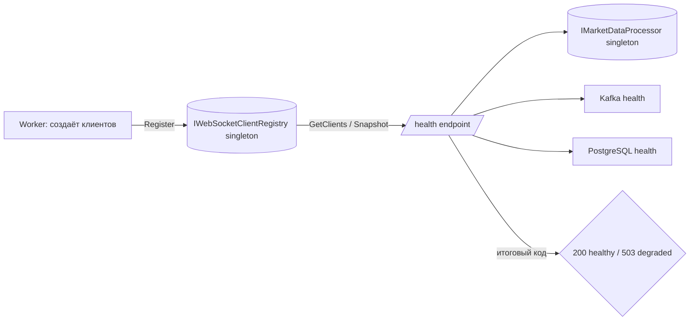

# План: Добавить в /health состояние WebSocket-клиентов и fill-level каналов

## Цель

Расширить HTTP endpoint `/health` в [`Program.cs`](src/MarketDataCollector.Workers/MarketDataCollector.Worker/Program.cs:88)
информацией о:
1. состоянии WebSocket-клиентов (подключён/отключён, метрики),
2. fill-level каналов MarketDataProcessor (заполненность, backlog, дропы, RPS).

Итоговый HTTP-код остаётся **комбинированным**:
- `503 degraded` — если Kafka/PostgreSQL unhealthy (как сейчас) **ИЛИ** если зарегистрированы WS-клиенты и **все** отключены.
- fill-каналов и производительность — **только информационные** поля (не влияют на код).

## Текущее состояние (анализ)

- `/health` в [`Program.cs:88`](src/MarketDataCollector.Workers/MarketDataCollector.Worker/Program.cs:88) проверяет только Kafka и PostgreSQL. Имеет доступ к `IMarketDataProcessor` через DI (не используется).
- Реальные WebSocket-клиенты создаются локально в [`Worker.RunWithRecoveryAsync`](src/MarketDataCollector.Workers/MarketDataCollector.Worker/Worker.cs:43) через `IWebSocketClientFactory` (scoped) и **не зарегистрированы в DI** — `/health` не может получить их состояние.
- Состояние каналов доступно через singleton `IMarketDataProcessor`:
  - `GetChannelFillLevels()` → `(Count, Capacity)[]` per-channel,
  - `GetEstimatedDroppedCount()`, `GetTotalIncomingCount()`, `GetTotalReceivedCount()`,
  - `GetProcessedRps()`.
- `IExchangeWebSocketClient` (в [`IExchangeWebSocketClient.cs`](src/MarketDataCollector.Core/Interfaces/IExchangeWebSocketClient.cs:11)) уже предоставляет:
  - `ExchangeName`, `Name`, `Symbol`, `IsConnected`,
  - `GetMessagesPerSecond()`, `GetTotalMessagesCount()`.

## Архитектурное решение

Вводится лёгкий **singleton-реестр** `IWebSocketClientRegistry` (контейнер реальных объектов клиентов).
`Worker` регистрирует в нём созданных клиентов при старте, `/health` читает состояние напрямую.
Это решает проблему: вызов `CreateAllClients()` в `/health` создавал бы НОВЫЕ не-подключённые клиенты
с бесполезным `IsConnected=false` и утечкой подписчиков на `MonitoringService`.



## Изменения по файлам

### 1. Новый интерфейс — `src/MarketDataCollector.Core/Interfaces/IWebSocketClientRegistry.cs`

```csharp
namespace MarketDataCollector.Core.Interfaces;

/// <summary>
/// Потокобезопасный реестр реальных экземпляров WebSocket-клиентов.
/// Worker регистрирует клиентов при старте, /health читает их состояние.
/// </summary>
public interface IWebSocketClientRegistry
{
    void Register(IExchangeWebSocketClient client);
    void Unregister(IExchangeWebSocketClient client);
    void Clear();
    IReadOnlyList<IExchangeWebSocketClient> GetClients();
}
```

### 2. Реализация — `src/MarketDataCollector.Core/Clients/WebSocketClientRegistry.cs`

```csharp
using System;
using System.Collections.Generic;
using MarketDataCollector.Core.Interfaces;

namespace MarketDataCollector.Core.Clients;

public sealed class WebSocketClientRegistry : IWebSocketClientRegistry
{
    private readonly object _lock = new();
    private readonly List<IExchangeWebSocketClient> _clients = new();

    public void Register(IExchangeWebSocketClient client)
    {
        if (client == null) throw new ArgumentNullException(nameof(client));
        lock (_lock)
        {
            if (!_clients.Contains(client))
                _clients.Add(client);
        }
    }

    public void Unregister(IExchangeWebSocketClient client)
    {
        lock (_lock) { _clients.Remove(client); }
    }

    public void Clear()
    {
        lock (_lock) { _clients.Clear(); }
    }

    public IReadOnlyList<IExchangeWebSocketClient> GetClients()
    {
        lock (_lock) { return _clients.ToArray(); }
    }
}
```

### 3. Регистрация в DI — `src/MarketDataCollector.Workers/MarketDataCollector.Worker/DependencyInjection.cs`

В `AddCoreServices()` (строки ~52-59) добавить:
```csharp
services.AddSingleton<IWebSocketClientRegistry, WebSocketClientRegistry>();
```
Добавить `using MarketDataCollector.Core.Clients;`.

### 4. Worker — регистрация клиентов — `src/MarketDataCollector.Workers/MarketDataCollector.Worker/Worker.cs`

В `RunWithRecoveryAsync`:
- Получить реестр из scope: `var clientRegistry = scope.ServiceProvider.GetRequiredService<IWebSocketClientRegistry>();`
- После `clients = clientFactory.CreateAllClients().ToList();` зарегистрировать всех:
  ```csharp
  foreach (var client in clients)
      clientRegistry.Register(client);
  ```
- В `CleanupAsync` (после остановки клиентов) очистить реестр:
  ```csharp
  clientRegistry.Clear();
  ```
  Передать реестр параметром в `CleanupAsync`.

### 5. `/health` — `src/MarketDataCollector.Workers/MarketDataCollector.Worker/Program.cs`

Внутри `app.MapGet("/health", ...)` после существующих Kafka/PostgreSQL проверок добавить:

```csharp
// WebSocket clients health
var registry = ctx.RequestServices.GetRequiredService<IWebSocketClientRegistry>();
var wsClients = registry.GetClients();
var connectedClients = wsClients.Count(c => c.IsConnected);
var wsInfo = new
{
    status = wsClients.Count == 0 ? "unknown" : (connectedClients > 0 ? "healthy" : "unhealthy"),
    total = wsClients.Count,
    connected = connectedClients,
    disconnected = wsClients.Count - connectedClients,
    clients = wsClients.Select(c => new
    {
        exchange = c.ExchangeName,
        name = c.Name,
        symbol = c.Symbol,
        connected = c.IsConnected,
        messagesPerSecond = c.GetMessagesPerSecond(),
        totalMessages = c.GetTotalMessagesCount()
    })
};
healthChecks["websocket"] = wsInfo;

// Channels (informational only)
var processor = ctx.RequestServices.GetRequiredService<IMarketDataProcessor>();
var fillLevels = processor.GetChannelFillLevels();
var totalCount = fillLevels.Sum(f => f.Count);
var totalCapacity = fillLevels.Sum(f => f.Capacity);
var channelsInfo = new
{
    channels = fillLevels.Select(f => new
    {
        count = f.Count,
        capacity = f.Capacity,
        fillPercent = f.Capacity > 0 ? Math.Round((double)f.Count / f.Capacity * 100.0, 1) : 0.0
    }),
    totalCount,
    totalCapacity,
    totalFillPercent = totalCapacity > 0 ? Math.Round((double)totalCount / totalCapacity * 100.0, 1) : 0.0,
    estimatedDropped = processor.GetEstimatedDroppedCount(),
    incoming = processor.GetTotalIncomingCount(),
    received = processor.GetTotalReceivedCount(),
    processedRps = processor.GetProcessedRps()
};
healthChecks["channels"] = channelsInfo;
```

**Комбинированная логика 503** — заменить блок `allHealthy` (строки ~143-147):

```csharp
var websocketCheck = wsInfo.status;
var allHealthy = healthChecks.Values.All(h =>
{
    var status = h.GetType().GetProperty("status")?.GetValue(h)?.ToString();
    return status == "healthy" || status == "disabled" || status == "unknown";
});

// Комбинированно: 503, если Kafka/PostgreSQL unhealthy ИЛИ все WS-клиенты отключены.
var wsAllDown = wsClients.Count > 0 && connectedClients == 0;
var degraded = !allHealthy || wsAllDown;

ctx.Response.StatusCode = degraded ? 503 : 200;
await ctx.Response.WriteAsJsonAsync(new
{
    status = degraded ? "degraded" : "healthy",
    checks = healthChecks,
    timestamp = DateTime.UtcNow
});
```

Нюанс: `websocket.status` выставляется в `"unhealthy"` при `connectedClients == 0` (но `total > 0`),
поэтому `allHealthy` его уже учтёт, а `wsAllDown` дублирует это условие явно и понятно.
Замечание: `GetEstimatedDroppedCount()`/`GetTotalIncomingCount()` и т.д. уже используются в Worker —
`Math`/`System.Linq` доступны.

## Проверка

- `dotnet build MarketDataCollector.sln`
- Запуск с `run.ps1`, запрос `curl http://localhost:5010/health` — ожидать в JSON блоки `websocket` и `channels`,
  а также корректный `status`/HTTP-код при отключённых клиентах (fake server остановлен).
