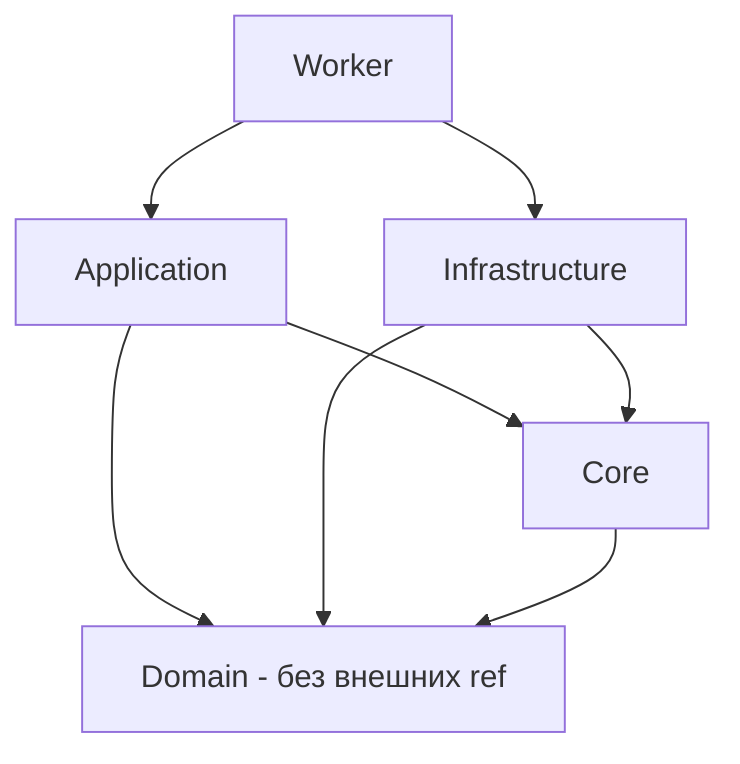
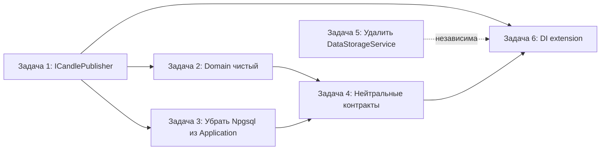

# План исправления архитектурных нарушений MarketDataCollector

Источник: [`plans/architecture-review-report.md`](plans/architecture-review-report.md)
Дата: 2026-07-31
Цель: устранить нарушения чистой/слоистой архитектуры, выявленные в архитектурном ревью.

---

## Целевая структура зависимостей

Ключевое отличие от текущего состояния:
- **Убрана ссылка `Application → Infrastructure`** (строка 6 в `Application.csproj`).
- **Domain не ссылается на `Npgsql.EFCore`** — убран пакет и EF-атрибуты из сущностей.

---

## Задача 1. Вынести Kafka за абстракцию `ICandlePublisher` и убрать `Application → Infrastructure`

### Суть проблемы
[`TickAggregator.cs`](src/MarketDataCollector.Application/Services/TickAggregator.cs:5) напрямую использует
`using MarketDataCollector.Infrastructure.Kafka;` и конкретный тип `KafkaCandleProducer?`. Это причина
единственной ссылки `Application → Infrastructure` в [`Application.csproj`](src/MarketDataCollector.Application/MarketDataCollector.Application.csproj:6).

### Шаги
1. Создать абстракцию `ICandlePublisher` в Core:
   - Файл: `src/MarketDataCollector.Core/Interfaces/ICandlePublisher.cs`
   - Сигнатура метода `ProduceAsync(...)` — копия `ProduceAsync` из
     [`KafkaCandleProducer.cs`](src/MarketDataCollector.Infrastructure/Kafka/KafkaCandleProducer.cs:35):
     `(ticker, interval, open, high, low, close, volume, startTime, endTime, exchange, cancellationToken)`.

2. В [`KafkaCandleProducer.cs`](src/MarketDataCollector.Infrastructure/Kafka/KafkaCandleProducer.cs:11)
   реализовать интерфейс:
   - `public class KafkaCandleProducer : ICandlePublisher`
   - Оставить JSON-сериализацию и логику сообщения внутри (это инфраструктурная деталь).

3. В [`TickAggregator.cs`](src/MarketDataCollector.Application/Services/TickAggregator.cs):
   - Заменить `KafkaCandleProducer?` на `ICandlePublisher?` (поле, конструктор, вызов `ProduceAsync`).
   - Убрать `using MarketDataCollector.Infrastructure.Kafka;`.
   - `_useKafka` логика остаётся (проверка `Enabled && publisher != null`).

4. В [`Application.csproj`](src/MarketDataCollector.Application/MarketDataCollector.Application.csproj:6):
   - **Удалить** `<ProjectReference ... MarketDataCollector.Infrastructure...>`.

5. Обновить композицию в `Program.cs`:
   - Зарегистрировать `ICandlePublisher` как singleton:
     `builder.Services.AddSingleton<ICandlePublisher, KafkaCandleProducer>();`
   - В заводской фабрике `ITickAggregator` заменить `GetRequiredService<KafkaCandleProducer>()` на
     `GetRequiredService<ICandlePublisher>()`.

6. Обновить тесты в
   [`KafkaIntegrationTests.cs`](tests/MarketDataCollector.Tests/Infrastructure/Kafka/KafkaIntegrationTests.cs):
   - Там, где `KafkaCandleProducer` передаётся как конкретный тип в `TickAggregator`, заменить тип на
     `ICandlePublisher` (мок). Проверить строки 192, 215, 402.

### Метрика завершения
- `Application.csproj` не содержит ссылки на Infrastructure.
- В `Application/` отсутствуют `using MarketDataCollector.Infrastructure.*`.
- Проект собирается, тесты Kafka проходят.

---

## Задача 2. Очистить Domain от EF-атрибутов и Npgsql, перенести маппинг в Fluent API

### Суть проблемы
Доменные сущности `RawTick`, `ConnectionLog`, `AggregatedData` помечены
`[Table]`, `[Key]`, `[Column]`, `[Required]`, `[MaxLength]` и ссылаются на `System.ComponentModel.DataAnnotations*`.
Пакет `Npgsql.EFCore` подключён в [`Domain.csproj`](src/MarketDataCollector.Domain/MarketDataCollector.Domain.csproj:14).

### Шаги
1. Убрать `Npgsql.EntityFrameworkCore.PostgreSQL` из
   [`Domain.csproj`](src/MarketDataCollector.Domain/MarketDataCollector.Domain.csproj:14).

2. В сущностях удалить атрибуты (оставить чистые POCO с `private set` и приватным ctor для EF):
   - [`RawTick.cs`](src/MarketDataCollector.Domain/Entities/RawTick.cs:9)
   - [`ConnectionLog.cs`](src/MarketDataCollector.Domain/Entities/ConnectionLog.cs:8)
   - [`AggregatedData.cs`](src/MarketDataCollector.Domain/Entities/AggregatedData.cs:9)
   - Удалить `using System.ComponentModel.DataAnnotations;` и `using System.ComponentModel.DataAnnotations.Schema;`.
   - Приватный конструктор `private X() {}` **оставить** — EF Core его использует.

3. Расширить [`MarketDataDbContext.OnModelCreating`](src/MarketDataCollector.Infrastructure/Data/MarketDataDbContext.cs:16),
   воспроизведя всё, что задавали атрибуты (иначе изменится схема БД):
   - Для каждой сущности: `.ToTable("имя")`, `.Property(e => e.Prop).HasColumnName("имя").IsRequired().HasMaxLength(n)`.
   - `RawTick`: `Id` key, `Ticker` (MaxLength 20, required), `Price`/`Volume` (precision 18,8), `Timestamp`,
     `Exchange` (MaxLength 50), `ReceivedAt`, `Normalized`.
   - `ConnectionLog`: `Exchange` (50), `EventType` (20), `Message` (nullable), `CreatedAt`.
   - `AggregatedData`: `Ticker` (20), `Interval` (10), цены (18,8), `StartTime`, `EndTime`, `CreatedAt`.
   - Уже существующие индексы и `HasPrecision` оставить без изменений.

4. Проверить `SystemTimeService`/репозитории на отсутствие зависимостей от атрибутов.

### Метрика завершения
- `Domain.csproj` не содержит пакетов EF/Npgsql.
- В `Domain/Entities/*.cs` нет `DataAnnotations` и `DataAnnotations.Schema`.
- Схема БД (из `OnModelCreating`) идентична текущей (сравнить с миграциями в `docker/init.sql`, `docker/init-partitioned.sql`).

---

## Задача 3. Убрать `using Npgsql` из Application, абстрагировать обработку ошибок БД

### Суть проблемы
[`MarketDataProcessor.cs`](src/MarketDataCollector.Application/Services/MarketDataProcessor.cs:10) делает
`using Npgsql;` и ловит `PostgresException`/`NpgsqlException` в блоке `catch` (строки 919–941), а также пишет
теляметрию по типам исключений (`ExceptionsByType`). Application-слой не должен знать о конкретной СУБД.

### Подход
Инфраструктура уже выполняет вставку через `IRawTickRepository.BulkCopyAsync`. Репозиторий
([`RawTickRepository.cs`](src/MarketDataCollector.Infrastructure/Repositories/RawTickRepository.cs:20))
— правильное место для перехвата Npgsql-ошибок.

### Шаги
1. Добавить доменное/прикладное исключение (например, `PersistenceException`) в Core или Domain, которое
   переносит только нейтральную информацию: сообщение и опциональный код (`SqlState` как строку без ссылки на Npgsql).

2. В `RawTickRepository.BulkCopyAsync(...)`:
   - Обернуть вызов в `try/catch` для `NpgsqlException`/`PostgresException`.
   - Логировать через существующий `ILogger`.
   - Бросать `PersistenceException` с сохранением `SqlState`/message.

3. В [`MarketDataProcessor.cs`](src/MarketDataCollector.Application/Services/MarketDataProcessor.cs):
   - Убрать `using Npgsql;`.
   - Заменить блоки `catch (PostgresException)` и `catch (NpgsqlException)` на один `catch (PersistenceException)`.
   - Телеметрию `ExceptionsByType.Add(...)` перестроить: классифицировать по `PersistenceException.SqlState`
     (например, `"23505"` = unique_violation → свой тег) либо общим тегом, не упоминая Npgsql.
   - Обновить `MarketDataProcessor.Logging.cs`:
     - Строка 68 `LogNpgsqlError` и связанные `LoggerMessage`-делегаты — переписать на нейтральное
       именование (например, `LogPersistenceError`), без упоминания Npgsql.

### Примечание (совместимость)
- `PostgresException` наследует `NpgsqlException`, поэтому перехват по `NpgsqlException` покрывал оба. После
  рефакторинга репозиторий перехватывает оба и единообразно оборачивает.
- Проверить, что в `MarketDataProcessor` больше нигде не используется `Npgsql*`.

### Метрика завершения
- В `Application/` нет `using Npgsql;` и упоминаний `Npgsql*`/`PostgresException`.
- Обработка ошибок вставки и телеметрия работают как раньше (проверить интеграционный тест вставки).

---

## Задача 4. Переименовать технологически-привязанные контракты в Core

### Суть проблемы
[`IRawTickRepository.cs`](src/MarketDataCollector.Core/Interfaces/IRawTickRepository.cs:20) содержит метод
`BulkCopyAsync` и XML-комментарий про «Npgsql Binary COPY protocol». Контракт привязан к конкретной технологии.

### Шаги
1. Переименовать `BulkCopyAsync` → нейтральное имя, например `BulkInsertFastAsync` (обе перегрузки — строки 26 и 32).
2. Переписать XML-комментарии: убрать «Npgsql Binary COPY», заменить на «быстрая массовая вставка» без технологий.
3. Обновить реализацию в `RawTickRepository.cs` (метод `BulkCopyAsync` → новое имя, внутренняя логика Npgsql остаётся).
4. Обновить вызовы:
   - [`MarketDataProcessor.cs`](src/MarketDataCollector.Application/Services/MarketDataProcessor.cs:882) — `BulkCopyAsync(...)`.
   - Тесты репозитория и `TickWriteBenchmark` (если используют имя).

### Метрика завершения
- В Core-интерфейсах нет упоминаний «COPY»/«Npgsql» в сигнатурах и XML-документации.
- Проект собирается.

---

## Задача 5. Удалить мёртвый `DataStorageService` и `IDataStorageService`

### Суть проблемы
[`DataStorageService.cs`](src/MarketDataCollector.Application/Services/DataStorageService.cs:10) и вложенный
`IDataStorageService` (строка 142) не зарегистрированы в DI и не используются в пайплайне (вставка идёт напрямую
через `BulkCopyAsync` в `MarketDataProcessor`).

### Шаги
1. Удалить `src/MarketDataCollector.Application/Services/DataStorageService.cs`.
2. Удалить тесты `tests/MarketDataCollector.Tests/Application/Services/DataStorageServiceTests.cs`.
3. Проверить отсутствие других ссылок на `DataStorageService`/`IDataStorageService` (поиск по решению).

### Альтернатива (если решено оставить)
Подключить сервис в пайплайн вместо прямого вызова `BulkCopyAsync`. Но по умолчанию — удалить как мёртвый код.

### Метрика завершения
- Нет упоминаний `DataStorageService`/`IDataStorageService` в решении (кроме удалённых файлов).
- Решение собирается.

---

## Задача 6. Вынести DI-регистрации в extension-методы для тонкого Program.cs

### Суть проблемы
[`Program.cs`](src/MarketDataCollector.Workers/MarketDataCollector.Worker/Program.cs:41) перегружен: ручная
фабрика `ITickAggregator` с Kafka (строки 119–130), `IMarketDataProcessor` (143–158), Kafka health-check
(82–102 и 182–210) встроены в composition root.

### Шаги
1. Создать файл `src/MarketDataCollector.Workers/MarketDataCollector.Worker/DependencyInjection.cs` с extension-методами:
   - `AddPersistence(this IServiceCollection)` — DbContext, репозитории.
   - `AddKafkaInfrastructure(this IServiceCollection, IConfiguration)` — `IKafkaProducer`, `ICandlePublisher`,
     `KafkaCandleConsumerService`, Kafka startup health-check.
   - `AddAggregation(this IServiceCollection)` — регистрация `ITickAggregator` (общая фабрика, независимая от Kafka).
   - `AddCorePipeline(this IServiceCollection)` — `IMarketDataProcessor`, мониторинг, WebSocket-фабрика, время.
2. В `Program.cs` оставить только: конфигурацию OpenTelemetry, вызовы extension-методов, `app.Run()`.
3. Kafka health-check оставить в `Program.cs` (endpoint) либо вынести в отдельный `KafkaHealthCheck` класс.

### Метрика завершения
- `Program.cs` не содержит ручного конструирования `TickAggregator`/`MarketDataProcessor`.
- DI-логика изолирована в `DependencyInjection.cs`, читается по слоям.
- Поведение не изменилось (проверить старт воркера и `/health`).

---

## Порядок выполнения и зависимости

Рекомендуемый порядок:
1. **Задача 1** — критична, устраняет главное нарушение (Application → Infrastructure).
2. **Задача 2** — независима, чистит Domain.
3. **Задача 5** — тривиальна, удаляет мёртвый код.
4. **Задача 3** — после Задачи 1 (убирает последние `using Npgsql` из Application).
5. **Задача 4** — механическое переименование.
6. **Задача 6** — финальная реорганизация composition root.

---

## Риски и замечания

- **Изменение схемы БД:** при переносе атрибутов в Fluent API надо 1-в-1 воспроизвести имена колонок, типы,
  `MaxLength`, required-ограничения. Сверить с `docker/init.sql` и `docker/init-partitioned.sql`. Если БД уже
  создана миграциями — не менять имена таблиц/колонок.
- **Телеметрия ошибок:** после замены Npgsql-исключений на `PersistenceException` могут «потеряться» различения
  между `PostgresException` и `NpgsqlException`. Перенести различение на уровень репозитория (сохранять тип/код).
- **Приватные конструкторы:** оставить `private X() {}` в сущностях, иначе EF Core не сможет материализовать.
- **Тесты:** после каждой задачи запускать `dotnet build` и соответствующие unit/integration тесты
  (`MarketDataCollector.Tests`, `TickWriteBenchmark`).

---

## Критерии приёмки

- [ ] `Application.csproj` не ссылается на Infrastructure; в `Application/` нет `using MarketDataCollector.Infrastructure.*`.
- [ ] `Domain.csproj` не содержит `Npgsql.EntityFrameworkCore.PostgreSQL`; в `Domain/Entities` нет DataAnnotations-атрибутов.
- [ ] В `Application/` нет `using Npgsql;` и типов `PostgresException`/`NpgsqlException`.
- [ ] В Core-интерфейсах нет технологической лексики («COPY», «Npgsql»).
- [ ] `DataStorageService`/`IDataStorageService` удалены.
- [ ] `Program.cs` тонкий, DI вынесен в extension-методы.
- [ ] Решение собирается; все тесты проходят; старт воркера и `/health` работают.
