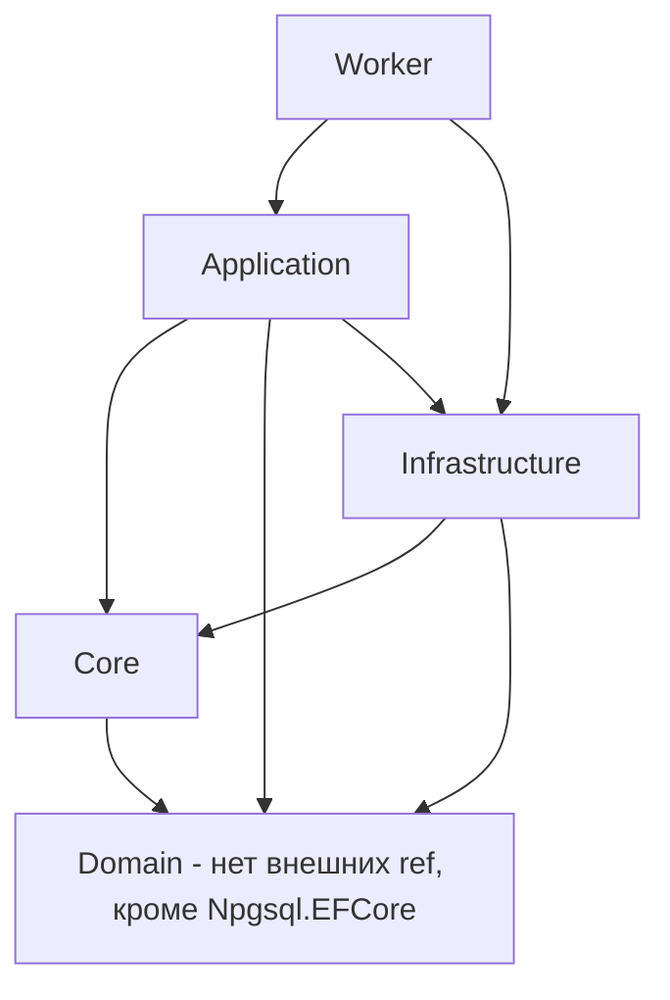

# Архитектурный обзор MarketDataCollector

Дата: 2026-07-31
Цель: проверить корректность архитектуры проекта и выявить нарушения слоистой/чистой архитектуры.

---

## 1. Текущая структура и зависимости слоёв

Проект заявлен как слоистая архитектура с принципами SOLID. Стек: .NET 8, EF Core 8, PostgreSQL 16, Kafka, OpenTelemetry.

### Карта проектных ссылок (из `.csproj`)



**Целевая архитектура** (для сравнения): слои зависят только «вниз»:

```
Domain (нет внешних зависимостей)
   ↑
Core (абстракции/интерфейсы)
   ↑
Application (бизнес-логика, использует интерфейсы Core)
   ↑
Infrastructure (реализации репозиториев/клиентов)
   ↑
Worker (composition root, DI)
```

---

## 2. Выявленные архитектурные нарушения

### 🔴 Критическое: Application ссылается на Infrastructure (и цикл-зависимость по смыслу)

Файл [`Application.csproj`](src/MarketDataCollector.Application/MarketDataCollector.Application.csproj:6) содержит
`ProjectReference` на `MarketDataCollector.Infrastructure`. Это прямое нарушение принципа инверсии зависимостей (DIP):
прикладной слой не должен знать об инфраструктуре.

Практическое подтверждение — [`TickAggregator.cs`](src/MarketDataCollector.Application/Services/TickAggregator.cs:5):
```csharp
using MarketDataCollector.Infrastructure.Kafka;   // ← Application зависит от конкретной реализации
...
private readonly KafkaCandleProducer? _kafkaCandleProducer;  // ← конкретный тип, не абстракция
```

**Последствия:**
- Application-слой невозможно переиспользовать/тестировать без Infrastructure.
- Инфраструктурная деталь (Kafka, конкретный producer) «протекает» в бизнес-логику.
- При изменении транспортного слоя (замена Kafka на другой брокер) придётся менять Application.

**Исправление:** вынести `KafkaCandleProducer` за абстракцию (например, `ICandlePublisher` в Core/Application),
а его реализацию оставить в Infrastructure. Application должен зависеть только от интерфейса.

---

### 🔴 Критическое: Domain зависит от Npgsql/EF Core (данные-атрибуты в доменных сущностях)

Файл [`Domain.csproj`](src/MarketDataCollector.Domain/MarketDataCollector.Domain.csproj:14) подключает
`Npgsql.EntityFrameworkCore.PostgreSQL`, а сами доменные сущности помечены EF/DataAnnotations-атрибутами:

- [`RawTick.cs`](src/MarketDataCollector.Domain/Entities/RawTick.cs:9) — `[Table]`, `[Key]`, `[Column]`, `[Required]`, `[MaxLength]`
- [`ConnectionLog.cs`](src/MarketDataCollector.Domain/Entities/ConnectionLog.cs:8)
- [`AggregatedData.cs`](src/MarketDataCollector.Domain/Entities/AggregatedData.cs:9)

**Последствия:**
- Доменный слой привязан к конкретной БД (PostgreSQL) и конкретной ORM (EF Core).
- Доменные сущности несут персистентность-детали, нарушая чистоту домена.
- Смена БД/ORM требует изменения домена.

**Исправление:** маппить сущности в `MarketDataDbContext` через Fluent API (`OnModelCreating`) внутри
Infrastructure, оставив доменные POCO чистыми. Убрать `Npgsql.EFCore` из Domain.

---

### 🔴 Критическое: логика работы с БД (Npgsql) зашита в Application-слой

[`MarketDataProcessor.cs`](src/MarketDataCollector.Application/Services/MarketDataProcessor.cs:10) напрямую
`using Npgsql;` и ловит `NpgsqlException` (строка 931). Хотя сам COPY-вставка делегируется репозиторию
(`_repository.BulkCopyAsync`), обработка исключений **конкретной СУБД** находится в прикладном слое.

**Последствия:** Application-слой знает про PostgreSQL на уровне исключений, что нарушает независимость от СУБД.

**Исправление:** абстрагировать обработку ошибок БД в репозиторий/Infrastructure, а Application работать с
типизированными доменными исключениями (или общим результатом операции), не ссылаясь на `Npgsql.*`.

---

### 🟠 Существенное: интерфейсы Core «протекают» деталями реализации

В [`IRawTickRepository.cs`](src/MarketDataCollector.Core/Interfaces/IRawTickRepository.cs:20) в комментарии и сигнатуре
прямо упоминается «Npgsql Binary COPY protocol». Сама ссылка на пакет в Core отсутствует, но контракт уже привязан
к конкретной технологии (метод `BulkCopyAsync` с «COPY»-семантикой).

**Исправление:** переименовать контракт в нейтральный (`BulkInsertFastAsync` / `BatchInsertAsync`) и убрать
технологическую лексику из интерфейсов.

---

### 🟠 Существенное: мёртвый код — DataStorageService не зарегистрирован в DI

[`DataStorageService.cs`](src/MarketDataCollector.Application/Services/DataStorageService.cs:10) и вложенный
интерфейс `IDataStorageService` (строка 142) **не зарегистрированы в DI** и не используются. Это дублирующая
обёртка над `IRawTickRepository`, которая не подключена к пайплайну (фактическая вставка идёт напрямую через
`BulkCopyAsync` в `MarketDataProcessor`).

**Исправление:** либо удалить мёртвый сервис и интерфейс, либо подключить через реальный пайплайн. Сейчас это
мёртвый код, вводящий в заблуждение.

---

### 🟡 Незначительное: Composition Root (Worker/Program) перегружен

[`Program.cs`](src/MarketDataCollector.Workers/MarketDataCollector.Worker/Program.cs:105) вручную конструирует
множество зависимостей с замыканиями (Kafka producer, TickAggregator, MarketDataProcessor), включая health-check
логику Kafka прямо в `Program.cs`. Часть «состава» (`TickAggregator` с Kafka) дублирует ветвление конфигурации
`if (kafkaConfig?.Enabled == true)`.

**Исправление:** вынести DI-регистрацию слоёв в отдельные extension-методы (по слоям), чтобы Program оставался
тонким. Это улучшит тестируемость и читаемость composition root.

---

## 3. Положительные стороны архитектуры

- Чёткое разделение проектов на слои (Domain/Core/Application/Infrastructure/Worker).
- Интерфейсы вынесены в Core — большинство компонентов зависят от абстракций.
- Worker использует DI и composition root для связывания.
- Домен отчасти чистый (value-type `TickData`, `DecimalHelper`).
- Конфигурация вынесена в `Options`-классы.
- Плюс много хороших практик производительности (каналы, батчинг, dedup).

---

## 4. Рекомендуемый порядок исправлений

1. **Вынести Kafka за абстракцию** (`ICandlePublisher`) и убрать `Application → Infrastructure` ссылку.
2. **Очистить Domain от EF-атрибутов и Npgsql**, перенести маппинг в `MarketDataDbContext` (Fluent API).
3. **Убрать `using Npgsql` из Application**, абстрагировать обработку ошибок БД.
4. **Переименовать технологически-привязанные контракты** в Core.
5. **Удалить/подключить мёртвый `DataStorageService`.**
6. **Вынести DI-регистрации в extension-методы** для тонкого Program.

---

## 5. Итог

Архитектура проекта в целом **рабочая и продуманная** (слои выделены, DI используется), но имеет **серьёзные
нарушения чистой архитектуры**: прикладной слой знает об инфраструктуре и конкретной СУБД, а доменный слой
загрязнён персистентностью. Исправление этих нарушений повысит тестируемость, переиспользуемость и
устойчивость к смене технологий.
