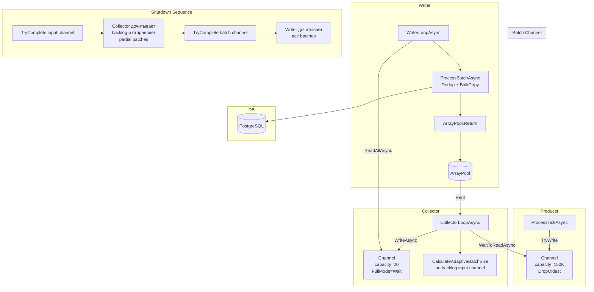

# План оптимизации: Асинхронная запись + неблокирующий Channel + адаптивный BatchSize

**Основание:** Рекомендация №1 из `plans/counters-analysis-20260730-161959.md`
**Архитектура:** Single Collector → Single Writer + адаптивный BatchSize
**Приоритет:** High

## 1. Проблема

### Текущая архитектура (один поток Collector+Writer)

```
ProcessTickAsync ──► Channel<TickData> ──► ProcessBatchesAsync (один поток)
    producer           bounded 150K          │ читает тики
    ~20K/сек          DropOldest             │ копит батч 2500
                                              │ пишет в БД ~120-140ms
                                              ▼
                                          PostgreSQL
```

**Проблема:** Поток consumer блокируется на ~120-140ms при записи батча. За это время в канал приходит ~2800 новых тиков. Backlog циклически растёт до 13K+ → GC pressure → исключения.

### Целевая архитектура (разделение Collector и Writer)

```
ProcessTickAsync ──► Channel<TickData> ──► Collector ──► Channel<CollectedBatch> ──► Writer ──► PostgreSQL
    producer           bounded 150K          читает тики     bounded 20 (Wait)       Dedup
    ~20K/сек          DropOldest             копит батч                               BulkCopy
                                              отправляет batch                        120-140ms
                                              (0.01ms)
```

**Ключевое преимущество:** Collector только копирует данные (микросекунды), никогда не блокируется на БД. Writer работает параллельно, получая уже сформированные батчи.

## 2. Новые типы и изменения в коде

### 2.1. `CollectedBatch` — контейнер для передачи батча

```csharp
// Внутренний тип в MarketDataProcessor
internal sealed class CollectedBatch
{
    public TickData[] Items { get; set; } = null!;   // из ArrayPool
    public int Count { get; set; }                    // количество заполненных элементов
}
```

Жизненный цикл: `ArrayPool.Rent` → Collector заполняет → Writer обрабатывает → `ArrayPool.Return`.

### 2.2. Новый Channel: `Channel<CollectedBatch>`

| Параметр | Значение | Обоснование |
|---|---|---|
| `BoundedChannelOptions` | `capacity = 20` | 20 батчей × 2500 тиков = 50K тиков в очереди |
| `FullMode` | `BoundedChannelFullMode.Wait` | Естественный backpressure: при переполнении Collector ждёт → перестаёт читать input → DropOldest на input |
| `SingleReader` | `true` | Один Writer |
| `SingleWriter` | `false` | Collector пишет (пока один, но future-proof) |

### 2.3. Адаптивный BatchSize

Новая логика в Collector, вычисляется после отправки каждого батча:

```csharp
private int CalculateAdaptiveBatchSize(int backlog)
{
    // backlog = inputChannel.Reader.Count
    // Пороги: low=2000, high=5000
    if (backlog <= _backlogLowThreshold)
        return _minBatchSize;                          // 1000 — низкое давление
    if (backlog >= _backlogHighThreshold)
        return _maxBatchSize;                          // 2500 — высокое давление
    // Линейная интерполяция между low и high
    var ratio = (backlog - _backlogLowThreshold) / (double)(_backlogHighThreshold - _backlogLowThreshold);
    return _minBatchSize + (int)(ratio * (_maxBatchSize - _minBatchSize));
}
```

Дополнительно: мониторинг `BatchWriteDuration` — если последняя запись заняла > 200ms, временно снижаем BatchSize на 20% (предотвращение каскадного роста backlog).

## 3. Детальный план изменений

### 3.1. `MarketDataProcessorOptions.cs` — новые параметры конфигурации

Добавить:
- `MinBatchSize` (`int`, default 1000) — минимальный размер батча при адаптивном режиме
- `MaxBatchSize` (`int`, default 2500) — максимальный размер батча (заменяет `BatchSize` как верхнюю границу)
- `BatchChannelCapacity` (`int`, default 20) — ёмкость channel между Collector и Writer
- `BacklogLowThreshold` (`int`, default 2000) — порог backlog для минимального BatchSize
- `BacklogHighThreshold` (`int`, default 5000) — порог backlog для максимального BatchSize
- `WriteDurationWarningMs` (`double`, default 200.0) — при превышении BatchSize снижается на 20%

Обратная совместимость: `BatchSize` остаётся как `MaxBatchSize`, если `MaxBatchSize` не задан.

### 3.2. `MarketDataProcessor.cs` — рефакторинг

#### Поля (добавить)

```csharp
private Channel<CollectedBatch> _batchChannel = null!;
private Task _writerTask = null!;

// Adaptive BatchSize
private readonly int _minBatchSize;
private readonly int _maxBatchSize;
private readonly int _backlogLowThreshold;
private readonly int _backlogHighThreshold;
private readonly double _writeDurationWarningMs;

// Reusable для Writer (переносится из current ProcessBatchesAsync)
private readonly FilteredTickSlice _writerFilteredSlice = new();
```

#### `StartProcessingAsync` — запуск Writer

После создания input channel добавить:

```csharp
// Создаём batch channel
_batchChannel = System.Threading.Channels.Channel.CreateBounded<CollectedBatch>(
    new BoundedChannelOptions(options.BatchChannelCapacity)
    {
        FullMode = BoundedChannelFullMode.Wait,
        SingleReader = true,
        SingleWriter = false
    });

// Запускаем Writer
var internalToken = _internalCts.Token;
_writerTask = WriterLoopAsync(channelIndex: 0, internalToken, deduplicationCacheMaxSize);

// Collector (текущий ProcessBatchesAsync, но без вызова ProcessBatchAsync)
_processingTask = CollectorLoopAsync(channelIndex: 0, internalToken);
```

#### `StopProcessingAsync` — двухэтапная остановка

```csharp
// 1. Завершаем input channel → Collector дочитывает backlog
_channels[0].Writer.TryComplete();

// 2. Ждём Collector (он отправляет все partial batch'и, затем завершает batch channel)
await _processingTask.WaitAsync(timeoutCts.Token);

// 3. Ждём Writer (дочитывает все batch'и из batch channel, пишет в БД)
await _writerTask.WaitAsync(timeoutCts.Token);

// 4. Отмена internal CTS
_internalCts.Cancel();
```

Новый метод `CollectorLoopAsync` — извлечён из текущего `ProcessBatchesAsync`:

```csharp
private async Task CollectorLoopAsync(int channelIndex, CancellationToken cancellationToken)
{
    var channel = _channels[channelIndex];
    var adaptiveBatchSize = _minBatchSize;
    var batchArray = ArrayPool<TickData>.Shared.Rent(_maxBatchSize);
    int batchCount = 0;
    
    // Timer для принудительного сброса частичных батчей
    using var flushTimerCts = new CancellationTokenSource();
    Timer? flushTimer = _flushIntervalSeconds > 0 
        ? new Timer(_ => flushTimerCts.Cancel(), null, Timeout.Infinite, Timeout.Infinite) 
        : null;

    try
    {
        while (!cancellationToken.IsCancellationRequested)
        {
            cancellationToken.ThrowIfCancellationRequested();

            // Wait for tick or timer flush (same as current logic)
            // ... (адаптировать текущую логику ожидания)
            
            // TryRead loop — drain available ticks
            while (channel.Reader.TryRead(out var tick))
            {
                batchArray[batchCount++] = tick;
                if (batchCount >= adaptiveBatchSize)
                {
                    // Send batch to Writer
                    var batch = new CollectedBatch { Items = batchArray, Count = batchCount };
                    await _batchChannel.Writer.WriteAsync(batch, cancellationToken);
                    
                    // Rent new array and reset
                    batchArray = ArrayPool<TickData>.Shared.Rent(_maxBatchSize);
                    batchCount = 0;
                    
                    // Update adaptive batch size based on backlog
                    adaptiveBatchSize = CalculateAdaptiveBatchSize(channel.Reader.Count);
                }
            }
        }
    }
    // ... error handling (same pattern)
    finally
    {
        // Flush partial batch
        if (batchCount > 0)
        {
            var batch = new CollectedBatch { Items = batchArray, Count = batchCount };
            await _batchChannel.Writer.WriteAsync(batch, CancellationToken.None);
        }
        else
        {
            ArrayPool<TickData>.Shared.Return(batchArray, clearArray: false);
        }
        
        // Signal Writer that no more batches are coming
        _batchChannel.Writer.TryComplete();
    }
}
```

Новый метод `WriterLoopAsync`:

```csharp
private async Task WriterLoopAsync(int channelIndex, CancellationToken cancellationToken, int deduplicationCacheMaxSize)
{
    var filteredSlice = new FilteredTickSlice();
    var dedupCache = deduplicationCacheMaxSize > 0 ? new DeduplicationCache(deduplicationCacheMaxSize) : null;
    var fillLevelTimer = Stopwatch.StartNew();
    
    try
    {
        await foreach (var batch in _batchChannel.Reader.ReadAllAsync(cancellationToken))
        {
            await ProcessBatchAsync(batch.Items, batch.Count, filteredSlice, dedupCache, cancellationToken, channelIndex);
            
            // Return array to pool after processing
            ArrayPool<TickData>.Shared.Return(batch.Items, clearArray: false);
            
            // Fill level monitoring (every ~10s)
            if (fillLevelTimer.ElapsedMilliseconds >= 10_000)
            {
                MarketDataTelemetry.ChannelFill.Record(
                    _channels[channelIndex].Reader.Count,
                    ChannelTag(channelIndex));
                fillLevelTimer.Restart();
            }
        }
    }
    // ... error handling (same pattern)
}
```

#### Упрощение: `ProcessBatchAsync` остаётся без изменений

Метод `ProcessBatchAsync(TickData[], batchCount, filteredSlice, dedupCache, cancellationToken, channelIndex)` **не меняется** — он уже принимает массив + count и делает dedup + BulkCopy. Просто теперь вызывается из Writer вместо Collector.

### 3.3. `MarketDataTelemetry.cs` — новые метрики

Добавить:

```csharp
/// <summary>
/// Fill level batch channel (количество батчей в очереди на запись).
/// </summary>
public static readonly Histogram<long> BatchChannelFill = Instance.CreateHistogram<long>(
    name: "processor.batch_channel.fill",
    unit: "count",
    description: "Batch channel fill level (batches pending write)");

/// <summary>
/// Адаптивный batch size (текущее значение).
/// </summary>
public static readonly Histogram<long> AdaptiveBatchSize = Instance.CreateHistogram<long>(
    name: "ticks.batch.adaptive_size",
    unit: "count",
    description: "Current adaptive batch size value");

/// <summary>
/// Задержка между созданием батча Collector'ом и началом обработки Writer'ом.
/// </summary>
public static readonly Histogram<double> BatchQueuingDelay = Instance.CreateHistogram<double>(
    name: "ticks.batch.queue_delay",
    unit: "ms",
    description: "Time between batch creation and processing start");
```

### 3.4. `appsettings.json` — обновление конфигурации

```json
"MarketDataProcessor": {
    "UseSingleConsumer": true,
    "ChannelCapacity": 150000,
    "MinBatchSize": 1000,
    "MaxBatchSize": 2500,
    "BatchChannelCapacity": 20,
    "FlushIntervalSeconds": 3,
    "DeduplicationCacheMaxSize": 10000,
    "BacklogLowThreshold": 2000,
    "BacklogHighThreshold": 5000,
    "WriteDurationWarningMs": 200.0
}
```

`BatchSize` удалить (заменён на `MinBatchSize`/`MaxBatchSize`).

## 4. Ожидаемый эффект

| Метрика | До | После (ожидание) |
|---|---|---|
| Backlog (пик) | 13,000+ | 2,000–5,000 |
| DropOldest | 2,500 (0.2%) | ~0 (backpressure через Wait) |
| Write rate | ~19K/с | ~20K/с (стабильно) |
| GC Gen2 (за 56с) | 7 | 3–4 |
| GC Pause ratio | 0.73% | < 0.4% |
| Дубли | ~4.8% | ~3% (меньше backlog → точнее дедупликация) |
| Исключения | 13 | ~2–3 |

## 5. Порядок реализации

### Шаг 1: Подготовка — добавить новые опции конфигурации
**Файл:** `src/MarketDataCollector.Core/Configuration/MarketDataProcessorOptions.cs`
- Добавить поля `MinBatchSize`, `MaxBatchSize`, `BatchChannelCapacity`, `BacklogLowThreshold`, `BacklogHighThreshold`, `WriteDurationWarningMs`
- `BatchSize` остаётся как `MaxBatchSize` default
- Обновить XML-документацию

### Шаг 2: Новый тип `CollectedBatch`
**Файл:** `src/MarketDataCollector.Application/Services/MarketDataProcessor.cs`
- Добавить `internal sealed class CollectedBatch` в конце файла
- Поля: `TickData[] Items`, `int Count`

### Шаг 3: Рефакторинг `MarketDataProcessor` — поля и конструктор
**Файл:** `src/MarketDataCollector.Application/Services/MarketDataProcessor.cs`
- Добавить поля `_batchChannel`, `_writerTask`, `_writerFilteredSlice`
- Добавить поля для adaptive batch size
- Обновить конструктор

### Шаг 4: CollectorLoopAsync
**Файл:** `src/MarketDataCollector.Application/Services/MarketDataProcessor.cs`
- Новый метод, извлечение из текущего `ProcessBatchesAsync`
- Убрать вызов `ProcessBatchAsync` — заменить на `_batchChannel.Writer.WriteAsync`
- Добавить `CalculateAdaptiveBatchSize`
- Добавить запись метрик `AdaptiveBatchSize` и `BatchChannelFill`

### Шаг 5: WriterLoopAsync
**Файл:** `src/MarketDataCollector.Application/Services/MarketDataProcessor.cs`
- Новый метод
- Читает из `_batchChannel.Reader.ReadAllAsync`
- Вызывает `ProcessBatchAsync`
- Возвращает массив в `ArrayPool`

### Шаг 6: StopProcessingAsync
**Файл:** `src/MarketDataCollector.Application/Services/MarketDataProcessor.cs`
- Двухэтапная остановка: сначала input channel → Collector → batch channel → Writer
- `await _processingTask` → потом `await _writerTask`

### Шаг 7: Старт Writer в StartProcessingAsync
**Файл:** `src/MarketDataCollector.Application/Services/MarketDataProcessor.cs`
- В `StartProcessingAsync` добавить создание `_batchChannel`
- Запустить Writer task
- Запустить Collector task (вместо старого `ProcessBatchesAsync`)

### Шаг 8: Метрики
**Файл:** `src/MarketDataCollector.Core/Telemetry/MarketDataTelemetry.cs`
- Добавить `BatchChannelFill`, `AdaptiveBatchSize`, `BatchQueuingDelay`

### Шаг 9: Конфигурация
**Файл:** `src/MarketDataCollector.Workers/MarketDataCollector.Worker/appsettings.json`
- Обновить секцию `MarketDataProcessor`

### Шаг 10: Тесты
- Адаптировать существующие тесты под новую архитектуру (проверить, что `GetChannel` и другие публичные методы работают корректно)
- Добавить тест на adaptive batch size (если возможно с Mock)

## 6. Диаграмма



## 7. Граничные случаи

| Сценарий | Поведение |
|---|---|
| **Writer упал с ошибкой** | Writer task становится Faulted. Collector продолжает заполнять batch channel до capacity=20, затем блокируется на `WriteAsync` → input channel заполняется → DropOldest. Worker observe'ит Faulted Writer и инициирует shutdown через `StopProcessingAsync`. |
| **Всплеск нагрузки 50K/с** | Input channel: DropOldest на 150K. Collector: backlog > 5000 → batchSize = 2500. Batch channel: 20 батчей × 2500 = 50K тиков. Writer пишет ~20K/с → backlog в batch channel растёт → Collector блокируется → input channel DropOldest. |
| **Спад нагрузки до 5K/с** | Backlog → 0 → batchSize = 1000. Меньше GC pressure, ниже latency. |
| **Timer flush частичного батча** | Collector: как только flushTimer сработал → отправляет частичный батч (Count < adaptiveBatchSize) в batch channel. Writer обрабатывает как обычный батч. |
| **Остановка с непустым batch channel** | StopProcessingAsync: TryComplete на input → Collector дочитывает → TryComplete на batch channel → Writer дочитывает. Все данные гарантированно записаны. |
| **Переполнение ArrayPool (редко)** | `ArrayPool.Shared.Rent(batchSize)` может вернуть массив больше запрошенного. Это нормально — используем `batch.Count`, а не `batch.Items.Length`. |

## 8. Критерии готовности

- [ ] Backlog не превышает 5000 тиков при 20K/с нагрузке (против 13K сейчас)
- [ ] DropOldest = 0 при штатной нагрузке (против 2500 сейчас)
- [ ] Write rate стабильно ≥ 19K/с (не хуже текущего)
- [ ] GC Gen2 ≤ 4 за 60 секунд (против 7 сейчас)
- [ ] Все существующие тесты проходят
- [ ] Нет регрессии по дубликатам (≤ 4.8%)
- [ ] Graceful shutdown корректно обрабатывает непустой batch channel
