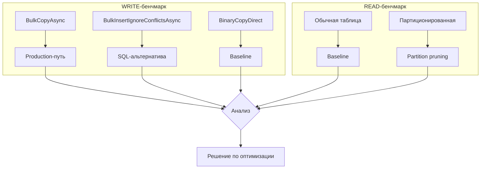

# План: Бенчмарк записи/чтения и A/B тест партиционирования

## Контекст

Пользователь спросил, ускорит ли партиционирование запись. Принято решение: сначала запустить бенчмарк, определить текущий bottleneck, потом принимать решение по оптимизации. Бенчмарк должен включать как WRITE, так и READ тесты (partition pruning) для полной картины.

## Проблемы текущего бенчмарка

Текущий [`BenchmarkRunner.cs`](tests/TickWriteBenchmark/BenchmarkRunner.cs:12) тестирует **только `BinaryCopyDirect`** — прямой COPY без ON CONFLICT. Это не отражает production-путь.

Production-пути записи:
1. **`BulkCopyAsync()`** — temp table + Binary COPY + INSERT...ON CONFLICT DO NOTHING (текущий основной метод)
2. **`BulkInsertIgnoreConflictsAsync()`** — массовый INSERT через raw SQL с ON CONFLICT DO NOTHING (альтернатива)

## Шаги

### Фаза 1: WRITE-бенчмарк

#### 1.1 Расширить генератор данных
Файл: [`TickDataGenerator.cs`](tests/TickWriteBenchmark/TickDataGenerator.cs)

- Добавить генерацию **мульти-тикеров** (BTCUSDT, ETHUSDT, SOLUSDT) — как в реальности
- Это важно, т.к. в production каждый consumer пишет свой тикер, и unique-индексы не пересекаются

#### 1.2 Добавить тест BulkCopyAsync (production-путь)
Файл: [`BenchmarkRunner.cs`](tests/TickWriteBenchmark/BenchmarkRunner.cs)

Реализовать метод, воспроизводящий логику [`BulkCopyAsync()`](src/MarketDataCollector.Infrastructure/Repositories/RawTickRepository.cs:233):
- CREATE TEMP TABLE
- Binary COPY в temp table
- INSERT INTO rawticks ... ON CONFLICT DO NOTHING из temp table

#### 1.3 Добавить тест BulkInsertIgnoreConflictsAsync (raw SQL)
Файл: [`BenchmarkRunner.cs`](tests/TickWriteBenchmark/BenchmarkRunner.cs)

Реализовать метод, воспроизводящий логику [`BulkInsertIgnoreConflictsAsync()`](src/MarketDataCollector.Infrastructure/Repositories/RawTickRepository.cs:159):
- Массовый INSERT с параметризованными VALUES + ON CONFLICT DO NOTHING

#### 1.4 Увеличить объём данных
Файл: [`BenchmarkConfig.cs`](tests/TickWriteBenchmark/BenchmarkConfig.cs)

- Увеличить `TotalTicks` с 20000 до **200000** (200k)
- Добавить chunk sizes: 500, 1000, 2000, 5000

#### 1.5 Запустить WRITE-бенчмарк и получить baseline
```
pwsh run_benchmark.ps1
```

### Фаза 2: READ-бенчмарк (partition pruning)

#### 2.1 Создать SQL-скрипт партиционирования
Файл: `docker/init-partitioned.sql` (новый файл)

Создать партиционированную версию таблицы `RawTicks`:
- **Стратегия**: RANGE по `Timestamp` (по дням)
- **Parent table**: `RawTicks` с `PARTITION BY RANGE (Timestamp)`
- **Дочерние партиции**: `rawticks_yyyy_mm_dd` по дням
- UNIQUE constraint `(Ticker, Exchange, Timestamp)` — переносится в составной PK партиции

```sql
-- Пример структуры
CREATE TABLE RawTicks (
    Id UUID NOT NULL,
    Ticker VARCHAR(20) NOT NULL,
    Price DECIMAL(18,8) NOT NULL,
    Volume DECIMAL(18,8) NOT NULL,
    Timestamp TIMESTAMPTZ NOT NULL,
    Exchange VARCHAR(50) NOT NULL,
    ReceivedAt TIMESTAMPTZ DEFAULT NOW(),
    Normalized BOOLEAN DEFAULT FALSE,
    PRIMARY KEY (Id, Timestamp)
) PARTITION BY RANGE (Timestamp);

-- Автоматическое создание партиций
CREATE TABLE rawticks_2026_07_29 PARTITION OF RawTicks
    FOR VALUES FROM ('2026-07-29') TO ('2026-07-30');
```

#### 2.2 Добавить READ-тесты в бенчмарк
Файл: `tests/TickWriteBenchmark/ReadBenchmarkRunner.cs` (новый файл)

Тесты SELECT по времени на **200k+ записях**:
1. **Full scan** — `SELECT * FROM RawTicks WHERE Ticker = 'X'` (без фильтра по времени)
2. **Time-range query** — `SELECT * FROM RawTicks WHERE Ticker = 'X' AND Timestamp BETWEEN ...` (1 день)
3. **EXPLAIN ANALYZE** — логирование плана запроса для анализа partition pruning

Сравнение:
- Обычная таблица (текущая) vs Партиционированная
- Метрики: время выполнения, rows scanned, plan (Seq Scan vs Index Scan vs Partition Pruning)

#### 2.3 Запустить READ-бенчмарк на обычной таблице (baseline)

#### 2.4 Применить партиционирование, запустить READ-бенчмарк повторно

### Фаза 3: Анализ и решение

Ключевые вопросы для анализа:
- **WRITE**: BinaryCopyDirect vs BulkCopyAsync vs BulkInsertIgnoreConflictsAsync — какой overhead от ON CONFLICT?
- **WRITE**: Sequential vs Parallel — масштабируется ли запись?
- **WRITE**: Chunk size — есть ли оптимальный размер батча?
- **READ**: Partition pruning — насколько ускоряются запросы по времени?

#### Таблица решений

| Если bottleneck = ... | Тогда ... |
|---|---|
| ON CONFLICT проверка при записи | Оптимизация unique-индекса или дедупликация на уровне приложения |
| Index maintenance на больших объёмах | Партиционирование по timestamp |
| Медленные SELECT по времени | Партиционирование по timestamp (partition pruning) |
| Блокировки/I/O | Оптимизация PostgreSQL параметров (shared_buffers, wal_buffers) |
| CPU (маловероятно) | Увеличение количества consumers |

## Mermaid: A/B тестирование



## Файлы для изменения/создания

| Файл | Действие | Описание |
|------|----------|----------|
| `tests/TickWriteBenchmark/TickDataGenerator.cs` | Изменить | Добавить мульти-тикери |
| `tests/TickWriteBenchmark/BenchmarkRunner.cs` | Изменить | Добавить методы BulkCopyAsync и BulkInsertIgnoreConflictsAsync |
| `tests/TickWriteBenchmark/BenchmarkConfig.cs` | Изменить | Увеличить TotalTicks, добавить chunk sizes |
| `docker/init-partitioned.sql` | Создать | SQL-скрипт партиционирования таблицы RawTicks |
| `tests/TickWriteBenchmark/ReadBenchmarkRunner.cs` | Создать | READ-бенчмарк для сравнения partition pruning |
