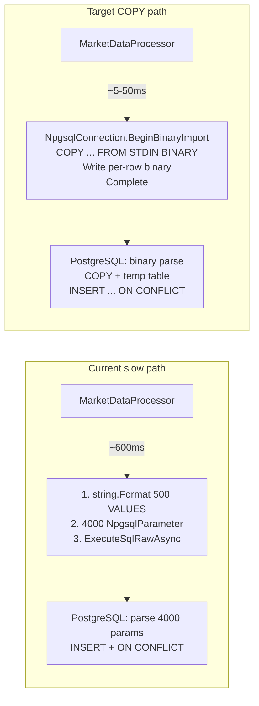

# План: Npgsql Binary COPY protocol для BulkInsert

## 1. Текущая проблема

### Текущая реализация [`RawTickRepository.cs:136-190`](../src/MarketDataCollector.Infrastructure/Repositories/RawTickRepository.cs:136)

```csharp
// INSERT INTO rawticks (...) VALUES (@p0_id, @p0_ticker, ...), (@p1_id, ...), ...
// 500 rows × 8 params = 4000 NpgsqlParameter
var formattedSql = string.Format(sql, string.Join(", ", valueRows));
return await _context.Database.ExecuteSqlRawAsync(formattedSql, parameters, cancellationToken);
```

**Что медленно:**
1. **string.Format** SQL-строки с 500 VALUES — аллокация большой строки
2. **4000 NpgsqlParameter** — аллокация 4000 объектов на батч
3. **PostgreSQL парсинг SQL** — 4000 параметров должны быть разобраны и типизированы
4. **Сетевая передача** — огромный SQL-текст вместо бинарного протокола

**Оценка:** `BulkInsertIgnoreConflictsAsync` занимает ~600-800ms на батч из 500 тиков. Это даёт ~1.2-1.6 batch/s → ~600-800 ticks/s.

### Целевая архитектура (после COPY)



## 2. Архитектура решения

### Npgsql Binary COPY (`NpgsqlConnection.BeginBinaryImport`)

Binary COPY — самый быстрый способ массовой вставки в PostgreSQL. Данные передаются в бинарном формате, минуя SQL-парсер.

**Особенности:**
- Данные идут напрямую в таблицу (минуя SQL)
- Может быть направлен во **временную таблицу** с последующим `INSERT ... ON CONFLICT`
- Скорость: ~1-5 миллионов строк/сек на типичном железе

```csharp
using var conn = new NpgsqlConnection(connectionString);
await conn.OpenAsync(cancellationToken);
using var writer = conn.BeginBinaryImport(
    "COPY rawticks_temp (id, ticker, price, volume, timestamp, exchange, receivedat, normalized) FROM STDIN (FORMAT BINARY)");
for (int i = 0; i < list.Count; i++)
{
    writer.StartRow();
    writer.Write(list[i].Id, NpgsqlDbType.Uuid);
    writer.Write(list[i].Ticker, NpgsqlDbType.Varchar);
    // ...
}
writer.Complete();
```

### Проблема: ON CONFLICT не работает с COPY

**COPY напрямую в таблицу не поддерживает `ON CONFLICT DO NOTHING`.** Варианты:

| Вариант | Описание | Плюсы | Минусы |
|---------|----------|-------|--------|
| **A: Временная таблица + INSERT FROM** | COPY во временную, затем `INSERT INTO rawticks SELECT ... ON CONFLICT DO NOTHING` | Сохраняет dedup | 2 операции |
| **B: Dropping duplicates in memory** | Дедупликация в памяти уже есть (GroupBy в ProcessBatchAsync). COPY напрямую | Максимум скорости | Без ON CONFLICT на уровне БД |
| **C: COPY + пакетное удаление дубликатов** | COPY напрямую, затем `DELETE FROM rawticks WHERE id IN (дубликаты)` | Компромисс | Сложнее |

### Рекомендуемый: Вариант A (временная таблица)

```sql
-- 1. Создаём временную таблицу (per session)
CREATE TEMP TABLE rawticks_staging (
    id UUID, ticker VARCHAR(20), price DECIMAL(18,8), volume DECIMAL(18,8),
    timestamp TIMESTAMPTZ, exchange VARCHAR(50), receivedat TIMESTAMPTZ, normalized BOOLEAN
) ON COMMIT DROP;

-- 2. COPY бинарных данных во временную таблицу
COPY rawticks_staging ... FROM STDIN (FORMAT BINARY);

-- 3. Перенос с ON CONFLICT
INSERT INTO rawticks (id, ticker, price, volume, timestamp, exchange, receivedat, normalized)
SELECT id, ticker, price, volume, timestamp, exchange, receivedat, normalized
FROM rawticks_staging
ON CONFLICT (ticker, exchange, timestamp) DO NOTHING;

-- 4. Возвращаем количество вставленных строк
GET DIAGNOSTICS v_inserted = ROW_COUNT;
```

## 3. Детальная реализация

### 3.1 Новый метод в `IRawTickRepository`

```csharp
/// <summary>
/// Быстрая массовая вставка через Npgsql Binary COPY protocol.
/// Данные копируются во временную таблицу, затем переносятся в основную
/// с ON CONFLICT DO NOTHING. Возвращает количество вставленных строк.
/// </summary>
Task<int> BulkCopyAsync(IEnumerable<RawTick> entities, CancellationToken cancellationToken = default);
```

### 3.2 Реализация в `RawTickRepository.cs`

```csharp
private NpgsqlConnection GetConnection()
{
    // Получаем connection из DbContext
    var connection = _context.Database.GetDbConnection();
    connection.Open(); // если не открыт
    return (NpgsqlConnection)connection;
}

public async Task<int> BulkCopyAsync(IEnumerable<RawTick> entities, CancellationToken cancellationToken = default)
{
    var list = entities.ToList();
    if (list.Count == 0) return 0;

    var conn = (NpgsqlConnection)_context.Database.GetDbConnection();
    var needClose = conn.State != ConnectionState.Open;
    if (needClose)
        await conn.OpenAsync(cancellationToken);

    try
    {
        // 1. Создаём временную таблицу
        await using (var cmd = conn.CreateCommand())
        {
            cmd.CommandText = @"
                CREATE TEMP TABLE IF NOT EXISTS rawticks_staging (
                    id UUID, ticker VARCHAR(20), price DECIMAL(18,8), volume DECIMAL(18,8),
                    timestamp TIMESTAMPTZ, exchange VARCHAR(50), receivedat TIMESTAMPTZ, normalized BOOLEAN
                ) ON COMMIT DROP;";
            await cmd.ExecuteNonQueryAsync(cancellationToken);
        }

        // 2. Binary COPY во временную таблицу
        await using (var writer = conn.BeginBinaryImport(
            "COPY rawticks_staging (id, ticker, price, volume, timestamp, exchange, receivedat, normalized) FROM STDIN (FORMAT BINARY)"))
        {
            for (int i = 0; i < list.Count; i++)
            {
                cancellationToken.ThrowIfCancellationRequested();
                writer.StartRow();
                writer.Write(list[i].Id, NpgsqlTypes.NpgsqlDbType.Uuid);
                writer.Write(list[i].Ticker, NpgsqlTypes.NpgsqlDbType.Varchar);
                writer.Write(list[i].Price, NpgsqlTypes.NpgsqlDbType.Numeric);
                writer.Write(list[i].Volume, NpgsqlTypes.NpgsqlDbType.Numeric);
                writer.Write(list[i].Timestamp, NpgsqlTypes.NpgsqlDbType.TimestampTz);
                writer.Write(list[i].Exchange, NpgsqlTypes.NpgsqlDbType.Varchar);
                writer.Write(list[i].ReceivedAt, NpgsqlTypes.NpgsqlDbType.TimestampTz);
                writer.Write(list[i].Normalized, NpgsqlTypes.NpgsqlDbType.Boolean);
            }
            await writer.CompleteAsync(cancellationToken);
        }

        // 3. INSERT INTO rawticks ... ON CONFLICT DO NOTHING
        var inserted = 0;
        await using (var cmd = conn.CreateCommand())
        {
            cmd.CommandText = @"
                WITH inserted AS (
                    INSERT INTO rawticks (id, ticker, price, volume, timestamp, exchange, receivedat, normalized)
                    SELECT id, ticker, price, volume, timestamp, exchange, receivedat, normalized
                    FROM rawticks_staging
                    ON CONFLICT (ticker, exchange, timestamp) DO NOTHING
                    RETURNING 1
                )
                SELECT COUNT(*) FROM inserted;";
            var result = await cmd.ExecuteScalarAsync(cancellationToken);
            inserted = result is int i ? i : Convert.ToInt32(result);
        }

        return inserted;
    }
    finally
    {
        if (needClose)
            await conn.CloseAsync();
    }
}
```

### 3.3 ON CONFLICT с уникальным индексом

В [`MarketDataDbContext.cs:26`](../src/MarketDataCollector.Infrastructure/Data/MarketDataDbContext.cs:26) определён уникальный индекс:

```csharp
entity.HasIndex(e => new { e.Ticker, e.Exchange, e.Timestamp }).IsUnique();
```

Этот индекс в БД создаёт unique constraint. В `init.sql` он же определён как:

```sql
CONSTRAINT unique_tick UNIQUE (Ticker, Exchange, Timestamp)
```

`ON CONFLICT (ticker, exchange, timestamp) DO NOTHING` будет использовать этот constraint.

### 3.4 Дедупликация в памяти (уже есть)

В [`MarketDataProcessor.cs:185-188`](../src/MarketDataCollector.Application/Services/MarketDataProcessor.cs:185) уже есть дедупликация:

```csharp
var uniqueTicks = batch
    .GroupBy(t => (t.Ticker, t.Exchange, t.Timestamp))
    .Select(g => g.First())
    .ToList();
```

COPY не требует дополнительной дедупликации — она уже выполнена в памяти. ON CONFLICT DO NOTHING — страховка от race condition.

## 4. Оценка производительности

| Метрика | Текущий SQL (ExecuteSqlRaw) | Binary COPY + temp table | Улучшение |
|---------|--------------------------|-------------------------|-----------|
| **Время на батч 500** | ~600-800ms | **~5-50ms** | **~15-160x** |
| **Batch/s** | ~1.2-1.6 | **~10-100** | **~10-60x** |
| **Throughput** | ~600-800 ticks/s | **~5000-50000 ticks/s** | **~10-60x** |
| **Аллокации** | 4000 NpgsqlParameter + большая строка | 8 NpgsqlDbType enum | **Значительно меньше** |
| **GC pressure** | Высокий (4000 объектов) | Минимальный | **~99% меньше** |

### Почему COPY быстрее:

1. **Бинарный протокол** — данные не конвертируются в текст и обратно
2. **Один вызов** — COPY это один protocol-level вызов, а не SQL с 500 VALUES
3. **Нет NpgsqlParameter** — простая запись бинарных данных
4. **PostgreSQL парсинг** — бинарный формат не требует токенизации SQL

## 5. Риски и предосторожности

### 5.1 Управление connection'ом

Текущий код использует `_context.Database.ExecuteSqlRawAsync(...)` — он управляет connection'ом через EF Core. COPY требует `NpgsqlConnection` напрямую. 

```csharp
// Получаем connection из DbContext, не закрываем его (EF управляет)
var conn = _context.Database.GetDbConnection();
var needOpen = conn.State != ConnectionState.Open;
if (needOpen) await conn.OpenAsync(cancellationToken);
// ... COPY operations ...
// НЕ закрываем connection, если он был открыт до нас
```

### 5.2 Транзакции

Если `ProcessBatchAsync` вызывается внутри транзакции, временная таблица `ON COMMIT DROP` удалится при коммите. Нужно убедиться, что `BulkCopyAsync` может быть и внутри, и вне транзакции.

```sql
CREATE TEMP TABLE IF NOT EXISTS rawticks_staging ( ... ) ON COMMIT DROP;
```

`ON COMMIT DROP` означает:
- Если есть транзакция → таблица удалится при коммите
- Если нет → таблица удалится при закрытии соединения (per session temp table)

### 5.3 Deadlock retry

Текущий код имеет retry на deadlock (40P01). С COPY protocol deadlock теоретически невозможен (нет конкуренции за уникальный индекс), но для безопасности можно сохранить retry:

```csharp
// Retry loop для транзиентных ошибок
int attempt = 0;
while (true)
{
    try { ... COPY ... return inserted; }
    catch (PostgresException ex) when (ex.SqlState == "40P01" && attempt < 3)
    {
        attempt++;
        await Task.Delay(DeadlockBaseDelay * (int)Math.Pow(2, attempt - 1), cancellationToken);
    }
}
```

## 6. План реализации

### 6.1 Добавить интерфейс `IBulkCopyRepository` или метод в `IRawTickRepository`

```csharp
// В IRawTickRepository добавить:
Task<int> BulkCopyAsync(IEnumerable<RawTick> entities, CancellationToken cancellationToken = default);
```

### 6.2 Реализовать `BulkCopyAsync` в `RawTickRepository.cs`

- Получить `NpgsqlConnection` из `_context.Database.GetDbConnection()`
- Создать временную таблицу
- Binary COPY
- INSERT ... ON CONFLICT ... SELECT
- Вернуть количество вставленных

### 6.3 Изменить `MarketDataProcessor.cs`

- В `ProcessBatchAsync`: заменить вызов `BulkInsertIgnoreConflictsAsync` на `BulkCopyAsync`
- Дедупликация в памяти (GroupBy) остаётся — она быстрее ON CONFLICT

### 6.4 Тесты

- **Unit-тест:** Mock `IRawTickRepository.BulkCopyAsync` — проверить вызов
- **Integration-тест:** Создать реальную таблицу в testcontainers, вставить через COPY, проверить данные
- **Benchmark:** Сравнить `BulkInsertIgnoreConflictsAsync` vs `BulkCopyAsync` на 500, 1000, 5000 тиков

## 7. Todo-лист

- [ ] **7.1** Добавить метод `BulkCopyAsync` в [`IRawTickRepository`](../src/MarketDataCollector.Core/Interfaces/IRawTickRepository.cs)
- [ ] **7.2** Реализовать `BulkCopyAsync` в [`RawTickRepository.cs`](../src/MarketDataCollector.Infrastructure/Repositories/RawTickRepository.cs) — Binary COPY + temp table + ON CONFLICT
- [ ] **7.3** Заменить `BulkInsertIgnoreConflictsAsync` на `BulkCopyAsync` в [`MarketDataProcessor.cs:200-203`](../src/MarketDataCollector.Application/Services/MarketDataProcessor.cs:200)
- [ ] **7.4** Обновить unit-тесты: Mock нового метода
- [ ] **7.5** Запустить тесты и проверить сборку
- [ ] **7.6** Запустить приложение на фейковых данных и замерить `Processed` vs `Incoming`
