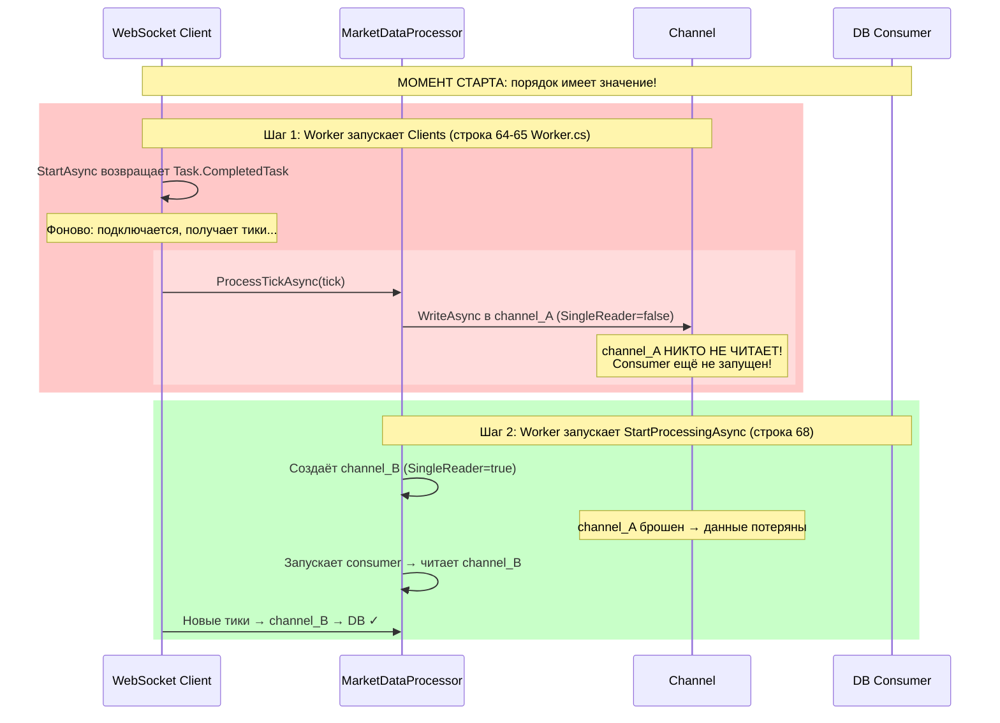
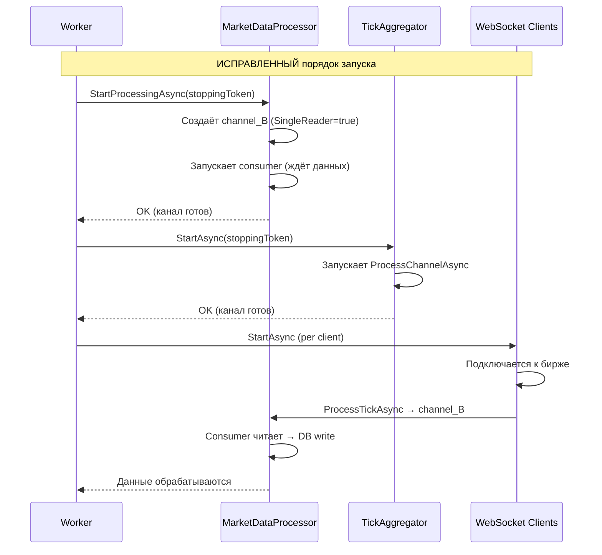

# План: Исправление отмены Worker'а и переполнения Channel

## Анализ проблем

### Проблема 1: Отмена Worker'а сломана

**Симптом**: После отмены `stoppingToken` ловится сообщение «Обработка отменена» из `MarketDataProcessor`, но health-check продолжает логироваться, а корректного завершения не происходит.

**Корневая причина** в [`Worker.cs`](src/MarketDataCollector.Workers/MarketDataCollector.Worker/Worker.cs:93):

```csharp
finally
{
    await CleanupAsync(marketDataProcessor, tickAggregator, clients, stoppingToken);
}
```

`CleanupAsync` получает **уже отменённый** `stoppingToken` (отмена пришла от ASP.NET). Внутри `CleanupAsync`:

1. **`StopClientAsync`** ([строка 133](src/MarketDataCollector.Workers/MarketDataCollector.Worker/Worker.cs:133)) — использует `CancellationToken.None`, что **правильно**.

2. **`tickAggregator.StopAsync(stoppingToken)`** ([строка 115](src/MarketDataCollector.Workers/MarketDataCollector.Worker/Worker.cs:115)) — внутри вызывает `_processingTask.WaitAsync(cancellationToken)` ([TickAggregator.cs:173](src/MarketDataCollector.Application/Services/TickAggregator.cs:173)). Поскольку `cancellationToken` уже отменён, `WaitAsync` **немедленно выбрасывает `OperationCanceledException`**, не дожидаясь фактического завершения `_processingTask`.

3. **`marketDataProcessor.StopProcessingAsync(stoppingToken)`** ([строка 125](src/MarketDataCollector.Workers/MarketDataCollector.Worker/Worker.cs:125)) — та же проблема: `_processingTask.WaitAsync(cancellationToken)` ([MarketDataProcessor.cs:222](src/MarketDataCollector.Application/Services/MarketDataProcessor.cs:222)) немедленно отменяется.

**Последствия**:
- Канал данных (`_channel`) завершается (`TryComplete`), но `ProcessBatchesAsync` может не успеть дочитать остатки.
- WebSocket-клиенты могут продолжать писать в уже завершённый канал → `ChannelClosedException`.
- Остаток тиков в канале теряется.
- Health-check может продолжать работать, потому что не дождались корректного завершения.

---

### Проблема 2: Channel DropOldest дропает тики (ложная тревога)

**Симптом**:
```
Health-check: Channel DropOldest дропнул 450 тиков (incoming=20018, received=19568). 
Канал переполняется! Увеличьте ChannelCapacity или оптимизируйте скорость записи в БД.
```

**Корневая причина**: «Канал-призрак» (phantom channel) при старте.

Весь pipeline передачи данных:



**Почему 450 дропов при capacity=100000, если всего 20018 тиков?**

Потому что это **не дропы от DropOldest**, а **тики, записанные в `channel_A`** — канал, который был создан в конструкторе и затем заменён в `StartProcessingAsync`.

Вот что происходит:

1. **Конструктор** ([`MarketDataProcessor.cs:88`](src/MarketDataCollector.Application/Services/MarketDataProcessor.cs:88)):
   Создаётся `channel_A` с `capacity=100000`, `SingleReader=false`
   
2. **Worker.cs строка 64-65**: `Task.WhenAll(clients.Select(c => c.StartAsync(stoppingToken)))` — запускает клиентов.
   `StartAsync` возвращает `Task.CompletedTask` мгновенно ([BaseWebSocketClient.cs:157](src/MarketDataCollector.Core/Clients/BaseWebSocketClient.cs:157)), но **фоново** запускает `RunBackgroundRecoveryLoopAsync`, который подключается к WS и начинает получать тики.
   
3. **Worker.cs строка 68**: `_ = marketDataProcessor.StartProcessingAsync(stoppingToken)` — **В ЭТОТ МОМЕНТ** пересоздаёт `_channel` на `channel_B` ([MarketDataProcessor.cs:139](src/MarketDataCollector.Application/Services/MarketDataProcessor.cs:139)).

4. **Между шагом 2 и шагом 3** проходит некоторое время (миллисекунды), за которое fake-server (1500 тиков/с на 3 символа = 500 msg/s на символ) успевает отправить ~150 тиков, которые попадают в `channel_A` и **теряются** при замене на `channel_B`.

5. Эти 150 тиков засчитываются в `_totalIncomingCount`, но **никогда не будут прочитаны**, потому что `channel_A` более не используется.

6. Ещё ~300 тиков теряются, пока `StartProcessingAsync` только начинает запускать consumer (между созданием `channel_B` и стартом цикла чтения).

**Итого**: `totalIncomingCount` = 20018, `totalReceivedCount` = 19568. Разница = 450 — это тики в канале-призраке.

**Доказательство**: Health-check говорит «Channel DropOldest дропнул 450», но `ChannelCapacity` = 100000, а `totalIncoming` = 20018. Даже если бы все тики были в канале одновременно, заполненность была бы 20%, что далеко до переполнения. Реальных дропов от DropOldest **нет**.

**Диагностика**: Добавить логирование остатка в старом канале при пересоздании в `StartProcessingAsync`.

---

### Проблема 3: Порядок запуска Worker'а неправильный

Дополнительно к проблеме 2: тики, успевшие прийти до `StartProcessingAsync`, попадают в `channel_A`, который будет заменён. Даже если consumer запущен — `channel_A` уже не читается.

---

## План исправлений

### Задача 1: Исправить отмену Worker'а

#### 1.1 `Worker.cs` — передавать `CancellationToken.None` в `CleanupAsync`

Изменить `finally` блок:

```csharp
finally
{
    // Используем CancellationToken.None, т.к. stoppingToken уже отменён
    await CleanupAsync(marketDataProcessor, tickAggregator, clients, CancellationToken.None);
}
```

#### 1.2 `Worker.CleanupAsync` — timeout для StopAsync как safety net

Добавить timeout через `CancellationTokenSource` с разумным лимитом (например, 30 секунд):

```csharp
using var cleanupCts = new CancellationTokenSource(TimeSpan.FromSeconds(30));
var cleanupToken = cleanupCts.Token;

// Остановка клиентов с таймаутом
var stopTasks = clients.Select(client => StopClientAsync(client, cleanupToken));
await Task.WhenAll(stopTasks);
```

#### 1.3 `TickAggregator.StopAsync` — не использовать внешний cancellationToken для WaitAsync

Изменить, чтобы `WaitAsync` использовал внутренний timeout, а внешний token применялся только для graceful-прерывания:

```csharp
// Ждём обработку с внутренним timeout 15с
using var timeoutCts = new CancellationTokenSource(TimeSpan.FromSeconds(15));
try
{
    await _processingTask.WaitAsync(timeoutCts.Token);
}
catch (OperationCanceledException)
{
    _logger.LogWarning("TickAggregator: превышен таймаут ожидания обработки");
}
```

#### 1.4 `MarketDataProcessor.StopProcessingAsync` — то же самое

Аналогично TickAggregator — не использовать внешний отменённый токен для `WaitAsync`:

```csharp
using var timeoutCts = new CancellationTokenSource(TimeSpan.FromSeconds(15));
try
{
    await _processingTask.WaitAsync(timeoutCts.Token);
}
catch (OperationCanceledException)
{
    _logger.LogWarning("Session={SessionId}: Превышен таймаут ожидания обработки", _sessionId);
}
```

---

### Задача 2: Исправить порядок запуска (устранить канал-призрак)

#### 2.1 `Worker.cs` — запускать `StartProcessingAsync` ДО старта клиентов

Изменить порядок в [`RunWithRecoveryAsync`](src/MarketDataCollector.Workers/MarketDataCollector.Worker/Worker.cs:51):

```csharp
// ВАЖНО: Сначала запускаем процессор, чтобы Channel был готов к приёму данных.
// Это предотвращает потерю тиков, которые клиенты могут отправить до старта процессора.
_ = marketDataProcessor.StartProcessingAsync(stoppingToken);

// Запускаем агрегатор свечей (канал также готов)
await tickAggregator.StartAsync(stoppingToken);

// Теперь запускаем WebSocket-клиентов — все их тики пойдут в правильный Channel
var tasks = clients.Select(client => client.StartAsync(stoppingToken));
await Task.WhenAll(tasks);
```

**Почему это безопасно**: `StartProcessingAsync` запускает consumer, который начинает читать из канала сразу после его создания. Consumer не начнёт читать, пока не будут готовы данные, но канал будет готов к приёму, и ни один тик не потеряется.

---

### Задача 3: Добавить диагностическое логирование

#### 3.1 `MarketDataProcessor.StartProcessingAsync` — логировать остаток перед заменой

Добавить проверку остатка в старом канале перед пересозданием:

```csharp
// Проверяем, не осталось ли данных от предыдущего channel (например, при повторном вызове)
var oldCount = _channel.Reader.Count;
if (oldCount > 0)
{
    _logger.LogWarning(
        "Session={SessionId}: Старый канал содержит {Count} необработанных тиков. " +
        "Это указывает на ошибку порядка запуска — клиенты были запущены до процессора.",
        _sessionId, oldCount);
}
```

#### 3.2 `Worker.cs` — добавить логирование при отмене

При отмене stoppingToken логировать, сколько тиков осталось в каналах:

```csharp
catch (OperationCanceledException)
{
    var remaining = marketDataProcessor.Channel.Reader.Count;
    _logger.LogWarning("Worker отменён. Остаток в канале: {Remaining}", remaining);
}
```

#### 3.3 Health-check — добавить метрику заполненности канала

Добавить в health-check отображение текущей заполненности канала в процентах:

```csharp
var channelFillPercent = marketDataProcessor.Channel.Reader.Count * 100.0 / 500000;
_logger.LogInformation(
    "Health-check: ... Channel fill: {FillPercent:F1}% ({Count}/{Capacity})",
    channelFillPercent, marketDataProcessor.Channel.Reader.Count, 500000);
```

---

### Задача 4: Увеличить ChannelCapacity (профилактика)

#### 4.1 `appsettings.json` — увеличить ChannelCapacity

Хотя реальных дропов нет (проблема 2 — ложная тревога), увеличение буфера — хорошая профилактика:

```json
"ChannelCapacity": 100000  →  "ChannelCapacity": 500000
```

#### 4.2 Увеличить BatchSize

Больший батч уменьшит количество DB-циклов:

```json
"BatchSize": 800  →  "BatchSize": 2000
```

---

## Диаграмма исправленного потока запуска



---

## Изменяемые файлы и порядок выполнения

| № | Файл | Что сделать | Тип |
|---|------|-------------|-----|
| 1 | [`Worker.cs`](src/MarketDataCollector.Workers/MarketDataCollector.Worker/Worker.cs) | Изменить порядок запуска: StartProcessingAsync → StartAsync клиентов | fix |
| 2 | [`Worker.cs`](src/MarketDataCollector.Workers/MarketDataCollector.Worker/Worker.cs) | Исправить `finally` — передавать `CancellationToken.None` | fix |
| 3 | [`Worker.cs`](src/MarketDataCollector.Workers/MarketDataCollector.Worker/Worker.cs) | Добавить timeout 30с для cleanup | fix |
| 4 | [`Worker.cs`](src/MarketDataCollector.Workers/MarketDataCollector.Worker/Worker.cs) | Добавить логирование остатка при отмене | improvement |
| 5 | [`TickAggregator.cs`](src/MarketDataCollector.Application/Services/TickAggregator.cs) | Исправить `StopAsync` — timeout для WaitAsync | fix |
| 6 | [`MarketDataProcessor.cs`](src/MarketDataCollector.Application/Services/MarketDataProcessor.cs) | Исправить `StopProcessingAsync` — timeout для WaitAsync | fix |
| 7 | [`MarketDataProcessor.cs`](src/MarketDataCollector.Application/Services/MarketDataProcessor.cs) | Добавить логирование остатка при пересоздании канала | improvement |
| 8 | [`Worker.cs`](src/MarketDataCollector.Workers/MarketDataCollector.Worker/Worker.cs) | Добавить метрику заполненности канала в health-check | improvement |
| 9 | [`appsettings.json`](src/MarketDataCollector.Workers/MarketDataCollector.Worker/appsettings.json) | Увеличить `ChannelCapacity` до 500000, `BatchSize` до 2000 | config |

## Ожидаемый результат

1. **Отмена Worker'а**: Корректное завершение — дожидаемся остановки всех компонентов (таймаут 30с как safety net), health-check прекращается.
2. **Канал-призрак устранён**: Тики не теряются при старте. Если порядок запуска будет нарушен снова — сработает диагностическое логирование.
3. **Исчезновение предупреждения о дропах**: После исправления порядка запуска `totalIncoming - totalReceived` будет показывать только реальные дропы от DropOldest.
4. **Заполненность канала в health-check**: Позволяет наблюдать реальную нагрузку на канал.
