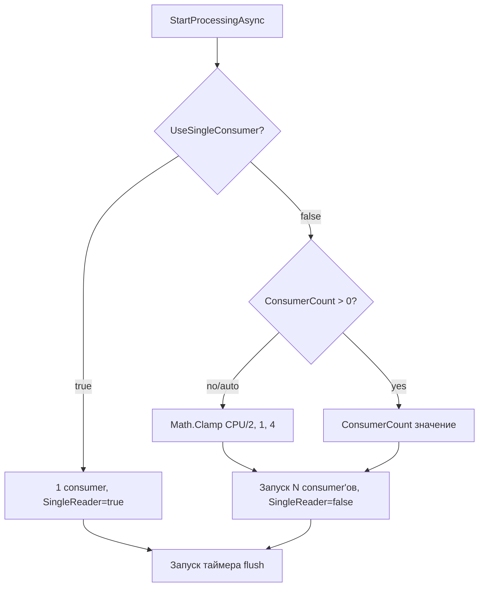

# План: Параметр количества consumer'ов при `UseSingleConsumer: false`

## Проблема

Сейчас при `UseSingleConsumer: false` количество consumer'ов вычисляется автоматически:
```csharp
var consumerCount = Math.Clamp((int)Math.Ceiling(Environment.ProcessorCount / 2.0), 1, 4);
```

Это негибко — нельзя настроить количество consumer'ов под конкретную нагрузку без правки кода.

## Решение

Добавить опциональный параметр `ConsumerCount` в [`MarketDataProcessorOptions`](src/MarketDataCollector.Core/Configuration/MarketDataProcessorOptions.cs).
Логика:
- `ConsumerCount == 0` (значение по умолчанию) — текущее авто-поведение: `Math.Clamp(CPU/2, 1, 4)`
- `ConsumerCount > 0` — используется указанное значение

## Изменения

### 1. [`src/MarketDataCollector.Core/Configuration/MarketDataProcessorOptions.cs`](src/MarketDataCollector.Core/Configuration/MarketDataProcessorOptions.cs)

Добавить новое свойство:

```csharp
/// <summary>
/// Количество parallel consumer'ов для режима Multiple Consumers (UseSingleConsumer=false).
/// 0 = авто-определение (Math.Clamp(CPU/2, 1, 4), по умолчанию).
/// Значение больше 0 — фиксированное количество consumer'ов.
/// </summary>
public int ConsumerCount { get; set; } = 0;
```

Обновить XML-doc на `UseSingleConsumer`, добавив упоминание `ConsumerCount`.

### 2. [`src/MarketDataCollector.Application/Services/MarketDataProcessor.cs`](src/MarketDataCollector.Application/Services/MarketDataProcessor.cs)

- Добавить поле `_consumerCount`
- В конструкторе читать `options.ConsumerCount`
- В `StartProcessingAsync()` (блок `else` для multiple consumers) изменить расчёт:

```csharp
int consumerCount;
if (_consumerCount > 0)
{
    consumerCount = _consumerCount;
}
else
{
    consumerCount = Math.Clamp((int)Math.Ceiling(Environment.ProcessorCount / 2.0), 1, 4);
}
```

Обновить лог-сообщение для отображения source: `auto` или `configured`.

### 3. [`src/MarketDataCollector.Workers/MarketDataCollector.Worker/appsettings.json`](src/MarketDataCollector.Workers/MarketDataCollector.Worker/appsettings.json)

Добавить в секцию `MarketDataProcessor`:

```json
"ConsumerCount": 4
```

### 4. `appsettings.Development.json`

Не требует изменений — содержит только настройки логирования.

## Семантика работы

| UseSingleConsumer | ConsumerCount | Результат |
|---|---|---|
| `true` | любой | 1 consumer (SingleConsumer mode) |
| `false` | `0` (default) | авто: `Math.Clamp(CPU/2, 1, 4)` |
| `false` | `4` | ровно 4 consumer'а |
| `false` | `10` | ровно 10 consumer'ов |

## Mermaid-диаграмма потока принятия решения



## Тестирование

Файлы тестов не требуют изменений, т.к.:
- Конструктор `MarketDataProcessor` продолжает принимать `MarketDataProcessorOptions`
- Поведение при `ConsumerCount == 0` идентично текущему
- Тесты не тестируют количество consumer'ов напрямую
