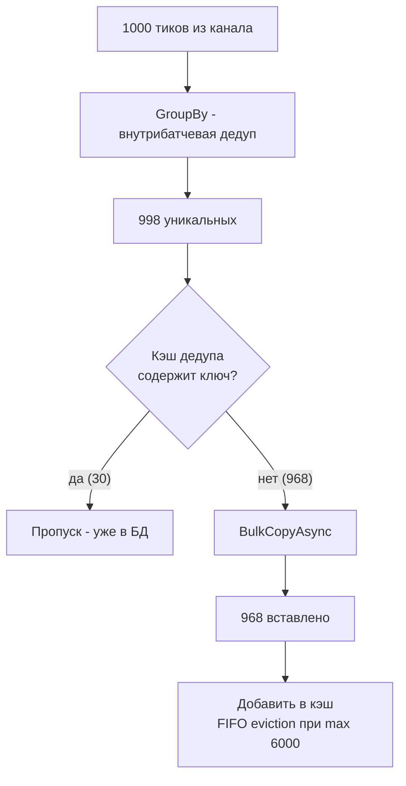
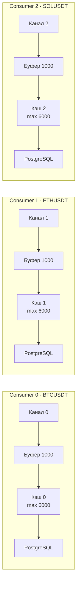

# План: In-memory кэш дедупликации перед записью в БД

## Проблема

В логе видно расхождение `uniq=998, вставлено=968` — 30 тиков из 998 уникальных (внутри батча) уже существуют в БД от предыдущих батчей и отсекаются `ON CONFLICT DO NOTHING`. Это лишняя нагрузка:
- Отправка данных в PostgreSQL
- COPY во временную таблицу
- Обработка конфликтов в INSERT

## Решение

In-memory кэш `(ticker, exchange, timestamp)` **ограниченный по размеру** (max 6000 записей), **per-consumer** (каждый consumer работает с disjoint набором тикеров через hash-based routing, поэтому синхронизация не нужна). FIFO-эвикция: при превышении лимита самая старая запись удаляется.



## Изменения

### 1. Новый класс `DeduplicationCache`

**Файл:** `src/MarketDataCollector.Application/Services/DeduplicationCache.cs`

- `Dictionary<(string, string, DateTime), byte>` — основное хранилище для O(1) проверки
- `Queue<(string, string, DateTime)>` — FIFO-очередь для отслеживания порядка добавления
- `int _maxSize` — максимальный размер кэша (по умолчанию 6000)
- Метод `Contains(string ticker, string exchange, DateTime timestamp)` — O(1) проверка наличия ключа
- Метод `Add(string ticker, string exchange, DateTime timestamp)` — добавление + эвикция при превышении лимита
- **Не thread-safe** — каждый consumer single-threaded, блокировки не нужны

Параметры конструктора:
- `int maxSize` — максимальное количество записей (по умолчанию 6000)

```csharp
public class DeduplicationCache
{
    private readonly Dictionary<(string, string, DateTime), byte> _cache;
    private readonly Queue<(string, string, DateTime)> _order;
    private readonly int _maxSize;

    public DeduplicationCache(int maxSize = 6000)
    {
        _maxSize = maxSize;
        _cache = new Dictionary<(string, string, DateTime), byte>(maxSize);
        _order = new Queue<(string, string, DateTime)>(maxSize);
    }

    public bool Contains(string ticker, string exchange, DateTime timestamp)
    {
        return _cache.ContainsKey((ticker, exchange, timestamp));
    }

    public void Add(string ticker, string exchange, DateTime timestamp)
    {
        var key = (ticker, exchange, timestamp);
        if (_cache.ContainsKey(key))
            return; // уже есть — пропускаем

        // Эвикция: если превышен лимит, удаляем самую старую запись
        while (_cache.Count >= _maxSize)
        {
            var oldest = _order.Dequeue();
            _cache.Remove(oldest);
        }

        _cache[key] = 0;
        _order.Enqueue(key);
    }

    public int Count => _cache.Count;
    public void Clear() { _cache.Clear(); _order.Clear(); }
}
```

### 2. Изменения в `MarketDataProcessorOptions`

**Файл:** `src/MarketDataCollector.Core/Configuration/MarketDataProcessorOptions.cs`

Добавить свойство:

```csharp
/// <summary>
/// Максимальный размер кэша дедупликации (количество записей).
/// Тики с ключом (ticker, exchange, timestamp), попавшие в кэш,
/// пропускаются перед BulkCopyAsync — экономят COPY + INSERT.
/// FIFO-эвикция: при превышении лимита самая старая запись удаляется.
/// 0 = кэш отключён.
/// </summary>
public int DeduplicationCacheMaxSize { get; set; } = 6000;
```

### 3. Изменения в `MarketDataProcessor`

**Файл:** `src/MarketDataCollector.Application/Services/MarketDataProcessor.cs`

#### 3.1. Конструктор
- Прочитать `DeduplicationCacheMaxSize` из options

#### 3.2. `ProcessBatchesAsync` (consumer loop)
- Создать `DeduplicationCache` для этого consumer'а (per-consumer, не shared)
- Передавать в `ProcessBatchAsync` как параметр

#### 3.3. `ProcessBatchAsync` (новая сигнатура)
```csharp
private async Task ProcessBatchAsync(
    List<TickData> batch,
    DeduplicationCache? dedupCache,
    CancellationToken cancellationToken)
```

После `GroupBy` (строка 525-528):
```csharp
// 1.5. Фильтрация через кэш дедупликации (cross-batch дубли)
List<TickData> filteredTicks;
int cachedCount = 0;
if (dedupCache != null)
{
    filteredTicks = new List<TickData>(uniqueTicks.Count);
    foreach (var t in uniqueTicks)
    {
        if (dedupCache.Contains(t.Ticker, t.Exchange, t.Timestamp))
            cachedCount++;
        else
            filteredTicks.Add(t);
    }
}
else
{
    filteredTicks = uniqueTicks;
}

var entities = filteredTicks.Select(t => new RawTick(...)).ToList();
```

После успешного INSERT — добавить в кэш:
```csharp
if (dedupCache != null && inserted > 0)
{
    foreach (var t in filteredTicks)
    {
        dedupCache.Add(t.Ticker, t.Exchange, t.Timestamp);
    }
}
```

Обновить лог:
```csharp
_logger.LogInformation(
    "Всего: {TotalInserted} вставлено, {TotalReceived} получено " +
    "(batch={BatchSize}, uniq={Unique}, cached={Cached}, вставлено={Inserted})",
    totalInserted, totalReceived, batchSize, uniqueTicks.Count, cachedCount, inserted);
```

### 4. Изменения в `appsettings.json`

**Файл:** `src/MarketDataCollector.Workers/MarketDataCollector.Worker/appsettings.json`

```json
"MarketDataProcessor": {
    "BatchSize": 1000,
    "ChannelCapacity": 150000,
    "UseSingleConsumer": false,
    "ConsumerCount": 3,
    "FlushIntervalSeconds": 3,
    "DeduplicationCacheMaxSize": 6000
}
```

### 5. Тесты

**Файл:** `tests/MarketDataCollector.Tests/Application/Services/DeduplicationCacheTests.cs` (новый)

Тесты:
- `Contains_ReturnsFalse_WhenEmpty`
- `Contains_ReturnsTrue_AfterAdd`
- `Add_EvictsOldest_WhenMaxSizeReached`
- `Add_DoesNotGrowBeyondMaxSize`
- `Add_IgnoresDuplicateKey`
- `Count_ReflectsActualSize`

**Файл:** `tests/MarketDataCollector.Tests/Application/Services/MarketDataProcessorTests.cs` (обновить)

Добавить тесты:
- `ProcessBatchAsync_WithDedupCache_SkipsDuplicateTicks`
- `ProcessBatchAsync_WithDedupCacheDisabled_ProcessesAllTicks` (MaxSize=0)

## Потребление памяти

При max 6000 записей на consumer:
- Ключ: tuple из 3 строк (ticker ~10 байт, exchange ~10 байт, DateTime 8 байт)
- Dictionary overhead: ~50 байт на запись
- Queue entry: ~48 байт на запись
- **Итого на consumer: ~700 KB**
- При 3 consumer'ах: **~2.1 MB** — пренебрежимо мало

## Диаграмма потока данных



Каждый кэш изолирован — никакой синхронизации между consumer'ами.
