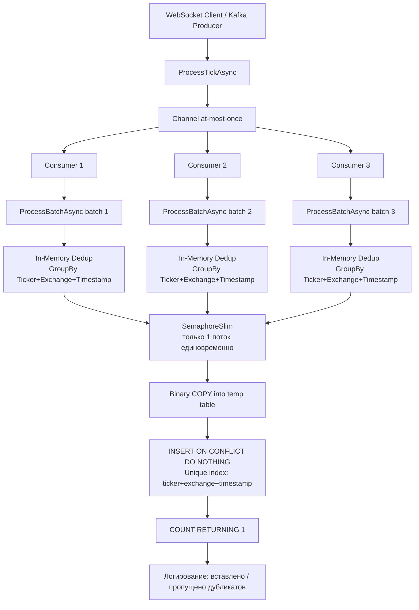

# Анализ механизма исключения дублей при `UseSingleConsumer: false`

## 1. Текущее состояние (как работает сейчас)

### 1.1. Поток данных (Data Flow)

```
WebSocket Client → ProcessTickAsync → Channel<TickData> → N Consumer'ов → ProcessBatchAsync → BulkCopyAsync
                                                                                        ↓
                                                                                 In-Memory Dedup
                                                                                 (GroupBy ticker+exchange+timestamp)
                                                                                        ↓
                                                                                 ON CONFLICT DO NOTHING
                                                                                 (уровень БД)
```

### 1.2. Три уровня дедупликации

#### Уровень 1 — In-Memory Dedup в [`ProcessBatchAsync`](src/MarketDataCollector.Application/Services/MarketDataProcessor.cs:384) (строка 393-396)

```csharp
var uniqueTicks = batch
    .GroupBy(t => (t.Ticker, t.Exchange, t.Timestamp))
    .Select(g => g.First())
    .ToList();
```

**Что делает:** Перед отправкой в БД, в рамках ОДНОГО батча, убирает дубликаты по композиту `(Ticker, Exchange, Timestamp)`.

**Проблема при `UseSingleConsumer: false`:** Если 2 consumer'а параллельно сформировали батчи с перекрывающимися данными, то in-memory dedup не сработает — дубликаты окажутся в РАЗНЫХ батчах, обрабатываемых РАЗНЫМИ потоками.

#### Уровень 2 — SemaphoreSlim в [`BulkCopyAsync`](src/MarketDataCollector.Infrastructure/Repositories/RawTickRepository.cs:158) (строка 158, 244)

```csharp
private static readonly SemaphoreSlim BulkCopyLock = new(1, 1);
// ...
await BulkCopyLock.WaitAsync(cancellationToken);
```

**Что делает:** Сериализует ВСЕ вызовы `BulkCopyAsync` — только один поток одновременно может выполнять Binary COPY + INSERT ON CONFLICT.

**Следствие для дублей:** Несмотря на то что consumer'ов несколько (3 по конфигурации), запись в БД всё равно последовательная. Это значит, что дубликаты между батчами обрабатываются корректно на уровне БД (Уровень 3), потому что нет параллельного INSERT'а.

**Важный нюанс:** Deadlock'и (40P01) в этом режиме маловероятны именно благодаря SemaphoreSlim, но retry-логика (5 попыток) оставлена как safety net.

#### Уровень 3 — `ON CONFLICT DO NOTHING` в [`BulkCopyAsync`](src/MarketDataCollector.Infrastructure/Repositories/RawTickRepository.cs:306-310) (строка 306-310)

```sql
INSERT INTO rawticks (id, ticker, price, volume, timestamp, exchange, receivedat, normalized)
SELECT id, ticker, price, volume, timestamp, exchange, receivedat, normalized
FROM rawticks_staging
ON CONFLICT (ticker, exchange, timestamp) DO NOTHING
RETURNING 1
```

**Что делает:** При нарушении unique-constraint `(ticker, exchange, timestamp)` строка из временной таблицы просто не вставляется. `RETURNING 1` и `SELECT COUNT(*)` возвращают количество реально вставленных строк.

**Это — финальный и самый надёжный уровень защиты от дублей.**

### 1.3. Unique Index в БД

Судя по ON CONFLICT, в таблице `rawticks` определён unique-индекс:

```sql
CREATE UNIQUE INDEX ON rawticks (ticker, exchange, timestamp);
```

Этот индекс гарантирует, что на уровне БД дубликаты невозможны независимо от количества параллельных consumer'ов.

### 1.4. Логирование статистики

После каждого батча в [`ProcessBatchAsync`](src/MarketDataCollector.Application/Services/MarketDataProcessor.cs:426-427) логируется:

```csharp
_logger.LogDebug("Батч сохранён: {Saved} вставлено, {Duplicates} дубликатов пропущено",
    inserted, entities.Count - inserted);
```

- `entities.Count` — сколько пришло после in-memory dedup (Уровень 1)
- `inserted` — сколько реально вставлено в БД (после Уровня 3)
- `entities.Count - inserted` — дубликаты, отсеянные на уровне БД (меж-батчевые дубли)

### 1.5. Счётчики мониторинга

| Счётчик | Описание |
|---------|----------|
| `_totalIncomingCount` | Сколько тиков пришло в ProcessTickAsync (до записи в Channel) |
| `_totalDroppedCount` | Сколько раз TryWrite вернул false (Channel полон, DropOldest) |
| `_totalReceivedCount` | Сколько тиков прочитано из Channel (batch.Count суммируется) |
| `_processedCount` | Сколько тиков реально вставлено в БД (сложением inserted) |

## 2. Ключевые сценарии дублей

### Сценарий A: Дубль в рамках одного батча

Один consumer вычитал из Channel 2 одинаковых тика. In-memory dedup (Уровень 1) убирает дубль. ON CONFLICT DO NOTHING всё равно не срабатывает.

**Итог:** Дубль исключён на Уровне 1. OK.

### Сценарий B: Дубль между разными батчами одного consumer'а

Consumer обработал батч, записал 100 тиков. Затем вычитал следующие тики, среди которых оказались дубликаты первого батча.

- In-memory dedup (Уровень 1) не видит дубль (тики в разных батчах)
- SemaphoreSlim (Уровень 2) не помогает (один consumer, последовательная запись)
- ON CONFLICT DO NOTHING (Уровень 3) отсеивает дубль

**Итог:** Дубль исключён на Уровне 3. OK.

### Сценарий C: Дубль между разными consumer'ами (UseSingleConsumer=false)

Consumer 1 обработал батч и пишет в БД (захватил SemaphoreSlim). Consumer 2 ждёт SemaphoreSlim. После Consumer 1 Consumer 2 начинает запись. Если в батче Consumer 2 есть дубликаты из батча Consumer 1:

- In-memory dedup (Уровень 1) не видит дубль
- SemaphoreSlim (Уровень 2) гарантирует, что Consumer 1 закончит запись ДО Consumer 2
- ON CONFLICT DO NOTHING (Уровень 3) отсеивает дубль

**Итог:** Дубль исключён на Уровне 3. OK.

### Сценарий D: Deadlock при конкурентной записи

Теоретически, если бы SemaphoreSlim был убран, 3 consumer'а одновременно писали бы через temp table + INSERT ON CONFLICT в один unique index. PostgreSQL сгенерировал бы deadlock (40P01). Retry-логика (5 попыток с exponential backoff + jitter) решила бы проблему.

**Итог:** SemaphoreSlim предотвращает deadlock. Retry — safety net. OK.

## 3. Графическая схема



## 4. Потенциальные проблемы и риски

### 4.1. SemaphoreSlim создаёт узкое горлышко (bottleneck)

**Суть:** SemaphoreSlim(1,1) сериализует ВСЕ записи в БД, независимо от количества consumer'ов. Consumer'ы эффективны только для чтения из Channel (конкурентный `TryRead`), но вставка в БД всё равно идёт последовательно.

**Следствие:** 3 consumer'а не дают 3x прироста производительности записи по сравнению с SingleConsumer mode. Бенчмарки подтверждают: 4 consumer'а ≈ 50-55k ticks/sec, Single Consumer ≈ 62k ticks/sec.

**Рекомендация:** Если производительность записи становится проблемой — нужна партиция по естественному ключу (например, `ticker`), чтобы consumer'ы писали в разные таблицы/партиции без конкуренции за SemaphoreSlim.

### 4.2. Inter-батчевые дубли не логируются отдельно

**Суть:** Логи `"Батч сохранён: {Saved} вставлено, {Duplicates} дубликатов пропущено"` показывают разницу между `uniqueTicks.Count` (после in-memory dedup) и `inserted` (после ON CONFLICT). Но `uniqueTicks.Count` уже исключил внутри-батчевые дубли. Нет метрики, сколько дублей отсечено на Уровне 1 vs Уровне 3.

**Рекомендация:** Добавить отдельный счётчик `_inMemoryDedupSkipped` для мониторинга эффективности in-memory дедупликации.

### 4.3. Consumer'ы не балансируют нагрузку

**Суть:** Channel использует `DropOldest`. Если один consumer медленный (например, retry после deadlock), другой consumer может вычитать больше тиков. Но это неявная балансировка. Нет гарантии fair распределения.

**Рекомендация:** Для текущей архитектуры OK. Если нужна строгая гарантия порядка — только SingleConsumer mode.

## 5. Рекомендации по улучшению

| # | Изменение | Обоснование | Сложность |
|---|-----------|-------------|-----------|
| 1 | **Метрика `_inMemoryDedupSkipped`** | Добавить счётчик для мониторинга эффективности in-memory дедупликации отдельно от DB-level | Низкая |
| 2 | **Метрика `_dbDedupSkipped`** | Отдельный счётчик для дублей, отсеянных на уровне БД (ON CONFLICT DO NOTHING) | Низкая |
| 3 | **Тест на меж-батчевые дубли при UseSingleConsumer=false** | Существующие тесты (`SkipDuplicateTicks`, `LogsSkippedDuplicates`) проверяют только внутри-батчевые дубли. Нужен тест, где дубли распределены между 2+ батчами через 2+ consumer'а | Средняя |
| 4 | **Рассмотреть партиционирование** (опционально) | Если производительность станет узким местом — партиции по ticker снимут конкуренцию за SemaphoreSlim | Высокая |

## 6. Заключение

**Механизм исключения дублей при `UseSingleConsumer: false` — корректен и надёжен.**

1. In-memory dedup (Уровень 1) убирает дубликаты в рамках одного батча
2. SemaphoreSlim (Уровень 2) сериализует запись, предотвращая deadlock и гарантируя, что дубли между батчами обрабатываются последовательно
3. ON CONFLICT DO NOTHING (Уровень 3) — финальная защита на уровне unique index БД

Единственный компромисс: SemaphoreSlim делает parallel consumer'ов неэффективными для записи (сериализация). Но это осознанный выбор — deadlock'и (40P01) были реальной проблемой, и SemaphoreSlim решил её полностью. Если нужна более высокая пропускная способность записи — нужно партиционирование.
