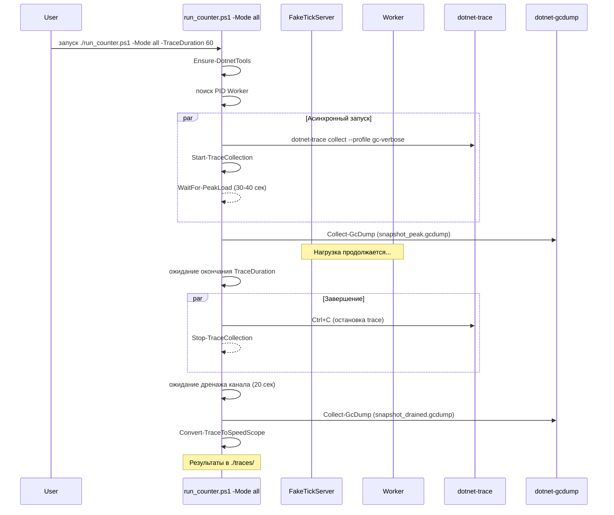

# План профилирования: dotnet-trace (allocation tracking) + dotnet-gcdump

## Контекст

**Текущее состояние кода (оптимизации уже применены):**
- ✅ `JObject.Parse` → `JsonDocument.Parse` в [`BinanceWebSocketClient.cs`](src/MarketDataCollector.Infrastructure/Clients/BinanceWebSocketClient.cs)
- ✅ `class InMemoryCandle` → `struct InMemoryCandle` в [`TickAggregator.cs`](src/MarketDataCollector.Application/Services/TickAggregator.cs)
- ✅ `ArrayPool<TickData>` в Collector/Writer циклах в [`MarketDataProcessor.cs`](src/MarketDataCollector.Application/Services/MarketDataProcessor.cs)
- ✅ `TickData` — `readonly record struct` (value type) в [`TickData.cs`](src/MarketDataCollector.Domain/Entities/TickData.cs)
- ✅ `FilteredTickSlice` — reusable `IReadOnlyList<TickData>` (без `List<T>` аллокаций)

**Известные метрики (из [`counters-analysis-20260730-175425.md`](plans/counters-analysis-20260730-175425.md)):**
- 2.87 GB аллокаций за 90 секунд
- 5 Gen2 сборок за 90 сек — **высокая GC pressure**
- Gen2 фрагментация ~2.4 MB, LOH ~1.1 MB
- ~16,700 ticks/sec throughput

**Цель профилирования:**
1. Увидеть **реальную аллокационную картину после оптимизаций** — какие типы и методы остались горячими
2. Подтвердить, что `JObject` больше не является главной проблемой
3. Обнаружить **следующие по значимости** источники аллокаций
4. Оценить фрагментацию Gen2/LOH в пике vs после стабилизации

---

## Модификация: все вызовы профилирования в run_counter.ps1

В [`run_counter.ps1`](run_counter.ps1) добавляются **новые параметры** для выбора режима работы:

| Параметр | Тип | Значение по умолчанию | Описание |
|----------|-----|----------------------|----------|
| `Mode` | `string` | `"counters"` | Режим: `counters`, `trace`, `gcdump`, `all` |
| `WorkerProcessName` | `string` | `"MarketDataCollector.Worker"` | Имя процесса для профилирования |
| `TraceDuration` | `int` | `60` | Длительность сбора trace (сек) |
| `GcDumpAtPeakSec` | `int` | `40` | Через сколько секунд взять первый gcdump |
| `OutputDir` | `string` | `"./traces"` | Директория для результатов профилирования |

### Режимы работы

```
.\run_counter.ps1 -Mode counters                  # сбор Prometheus-метрик (как сейчас)
.\run_counter.ps1 -Mode trace                     # dotnet-trace с gc-verbose
.\run_counter.ps1 -Mode gcdump                    # dotnet-gcdump (2 снапшота)
.\run_counter.ps1 -Mode all                       # всё сразу: counters + trace + gcdump
```

### Добавляемые функции в скрипт

| Функция | Назначение |
|---------|------------|
| `Find-ProcessId` | Поиск PID Worker'а по имени процесса |
| `Start-TraceCollection` | Запуск `dotnet-trace collect --profile gc-verbose` |
| `Convert-TraceToSpeedScope` | Конвертация `.nettrace` → `.speedscope.json` |
| `Collect-GcDump` | `dotnet-gcdump collect` в указанный файл |
| `Ensure-DotnetTools` | Проверка наличия `dotnet-trace` и `dotnet-gcdump`, установка при отсутствии |
| `WaitFor-PeakLoad` | Ожидание пика нагрузки (пауза + проверка backlog через /metrics) |

### Сценарий выполнения: режим `all`



---

## Детальное описание функций для run_counter.ps1

### 1. `Ensure-DotnetTools`

```powershell
function Ensure-DotnetTools {
    # Проверяет dotnet-trace и dotnet-gcdump через dotnet tool list --global
    # Если нет — устанавливает
}
```

### 2. `Find-ProcessId`

```powershell
function Find-ProcessId {
    param([string]$ProcessName = "MarketDataCollector.Worker")
    # dotnet-trace ps → парсим вывод, ищем процесс по имени
    # fallback: Get-Process -Name $ProcessName
}
```

### 3. `Start-TraceCollection`

```powershell
function Start-TraceCollection {
    param(
        [int]$ProcessId,
        [int]$DurationSec = 60,
        [string]$OutputDir = "./traces"
    )
    # Запуск: dotnet-trace collect --process-id $ProcessId --profile gc-verbose
    # Возвращает: объект Process (фоновый), путь к файлу
}
```

### 4. `Collect-GcDump`

```powershell
function Collect-GcDump {
    param(
        [int]$ProcessId,
        [string]$OutputPath
    )
    # dotnet-gcdump collect --process-id $ProcessId --output $OutputPath
}
```

### 5. `WaitFor-PeakLoad`

```powershell
function WaitFor-PeakLoad {
    param([int]$Seconds = 40)
    # Ожидание указанного кол-ва секунд для выхода на пик нагрузки
    # Можно добавить опрос /metrics endpoint'a для проверки backlog
}
```

### 6. `Convert-TraceToSpeedScope`

```powershell
function Convert-TraceToSpeedScope {
    param([string]$TraceFile)
    # dotnet-trace convert --format speedscope $TraceFile --output $TraceFile.speedscope.json
}
```

### 7. `WaitFor-Drain`

```powershell
function WaitFor-Drain {
    param([int]$TimeoutSec = 30)
    # Проверка /metrics endpoint: ticks_processed_count_total == ticks_incoming_count_total
    # Или просто пауза 20-30 сек
}
```

---

## Обновлённая секция параметров в run_counter.ps1

```powershell
param(
    # Существующие параметры
    [string]$OutputDir = "./traces",
    [string]$MetricsUrl = "http://localhost:5010/metrics",
    
    # НОВЫЕ параметры
    [ValidateSet("counters", "trace", "gcdump", "all")]
    [string]$Mode = "counters",
    
    [string]$WorkerProcessName = "MarketDataCollector.Worker",
    [int]$TraceDuration = 60,
    [int]$GcDumpAtPeakSec = 40,
    [int]$DrainWaitSec = 30
)
```

---

## Примеры запуска

```powershell
# Только сбор Prometheus-метрик (как сейчас было)
.\run_counter.ps1 -Mode counters -RefreshSeconds 5

# Только dotnet-trace allocation tracking (60 сек)
.\run_counter.ps1 -Mode trace -TraceDuration 60

# Только gcdump: 2 снапшота (на пике через 40 сек и после дренажа)
.\run_counter.ps1 -Mode gcdump -GcDumpAtPeakSec 40

# Всё вместе: counters + trace + gcdump
.\run_counter.ps1 -Mode all -TraceDuration 90 -GcDumpAtPeakSec 50

# С кастомным именем процесса
.\run_counter.ps1 -Mode all -WorkerProcessName "dotnet"
```

---

## Структура выходных файлов

```
traces/
├── counters_<timestamp>.csv              # Prometheus-метрики (если Mode=counters/all)
├── allocation_trace_<timestamp>.nettrace      # сырой trace
├── allocation_trace_<timestamp>.speedscope.json  # SpeedScope JSON
├── snapshot_peak_<timestamp>.gcdump       # снапшот на пике
├── snapshot_drained_<timestamp>.gcdump    # снапшот после дренажа
└── profiling_report_<timestamp>.md        # сводный отчёт (генерируется скриптом)
```

---

## Критерии успешного завершения профилирования

1. **dotnet-trace:**
   - Получен `.nettrace` файл размера >50 MB (достаточно данных)
   - Конвертирован в `.speedscope.json` без ошибок
   - В flame graph видны горячие методы с аллокациями

2. **dotnet-gcdump:**
   - 2 снапшота успешно собраны
   - Разница между peak и drained видна невооружённым глазом

3. **Сводный отчёт:**
   - Top allocation types с процентным распределением
   - Gen2/LOH фрагментация для каждого снапшота
   - Survivor ratio
   - Вывод: какие следующие шаги по оптимизации
