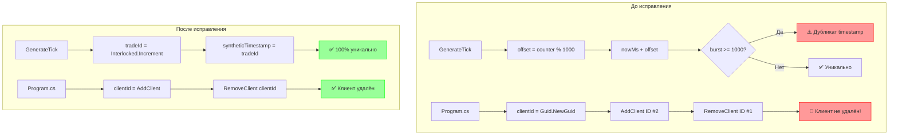

# План исправления проблем в FakeTickServer

## Обзор

В ходе анализа кода `FakeTickServer` (`tests/FakeTickServer/`) были обнаружены две проблемы:

1. **Дубликаты timestamp** — при burst-генерации тики могут получить одинаковый `(Ticker, Exchange, Timestamp)`
2. **Баг с `RemoveClient`** — клиенты не удаляются из словаря при отключении из-за несовпадения ID

---

## Проблема 1: Дубликаты timestamp

### Описание

В методе [`GenerateTick`](tests/FakeTickServer/TickGeneratorService.cs:265) синтезируется timestamp:

```csharp
var offset = Interlocked.Increment(ref _timestampOffset) % 1000;   // 0..999
var nowMs = DateTimeOffset.UtcNow.ToUnixTimeMilliseconds();
var syntheticTimestamp = nowMs + offset;
```

При burst-генерации (когда `need > 1000` за одну итерацию цикла) `nowMs` не успевает измениться, `offset` делает полный оборот 0→999, и timestamp повторяется.

### Последствия

В [`MarketDataProcessor.ProcessBatchAsync`](src/MarketDataCollector.Application/Services/MarketDataProcessor.cs:351-355) выполняется дедупликация:

```csharp
var uniqueTicks = batch
    .GroupBy(t => (t.Ticker, t.Exchange, t.Timestamp))
    .Select(g => g.First())
    .ToList();
```

Тики с одинаковым `(Ticker, Exchange, Timestamp)` отбрасываются → **потеря данных при тестировании**.

### Исправление (Вариант Д — выбран пользователем)

**Использовать `tradeId` как timestamp.**

Счётчик `_globalTradeId` атомарно инкрементируется через `Interlocked.Increment` (строка 269). Он строго монотонен и уникален на всём протяжении работы сервера. Переполнение `long` (9.2×10¹⁸) невозможно — при RPS=1_000_000 это займёт ~300 000 лет.

```csharp
// Вместо:
var offset = Interlocked.Increment(ref _timestampOffset) % 1000;
var nowMs = DateTimeOffset.UtcNow.ToUnixTimeMilliseconds();
var syntheticTimestamp = nowMs + offset;

// Используем tradeId:
var tradeId = Interlocked.Increment(ref _globalTradeId);
var syntheticTimestamp = tradeId;  // 100% гарантия уникальности
```

**Побочный эффект:** Timestamp будет в районе 1970-2001 года (т.к. tradeId стартует от ~500M). Это не влияет на функциональность — дедупликация работает по равенству значений, а не по их реалистичности.

**Гарантия 100%:** Единственный возможный сценарий коллизии — переполнение `long` (9.2×10¹⁸), что при любом разумном RPS невозможно.

---

## Проблема 2: Баг с `RemoveClient`

### Описание

В [`Program.cs`](tests/FakeTickServer/Program.cs:38) создаётся локальный `clientId`:

```csharp
var clientId = Guid.NewGuid().ToString("N")[..8];  // ← ID №1
gen.AddClient(webSocket, symbol);                   // внутри AddClient создаётся ID №2
// ...
gen.RemoveClient(clientId);                         // ← пытается удалить по ID №1
```

Внутри [`AddClient`](tests/FakeTickServer/TickGeneratorService.cs:73) генерируется **новый** ID:

```csharp
public void AddClient(WebSocket webSocket, string symbol)
{
    var clientId = Guid.NewGuid().ToString("N")[..8];  // ← ID №2
    _clients.TryAdd(clientId, new ClientState(webSocket, symbol));
    // Не возвращает clientId наружу!
}
```

### Последствия

`RemoveClient` никогда не удаляет клиента → при обрыве соединения клиент остаётся в `_clients`. Сервер продолжает отправлять ему тики, получает `WebSocketException`, логирует ошибку, но клиент не удаляется. Это приводит к:
- Утечке памяти (растёт `_clients`)
- Лишним ошибкам в логах
- Возможному снижению RPS из-за постоянных exception

### Исправление

**Решение: Возвращать `clientId` из `AddClient` и использовать его в `Program.cs`**

В [`TickGeneratorService`](tests/FakeTickServer/TickGeneratorService.cs:72):

```csharp
// Изменить сигнатуру, чтобы возвращать сгенерированный ID
public string AddClient(WebSocket webSocket, string symbol)
{
    var clientId = Guid.NewGuid().ToString("N")[..8];
    _clients.TryAdd(clientId, new ClientState(webSocket, symbol));
    _logger.LogInformation("Клиент {ClientId} подключился. Всего клиентов: {Count}, symbol: {Symbol}",
        clientId, _clients.Count, symbol);
    _firstClientConnected.TrySetResult();
    return clientId;  // ← возвращаем реальный ID
}
```

В [`Program.cs`](tests/FakeTickServer/Program.cs:38-40):

```csharp
// Убрать дублирующий Guid.NewGuid, использовать возвращаемое значение
var clientId = gen.AddClient(webSocket, symbol);
// ...
gen.RemoveClient(clientId);  // ← теперь удаляем правильный ID
```

---

## Диаграмма исправлений



---

## Краткий список изменений (Todo)

| # | Файл | Изменение | Строки |
|---|------|-----------|--------|
| 1 | [`TickGeneratorService.cs`](tests/FakeTickServer/TickGeneratorService.cs:72) | Изменить сигнатуру `AddClient`: `void` → `string`, возвращать `clientId` | 72-81 |
| 2 | [`Program.cs`](tests/FakeTickServer/Program.cs:38) | Убрать `Guid.NewGuid()`, использовать возвращаемое значение `gen.AddClient()` | 38-40 |
| 3 | [`TickGeneratorService.cs`](tests/FakeTickServer/TickGeneratorService.cs:258) | Удалить поле `_timestampOffset` (больше не нужно) | 258 |
| 4 | [`TickGeneratorService.cs`](tests/FakeTickServer/TickGeneratorService.cs:291-293) | Заменить логику синтеза timestamp на `syntheticTimestamp = tradeId` | 291-293 |
| 5 | [`TickGeneratorService.cs`](tests/FakeTickServer/TickGeneratorService.cs:281-293) | Обновить комментарий (убрать упоминание циклического offset) | 281-293 |
