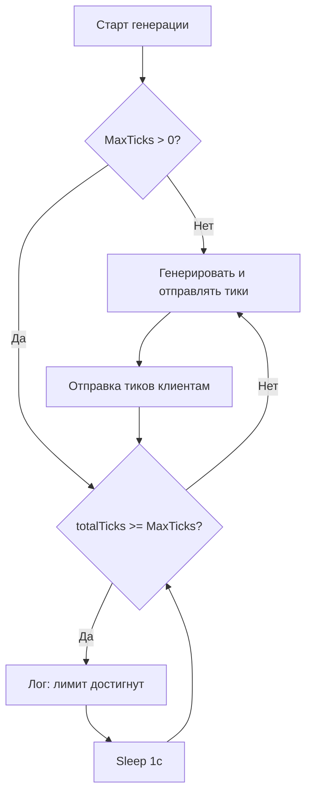

# План: добавление MaxTicks в FakeTickServer

## Суть задачи

Добавить параметр `--max-ticks` в FakeTickServer, при достижении которого:
1. Выводится сообщение в лог
2. Генерация новых тиков прекращается
3. Сервис продолжает работать, WebSocket-соединения остаются открытыми

Дефолтное значение в [`run_fake_server.ps1`](run_fake_server.ps1) — `300_000`.

---

## Изменения

### 1. `Settings.cs` — новый параметр `--max-ticks / -m`

Добавить поле:

```csharp
/// <summary>Максимальное количество тиков (0 = без лимита). По умолчанию: 0.</summary>
public long MaxTicks { get; set; } = 0;
```

Парсинг в `Parse`:

```csharp
case "--max-ticks":
case "-m":
    if (i + 1 < args.Length && long.TryParse(args[++i], out var maxTicks))
        result.MaxTicks = maxTicks;
    break;
```

Обновить `ToString()` — добавить вывод `maxTicks`.

---

### 2. `TickGeneratorService.cs` — остановка генерации по лимиту

Добавить публичное свойство `IsLimitReached`:

```csharp
private volatile bool _isLimitReached;

public bool IsLimitReached => _isLimitReached;
```

В главном цикле `ExecuteAsync`, **перед** расчётом `need` и отправкой, добавить проверку:

```csharp
if (_settings.MaxTicks > 0 && Interlocked.Read(ref _totalTicks) >= _settings.MaxTicks)
{
    if (!_isLimitReached)
    {
        _isLimitReached = true;
        _logger.LogInformation(
            "Достигнут лимит тиков: {MaxTicks}. Генерация остановлена, сервис продолжает работу.",
            _settings.MaxTicks);
    }
    await Task.Delay(1000, stoppingToken);
    continue;
}
```

Проверка стоит **до** блока отправки — тики не генерируются, но цикл жив, соединения не закрыты.

---

### 3. `Program.cs` — HTTP endpoint `/`

Добавить в JSON-ответ:

```csharp
maxTicks = settings.MaxTicks,
totalTicks = generator.TotalTicksGenerated,
isLimitReached = generator.IsLimitReached
```

---

### 4. `run_fake_server.ps1` — новый параметр с дефолтом 300000

```powershell
$MaxTicks = 300000
```

Вывод в консоль (строка 21):

```powershell
Write-Host "MaxTicks:  $MaxTicks$([char]0x00A0)(0=без лимита)"
```

В вызов `dotnet run` (строка 30):

```powershell
dotnet run -- --port $Port --rps $Rps --symbols $Symbols --base-price $BasePrice --max-ticks $MaxTicks
```

---

## Диаграмма потока генерации



## Поведение

| MaxTicks | Поведение |
|---------|-----------|
| `0` (дефолт в C#) | Лимит отключён — генерация бесконечная |
| `300000` (дефолт в ps1) | После 300k тиков генерация стопается, сокеты висят |
| Любое число > 0 | После достижения — сообщение в лог, сервис жив |
