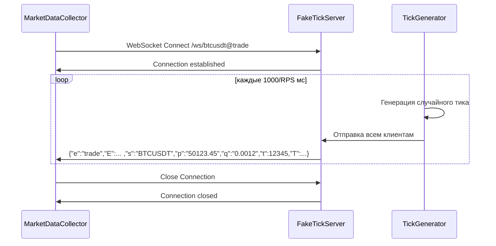

# План: FakeTickServer — WebSocket сервер для нагрузочного тестирования

## Цель

Создать маленький, простой WebSocket-сервер, который генерирует случайные тики (trades) в формате Binance trade stream. Сервер должен управляться параметром RPS (ticks-per-second) — сколько тиков в секунду выдавать всем подключённым клиентам.

Это позволит подменять URL в [`appsettings.json`](src/MarketDataCollector.Workers/MarketDataCollector.Worker/appsettings.json) с реальной Binance на `ws://localhost:5000` и генерировать **контролируемую нагрузку** без внешних зависимостей.

---

## Архитектура

```mermaid
flowchart LR
    subgraph FakeTickServer
        CLI[Параметры:\n--port --rps --symbols]
        MAIN[Program.cs\nWebHost]
        WS[WebSocket Endpoint\n/ws/{symbol}@trade]
        GEN[TickGenerator\nBackgroundService]
        LOOP[Timer Loop\nкаждые 1000/RPS мс]
        RAND[RandomPrice\nRandomVolume]
    end

    subgraph MarketDataCollector
        BWC[BinanceWebSocketClient\nподключается вместо Binance]
    end

    CLI --> MAIN
    MAIN --> WS
    GEN --> LOOP
    LOOP --> RAND
    RAND -->|JSON Binance format| WS
    WS -->|WebSocket| BWC
```

## Поток данных



---

## Структура проекта

```
tests/FakeTickServer/
├── FakeTickServer.csproj    # .NET 8 console app
├── Program.cs               # ASP.NET Minimal API хост
├── TickGeneratorService.cs  # BackgroundService для генерации тиков
└── Settings.cs              # Класс параметров командной строки
```

---

## Детали реализации

### 1. [`FakeTickServer.csproj`](tests/FakeTickServer/FakeTickServer.csproj)

- `TargetFramework`: `net8.0`
- Зависимости: минимальные — только `Microsoft.AspNetCore.WebSockets` (встроен в ASP.NET Core)
- `OutputType`: `Exe`
- `ImplicitUsings`: `enable`
- `Nullable`: `enable`

### 2. [`Settings.cs`](tests/FakeTickServer/Settings.cs)

Парсинг параметров командной строки:

| Параметр | Флаг | По умолчанию | Описание |
|----------|------|-------------|----------|
| `--port` | `-p` | `5000` | Порт для WebSocket сервера |
| `--rps` | `-r` | `1000` | Количество тиков в секунду |
| `--symbols` | `-s` | `btcusdt,ethusdt` | Список тикеров через запятую |
| `--base-price` | `-b` | `50000` | Базовая цена (USD) |

**Пример запуска:**
```bash
dotnet run -- --port 5000 --rps 5000 --symbols btcusdt,ethusdt,solusdt,xrpusdt,adausdt
```

### 3. [`Program.cs`](tests/FakeTickServer/Program.cs)

- Minimal API хост (`WebApplication.CreateBuilder`)
- Регистрирует `TickGeneratorService` как `BackgroundService` (singleton)
- `UseWebSockets()` middleware
- Endpoint: `app.Map("/ws/{symbol}@trade", ...)` — принимает WebSocket-соединения
- При подключении добавляет клиента в список `TickGeneratorService`, при отключении — удаляет

```csharp
// Псевдокод endpoint'а
app.Map("/ws/{symbol}@trade", async (HttpContext context, string symbol, 
    TickGeneratorService generator) =>
{
    if (!context.WebSockets.IsWebSocketRequest)
    {
        context.Response.StatusCode = 400;
        return;
    }
    
    var ws = await context.WebSockets.AcceptWebSocketAsync();
    var client = new WebSocketClient(ws, symbol);
    generator.AddClient(client);
    
    try
    {
        // Ждём, пока клиент не отключится
        await client.WaitForCloseAsync();
    }
    finally
    {
        generator.RemoveClient(client);
    }
});
```

### 4. [`TickGeneratorService.cs`](tests/FakeTickServer/TickGeneratorService.cs)

**Ключевой компонент.** Это `BackgroundService`, работающий в цикле:

- Берёт `_settings.Rps` — целевое количество тиков в секунду
- Интервал между отправками: `1000 / Rps` миллисекунд
- На каждой итерации:
  1. Проходится по всем подключённым клиентам
  2. Для каждого клиента генерирует случайный тик (см. формат ниже)
  3. Отправляет JSON через `WebSocket.SendAsync`

**Формат тика** — 100% совместимость с Binance trade (`BinanceWebSocketClient.ProcessMessageAsync`):

```json
{
  "e": "trade",
  "E": 1747570942000,
  "s": "BTCUSDT",
  "t": 987654321,
  "p": "50123.45",
  "q": "0.001234",
  "T": 1747570942000,
  "m": true,
  "M": true
}
```

Поля:
- `e` — event type, `"trade"` (константа)
- `E` — event time (Unix ms, текущее время)
- `s` — symbol (из параметра `--symbols`, берётся соответствующий символ клиента)
- `t` — trade ID (инкрементальный счётчик для каждого клиента)
- `p` — цена (случайное отклонение +/-0.2% от базовой цены)
- `q` — объём (случайное число 0.0001–0.1)
- `T` — trade time (Unix ms, текущее время)
- `m` — is buyer maker (случайный bool)
- `M` — is best price match (случайный bool)

**Генерация цены**:
```csharp
var priceVariation = 1.0 + (random.NextDouble() - 0.5) * 0.004; // +/- 0.2%
var price = _settings.BasePrice * (decimal)priceVariation;
```

**Отправка**:
```csharp
var bytes = Encoding.UTF8.GetBytes(jsonMessage);
var segment = new ArraySegment<byte>(bytes);
await client.WebSocket.SendAsync(segment, WebSocketMessageType.Text, true, ct);
```

### 5. Обработка ошибок

- Если клиент отключился (исключение при `SendAsync` с `WebSocketCloseStatus`) — удаляем его из списка
- Блокировка списка клиентов через `ConcurrentBag<WebSocketClient>` или `lock`
- Обработка `OperationCanceledException` при остановке сервера

---

## Как использовать

### 1. Запуск FakeTickServer

```bash
cd tests/FakeTickServer
dotnet run -- --port 5000 --rps 5000
```

### 2. Подмена URL в `appsettings.json`

Вместо:
```json
"WebSocketUrl": "wss://stream.binance.com:9443/ws/{symbol}@trade"
```

Поставить:
```json
"WebSocketUrl": "ws://localhost:5000/ws/{symbol}@trade"
```

### 3. Запуск основного приложения

```bash
# в корне проекта
dotnet run --project src/MarketDataCollector.Workers/MarketDataCollector.Worker
```

Теперь `BinanceWebSocketClient` будет подключаться к локальному FakeTickServer вместо реальной Binance.

---

## Совместимость с BinanceWebSocketClient

Проверим, что формат совпадает с ожидаемым в [`BinanceWebSocketClient.ProcessMessageAsync`](src/MarketDataCollector.Infrastructure/Clients/BinanceWebSocketClient.cs:59-83):

| Поле Binance | Парсинг | FakeTickServer |
|-------------|---------|----------------|
| `e` == "trade" | `json["e"]?.ToString() == "trade"` | ✅ `"e": "trade"` |
| `s` | `json["s"]?.ToString()` | ✅ `"s": "BTCUSDT"` |
| `p` | `decimal.Parse(json["p"])` | ✅ `"p": "50123.45"` |
| `q` | `decimal.Parse(json["q"])` | ✅ `"q": "0.001234"` |
| `T` | `long.Parse(json["T"])` | ✅ `"T": 1747570942000` |

**100% совместимость.** Единственное отличие — FakeTickServer не отправляет ping-сообщения (их и Binance не всегда шлёт, всё корректно).

---

## Todo-лист реализации

1. **Создать проект `tests/FakeTickServer/FakeTickServer.csproj`** — .NET 8 console app
2. **Создать `Settings.cs`** — парсинг параметров командной строки (port, rps, symbols, basePrice)
3. **Создать `TickGeneratorService.cs`** — BackgroundService с таймером, генерацией случайных тиков и списком клиентов
4. **Создать `Program.cs`** — Minimal API хост с WebSocket endpoint, DI регистрация TickGeneratorService
5. **Проверить сборку** — `dotnet build` без ошибок
6. **Проверить интеграцию** — запустить сервер, подключиться BinanceWebSocketClient, проверить логи HealthCheck'а
