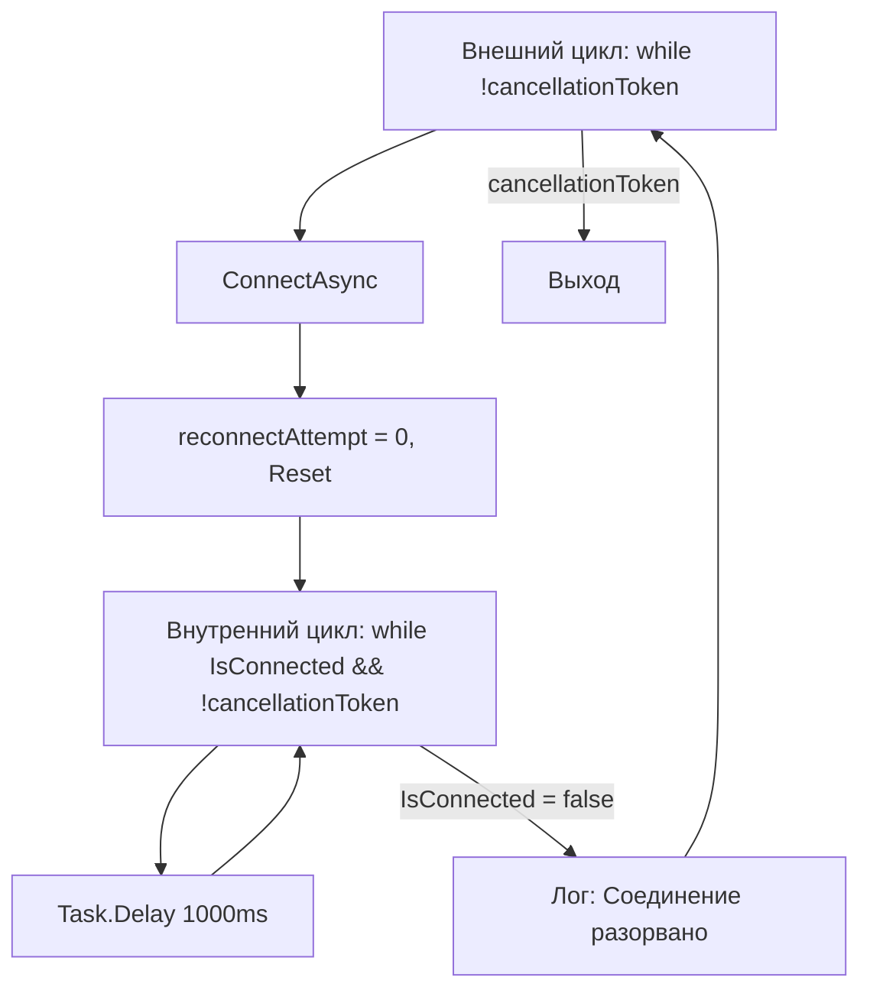

# План исправления: Бесконечный цикл в тестах BaseWebSocketClientTests

**Файл:** `tests/MarketDataCollector.Tests/Core/Clients/BaseWebSocketClientTests.cs`
**Проблемные тесты:**
- `StartAsync_StartsBackgroundRecoveryLoop` (строка 373)
- `StopAsync_StopsBackgroundRecoveryLoop` (строка 416)

## Корневая причина

### Анализ `RunBackgroundRecoveryLoopAsync`

Метод [`RunBackgroundRecoveryLoopAsync`](src/MarketDataCollector.Core/Clients/BaseWebSocketClient.cs:291) содержит два вложенных цикла:



**Проблема:** В обоих тестах `_connectionManagerMock.SetupGet(cm => cm.IsConnected).Returns(false)` — `IsConnected` **всегда** возвращает `false`.

Последовательность выполнения:
1. `StartAsync` → запускает `RunBackgroundRecoveryLoopAsync`
2. Внешний цикл: `ConnectAsync` → успешно (мок возвращает `Task.CompletedTask`)
3. `reconnectAttempt = 0`, `_reconnectStrategy.Reset()`
4. Внутренний цикл: `while (IsConnected && !cancellationToken)` — **сразу выходит**, т.к. `IsConnected = false`
5. Лог: "Соединение разорвано"
6. Возврат к шагу 2 — **бесконечный цикл**

### Почему тесты зависают

**Тест `StartAsync_StartsBackgroundRecoveryLoop`:**
- Строка 407: `await Task.Delay(200)` — ожидает 200ms
- Но фоновый цикл `RunBackgroundRecoveryLoopAsync` работает **вечно**
- `Task.Delay(200)` **никогда не завершится**, т.к. xUnit не может прервать async-тест через `[Fact(Timeout = 5000)]` — Timeout в xUnit v2 не передаёт CancellationToken в async-методы

**Тест `StopAsync_StopsBackgroundRecoveryLoop`:**
- Строка 436: `await client.StartAsync(cts.Token)` — запускает бесконечный фоновый цикл
- Строка 439: `await client.StopAsync(cts.Token)` — вызывает `backgroundCts.Cancel()`, затем `await backgroundTask.WaitAsync(cancellationToken)`
- Но фоновый цикл игнорирует `backgroundCts.Token`, т.к. `IsConnected = false` и цикл не доходит до `Task.Delay(1000, cancellationToken)` — он застревает на `ConnectAsync` → `ConnectAsync` вызывает `StartReceiveLoopAsync` → `_messageReceiver.StartReceiveLoopAsync(...)` — этот метод в моке возвращает `Task.CompletedTask` и не проверяет токен
- Фактически, `StopAsync` **зависает** на ожидании `backgroundTask`

## План исправления

### Шаг 1: Изменить настройку `IsConnected` — использовать динамическое значение

Вместо статического `Returns(false)` нужно использовать `Returns(() => isConnected)` с флагом, который меняется после `ConnectAsync`.

```csharp
var isConnected = false;
_connectionManagerMock.SetupGet(cm => cm.IsConnected).Returns(() => isConnected);
_connectionManagerMock.Setup(cm => cm.ConnectAsync(It.IsAny<Uri>(), It.IsAny<CancellationToken>()))
    .Callback(() => isConnected = true)
    .Returns(Task.CompletedTask);
```

**Как это работает:**
1. До `ConnectAsync`: `IsConnected = false` → `ConnectAsync` вызывается
2. После `ConnectAsync`: `IsConnected = true` → внутренний `while`-цикл выполняется
3. `cts.Cancel()` → внутренний цикл выходит → внешний цикл проверяет `cancellationToken` и выходит

### Шаг 2: Исправить тест `StartAsync_StartsBackgroundRecoveryLoop`

**Текущий код (строки 373-414):**
```csharp
[Fact(Timeout = 5000)]
public async Task StartAsync_StartsBackgroundRecoveryLoop()
{
    // Arrange
    _connectionManagerMock.SetupGet(cm => cm.IsConnected).Returns(false);
    _connectionManagerMock.Setup(cm => cm.ConnectAsync(It.IsAny<Uri>(), It.IsAny<CancellationToken>()))
        .Returns(Task.CompletedTask);

    var client = new TestableWebSocketClient(...);

    using var cts = new CancellationTokenSource();

    // Act
    var task = client.StartAsync(cts.Token);

    // Assert
    task.Should().NotBeNull();
    _loggerMock.Verify(... "Фоновый цикл восстановления запущен" ...);
    
    await Task.Delay(200);  // <-- ЗАВИСАЕТ
    
    _connectionManagerMock.Verify(cm => cm.ConnectAsync(...), Times.AtLeastOnce);

    cts.Cancel();  // <-- НИКОГДА НЕ ДОСТИГАЕТСЯ
}
```

**Исправленный код:**
```csharp
[Fact(Timeout = 5000)]
public async Task StartAsync_StartsBackgroundRecoveryLoop()
{
    // Arrange
    var isConnected = false;
    _connectionManagerMock.SetupGet(cm => cm.IsConnected).Returns(() => isConnected);
    _connectionManagerMock.Setup(cm => cm.ConnectAsync(It.IsAny<Uri>(), It.IsAny<CancellationToken>()))
        .Callback(() => isConnected = true)
        .Returns(Task.CompletedTask);

    var client = new TestableWebSocketClient(
        _testUri,
        "Binance",
        "BTCUSDT",
        _connectionManagerMock.Object,
        _messageReceiverMock.Object,
        _reconnectStrategyMock.Object,
        Options.Create(_defaultOptions),
        _loggerMock.Object);

    using var cts = new CancellationTokenSource();

    // Act
    var task = client.StartAsync(cts.Token);

    // Assert
    task.Should().NotBeNull();
    _loggerMock.Verify(
        x => x.Log(
            LogLevel.Information,
            It.IsAny<EventId>(),
            It.Is<It.IsAnyType>((o, t) => o.ToString()!.Contains("Фоновый цикл восстановления запущен")),
            It.IsAny<Exception>(),
            It.IsAny<Func<It.IsAnyType, Exception?, string>>()),
        Times.Once);

    // Даём время фоновому циклу выполнить ConnectAsync
    await Task.Delay(200);

    // Проверяем, что ConnectAsync был вызван внутри фонового цикла
    _connectionManagerMock.Verify(cm => cm.ConnectAsync(It.IsAny<Uri>(), It.IsAny<CancellationToken>()), Times.AtLeastOnce);

    // Останавливаем фоновый цикл через отмену токена
    cts.Cancel();

    // Ждём завершения фоновой задачи
    await task;
}
```

### Шаг 3: Исправить тест `StopAsync_StopsBackgroundRecoveryLoop`

**Текущий код (строки 416-450):**
```csharp
[Fact(Timeout = 5000)]
public async Task StopAsync_StopsBackgroundRecoveryLoop()
{
    // Arrange
    _connectionManagerMock.SetupGet(cm => cm.IsConnected).Returns(false);

    var client = new TestableWebSocketClient(...);

    using var cts = new CancellationTokenSource();

    await client.StartAsync(cts.Token);  // <-- ЗАПУСКАЕТ БЕСКОНЕЧНЫЙ ЦИКЛ

    // Act
    await client.StopAsync(cts.Token);  // <-- ЗАВИСАЕТ

    // Assert
    _loggerMock.Verify(... "Фоновый цикл восстановления остановлен" ...);
}
```

**Исправленный код:**
```csharp
[Fact(Timeout = 5000)]
public async Task StopAsync_StopsBackgroundRecoveryLoop()
{
    // Arrange
    var isConnected = false;
    _connectionManagerMock.SetupGet(cm => cm.IsConnected).Returns(() => isConnected);
    _connectionManagerMock.Setup(cm => cm.ConnectAsync(It.IsAny<Uri>(), It.IsAny<CancellationToken>()))
        .Callback(() => isConnected = true)
        .Returns(Task.CompletedTask);

    var client = new TestableWebSocketClient(
        _testUri,
        "Binance",
        "BTCUSDT",
        _connectionManagerMock.Object,
        _messageReceiverMock.Object,
        _reconnectStrategyMock.Object,
        Options.Create(_defaultOptions),
        _loggerMock.Object);

    using var cts = new CancellationTokenSource();

    // Запускаем фоновый цикл
    await client.StartAsync(cts.Token);

    // Даём время фоновому циклу выполнить ConnectAsync и войти во внутренний цикл
    await Task.Delay(200);

    // Act
    await client.StopAsync(cts.Token);

    // Assert
    _loggerMock.Verify(
        x => x.Log(
            LogLevel.Information,
            It.IsAny<EventId>(),
            It.Is<It.IsAnyType>((o, t) => o.ToString()!.Contains("Фоновый цикл восстановления остановлен")),
            It.IsAny<Exception>(),
            It.IsAny<Func<It.IsAnyType, Exception?, string>>()),
        Times.Once);
}
```

### Шаг 4: Проверить остальные тесты на аналогичные проблемы

Проверить, что ни один другой тест не страдает от той же проблемы:
- `ConnectAsync_WhenAlreadyConnected_DoesNothing` — `IsConnected = true`, корректно
- `ConnectAsync_WhenNotConnected_CallsConnectionManagerAndStartsReceiveLoop` — `IsConnected = false`, но `ConnectAsync` вызывается напрямую, не через фоновый цикл, корректно
- `ConnectAsync_WithSubscriptionManager_CallsSubscribeWithRetryAsync` — `IsConnected = false`, но `ConnectAsync` вызывается напрямую, корректно
- `SetSubscriptionManager_SetsManagerCorrectly` — `IsConnected = false`, но `ConnectAsync` вызывается напрямую, корректно

## Сводка изменений

| # | Тест | Изменение |
|---|------|-----------|
| 1 | `StartAsync_StartsBackgroundRecoveryLoop` | Заменить `SetupGet(...).Returns(false)` на динамический `Returns(() => isConnected)` с `Callback` в `ConnectAsync` |
| 2 | `StartAsync_StartsBackgroundRecoveryLoop` | Добавить `await task` после `cts.Cancel()` для ожидания завершения фонового цикла |
| 3 | `StopAsync_StopsBackgroundRecoveryLoop` | Заменить `SetupGet(...).Returns(false)` на динамический `Returns(() => isConnected)` с `Callback` в `ConnectAsync` |
| 4 | `StopAsync_StopsBackgroundRecoveryLoop` | Добавить `await Task.Delay(200)` после `StartAsync` для входа во внутренний цикл |

## Диаграмма потока исправленного теста

```mermaid
sequenceDiagram
    participant Test as StartAsync_StartsBackgroundRecoveryLoop
    participant Client as BaseWebSocketClient
    participant ConnMock as ConnectionManager Mock
    participant BgLoop as RunBackgroundRecoveryLoopAsync

    Test->>Client: StartAsync(cts.Token)
    Client->>BgLoop: запуск фонового цикла
    
    loop Внешний цикл
        BgLoop->>ConnMock: IsConnected?
        ConnMock-->>BgLoop: false (isConnected = false)
        BgLoop->>ConnMock: ConnectAsync(uri, token)
        ConnMock->>ConnMock: Callback: isConnected = true
        ConnMock-->>BgLoop: Task.CompletedTask
        
        loop Внутренний цикл
            BgLoop->>ConnMock: IsConnected?
            ConnMock-->>BgLoop: true (isConnected = true)
            BgLoop->>BgLoop: Task.Delay(1000, token)
        end
    end

    Test->>Test: Task.Delay(200)
    Test->>ConnMock: Verify ConnectAsync called
    Test->>Test: cts.Cancel()
    
    Note over BgLoop: Task.Delay бросает OperationCanceledException
    Note over BgLoop: Внутренний цикл выходит
    Note over BgLoop: Внешний цикл: cancellationToken.IsCancellationRequested = true
    Note over BgLoop: Выход из внешнего цикла
    
    Test->>Test: await task (фоновый цикл завершён)