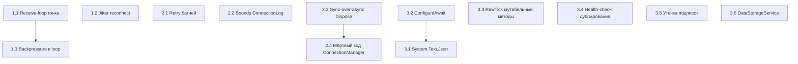

# План устранения проблем из CODE_REVIEW_REPORT

Исходный анализ: [`plans/code-review-status-analysis.md`](plans/code-review-status-analysis.md)

---

## Приоритет 1: Высокий — критичные конкурентные и производительностные проблемы

### Задача 1.1: Исправить receive-loop гонку при рестарте

**Проблема:** [`BaseWebSocketClient.StartReceiveLoopAsync()`](src/MarketDataCollector.Core/Clients/BaseWebSocketClient.cs:278) не ожидает завершения предыдущего receive loop. `StopReceiveLoop()` в [`WebSocketMessageReceiver`](src/MarketDataCollector.Core/Clients/WebSocketMessageReceiver.cs:141) — пустой метод.

**Файлы для изменения:**
- [`src/MarketDataCollector.Core/Clients/WebSocketMessageReceiver.cs`](src/MarketDataCollector.Core/Clients/WebSocketMessageReceiver.cs)
- [`src/MarketDataCollector.Core/Clients/BaseWebSocketClient.cs`](src/MarketDataCollector.Core/Clients/BaseWebSocketClient.cs)

**Шаги:**
1. Добавить в `WebSocketMessageReceiver` поле `_receiveLoopTask` для хранения текущей задачи receive loop
2. Реализовать `StopReceiveLoop()` — отменить `CancellationToken`, **дождаться** `_receiveLoopTask` с таймаутом (например, 5 секунд)
3. В `StartReceiveLoopAsync()` — вызвать `await StopReceiveLoop()` перед запуском нового цикла вместо `StopReceiveLoop()` без await
4. В `BaseWebSocketClient.StartReceiveLoopAsync()` — сделать `await _messageReceiver.StopReceiveLoop()` перед запуском нового loop
5. Убрать `await Task.CompletedTask` в конце — вернуть `Task` receive loop для наблюдения
6. В `BaseWebSocketClient.StopReceiveLoop()` — сохранять `_receiveLoopTask` для отслеживания

**Метрика завершения:** Отсутствие двух одновременно работающих receive loop при реконнекте. Юнит-тест на корректную остановку.

---

### Задача 1.2: Добавить jitter в стратегию переподключения

**Проблема:** [`ExponentialReconnectStrategy`](src/MarketDataCollector.Core/Clients/ExponentialReconnectStrategy.cs) — `GetDelay` без jitter, `ShouldRetry` всегда `true`, `Reset` — no-op.

**Файлы для изменения:**
- [`src/MarketDataCollector.Core/Clients/ExponentialReconnectStrategy.cs`](src/MarketDataCollector.Core/Clients/ExponentialReconnectStrategy.cs)
- [`src/MarketDataCollector.Core/Configuration/WebSocketClientOptions.cs`](src/MarketDataCollector.Core/Configuration/WebSocketClientOptions.cs) — возможно добавить `MaxReconnectAttempts`

**Шаги:**
1. Добавить jitter к `GetDelay()`: `delay ± random(0, delay * 0.3)` — decorator pattern для предотвращения thundering herd
2. Добавить поле `_attemptCount` и логику `ShouldRetry()`: ограничить количество попыток через `MaxReconnectAttempts` из конфигурации (0 = бесконечно)
3. Реализовать `Reset()`: сбросить `_attemptCount` в 0
4. Обновить [`WebSocketClientOptions`](src/MarketDataCollector.Core/Configuration/WebSocketClientOptions.cs) — добавить `MaxReconnectAttempts` (default = 0 = бесконечно)

**Метрика завершения:** Юнит-тесты на jitter (разброс задержек), `ShouldRetry` с лимитом, `Reset` сбрасывает счётчик.

---

### Задача 1.3: Убрать остатки обратного давления в receive loop

**Проблема:** [`WebSocketMessageReceiver`](src/MarketDataCollector.Core/Clients/WebSocketMessageReceiver.cs:94) вызывает `await processMessage(message)` синхронно в receive loop. Хотя `ProcessTickAsync` теперь неблокирующий, `await` создаёт state machine overhead.

**Файлы для изменения:**
- [`src/MarketDataCollector.Core/Clients/WebSocketMessageReceiver.cs`](src/MarketDataCollector.Core/Clients/WebSocketMessageReceiver.cs)

**Шаги:**
1. Заменить `await processMessage(message)` на fire-and-forget с обработкой ошибок через `Task.WhenAny` + таймаут
2. Или: переделать `processMessage` на `Action<string>` (sync), если `ProcessTickAsync` возвращает `Task.CompletedTask`
3. Убедиться, что ошибки парсинга JSON в `BinanceWebSocketClient.ProcessMessageAsync` не приводят к остановке receive loop

**Метрика завершения:** Receive loop не блокируется ни при каких условиях. Юнит-тест на обработку сообщения без блокировки.

---

## Приоритет 2: Средний — надёжность и корректность

### Задача 2.1: Retry-логика для ошибок батчей

**Проблема:** [`ProcessBatchAsync()`](src/MarketDataCollector.Application/Services/MarketDataProcessor.cs:615) — при ошибке БД батч теряется без повторной попытки.

**Файлы для изменения:**
- [`src/MarketDataCollector.Application/Services/MarketDataProcessor.cs`](src/MarketDataCollector.Application/Services/MarketDataProcessor.cs)

**Шаги:**
1. Добавить retry-логику (2-3 попытки) для `BulkCopyAsync` с экспоненциальной задержкой
2. При исчерпании попыток — логировать `LogCritical` с размером потерянного батча
3. Добавить OpenTelemetry-счётчик потерянных батчей (`MarketDataTelemetry.BatchesLost`)
4. Рассмотреть dead-letter механизм: при провале батча — записать в отдельную таблицу/очередь для последующей обработки

**Метрика завершения:** Юнит-тест на retry при `DbUpdateException`. Метрики потерь батчей.

---

### Задача 2.2: Ограничить fire-and-forget задачи в `SaveConnectionLogAsync`

**Проблема:** [`MonitoringService.SaveConnectionLogAsync()`](src/MarketDataCollector.Application/Services/MonitoringService.cs:138) — нет bounds на количество одновременных задач.

**Файлы для изменения:**
- [`src/MarketDataCollector.Application/Services/MonitoringService.cs`](src/MarketDataCollector.Application/Services/MonitoringService.cs)

**Шаги:**
1. Заменить fire-and-forget `_ = SaveConnectionLogAsync(...)` на `SemaphoreSlim` с максимальным количеством одновременных задач (например, 5)
2. Или: использовать `Channel<ConnectionLog>` + один фоновый consumer, который пакетно пишет логи
3. Добавить таймаут на `SaveConnectionLogAsync` (например, 5 секунд)
4. При переполнении — логировать предупреждение и пропускать запись

**Метрика завершения:** Максимум N одновременных задач при шторме реконнектов. Юнит-тест на лимит.

---

### Задача 2.3: Убрать sync-over-async в `Dispose`

**Проблема:** [`BaseWebSocketClient.Dispose()`](src/MarketDataCollector.Core/Clients/BaseWebSocketClient.cs:434) — `StopAsync(...).Wait()`.

**Файлы для изменения:**
- [`src/MarketDataCollector.Core/Clients/BaseWebSocketClient.cs`](src/MarketDataCollector.Core/Clients/BaseWebSocketClient.cs)

**Шаги:**
1. Убрать синхронный `Dispose()` — оставить только `DisposeAsync()`
2. Если обратная совместимость критична — оставить `Dispose()` с `ConfigureAwait(false)` и `GetAwaiter().GetResult()` (не `.Wait()`) + таймаут через `CancellationTokenSource`
3. Исправить `DisposeCore()` — убрать обращение к `_backgroundRecoveryCts` после `StopAsync` (race condition)
4. Использовать `_disposed` под锁ом или через `Interlocked.CompareExchange`

**Метрика завершения:** Нет `Task.Wait()` в production коде. Юнит-тест на корректный dispose.

---

### Задача 2.4: Исправить мёртвый код в `WebSocketConnectionManager.ConnectAsync`

**Проблема:** [Условие `if (oldWs != _webSocket)`](src/MarketDataCollector.Core/Clients/WebSocketConnectionManager.cs:62) всегда истинно после `Interlocked.Exchange`.

**Файлы для изменения:**
- [`src/MarketDataCollector.Core/Clients/WebSocketConnectionManager.cs`](src/MarketDataCollector.Core/Clients/WebSocketConnectionManager.cs)

**Шаги:**
1. Заменить условие на безусловный `oldWs.Dispose()` (кроме case, когда `oldWs` — дефолтный сокет)
2. Или: хранить флаг `_isFirstConnect` чтобы не диспозить дефолтный сокет
3. Добавить `IsDefault` свойство в `IClientWebSocket` или проверять через `ReferenceEquals`

**Метрика завершения:** Мёртвый код удалён или исправлен. Юнит-тест на корректную замену сокета.

---

## Приоритет 3: Низкий — оптимизация и код-стайл

### Задача 3.1: Заменить `JObject.Parse` на `System.Text.Json`

**Проблема:** [`BinanceWebSocketClient.ProcessMessageAsync()`](src/MarketDataCollector.Infrastructure/Clients/BinanceWebSocketClient.cs:74) — `JObject.Parse` на горячем пути.

**Файлы для изменения:**
- [`src/MarketDataCollector.Infrastructure/Clients/BinanceWebSocketClient.cs`](src/MarketDataCollector.Infrastructure/Clients/BinanceWebSocketClient.cs)

**Шаги:**
1. Заменить `JObject.Parse` на `System.Text.Json.JsonDocument.Parse` или `JsonSerializer.Deserialize`
2. Убрать зависимость от `Newtonsoft.Json` из проекта `MarketDataCollector.Infrastructure`
3. Обновить `.csproj` — убрать пакет `Newtonsoft.Json` если больше нигде не используется

**Метрика завершения:** Нет `Newtonsoft.Json` в горячем пути. Бенчмарк показывает снижение аллокаций.

---

### Задача 3.2: Добавить `.ConfigureAwait(false)` в библиотечном коде

**Проблема:** Отсутствие `.ConfigureAwait(false)` во всех await в Core/Application/Infrastructure.

**Файлы для изменения:** Все `.cs` файлы в `src/MarketDataCollector.Core/`, `src/MarketDataCollector.Application/`, `src/MarketDataCollector.Infrastructure/`

**Шаги:**
1. Добавить `.ConfigureAwait(false)` ко всем `await` в библиотечном коде
2. Исключение: код в `Worker.cs` (entry point, имеет `SynchronizationContext`)
3. Рассмотреть использование `[ConfigureAwait(false)]` через `EditorConfig` или analyzer

**Метрика завершения:** Все await в Core/Application/Infrastructure содержат `.ConfigureAwait(false)`.

---

### Задача 3.3: Убрать `RawTick.UpdatePrice/UpdateVolume`

**Проблема:** Мутабельные методы в [`RawTick.cs`](src/MarketDataCollector.Domain/Entities/RawTick.cs:65) — не используются, открывают дверь к гонкам.

**Файлы для изменения:**
- [`src/MarketDataCollector.Domain/Entities/RawTick.cs`](src/MarketDataCollector.Domain/Entities/RawTick.cs)

**Шаги:**
1. Удалить методы `UpdatePrice` и `UpdateVolume`
2. Проверить, что они нигде не вызываются (grep по проекту)

**Метрика завершения:** Методы удалены. Проект компилируется без ошибок.

---

### Задача 3.4: Убрать дублирование ответственности health-check

**Проблема:** [`Worker.RunHealthCheckAsync()`](src/MarketDataCollector.Workers/MarketDataCollector.Worker/Worker.cs:251) вызывает `client.StartAsync()` для дисконнектнутых клиентов, параллельно с recovery-loop того же клиента.

**Файлы для изменения:**
- [`src/MarketDataCollector.Workers/MarketDataCollector.Worker/Worker.cs`](src/MarketDataCollector.Workers/MarketDataCollector.Worker/Worker.cs)

**Шаги:**
1. Убрать вызов `client.StartAsync()` из health-check loop — recovery-loop клиента уже обрабатывает переподключение
2. Health-check должен только **мониторить** и **логировать** состояние, без вмешательства
3. Или: сделать health-check единственным источником рестарта, отключив auto-recovery в клиентах

**Метрика завершения:** Единая точка ответственности за переподключение. Юнит-тест на health-check без side-effect'ов.

---

### Задача 3.5: Убрать утечку подписок на события в `WebSocketClientFactory`

**Проблема:** [`CreateBinanceClient()`](src/MarketDataCollector.Infrastructure/Factories/WebSocketClientFactory.cs:79) добавляет обработчики событий, но не хранит ссылки для отписки.

**Файлы для изменения:**
- [`src/MarketDataCollector.Infrastructure/Factories/WebSocketClientFactory.cs`](src/MarketDataCollector.Infrastructure/Factories/WebSocketClientFactory.cs)

**Шаги:**
1. Хранить обработчики в поле `Dictionary<IExchangeWebSocketClient, EventHandler[]>`
2. Реализовать `IDisposable` на фабрике — при dispose отписывать все обработчики
3. Или: зарегистрировать фабрику как `Scoped` и автоматически диспозить при уничтожении scope

**Метрика завершения:** Нет утечек подписок при пересоздании клиентов.

---

### Задача 3.6: Убрать повторное перечисление в `DataStorageService`

**Проблема:** [`DataStorageService.StoreRawTicksBatchAsync()`](src/MarketDataCollector.Application/Services/DataStorageService.cs:46) — `rawTicks.Count()` повторно перечисляет `IEnumerable`.

**Файлы для изменения:**
- [`src/MarketDataCollector.Application/Services/DataStorageService.cs`](src/MarketDataCollector.Application/Services/DataStorageService.cs)

**Шаги:**
1. Принимать `IReadOnlyList<RawTick>` или `List<RawTick>` вместо `IEnumerable<RawTick>`
2. Или: материализовать коллекцию в начале метода
3. Рассмотреть удаление `DataStorageService` если он не используется в горячем пути

**Метрика завершения:** Нет повторных перечислений.

---

## Диаграмма зависимостей задач

## Рекомендуемый порядок выполнения

1. **Спринт 1** (критичные): Задачи 1.1 → 1.2 → 1.3
2. **Спринт 2** (надёжность): Задачи 2.1 → 2.2 → 2.3 → 2.4
3. **Спринт 3** (оптимизация): Задачи 3.1 → 3.2 → 3.3 → 3.4 → 3.5 → 3.6
