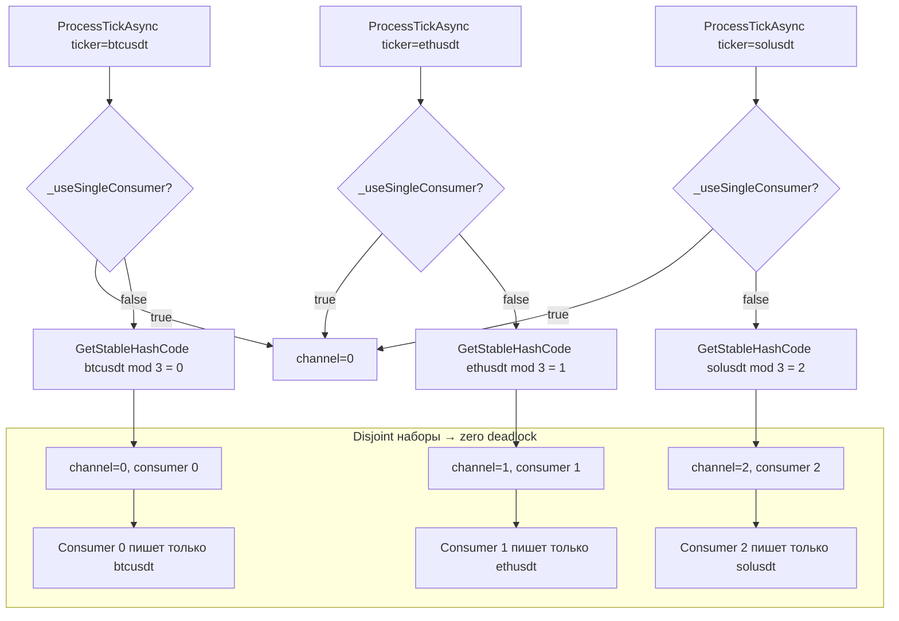

# План исправления deadlock (40P01) в PostgreSQL

## Проблема

В логах наблюдаются deadlock'и при параллельной вставке данных в таблицу `rawticks`:

```
40P01: deadlock detected
DETAIL: Process 43310 waits for ShareLock on transaction 201940; blocked by process 43309.
Process 43309 waits for ShareLock on transaction 201939; blocked by process 43310.
Where: while inserting index tuple (4639,62) in relation "rawticks"
```

Deadlock'и возникают, когда 2+ parallel consumer'а одновременно вставляют тики с **пересекающимися тикерами** и используют `ON CONFLICT (ticker, exchange, timestamp) DO NOTHING`.

Каждый INSERT с `ON CONFLICT DO NOTHING` захватывает `ShareLock` на странице уникального индекса для проверки наличия конфликта. Если два concurrent INSERT'а держат ShareLock на разных страницах индекса и каждый ждёт страницу другого — PostgreSQL детектирует deadlock.

## Root Cause

**Round-robin routing** в [`MarketDataProcessor.cs:135-137`](src/MarketDataCollector.Application/Services/MarketDataProcessor.cs:135):

```csharp
channelIndex = (Interlocked.Increment(ref _roundRobinIndex) & int.MaxValue) % channels.Length;
```

Round-robin распределяет тикеры равномерно, но **не гарантирует disjoint наборов** между consumer'ами. В результате один батч может содержать BTC, ETH, SOL, а параллельный батч — тоже BTC, ETH, SOL. Пересечение по ключу `(ticker, exchange, timestamp)` + параллельный `ON CONFLICT DO NOTHING` → deadlock.

**Исходная гипотеза** (комментарий в `RawTickRepository.cs:228-230`):
```
/// Deadlock'и невозможны (per-ticker routing), retry — на случай
/// других транзиентных ошибок Npgsql.
```
Эта гипотеза верна **только для ticker-based routing**. После перехода на round-robin (для борьбы с перекосом нагрузки) **инвариант disjoint-тикеров был нарушен**, и deadlock'и стали возможны.

## Диагностика: почему retry не спасает

Текущая конфигурация:
- `ConsumerCount: 3`, `BatchSize: 2500`, `ChannelCapacity: 150000`
- `Retry`: 3 попытки с экспоненциальным backoff (100ms → 200ms → 400ms + jitter)

Retry перехватывает deadlock, но:
1. **Latency spike**: каждая retry-пауза добавляет 100-700ms к времени обработки батча
2. **Backlog растёт**: пока один consumer ждёт retry, его канал переполняется → DropOldest теряет тики (строка `"dropped: ~2980"`)
3. **Непредсказуемость**: deadlock может произойти в любой момент при перекрытии ключей

## Предлагаемое решение: Per-ticker routing (детерминированный хэш)

### Суть

Изменить routing с round-robin на детерминированный хэш от тикера. Все тики одного тикера гарантированно попадают в один и тот же канал → один consumer → disjoint наборы → deadlock'и невозможны.

### Изменения в коде

**Файл**: [`src/MarketDataCollector.Application/Services/MarketDataProcessor.cs`](src/MarketDataCollector.Application/Services/MarketDataProcessor.cs)

**Строки 127-138**, блок выбора канала:

```csharp
var channels = _channels;
int channelIndex;
if (_useSingleConsumer || channels.Length == 1)
{
    channelIndex = 0;
}
else
{
    // Per-ticker routing: детерминированный хэш от ticker'а.
    // Гарантирует, что все тики одного тикера попадают в один канал,
    // а разные consumer'ы работают с disjoint наборами тикеров.
    // Это исключает deadlock'и (40P01) при ON CONFLICT DO NOTHING,
    // т.к. два consumer'а никогда не конкурируют за один unique index.
    //
    // При 3 тикерах и 3 consumer'ах нагрузка распределяется идеально
    // (каждый consumer получает ровно один тикер).
    // При асимметричной нагрузке (один тикер быстрее других) 
    // DropOldest защищает от переполнения.
    channelIndex = (GetStableHashCode(ticker) & int.MaxValue) % channels.Length;
}
```

### Почему это исправляет deadlock

При `ConsumerCount=3` и 3 тикерах (btc, eth, sol):
- Consumer 0: всегда **btcusdt**
- Consumer 1: всегда **ethusdt**
- Consumer 2: всегда **solusdt**

Ни один consumer не пишет тикер другого consumer'а → уникальный индекс `(ticker, exchange, timestamp)` никогда не конфликтует между consumer'ами → deadlock'и невозможны.

### Что делать с дисбалансом нагрузки

Round-robin был введён для решения проблемы перекоса нагрузки. **Анализ текущей ситуации:**

1. **Сейчас 3 тикера и 3 consumer'а** — hash-распределение даёт каждому consumer'у ровно один тикер. Баланс = идеальный.
2. **При добавлении неравного количества тикеров** (например, 4 тикера на 3 consumer'а) — один consumer получит 2 тикера. Это **приемлемо**, т.к.:
   - Канал работает с `BoundedChannelFullMode.DropOldest` — при перегрузке дропаются старые тики
   - `ChannelCapacity` (150000) — достаточный буфер для сглаживания пиков
   - Retry-механизм остаётся как safety-net на случай других транзиентных ошибок
3. **Альтернатива на будущее**: Weighted routing (по пропускной способности каналов), но это overengineering для текущей задачи.

### Изменение документации

**Файл**: [`src/MarketDataCollector.Infrastructure/Repositories/RawTickRepository.cs`](src/MarketDataCollector.Infrastructure/Repositories/RawTickRepository.cs)

Обновить комментарий у `BulkCopyAsync(IReadOnlyList<TickData>...)`:

```csharp
/// Deadlock'и невозможны (per-ticker routing гарантирует disjoint наборы тикеров).
/// Retry — safety-net для других транзиентных ошибок Npgsql.
```

## Альтернативные решения (рассмотрены, НЕ рекомендованы)

| Решение | Плюсы | Минусы |
|---------|-------|--------|
| **SingleConsumer mode** (через конфиг) | Просто, zero deadlock | Теряется parallelism, throughput ~62K ticks/s |
| **SemaphoreSlim в BulkCopyAsync** | Сохраняет round-robin | Сложнее, serializes DB writes, ест parallelism |
| **ORDER BY ticker в SQL** | Не требует C#-изменений | Deadlock'и менее вероятны, но не исключены |
| **Увеличить retry** | Просто | Лечит симптом, а не причину; latency spikes |

**Per-ticker routing** — минимальное, наиболее правильное решение, устраняющее root cause.

## План реализации

| Шаг | Действие | Файл |
|-----|----------|------|
| 1 | Изменить routing с round-robin на per-ticker hash | `MarketDataProcessor.cs:127-138` |
| 2 | Обновить комментарий о deadlock'ах | `RawTickRepository.cs:228-230` |
| 3 | Обновить докстринг multi-consumer mode | `MarketDataProcessorOptions.cs:38-49` |
| 4 | Проверить тесты `MarketDataProcessorTests` на routing | `tests/MarketDataCollector.Tests/` |

## Диаграмма нового routing



## Риски

1. **Перегрузка одного канала** при асимметричной нагрузке (например, BTC 50K msg/s): решается DropOldest + ChannelCapacity.
2. **При изменении количества consumer'ов** надо пересчитывать хэш-распределение. Автоматически покрывается формулой `hash % channels.Length`.
3. **При добавлении новых тикеров** без увеличения consumer'ов один consumer может получить 2+ тикера. Это допустимо, т.к. deadlock'и всё равно исключены (disjoint наборы).
