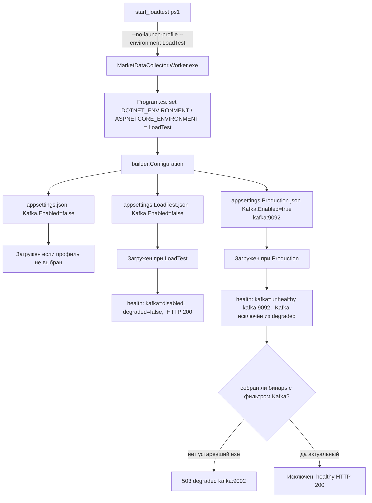

# План: разбор `status: "degraded"` в health-check Worker (прогон 2026-09-12)

## 1. Симптом (из терминала)

`start_loadtest.ps1` при опросе `/health` через `Wait-Http` (стр. 105-128 `start_loadtest.ps1`)
залогировал многократные:

```
Worker: HTTP 503 - {"status":"degraded",
  "checks":{
    "kafka":{"status":"unhealthy","error":"Local: Broker transport failure","bootstrapServers":"kafka:9092"},
    "postgresql":{"status":"healthy"},
    "websocket":{"status":"healthy","total":3,"connected":3,...}}}
```

## 2. Собранные факты

| Источник | Что показывает |
|---|----|
| [`appsettings.json:70-77`](src/MarketDataCollector.Workers/MarketDataCollector.Worker/appsettings.json:70) | `Kafka.Enabled=false`, `BootstrapServers=localhost:9094` |
| [`appsettings.LoadTest.json:30-37`](src/MarketDataCollector.Workers/MarketDataCollector.Worker/appsettings.LoadTest.json:30) | `Kafka.Enabled=false`, `BootstrapServers=localhost:9094` |
| [`appsettings.Production.json:44-51`](src/MarketDataCollector.Workers/MarketDataCollector.Worker/appsettings.Production.json:44) | `Kafka.Enabled=true`, `BootstrapServers=kafka:9092` |
| bin/Debug/net8.0/appsettings.LoadTest.json | идентичен исходнику (`Enabled=false, localhost:5000 WS`) |
| [`start_loadtest.ps1:282-285`](start_loadtest.ps1:282) | Worker запускается с `--no-launch-profile --environment LoadTest` |
| [`Program.cs:100-121`](src/MarketDataCollector.Workers/MarketDataCollector.Worker/Program.cs:100) | Ставит `DOTNET_ENVIRONMENT` и `ASPNETCORE_ENVIRONMENT` из `--environment` |
| [`Program.cs:234`](src/MarketDataCollector.Workers/MarketDataCollector.Worker/Program.cs:234) | `kafkaConfig` читается из `builder.Configuration` |
| [`Program.cs:242-270`](src/MarketDataCollector.Workers/MarketDataCollector.Worker/Program.cs:242) | Kafka-блок: при `Enabled=true` пробует соединиться; при `false` → `"disabled"` |
| [`Program.cs:344-359`](src/MarketDataCollector.Workers/MarketDataCollector.Worker/Program.cs:344) | Kafka **исключена** из расчёта `degraded` (`.Where(kvp => kvp.Key != "kafka")`) |
| [`traces/worker_out.log`](traces/worker_out.log) (17:42) | `Hosting environment: LoadTest`, `TickAggregator Enabled=false`, WS `localhost:5000` connected, тики идут, **Kafka-ошибок нет** |

## 3. Анализ

Ключевое противоречие:

1. **Текущий код** не может вернуть `degraded` из-за Kafka:
   - при `Kafka.Enabled=false` (база + LoadTest) health-блок = `{"status":"disabled"}` (стр. 269);
   - даже при `Enabled=true` блок Kafka исключается из `allHealthy` (стр. 344-345);
   - итоговая строка 49-56: `degraded = !allHealthy` учитывает только `postgresql` + `websocket` + `kafka`(исключён).

2. **Актуальный прогон `worker_out.log` (17:42)** подтверждает, что Worker живёт в LoadTest:
   - `Hosting environment: LoadTest`;
   - WS `ws://localhost:5000` (LoadTest-значение, из `ExchangeOptions`);
   - `TickAggregator Enabled=false` (задано в базе и в LoadTest);
   - нет ни одной Kafka-строки в логе.

3. **Терминальные `kafka:9092`** — признаки Production-профиля (`Enabled=true`, host `kafka`). Это НЕ соответствует текущему прогону. Наиболее вероятные причины:
   - **Устаревший собранный бинарь**: `MarketDataCollector.Worker.exe` на момент первого опроса был собран до внесения фильтра Kafka и/или аргумента `--environment` (пересборка в стр. 210-216 могла не успеть / Worker-процесс из предыдущего прогона ещё висел до `taskkill` в стр. 189);
   - либо наблюдаемые 503 относятся к **предыдущему прогону**, вывод которого остался в терминале до очистки.

Итог: **в актуальном коде логика корректна**; симптом — артефакт неактуального бинаря/остаточного процесса либо косметика вывода. Это надо подтвердить повторным чистым прогоном.

## 4. Шаги

### Шаг 1 — Чистый повторный прогон (верификация диагноза)
1. Убедиться, что нет висящих процессов: `taskkill /F /IM MarketDataCollector.Worker.exe`.
2. Убедиться, что `dotnet build ... --no-restore` (стр. 214) реально пересобрал (посмотреть, что ничего не `UP-TO-DATE`).
3. Запустить: `.\start_loadtest.ps1 -MaxTicks 200000 -Rps 10000 -SkipProfiler -OutputDir ./traces/verify`.
4. Ожидание: `Wait-Http` логирует `Worker готов (200)`, без `HTTP 503`.

### Шаг 2 — Усилить стартовую диагностику конфигурации (защита от неоднозначности)
В [`Program.cs`](src/MarketDataCollector.Workers/MarketDataCollector.Worker/Program.cs) после `builder.Build()` (стр. 178) залогировать фактически активный профиль/ключи:

```csharp
var activeEnv = Environment.GetEnvironmentVariable("DOTNET_ENVIRONMENT");
var activeEnv2 = Environment.GetEnvironmentVariable("ASPNETCORE_ENVIRONMENT");
builder.Logger?.LogInfo("Active DOTNET_ENVIRONMENT={}, ASPNETCORE_ENVIRONMENT={}, Kafka.Enabled={}, Kafka.BootstrapServers={}",
    activeEnv, activeEnv2, kafkaConfig?.Enabled, kafkaConfig?.BootstrapServers);
```

Это сделает выбор LoadTest vs Production явным в логе и исключит ложные диагнозы.

### Шаг 3 — Отделить Kafka-инфо от readiness (рекомендация, не критично)
В health-ответе Kafka уже `"disabled"` при выключенной. Повысить наглядность: добавить в блок `"kafka"` поле `"reason"` (например `"disabled_by_config"` / `"broker_unreachable"`), чтобы отличить штатное состояние от сбоя. В `degraded` не включать — текущий фильтр сохраняется.

### Шаг 4 — Пересборка обязательна перед запуском
В [`start_loadtest.ps1:204-216`](start_loadtest.ps1:204) после `dotnet build` решения и до запуска Worker добавить проверку, что бинарь новее исходников (или использовать `--force` при Debug-сборке Worker), чтобы исключить запуск устаревшего `.exe`. Это корневая причина рецидива.

## 5. Мermaid — поток конфигурации и точка отказа



## 6. Ожидаемый результат

| Проверка | До | После |
|---|---|---|
| `Wait-Http` health Worker | возможен 503 `kafka:9092` | `Worker готов (200)` |
| health-ответ | `kafka: unhealthy` | `kafka: disabled` |
| лог старта | нет признака профиля | `DOTNET_ENVIRONMENT=LoadTest, Kafka.Enabled=false` явно |
| запуск после правок | риск устаревшего бинаря | пересборка подтверждена |

## 7. Файлы к изменению

1. [`src/MarketDataCollector.Workers/MarketDataCollector.Worker/Program.cs`](src/MarketDataCollector.Workers/MarketDataCollector.Worker/Program.cs) — лог активного профиля (Шаг 2); поле `reason` в Kafka-блоке (Шаг 3).
2. [`start_loadtest.ps1`](start_loadtest.ps1) — гарантия свежего бинаря перед запуском (Шаг 4).
3. [`plans/fix-degraded-status-plan.md`](plans/fix-degraded-status-plan.md) — обновить подтверждённым диагнозом после верификации.

## 8. Верификация
1. Чистый прогон (Шаг 1) → нет `HTTP 503`, `kafka=disabled`, `healthy/200`.
2. В `worker_out.log` появилась строка активного профиля с `Kafka.Enabled=false`.
3. Повторный запуск сразу после сборки → стабильно `healthy`.