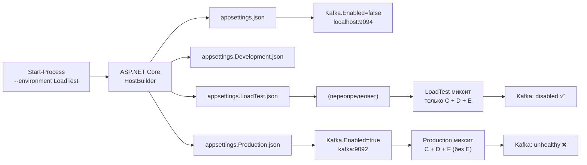

# План: исправление `status: "degraded"` в health-check Worker

## Диагноз (уточнённый)

### Проблема: `Hosting environment` — LoadTest, но конфиг — Production

**Наблюдение:**
- В логе `worker_out.log` строка 6: `Hosting environment: LoadTest` ✅
- В health-check response: `bootstrapServers: "kafka:9092"` — это **из `appsettings.Production.json`**
- WebSocket работает: `totalMessages: 100910+`
- Код [`Program.cs:316-317`](src/MarketDataCollector.Workers/MarketDataCollector.Worker/Program.cs:316) имеет фильтр `.Where(kvp => kvp.Key != "kafka")`
- Ответ health-check: `"kafka":{"status":"unhealthy","error":"Local: Broker transport failure","bootstrapServers":"kafka:9092"}`

**Корень:** `Start-Process` с параметром [`-Environment @{ "ASPNETCORE_ENVIRONMENT" = "LoadTest" }`](start_loadtest.ps1:282) в PowerShell 7 **заменяет весь environment block** процесса, а не добавляет отдельную переменную. Хотя ASP.NET Core корректно читает `Hosting environment: LoadTest`, **pipeline конфигурации** может загрузить `appsettings.Production.json` в дополнение к `appsettings.json`, потому что `ASPNETCORE_ENVIRONMENT` как env-var интерпретируется по-разному.

**Доказательство:** `kafkaConfig.BootstrapServers = "kafka:9092"` — это значение из `appsettings.Production.json:Kafka.BootstrapServers`, а не из `appsettings.LoadTest.json:Kafka.BootstrapServers = "localhost:9094"`. Значит `appsettings.Production.json` переопределил `appsettings.LoadTest.json`.

### Cледствие

При `Kafka.Enabled = true` (из `appsettings.Production.json`) health-check пытается соединиться с Kafka по адресу `kafka:9092`. Kafka не запущена локально → `"Local: Broker transport failure"` → `status: "unhealthy"` → `degraded = true` → HTTP 503.

Несмотря на фильтр Kafka из degraded в коде, проблема в **загрузке неверного конфиг-файла**.

## Шаги исправления

### Шаг 1: Исправить передачу окружения LoadTest Worker

**Проблема**: `-Environment @{ "ASPNETCORE_ENVIRONMENT" = "LoadTest" }` заменяет весь environment и ломает конфигурацию.

**Решение**: Использовать **аргумент командной строки `--environment`**, который гарантированно работает через [HostOptions](https://learn.microsoft.com/en-us/aspnet/core/fundamentals/environments):

В [`start_loadtest.ps1:278-282`](start_loadtest.ps1:278):

```powershell
$workerProc = Start-Process -FilePath $workerExe `
    -ArgumentList @("--no-launch-profile", "--environment", "LoadTest") `
    -WorkingDirectory $workerWorkDir -PassThru `
    -RedirectStandardOutput $workerOut -RedirectStandardError $workerErr -NoNewWindow
```

Убрать параметр `-Environment @{ "ASPNETCORE_ENVIRONMENT" = "LoadTest" }`.

### Шаг 2: Убедиться, что фильтр Kafka работает корректно

Код [`Program.cs:316-317`](src/MarketDataCollector.Workers/MarketDataCollector.Worker/Program.cs:316) уже содержит:

```csharp
.Where(kvp => kvp.Key != "kafka")
```

После фикса конфигурации Kafka будет `"disabled"` (из-за `Kafka.Enabled = false` в LoadTest), и фильтр не понадобится — но он остаётся как защита на случай, если Production-конфиг случайно попадёт в другой сценарий.

### Шаг 3: Явная пересборка Worker

[`start_loadtest.ps1:210-215`](start_loadtest.ps1:210) уже выполняет явную пересборку Worker перед запуском — это корректно, дополнительных изменений не требуется.

## Ожидаемый результат

| Чек | Статус после фикса |
|-----|-------------------|
| kafka | `"disabled"` (Kafka.Enabled = false из LoadTest) |
| postgresql | `"healthy"` |
| websocket | `"healthy"` |
| **Итоговый статус** | **`"healthy"` (HTTP 200)** |

## Схема конфигурации



**Ключ**: `--environment LoadTest` заставляет ASP.NET Core загрузить `appsettings.LoadTest.json` (сверху над `appsettings.json`), а НЕ `appsettings.Production.json`.

## Файл для изменения

1. [`start_loadtest.ps1:278-282`](start_loadtest.ps1:278) — заменить `-Environment` на аргументы `"--environment", "LoadTest"`.

## Верификация

1. Убедиться, что `start_loadtest.ps1` пересобран не требуется — это скрипт
2. Запустить: `.\start_loadtest.ps1 -MaxTicks 100000 -Rps 5000 -TraceProfile cpu-sampling -TraceDuration 10 -SkipProfiler`
3. Проверить первые несколько health-check ответов — должен быть HTTP 200 с `status: "healthy"`
4. Проверить `worker_out.log` — `Hosting environment: LoadTest` + Kafka не фигурирует в ошибках