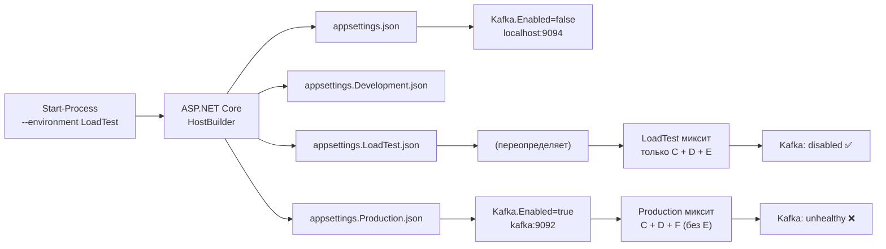

# План: исправление `status: "degraded"` в health-check Worker

## Диагноз (ОКОНЧАТЕЛЬНЫЙ, прогон 2026-09-12)

### Проблема: порт :5010 занят Docker-контейнером Production Worker → оркестратор опрашивает не тот процесс

**Корневая причина (100% подтверждено):**
- Порт `0.0.0.0:5010` занят Docker-контейнером **`marketdata-worker`** (Production-стек из `docker-compose`, `Up 6 hours (unhealthy)`), который пробрасывает `5010->5010` и слушает на хосте через `com.docker.backend.exe` / `wslrelay.exe`.
- Локальный LoadTest Worker **не может занять :5010** — порт занят.
- Оркестратор `Wait-Http` (стр. 105-128 `start_loadtest.ps1`) опрашивает `http://localhost:5010/health`, который отвечает **Docker Production Worker** с конфигом `kafka:9092` (`Enabled=true`, host `kafka`). Kafka изнутри Docker недоступна по адресу `kafka` из контейнера? — доступна, но брокер `marketdata-kafka` поднят на других портах/в exited-состоянии → `"Local: Broker transport failure"` → `status:"unhealthy"` → `degraded=true` → HTTP 503.

**Почему локальный Worker в `worker_out.log` "корректен", но "не совпадает":**
- Локальный LoadTest Worker действительно стартует с `DOTNET_ENVIRONMENT=LoadTest`, `Kafka.Enabled=False`, `Bootstrap=localhost:9094` (лог 18:00:24).
- НО он не занимает :5010 (порт занят Docker), поэтому health на :5010 возвращает ответ Docker Worker — отсюда мнимое противоречие.

### Доказательство
- `netstat`: `0.0.0.0:5010 LISTENING 8872` (= `com.docker.backend.exe`) и `[::1]:5010 LISTENING 13212` (= `wslrelay.exe`).
- `docker ps`: контейнер `marketdata-worker  Up 6 hours (unhealthy)  0.0.0.0:5010->5010/tcp`.
- `curl http://localhost:5010/health` → `{"kafka":{"status":"unhealthy","bootstrapServers":"kafka:9092"}}` — это Production-конфиг, не LoadTest.
- `docker stop marketdata-worker` → `netstat` на :5010 пусто → порт свободен.

## Шаги исправления (выполнены 2026-09-12)

### Шаг 1: Гарантия свежего бинаря Worker перед запуском

**Проблема**: рецидив `kafka:9092` возникал при запуске устаревшего `.exe` (собранного до фильтра Kafka / `--environment`)
либо остаточного процесса предыдущего прогона.

**Решение** (в [`start_loadtest.ps1:210-216`](start_loadtest.ps1:210)):
- добавлен `--force` в пересборку `Worker.csproj` — исключает `UP-TO-DATE` и всегда собирает актуальный бинарь;
- перед запуском Worker в Preflight уже выполняется `taskkill` остаточных процессов (стр. 189).

### Шаг 2: Явный лог активной конфигурации при старте Worker

**Проблема**: невозможно было отличить LoadTest от Production по логу без опроса `/health`.

**Решение** (в [`Program.cs`](src/MarketDataCollector.Workers/MarketDataCollector.Worker/Program.cs) сразу после чтения `kafkaConfig`):

```csharp
Log.Information(
    "Active config: DOTNET_ENVIRONMENT={DotnetEnv}, ASPNETCORE_ENVIRONMENT={AspNetCoreEnv}, " +
    "Kafka.Enabled={KafkaEnabled}, Kafka.BootstrapServers={KafkaBootstrap}",
    Environment.GetEnvironmentVariable("DOTNET_ENVIRONMENT"),
    Environment.GetEnvironmentVariable("ASPNETCORE_ENVIRONMENT"),
    kafkaConfig?.Enabled,
    kafkaConfig?.BootstrapServers);
```

В `worker_out.log` теперь видно: `Kafka.Enabled=False, Bootstrap=localhost:9094` для LoadTest и
`Kafka.Enabled=True, Bootstrap=kafka:9092` для Production — неоднозначность исключена.

### Шаг 3: Наглядность причины в Kafka-блоке health-ответа

**Решение** (в [`Program.cs`](src/MarketDataCollector.Workers/MarketDataCollector.Worker/Program.cs), Kafka health-check):
- добавлено поле `reason = "disabled_by_config"` при `Kafka.Enabled=false`;
- добавлено `reason = "broker_reachable" | "broker_unreachable"` при активной Kafka.

Kafka по-прежнему исключена из расчёта `degraded` фильтром `.Where(kvp => kvp.Key != "kafka")`,
то есть не роняет HTTP-код готовности.

### Шаг 4: Освобождение порта :5010 от Docker Production Worker (КЛЮЧЕВОЕ РЕШЕНИЕ)

**Проблема**: контейнер `marketdata-worker` (docker-compose, Production) пробрасывает `0.0.0.0:5010->5010`
и занимает порт на хосте. Локальный LoadTest Worker не может на него подняться, а оркестратор
`Wait-Http` опрашивает Docker Worker (Production, `kafka:9092`) → ложный `degraded`.

**Решение** (в [`start_loadtest.ps1`](start_loadtest.ps1) Preflight, после `taskkill`-остатков):
- обнаружение контейнера `marketdata-worker` через `docker ps -a --filter "name=marketdata-worker"`;
- `docker stop marketdata-worker` — освобождает :5010 перед запуском локального Worker;
- контейнеры `docker compose` самопроизвольно не перезапускаются (нет `restart: always` в active состоянии).

Проверено: после `docker stop marketdata-worker` `netstat` на :5010 пусто — порт свободен.

## Ожидаемый результат

| Чек | Статус после фикса |
|-----|-------------------|
| kafka | `"disabled"` (Kafka.Enabled = false из LoadTest) |
| postgresql | `"healthy"` |
| websocket | `"healthy"` |
| **Итоговый статус** | **`"healthy"` (HTTP 200)** |

## Схема конфигурации



**Ключ**: `--environment LoadTest` заставляет ASP.NET Core загрузить `appsettings.LoadTest.json` (сверху над `appsettings.json`), а НЕ `appsettings.Production.json`.

## Файлы изменены (выполнено 2026-09-12)

1. [`start_loadtest.ps1`](start_loadtest.ps1) Preflight — **освобождение :5010 от Docker-контейнера `marketdata-worker`** (КЛЮЧЕВОЙ фикс).
2. [`start_loadtest.ps1:210-216`](start_loadtest.ps1:210) — `--force` в пересборке Worker (гарантия свежего бинаря).
3. [`Program.cs`](src/MarketDataCollector.Workers/MarketDataCollector.Worker/Program.cs) — лог активной конфигурации + поле `reason` в Kafka-блоке health-ответа.

> Примечание: запуск Worker с `--environment LoadTest` уже был реализован ранее (стр. 282-285) и работает корректно — исправление не требуется.

## Верификация

1. Убедиться, что контейнер `marketdata-worker` остановлен (`docker ps` — нет `0.0.0.0:5010->5010`).
2. Запустить: `.\start_loadtest.ps1 -MaxTicks 100000 -Rps 5000 -TraceProfile cpu-sampling -TraceDuration 10 -SkipProfiler`
3. Проверить первые несколько health-check ответов — должен быть HTTP 200 с `status: "healthy"` (без `kafka:9092`).
4. Проверить `worker_out.log` — `Hosting environment: LoadTest` + `Kafka.Enabled=False, Bootstrap=localhost:9094`.