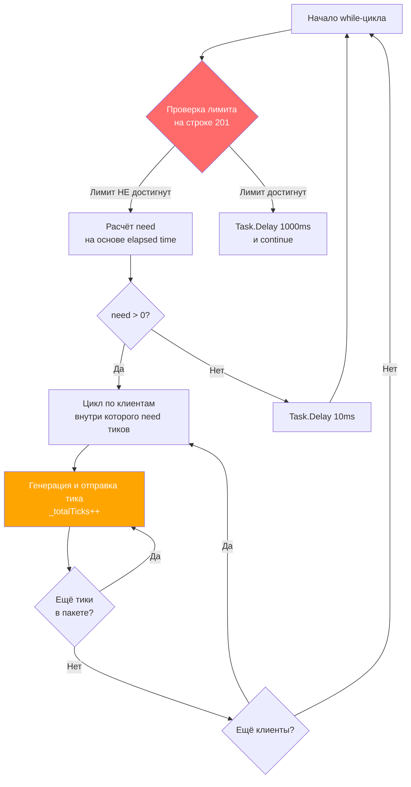

# Исправление перерасхода лимита MaxTicks

## Проблема
При установке `--max-ticks 600000` фактически генерируется 874620 тиков — перерасход 45.8%.

## Корневая причина
Проверка лимита (`_totalTicks >= MaxTicks`) выполняется только в начале каждой итерации `while`-цикла. Внутри итерации генерируется весь пакет `need` тиков без проверки лимита. При RPS=35000 и отставании от целевого RPS переменная `need` накапливается и может составлять десятки тысяч тиков за одну итерацию.

## Схема потока данных



**Проблемная зона**: между шагами B и A нет промежуточной проверки лимита — весь пакет генерируется разом.

## Решение

### Изменение 1: Ограничить `need` перед входом во внутренний цикл

В файле [`TickGeneratorService.cs`](tests/FakeTickServer/TickGeneratorService.cs), после расчёта `need` (строка 225), добавить ограничение:

```csharp
var need = (int)(newExpected - expectedTotal);

// Ограничиваем need, чтобы не превысить MaxTicks
if (_settings.MaxTicks > 0)
{
    var remaining = _settings.MaxTicks - Interlocked.Read(ref _totalTicks);
    if (remaining <= 0)
    {
        // Лимит уже достигнут — перейти к проверке в начале цикла
        continue;
    }
    need = (int)Math.Min(need, remaining);
}
```

### Изменение 2: Проверка лимита внутри внутреннего цикла отправки

Внутри цикла `for (int j = 0; j < count; j++)` (строка 243), после `Interlocked.Increment(ref _totalTicks)` (строка 269), добавить проверку:

```csharp
Interlocked.Increment(ref _totalTicks);

// Проверка лимита внутри пакета — прерываем отправку
if (_settings.MaxTicks > 0 && Interlocked.Read(ref _totalTicks) >= _settings.MaxTicks)
{
    break;
}
```

Аналогичную проверку добавить во внешний цикл `foreach (var (clientId, clientState) in _clients)` — после внутреннего `for` проверять `_isLimitReached` и прерывать итерацию по клиентам.

### Изменение 3 (опционально): Логировать фактическое количество при остановке

В блоке где логируется достижение лимита (строка 206-208), добавить информацию о фактическом количестве:

```csharp
_logger.LogInformation(
    "Достигнут лимит тиков: {MaxTicks}. Фактически сгенерировано: {Actual}. " +
    "Генерация остановлена, сервис продолжает работу.",
    _settings.MaxTicks, Interlocked.Read(ref _totalTicks));
```

## Файлы для изменения
- `tests/FakeTickServer/TickGeneratorService.cs`

## Тестирование
1. Запустить FakeTickServer с `--max-ticks 600000 --rps 35000`
2. Подключить MarketDataCollector
3. Убедиться, что `всего` в финальном статусе не превышает 600000 (или превышает минимально, на единицы/десятки, а не на сотни тысяч)
