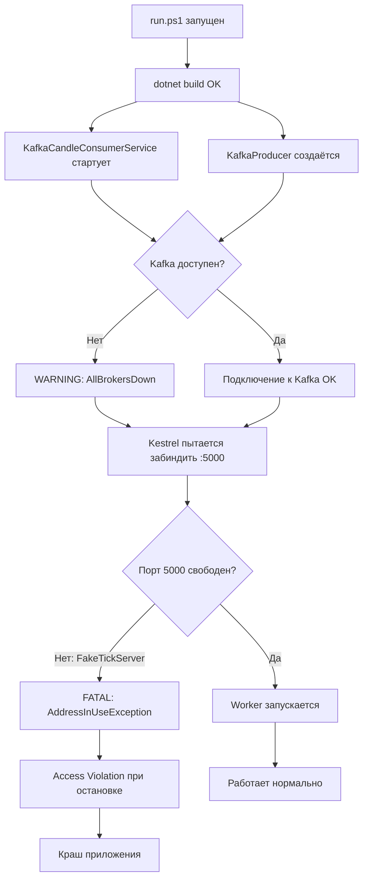

# План исправления ошибок запуска MarketDataCollector.Worker

## Анализ вывода терминала

При запуске `run.ps1` обнаружено **3 проблемы**:

---

### Проблема 1: Конфликт порта 5000 — FATAL (краш приложения)

**Симптом:**
```
System.IO.IOException: Failed to bind to address http://0.0.0.0:5000: address already in use.
```

**Причина:**
- [`appsettings.json`](src/MarketDataCollector.Workers/MarketDataCollector.Worker/appsettings.json:5) — Kestrel настроен на порт `5000`
- [`appsettings.json`](src/MarketDataCollector.Workers/MarketDataCollector.Worker/appsettings.json:48) — WebSocket-клиенты подключаются к `ws://localhost:5000/ws/{symbol}@trade`
- [`run_fake_server.ps1`](run_fake_server.ps1:2) — `FakeTickServer` также слушает порт `5000`

Архитектура подразумевает:
```
FakeTickServer :5000 → MarketDataCollector подключается к :5000 по WebSocket
```
Но Kestrel в Worker тоже пытается занять порт `5000` для HTTP-эндпоинтов (метрики, health-check). Если `FakeTickServer` уже запущен — порт занят, Worker падает.

**Решение:** Вынести Kestrel на другой порт (например, `5010`), сделав его конфигурируемым.

---

### Проблема 2: Kafka недоступен — WARNING (не крашит, но ломает пайплайн)

**Симптом:**
```
Kafka consumer error: Local_AllBrokersDown 1/1 brokers are down
Kafka producer error: Local_AllBrokersDown 1/1 brokers are down
```

**Причина:**
Kafka запускается через Docker Compose ([`docker-compose.yml`](docker/docker-compose.yml:28)), но контейнер не был запущен перед `run.ps1`.

**Решение:** Добавить опциональную проверку доступности Kafka в [`run.ps1`](run.ps1:1) или в [`Program.cs`](src/MarketDataCollector.Workers/MarketDataCollector.Worker/Program.cs:1) с предупреждением. Не критично — приложение работает без Kafka (записывает свечи напрямую в БД).

---

### Проблема 3: Access Violation в KafkaConsumer при остановке — CRASH

**Симптом:**
```
Fatal error. System.AccessViolationException: Attempted to read or write protected memory.
  at Confluent.Kafka.Impl.NativeMethods.NativeMethods.rd_kafka_consumer_poll(IntPtr, IntPtr)
```

**Причина:**
В [`KafkaCandleConsumerService.ConsumeLoopAsync()`](src/MarketDataCollector.Infrastructure/Kafka/KafkaCandleConsumerService.cs:143) вызывается `_consumer.Consume(ct)` — это блокирующий нативный вызов `rd_kafka_consumer_poll`, который **не реагирует** на `.NET CancellationToken`. При остановке:
1. `_cts.Cancel()` отменяет токен
2. `_consumer.Close()` вызывается в `StopAsync` (строка 127)
3. Нативный `rd_kafka_consumer_poll` ещё выполняется
4. `Close()` уничтожает handleconsumer → Access Violation

**Решение:** Заменить `_consumer.Consume(ct)` на `_consumer.Consume(TimeSpan)` с проверкой `ct.IsCancellationRequested` между итерациями. Это позволит корректно завершить poll и закрыть consumer без гонки.

---

## План исправлений

### Шаг 1: Исправить конфликт порта 5000

**Файлы:**
- [`appsettings.json`](src/MarketDataCollector.Workers/MarketDataCollector.Worker/appsettings.json)
- [`Program.cs`](src/MarketDataCollector.Workers/MarketDataCollector.Worker/Program.cs)

**Действия:**
1. В `appsettings.json` изменить порт Kestrel с `5000` на `5010`:
   ```json
   "Kestrel": {
     "Endpoints": {
       "Http": {
         "Url": "http://0.0.0.0:5010"
       }
     }
   }
   ```
2. Добавить переменную окружения `ASPNETCORE_URLS` в `run.ps1` как запасной вариант, либо использовать `appsettings.Development.json` для переопределения.

### Шаг 2: Исправить Access Violation в KafkaCandleConsumerService

**Файл:** [`KafkaCandleConsumerService.cs`](src/MarketDataCollector.Infrastructure/Kafka/KafkaCandleConsumerService.cs:143)

**Действия:**
Заменить блок `ConsumeLoopAsync` — вместо `_consumer.Consume(ct)` использовать polling с таймаутом:

```csharp
private async Task ConsumeLoopAsync(CancellationToken ct)
{
    _consumer.Subscribe(_options.AggregatedDataTopic);
    _logger.LogInformation(
        "Subscribed to topic {Topic}. Waiting for messages...",
        _options.AggregatedDataTopic);

    try
    {
        while (!ct.IsCancellationRequested)
        {
            try
            {
                // Используем Consume с таймаутом вместо CancellationToken,
                // чтобы избежать Access Violation при закрытии consumer
                var consumeResult = _consumer.Consume(TimeSpan.FromSeconds(1));

                if (consumeResult == null || consumeResult.IsPartitionEOF)
                    continue;

                await ProcessCandleMessageAsync(consumeResult.Message, ct);
                _consumer.Commit(consumeResult);

                _logger.LogTrace(
                    "Candle consumed and saved. Offset={Offset}, Partition={Partition}, Key={Key}",
                    consumeResult.Offset, consumeResult.Partition, consumeResult.Message.Key);
            }
            catch (ConsumeException ex)
            {
                _logger.LogError(ex,
                    "Kafka consume error. Topic={Topic}, ErrorCode={ErrorCode}",
                    _options.AggregatedDataTopic, ex.Error.Code);
                await Task.Delay(1000, ct);
            }
        }
    }
    catch (OperationCanceledException)
    {
        // Ожидаемо при остановке
    }
    catch (Exception ex)
    {
        _logger.LogCritical(ex, "Unexpected error in Kafka consumer loop");
    }
}
```

Ключевое изменение: `_consumer.Consume(ct)` → `_consumer.Consume(TimeSpan.FromSeconds(1))`. Это гарантирует, что нативный poll завершится максимум за 1 секунду, и `Close()` не вызовет гонку.

### Шаг 3: Улучшить StopAsync в KafkaCandleConsumerService

**Файл:** [`KafkaCandleConsumerService.cs`](src/MarketDataCollector.Infrastructure/Kafka/KafkaCandleConsumerService.cs:98)

**Действия:**
Упростить `StopAsync` — убрать таймаут `WaitAsync`, т.к. теперь consumer poll завершается за ~1 секунду:

```csharp
public async Task StopAsync(CancellationToken cancellationToken)
{
    if (_cts == null) return;

    _logger.LogInformation("KafkaCandleConsumerService stopping...");
    _cts.Cancel();

    try
    {
        if (_consumingTask != null)
        {
            await _consumingTask.WaitAsync(TimeSpan.FromSeconds(5));
        }
    }
    catch (OperationCanceledException)
    {
        _logger.LogWarning("Consumer task did not complete within timeout");
    }
    finally
    {
        try
        {
            _consumer.Close();
        }
        catch (Exception ex)
        {
            _logger.LogWarning(ex, "Error closing Kafka consumer");
        }
    }

    _logger.LogInformation("KafkaCandleConsumerService stopped");
}
```

### Шаг 4 (опционально): Добавить проверку инфраструктуры в run.ps1

**Файл:** [`run.ps1`](run.ps1)

**Действия:**
Добавить проверку Docker и Kafka перед запуском Worker:

```powershell
# Проверка Docker
$dockerRunning = docker info 2>&1 | Select-String "Server Version"
if (-not $dockerRunning) {
    Write-Host "Docker не запущен! Запустите Docker Desktop." -ForegroundColor Red
    Read-Host -Prompt "Нажмите любую клавишу для выхода"
    exit 1
}

# Проверка Kafka
$kafkaContainer = docker ps --filter "name=marketdata-kafka" --format "{{.Status}}" 2>&1
if (-not $kafkaContainer) {
    Write-Host "Kafka не запущен! Запустите: docker-compose -f docker/docker-compose.yml up -d" -ForegroundColor Yellow
    Write-Host "Продолжаем без Kafka..." -ForegroundColor Yellow
}
```

---

## Диаграмма потока ошибок


