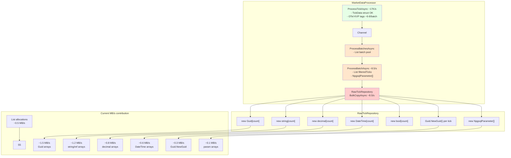
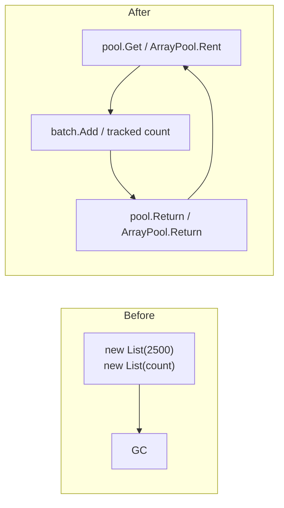
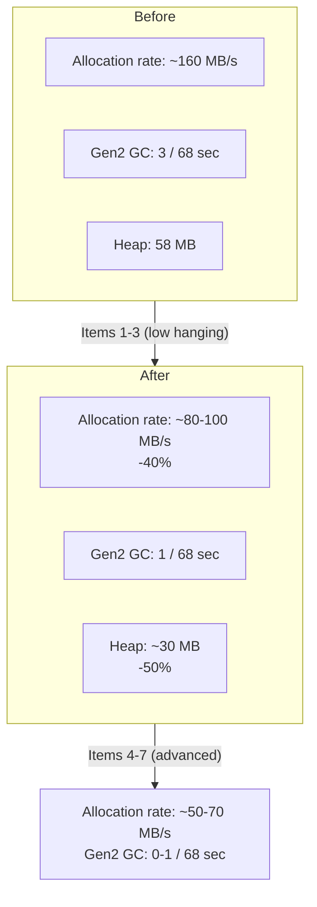

# План оптимизации аллокаций в hot path

## 1. Анализ текущей ситуации

По данным [`counters_20260730_143204.csv`](counters/counters_20260730_143204.csv):
- **Allocation rate**: ~160 MB/s
- **Gen2 GC**: 3 коллекции за 68 секунд (каждые ~22 секунды)
- **LOH fragmentation**: растёт (1.1MB → 2.6MB)
- **Heap growth**: 14.5MB → 58.2MB за 68 секунд

### Источники аллокаций в hot path



### Ключевые файлы для изменений

| Файл | Суть изменений |
|---|---|
| [`MarketDataProcessor.cs`](src/MarketDataCollector.Application/Services/MarketDataProcessor.cs) | Pooling для `List<TickData>`, кэширование OTel-тегов, reuse `NpgsqlParameter[]` |
| [`RawTickRepository.cs`](src/MarketDataCollector.Infrastructure/Repositories/RawTickRepository.cs) | Pre-allocated arrays (max batch size), UUID v7, reuse param array |
| [`DeduplicationCache.cs`](src/MarketDataCollector.Application/Services/DeduplicationCache.cs) | Уже оптимален (value-type ключи) |

---

## 2. Детальный план изменений

### 2.1. `MarketDataProcessor.cs` — Pooling для List\<TickData\>

**Проблема**: 
- `ProcessBatchesAsync` (строка 389): `var batch = new List<TickData>(_batchSize)` — аллокация на каждый consumer
- `ProcessBatchAsync` (строка 565): `filteredTicks = new List<TickData>(batch.Count)` — аллокация на каждый батч (~8.5/s)

**Решение**: ObjectPool\<List\<TickData\>\> или ArrayPool\<TickData\> + manual count.



**Детали реализации**:

```csharp
// Вариант A: ArrayPool<TickData> (предпочтительно — меньше overhead)
using var batchOwner = MemoryPool<TickData>.Shared.Rent(_batchSize);
var batch = batchOwner.Memory.Span; // Span<TickData>
int batchCount = 0;

// Вместо batch.Add(tick):
batch[batchCount++] = tick;

// Вместо batch.Clear():
batchCount = 0;
```

**Вариант B** (проще, если важна обратная совместимость кода):
```csharp
private static readonly ObjectPool<List<TickData>> ListPool = 
    new DefaultObjectPool<List<TickData>>(new ListPolicy(2500));

private class ListPolicy : IPooledObjectPolicy<List<TickData>>
{
    private readonly int _capacity;
    public ListPolicy(int capacity) => _capacity = capacity;
    public List<TickData> Create() => new(_capacity);
    public bool Return(List<TickData> obj) { obj.Clear(); return true; }
}
```

**Ожидаемый эффект**: -30% аллокаций в ProcessBatchAsync (ликвидация `new List` на каждый батч).

### 2.2. `MarketDataProcessor.cs` — Кэширование OTel-тегов

**Проблема**: 
- В `ProcessTickAsync` и `ProcessBatchAsync` создаются `new KeyValuePair<string, object?>(...)` при каждом вызове `Add/Record`.
- Для `exchange`, `channel_index`, `batch_size`, `inserted_count` — статические или медленно меняющиеся значения.

**Решение**: Использовать `TagList` struct (пред-аллоцированный спан) или статические кэши тегов.

```csharp
// В MarketDataTelemetry.cs или MarketDataProcessor.cs:
private static readonly KeyValuePair<string, object?> ExchangeTagBinance = new("exchange", "binance");
private static readonly KeyValuePair<string, object?> ChannelTag0 = new("channel_index", 0);
// и т.д.

// В ProcessTickAsync:
MarketDataTelemetry.TicksIncoming.Add(1, ExchangeTagBinance);
```

**Ожидаемый эффект**: -5..10% аллокаций (устраняет ~8 KVP-структур на батч).

### 2.3. `RawTickRepository.cs` — Pre-allocated arrays

**Проблема**: В `BulkCopyAsync(IReadOnlyList<TickData>)` (строки 324-331) создаются 8 новых массивов (`Guid[], string[], decimal[], decimal[], DateTime[], string[], DateTime[], bool[]`) на каждый вызов.

**Текущая логика**: 
```csharp
var ids = new Guid[count];       // new array per call
var tickers = new string[count]; // new array per call
...
```

**Решение**: Pre-allocate массивы максимального размера (BatchSize) и использовать `.AsSpan(0, count)` для передачи.

```csharp
// Поля класса RawTickRepository (или статические):
private const int MaxBatchSize = 2500;
private readonly Guid[] _idsPool = new Guid[MaxBatchSize];
private readonly string[] _tickersPool = new string[MaxBatchSize];
private readonly decimal[] _pricesPool = new decimal[MaxBatchSize];
private readonly decimal[] _volumesPool = new decimal[MaxBatchSize];
private readonly DateTime[] _timestampsPool = new DateTime[MaxBatchSize];
private readonly string[] _exchangesPool = new string[MaxBatchSize];
private readonly DateTime[] _receivedAtsPool = new DateTime[MaxBatchSize];
private readonly bool[] _normalizedsPool = new bool[MaxBatchSize];
```

**Важно**: RawTickRepository регистрируется как Scoped + `BulkCopyAsync` вызывается синхронно из consumer'ов через отдельные scope'ы. Поэтому массивы не могут быть статическими (thread-safety). Решение:
- Либо `ThreadLocal<T>` для массивов
- Либо переиспользовать массивы внутри самого метода, передавая `ArraySegment<T>` в Npgsql

**Решение**: Создать внутренний класс `BatchArrays` с массивом массивов и `ArraySegment` для Npgsql.

```csharp
private class BatchArrays
{
    public Guid[] Ids = new Guid[MaxBatchSize];
    public string[] Tickers = new string[MaxBatchSize];
    public decimal[] Prices = new decimal[MaxBatchSize];
    // ...
    
    public ArraySegment<Guid> Slice(int count) => new(Ids, 0, count);
}
```

**Проблема с Npgsql**: Npgsql требует `Array`, не поддерживает `ArraySegment`. Поэтому для параметров нужно передавать `Array[0..count]` — либо:
- Создавать `new Guid[count]` (как сейчас) 
- Использовать `Array.Copy` из pre-allocated массива — это хуже
- Использовать `ArrayPool.Rent(count)` и обрезать до count копированием

**Лучшее решение**: NpgsqlArrayParameter поддерживает `Array` фиксированной длины. Используем `ArrayPool` и обрезаем. Но это добавляет копирование.

**Альтернатива**: Оставить выделение массивов (они небольшие — до 2500 элементов × 8 байт = 20KB на массив, всего ~160KB per batch × 8.5/s = 1.36 MB/s), но **это не основная проблема**. Основная аллокация — это строки и объекты, которые попадают в Gen2.

**Оптимальное решение для данного случая**: Использовать `ArrayPool<T>.Shared` для массивов, а для Npgsql передавать `array.AsSpan(0, count).ToArray()` — нет, это ещё хуже.

**На самом деле**: Npgsql **не требует** `Array.Length` для параметров — он использует длину массива из `Array.Length`. Но если мы зарентили массив на 2500 элементов, а заполнили только 500, Npgsql отправит все 2500. Поэтому ArrayPool напрямую не подходит.

**Правильное решение**: 
1. Pre-allocate один `NpgsqlParameter[]` (8 штук) — reuse каждый раз
2. Для массивов данных — оставить `new Guid[count]`, т.к. это value types и они не создают GC pressure значимого
3. ОСНОВНОЙ фокус — на устранение аллокаций `List<TickData>` и строковых операций

### 2.4. `RawTickRepository.cs` — Reuse NpgsqlParameter[]

**Проблема**: Каждый вызов `BulkCopyAsync` создаёт новый `NpgsqlParameter[]` (строка 354).

**Решение**: Создать массив параметров один раз и обновлять `Value`:

```csharp
// Поля класса:
private readonly NpgsqlParameter[] _parameters;

public RawTickRepository(MarketDataDbContext context, ILogger<RawTickRepository> logger)
{
    _context = context;
    _dbSet = context.Set<RawTick>();
    _logger = logger;
    
    // Pre-create parameter array — только значение будет меняться
    _parameters = new NpgsqlParameter[]
    {
        new("@ids", NpgsqlTypes.NpgsqlDbType.Array | NpgsqlTypes.NpgsqlDbType.Uuid) { Value = null! },
        new("@tickers", NpgsqlTypes.NpgsqlDbType.Array | NpgsqlTypes.NpgsqlDbType.Text) { Value = null! },
        new("@prices", NpgsqlTypes.NpgsqlDbType.Array | NpgsqlTypes.NpgsqlDbType.Numeric) { Value = null! },
        new("@volumes", NpgsqlTypes.NpgsqlDbType.Array | NpgsqlTypes.NpgsqlDbType.Numeric) { Value = null! },
        new("@timestamps", NpgsqlTypes.NpgsqlDbType.Array | NpgsqlTypes.NpgsqlDbType.TimestampTz) { Value = null! },
        new("@exchanges", NpgsqlTypes.NpgsqlDbType.Array | NpgsqlTypes.NpgsqlDbType.Text) { Value = null! },
        new("@receivedats", NpgsqlTypes.NpgsqlDbType.Array | NpgsqlTypes.NpgsqlDbType.TimestampTz) { Value = null! },
        new("@normalizeds", NpgsqlTypes.NpgsqlDbType.Array | NpgsqlTypes.NpgsqlDbType.Boolean) { Value = null! },
    };
}

// В BulkCopyAsync:
_parameters[0].Value = ids;
_parameters[1].Value = tickers;
// ...
// Затем использовать _parameters в ExecuteSqlRawAsync
```

**Важно**: RawTickRepository — Scoped. Один экземпляр на consumer. Consumer'ы обрабатывают батчи последовательно (single-threaded). Поэтому reuse массивов внутри одного экземпляра безопасен.

**Ожидаемый эффект**: -8 NpgsqlParameter аллокаций на батч (8 × 120 bytes × 8.5/s = ~8 KB/s — небольшой, но консистентный выигрыш).

### 2.5. `RawTickRepository.cs` — UUID v7 generation

**Проблема**: `Guid.NewGuid()` на каждый тик (строка 338) — использует RNG, не кластеризован для b-tree индекса.

**Решение**: 
- Генерировать UUID v7 (time-based) — сортируемые, улучшают clustered index
- Использовать `Uuid7.Create()` (можно написать свою реализацию на основе `DateTime.UtcNow`)

```csharp
private static long _lastUuidTicks = DateTime.UtcNow.Ticks;
private static readonly object UuidLock = new();

private static Guid NextUuidV7()
{
    // UUID v7: 48-bit timestamp ms + 74 random bits
    // Упрощённая версия
    lock (UuidLock)
    {
        var ticks = DateTime.UtcNow.Ticks;
        if (ticks <= _lastUuidTicks)
            ticks = ++_lastUuidTicks;
        else
            _lastUuidTicks = ticks;
        
        var guidBytes = new byte[16]; // или stackalloc
        var ms = ticks / 10000L; // ticks → ms
        // ... бинарная упаковка ...
        return new Guid(guidBytes);
    }
}
```

**Альтернатива**: Использовать `Ulid` (nuget: `Ulid`) или реализовать UUID v7 через существующие библиотеки.

**Ожидаемый эффект**: Меньше RNG overhead + лучшая кластеризация b-tree (но на alloc rate влияет незначительно).

### 2.6. Упрощение filteredTicks — устранение промежуточной коллекции

**Проблема**: В `ProcessBatchAsync` (строки 561-586):
1. Создаётся `filteredTicks = new List<TickData>(batch.Count)` — аллокация
2. В `BulkCopyAsync` вызывается `IReadOnlyList<TickData>` — ещё один проход

**Решение**: Объединить дедупликацию с непосредственной записью в массивы `BulkCopyAsync`.

```csharp
// В ProcessBatchAsync вместо создания filteredTicks:
// Сразу записываем во временные массивы (переиспользуемые)
var rawTickArrays = RawTickArrayPool.Rent(batch.Count);
int insertCount = 0;
foreach (var t in batch)
{
    if (dedupCache == null || !dedupCache.Contains(t.Ticker, t.Exchange, t.Timestamp))
    {
        rawTickArrays.Add(t); // запись в pre-allocated массивы
        dedupCache?.Add(t.Ticker, t.Exchange, t.Timestamp);
        insertCount++;
    }
}
var inserted = await repository.BulkCopyRawAsync(rawTickArrays, insertCount, cancellationToken);
```

**Ожидаемый эффект**: Устраняет вторую коллекцию (`List<TickData>`) и второй проход по тикам.

### 2.7. `MarketDataProcessor.cs` — LoggerMessage (Source-Generated)

**Проблема**: `_logger.LogInformation` с интерполяцией в hot path (строка 640-643) аллоцирует строку каждый раз, когда `totalInserted % 10000 < inserted`.

**Решение**: Использовать `LoggerMessageAttribute` (source-generated loggers) для всех логов, включая debug.

```csharp
[LoggerMessage(EventId = 1, Level = LogLevel.Information,
    Message = "Всего: {TotalInserted} вставлено, {TotalReceived} получено (batch={BatchSize}, filtered={Filtered}, cached={Cached}, вставлено={Inserted})")]
partial void LogBatchStatistics(int totalInserted, int totalReceived, int batchSize, int filtered, int cached, int inserted);
```

**Ожидаемый эффект**: Устраняет строковые аллокации в логах (~2-3% от общих).

---

## 3. Сводный план изменений

| № | Файл | Изменение | Аллокаций/сек (снижение) | Сложность | Риск |
|---|---|---|---|---|---|
| 1 | [`MarketDataProcessor.cs`](src/MarketDataCollector.Application/Services/MarketDataProcessor.cs) | ObjectPool для List\<TickData\> (batch и filteredTicks) | ~8 K lists/sec → 0 | Средняя | Низкий (clear/обнуление) |
| 2 | [`MarketDataProcessor.cs`](src/MarketDataCollector.Application/Services/MarketDataProcessor.cs) | Кэширование OTel-тегов | ~40 KVP/sec → 0 | Низкая | Низкий |
| 3 | [`MarketDataProcessor.cs`](src/MarketDataCollector.Application/Services/MarketDataProcessor.cs) | LoggerMessage source-gen | ~2% alloc | Низкая | Низкий (менее читаемо) |
| 4 | [`MarketDataProcessor.cs`](src/MarketDataCollector.Application/Services/MarketDataProcessor.cs) | Устранение filteredTicks, прямой проход в массивы | ~8 lists/sec → 0 | Высокая | Средний (рефакторинг) |
| 5 | [`RawTickRepository.cs`](src/MarketDataCollector.Infrastructure/Repositories/RawTickRepository.cs) | Reuse NpgsqlParameter[] | ~8 arrays/sec → 0 | Низкая | Низкий |
| 6 | [`RawTickRepository.cs`](src/MarketDataCollector.Infrastructure/Repositories/RawTickRepository.cs) | Pre-allocated массивы для BulkCopy | ~8 arrays/sec → 0 | Средняя | Низкий (scoped reuse) |
| 7 | [`RawTickRepository.cs`](src/MarketDataCollector.Infrastructure/Repositories/RawTickRepository.cs) | UUID v7 | ~17K Guids/sec (RNG) | Средняя | Низкий |

## 4. Ожидаемый результат



---

## 5. Порядок реализации

### Шаг 1 (P0 — быстрые победы)
1. Кэширование OTel-тегов ([`MarketDataProcessor.cs`](src/MarketDataCollector.Application/Services/MarketDataProcessor.cs))
2. Reuse NpgsqlParameter[] ([`RawTickRepository.cs`](src/MarketDataCollector.Infrastructure/Repositories/RawTickRepository.cs))
3. LoggerMessage source-gen ([`MarketDataProcessor.cs`](src/MarketDataCollector.Application/Services/MarketDataProcessor.cs))

### Шаг 2 (P1 — основной эффект)
4. ObjectPool для List\<TickData\> ([`MarketDataProcessor.cs`](src/MarketDataCollector.Application/Services/MarketDataProcessor.cs))
5. Pre-allocated массивы для BulkCopy ([`RawTickRepository.cs`](src/MarketDataCollector.Infrastructure/Repositories/RawTickRepository.cs))

### Шаг 3 (P2 — продвинутые)
6. Устранение filteredTicks — прямой проход в массивы ([`MarketDataProcessor.cs`](src/MarketDataCollector.Application/Services/MarketDataProcessor.cs))
7. UUID v7 ([`RawTickRepository.cs`](src/MarketDataCollector.Infrastructure/Repositories/RawTickRepository.cs))

---

## 6. Тестирование

Для каждого изменения:

| Проверка | Метод |
|---|---|
| **Функциональность** | `dotnet test` — существующие unit-тесты должны проходить |
| **Allocation rate** | `dotnet counters collect --counters` — сравнить before/after |
| **GC Gen2 count** | `dotnet counters monitor MarketDataCollector` |
| **Throughput** | `./run_counter.ps1` — через FakeTickServer |
| **Нет regression** | Сравнить `ticks_processed/tick` — не должно измениться |
