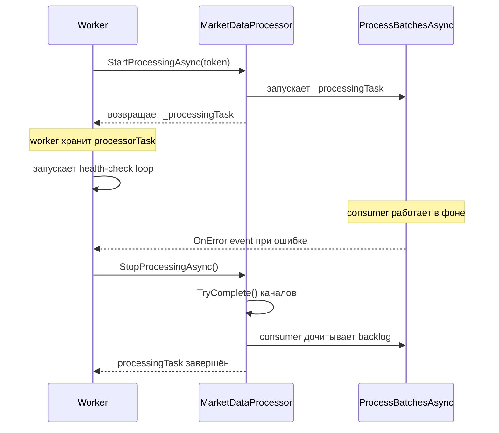

# Улучшение паттерна fire-and-forget в StartProcessingAsync

## Проблема

Строка 67 в [`Worker.cs`](src/MarketDataCollector.Workers/MarketDataCollector.Worker/Worker.cs:67):
```csharp
_ = marketDataProcessor.StartProcessingAsync(stoppingToken);
```

Имеет несколько проблем:

1. **`_ =` — code smell**: подавляет предупреждение CS4014, но маскирует проблему
2. **Метод возвращает `Task.CompletedTask`**: хотя внутри [`MarketDataProcessor`](src/MarketDataCollector.Application/Services/MarketDataProcessor.cs:20) создаётся реальная фоновая задача `_processingTask`, метод возвращает `Task.CompletedTask` — signature вводит в заблуждение
3. **Параметр `stoppingToken` не используется**: consumer'ы используют `_internalCts.Token`, а не внешний токен
4. **Исключения в самом `StartProcessingAsync`** молча проглатываются из-за `_ =`
5. **Непоследовательность**: [`tickAggregator.StartAsync(stoppingToken)`](src/MarketDataCollector.Workers/MarketDataCollector.Worker/Worker.cs:70) — await'ится, хотя тоже возвращает `Task.CompletedTask`

## Решение: Возвращать `_processingTask` из `StartProcessingAsync`

### Суть изменения

Метод [`StartProcessingAsync()`](src/MarketDataCollector.Application/Services/MarketDataProcessor.cs:166) вместо `return Task.CompletedTask` будет возвращать реальную фоновую задачу `_processingTask`. Это даёт caller'у видимость жизненного цикла фоновой обработки и возможность обработать исключения.

### Схема потока данных



## Файлы для изменения

### 1. [`IMarketDataProcessor.cs`](src/MarketDataCollector.Core/Interfaces/IMarketDataProcessor.cs:17)

Изменение сигнатуры **не требуется** — интерфейс уже возвращает `Task`. Только обновить XML-документацию:

```csharp
/// <summary>
/// Запускает фоновую обработку данных из каналов.
/// Возвращает Task фоновой задачи обработки, который завершается
/// только после вызова StopProcessingAsync.
/// Caller НЕ должен await'ить этот Task — он предназначен для
/// мониторинга и обработки исключений фоновых consumer'ов.
/// </summary>
Task StartProcessingAsync(CancellationToken cancellationToken = default);
```

### 2. [`MarketDataProcessor.cs`](src/MarketDataCollector.Application/Services/MarketDataProcessor.cs:166)

Заменить `return Task.CompletedTask;` на `return _processingTask;`:

**Было** (строка 299):
```csharp
return Task.CompletedTask;
```

**Стало**:
```csharp
return _processingTask;
```

Также обновить early return (строка 177):
```csharp
// Было:
if (_processingTask != null && !_processingTask.IsCompleted)
    return Task.CompletedTask;

// Стало:
if (_processingTask != null && !_processingTask.IsCompleted)
    return _processingTask;
```

### 3. [`Worker.cs`](src/MarketDataCollector.Workers/MarketDataCollector.Worker/Worker.cs:67)

Заменить `_ =` discard на осознанное хранение задачи:

**Было**:
```csharp
_ = marketDataProcessor.StartProcessingAsync(stoppingToken);
```

**Стало**:
```csharp
// Запускаем процессор — возвращает фоновую задачу consumer'ов.
// Не await'им здесь — она работает параллельно с health-check loop.
// Исключения обрабатываются через OnError event (строка 59-64).
var processorTask = marketDataProcessor.StartProcessingAsync(stoppingToken);
```

Затем после health-check loop (строка 81-87) добавить наблюдение за задачей:

```csharp
// Наблюдаем за фоновой задачей процессора — если она упала с исключением
// (не через OnError), пробрасываем его для внешнего оркестратора.
if (processorTask.IsFaulted)
{
    throw new InvalidOperationException(
        "MarketDataProcessor background task failed",
        processorTask.Exception?.InnerException);
}
```

### 4. [`TickAggregator.cs`](src/MarketDataCollector.Application/Services/TickAggregator.cs:135) — опционально, для консистентности

Аналогичное изменение — вернуть `_processingTask` вместо `Task.CompletedTask`:

```csharp
// Было:
return Task.CompletedTask;

// Стало:
return _processingTask;
```

И в [`Worker.cs`](src/MarketDataCollector.Workers/MarketDataCollector.Worker/Worker.cs:70) аналогично:
```csharp
// Было:
await tickAggregator.StartAsync(stoppingToken);

// Стало:
var aggregatorTask = tickAggregator.StartAsync(stoppingToken);
```

### 5. Тесты [`MarketDataProcessorTests.cs`](tests/MarketDataCollector.Tests/Application/Services/MarketDataProcessorTests.cs:1)

Все тесты, которые делают `await processor.StartProcessingAsync(cts.Token)`, теперь будут await'ить реальную фоновую задачу, которая не завершится до `StopProcessingAsync`. Нужно заменить `await` на fire-and-forget:

**Было** (повторяется ~25 раз):
```csharp
await processor.StartProcessingAsync(cts.Token);
```

**Стало**:
```csharp
processor.StartProcessingAsync(cts.Token);
```

Это безопасно, потому что:
- `StartProcessingAsync` не бросает исключений (все ошибки идут через `OnError`)
- В тестах `StopProcessingAsync` вызывается сразу после и корректно завершает фоновую задачу
- Единственный тест, который проверяет возвращаемый объект ([строка 186](tests/MarketDataCollector.Tests/Application/Services/MarketDataProcessorTests.cs:186)), использует `var task = processor.StartProcessingAsync(...)` без await — он продолжит работать

## Порядок выполнения

1. Обновить XML-документацию в [`IMarketDataProcessor`](src/MarketDataCollector.Core/Interfaces/IMarketDataProcessor.cs:17)
2. Изменить [`MarketDataProcessor.StartProcessingAsync()`](src/MarketDataCollector.Application/Services/MarketDataProcessor.cs:166) — возвращать `_processingTask`
3. Обновить [`Worker.cs`](src/MarketDataCollector.Workers/MarketDataCollector.Worker/Worker.cs:67) — хранить и наблюдать задачу
4. Опционально: аналогично для [`TickAggregator`](src/MarketDataCollector.Application/Services/TickAggregator.cs:135)
5. Обновить тесты — убрать `await` из вызовов `StartProcessingAsync`
6. Запустить тесты для проверки
