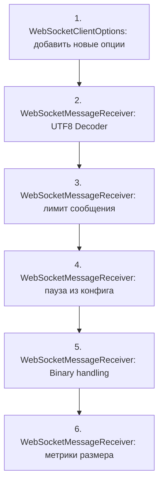

# План улучшений: WebSocketMessageReceiver.StartReceiveLoopAsync

## Текущие проблемы

На основе анализа [`WebSocketMessageReceiver.StartReceiveLoopAsync`](src/MarketDataCollector.Core/Clients/WebSocketMessageReceiver.cs:31) выявлены следующие проблемы:

| # | Проблема | Серьёзность | Описание |
|---|----------|-------------|----------|
| 1 | **Multi-byte UTF8 на границе фрагментов** | Высокая | При фрагментированном сообщении multi-byte символ (кириллица, эмодзи) может быть разрезан границей фрагмента. `Encoding.UTF8.GetString` на каждом фрагменте по отдельности даёт искажённые данные |
| 2 | **Нет лимита на размер StringBuilder** | Средняя | Если `EndOfMessage` никогда не приходит (битая биржа или атака), `StringBuilder` растёт бесконечно → OOM |
| 3 | **Пауза 1с при ошибке хардкодом** | Низкая | `await Task.Delay(1000, cancellationToken)` — не из конфигурации, нельзя настроить |
| 4 | **StopReceiveLoop() — no-op** | Низкая | В самом `WebSocketMessageReceiver` только логирует, реальная остановка через CancellationToken извне |
| 5 | **Нет обработки бинарных сообщений** | Средняя | Если биржа пришлёт `WebSocketMessageType.Binary`, будет декодировано как UTF8 → мусор |
| 6 | **Нет метрик/логов размера сообщений** | Низкая | Нет логирования аномально больших сообщений для диагностики |

## Предлагаемые улучшения

### 1. Исправить декодирование UTF8 на границе фрагментов

**Где:** [`WebSocketMessageReceiver.cs:61`](src/MarketDataCollector.Core/Clients/WebSocketMessageReceiver.cs:61)

**Что изменить:** Заменить `Encoding.UTF8.GetString(buffer, 0, result.Count)` на использование `Encoding.UTF8.GetDecoder()`.

**Как работает сейчас:**
```csharp
stringBuilder.Append(Encoding.UTF8.GetString(buffer, 0, result.Count));
```

**Как должно быть:**
```csharp
// В конструкторе или поле класса:
private readonly Decoder _utf8Decoder = Encoding.UTF8.GetDecoder();

// В цикле:
var chars = new char[result.Count]; // максимум chars == bytes
var charCount = _utf8Decoder.GetChars(buffer, 0, result.Count, chars, 0);
stringBuilder.Append(chars, 0, charCount);
```

`Decoder` сохраняет состояние между вызовами, поэтому multi-byte символ, разорванный границей фрагмента, будет корректно собран при получении следующего фрагмента.

**Важно:** При разрыве соединения или ошибке `Decoder` нужно сбросить (`_utf8Decoder.Reset()`), иначе состояние останется от предыдущего сообщения.

### 2. Добавить лимит на размер сообщения

**Где:** [`WebSocketMessageReceiver.cs:37`](src/MarketDataCollector.Core/Clients/WebSocketMessageReceiver.cs:37) и [`WebSocketClientOptions.cs`](src/MarketDataCollector.Core/Configuration/WebSocketClientOptions.cs)

**Что изменить:**
1. Добавить опцию `MaxMessageSize` в `WebSocketClientOptions` (по умолчанию, например, 4 MB = 4 * 1024 * 1024)
2. В цикле проверять длину `StringBuilder` перед добавлением фрагмента

```csharp
// В WebSocketClientOptions добавить:
public int MaxMessageSize { get; set; } = 4 * 1024 * 1024; // 4 MB

// В цикле после stringBuilder.Append:
if (stringBuilder.Length > _options.MaxMessageSize)
{
    _logger.LogError("Превышен максимальный размер сообщения: {Length} > {MaxSize}",
        stringBuilder.Length, _options.MaxMessageSize);
    stringBuilder.Clear();
    break; // или continue — выйти из цикла, соединение битое
}
```

### 3. Вынести паузу при ошибке в конфигурацию

**Где:** [`WebSocketMessageReceiver.cs:90`](src/MarketDataCollector.Core/Clients/WebSocketMessageReceiver.cs:90) и [`WebSocketClientOptions.cs`](src/MarketDataCollector.Core/Configuration/WebSocketClientOptions.cs)

**Что изменить:**
1. Добавить опцию `ReceiveErrorDelay` в `WebSocketClientOptions`
2. Использовать её вместо хардкода 1000

```csharp
// В WebSocketClientOptions добавить:
public TimeSpan ReceiveErrorDelay { get; set; } = TimeSpan.FromSeconds(1);

// В цикле заменить:
await Task.Delay(_options.ReceiveErrorDelay, cancellationToken);
```

### 4. Добавить обработку бинарных сообщений

**Где:** [`WebSocketMessageReceiver.cs:55-59`](src/MarketDataCollector.Core/Clients/WebSocketMessageReceiver.cs:55-59)

**Что изменить:** Добавить обработку `WebSocketMessageType.Binary` — логировать предупреждение и пропускать, либо декодировать как UTF8 (если биржа шлёт текст как binary).

```csharp
if (result.MessageType == WebSocketMessageType.Close)
{
    _logger.LogInformation("Получен сообщение закрытия WebSocket.");
    break;
}

if (result.MessageType == WebSocketMessageType.Binary)
{
    _logger.LogWarning("Получено бинарное сообщение, ожидался текст. Пропуск.");
    stringBuilder.Clear();
    continue;
}
```

### 5. Добавить метрики размера сообщений

**Где:** [`WebSocketMessageReceiver.cs:63-76`](src/MarketDataCollector.Core/Clients/WebSocketMessageReceiver.cs:63-76)

**Что изменить:** Логировать предупреждение при аномально больших сообщениях (например, > 1 MB).

```csharp
if (result.EndOfMessage)
{
    var message = stringBuilder.ToString();
    var messageSize = message.Length;
    
    if (messageSize > 1024 * 1024) // > 1 MB
    {
        _logger.LogWarning("Получено большое сообщение: {Size} байт", messageSize);
    }
    
    stringBuilder.Clear();
    // ... остальная обработка
}
```

### 6. Сделать StopReceiveLoop осмысленным (опционально)

**Где:** [`WebSocketMessageReceiver.cs:103-106`](src/MarketDataCollector.Core/Clients/WebSocketMessageReceiver.cs:103-106)

**Что изменить:** Добавить `CancellationTokenSource` внутрь `WebSocketMessageReceiver`, чтобы `StopReceiveLoop()` могла реально остановить цикл, а не только логировать.

**Важно:** Это потребует изменения сигнатуры `StartReceiveLoopAsync` — нужно будет передавать `CancellationToken` не как параметр, а хранить внутри. Либо оставить как есть, поскольку остановка через CancellationToken из `BaseWebSocketClient` работает корректно.

**Рекомендация:** Не менять — текущий механизм остановки через CancellationToken из `BaseWebSocketClient` работает, и добавление второго CTS внутри `WebSocketMessageReceiver` создаст путаницу.

## Порядок реализации



## Файлы для изменения

| Файл | Изменения |
|------|-----------|
| [`src/MarketDataCollector.Core/Configuration/WebSocketClientOptions.cs`](src/MarketDataCollector.Core/Configuration/WebSocketClientOptions.cs) | Добавить `MaxMessageSize` и `ReceiveErrorDelay` |
| [`src/MarketDataCollector.Core/Clients/WebSocketMessageReceiver.cs`](src/MarketDataCollector.Core/Clients/WebSocketMessageReceiver.cs) | Все 6 улучшений |

## Критерии готовности

- [ ] UTF8-декодер корректно обрабатывает multi-byte символы на границе фрагментов
- [ ] При превышении `MaxMessageSize` цикл прерывается с логом ошибки
- [ ] Пауза при ошибке читается из `WebSocketClientOptions.ReceiveErrorDelay`
- [ ] Бинарные сообщения логируются и пропускаются без падения
- [ ] Аномально большие сообщения (>1 MB) логируются предупреждением
- [ ] Существующие тесты проходят (если есть)
- [ ] При разрыве соединения `Decoder.Reset()` вызывается для сброса состояния