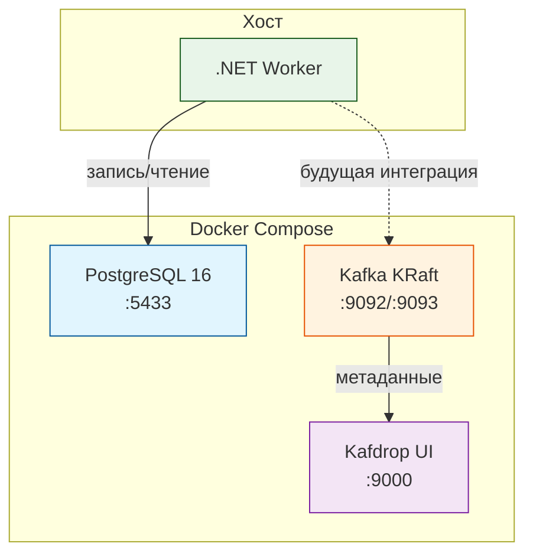

# План: Добавление Kafka в Docker Compose

## Цель

Добавить Apache Kafka (в режиме KRaft — без ZooKeeper) и Kafdrop (веб-интерфейс) в существующий `docker-compose.yml`. Это первый шаг к внедрению message queue для развязки компонентов, как описано в `Roadmap.md` (п. 2.2).

## Что будет добавлено

### 1. Kafka (KRaft mode)

- **Образ:** `bitnami/kafka:latest` (поддерживает KRaft из коробки)
- **Режим:** KRaft (без ZooKeeper) — проще, современнее, меньше ресурсов
- **Порт:** `9092` (внутренний), `9093` (внешний, для .NET приложения)
- **Топики** (автосоздание при старте):
  - `raw-ticks` — сырые тиковые данные
  - `aggregated-data` — агрегированные данные (свечи)
  - `connection-events` — события подключений
- **Персистентность:** том `kafka_data` для сохранения данных между перезапусками

### 2. Kafdrop (Веб-UI)

- **Образ:** `obsidiandynamics/kafdrop:latest`
- **Порт:** `9000`
- **Возможности:** просмотр топиков, сообщений, партиций, consumer groups
- **Доступ:** http://localhost:9000

### 3. Скрипт инициализации

- **Файл:** `docker/kafka/init-topics.sh`
- **Действие:** создаёт топики при первом запуске, если их нет
- **Запуск:** через `command` в Kafka сервисе или отдельный init-контейнер

## Архитектура после изменений



## Изменяемые файлы

### 1. `docker/docker-compose.yml`

Добавить сервисы:

```yaml
kafka:
  image: bitnami/kafka:latest
  container_name: marketdata-kafka
  ports:
    - "9092:9092"
    - "9093:9093"
  environment:
    # KRaft mode
    - KAFKA_CFG_NODE_ID=1
    - KAFKA_CFG_PROCESS_ROLES=broker,controller
    - KAFKA_CFG_CONTROLLER_QUORUM_VOTERS=1@kafka:9093
    - KAFKA_CFG_CONTROLLER_LISTENER_NAMES=CONTROLLER
    - KAFKA_CFG_LISTENERS=PLAINTEXT://:9092,CONTROLLER://:9093,EXTERNAL://:9094
    - KAFKA_CFG_ADVERTISED_LISTENERS=PLAINTEXT://kafka:9092,EXTERNAL://localhost:9094
    - KAFKA_CFG_LISTENER_SECURITY_PROTOCOL_MAP=PLAINTEXT:PLAINTEXT,CONTROLLER:PLAINTEXT,EXTERNAL:PLAINTEXT
    - KAFKA_CFG_INTER_BROKER_LISTENER_NAME=PLAINTEXT
    - KAFKA_CFG_AUTO_CREATE_TOPICS_ENABLE=false
    - KAFKA_CFG_OFFSETS_TOPIC_REPLICATION_FACTOR=1
    - KAFKA_CFG_TRANSACTION_STATE_LOG_REPLICATION_FACTOR=1
    - KAFKA_CFG_TRANSACTION_STATE_LOG_MIN_ISR=1
    - ALLOW_PLAINTEXT_LISTENER=yes
    - KAFKA_KRAFT_CLUSTER_ID=marketdata-kafka-cluster
  volumes:
    - kafka_data:/bitnami/kafka
  networks:
    - marketdata-network
  healthcheck:
    test: ["CMD-SHELL", "kafka-topics.sh --bootstrap-server localhost:9092 --list"]
    interval: 10s
    timeout: 5s
    retries: 5
  restart: unless-stopped

  kafka-init-topics:
    image: bitnami/kafka:latest
    container_name: marketdata-kafka-init
    command:
      - /bin/bash
      - -c
      - |
        # Ждём, пока Kafka станет доступна
        echo "Waiting for Kafka to be ready..."
        cub kafka-ready -b kafka:9092 1 30
        # Создаём топики
        echo "Creating topics..."
        kafka-topics.sh --bootstrap-server kafka:9092 --create --if-not-exists --topic raw-ticks --partitions 3 --replication-factor 1
        kafka-topics.sh --bootstrap-server kafka:9092 --create --if-not-exists --topic aggregated-data --partitions 3 --replication-factor 1
        kafka-topics.sh --bootstrap-server kafka:9092 --create --if-not-exists --topic connection-events --partitions 1 --replication-factor 1
        echo "Topics created successfully!"
        kafka-topics.sh --bootstrap-server kafka:9092 --list
    networks:
      - marketdata-network
    depends_on:
      kafka:
        condition: service_healthy

  kafdrop:
    image: obsidiandynamics/kafdrop:latest
    container_name: marketdata-kafdrop
    ports:
      - "9000:9000"
    environment:
      - KAFKA_BROKERCONNECT=kafka:9092
      - JVM_OPTS=-Xms64m -Xmx128m
      - SERVER_SERVLET_CONTEXTPATH=/
    networks:
      - marketdata-network
    depends_on:
      - kafka
    restart: unless-stopped
```

Добавить volume:

```yaml
volumes:
  postgres_data:
  kafka_data:      # NEW
```

### 2. `docker/kafka/init-topics.sh` (опционально, для ручного использования)

Скрипт для ручного создания/проверки топиков.

### 3. `README.md`

Добавить раздел "Запуск Kafka" в "Быстрый старт" и описание новых сервисов.

## Топики и их назначение

| Топик | Партиции | Назначение |
|-------|----------|------------|
| `raw-ticks` | 3 | Сырые тики с бирж для массовой записи в PostgreSQL |
| `aggregated-data` | 3 | OHLCV-свечи после агрегации |
| `connection-events` | 1 | События подключений/отключений для мониторинга |

## Инструкция по запуску

### Шаг 1: Запуск всех сервисов

```bash
cd docker
docker-compose up -d
```

### Шаг 2: Проверка запуска

```bash
docker ps
# Ожидаемые контейнеры:
#   marketdata-postgres   (PostgreSQL 16)
#   marketdata-kafka       (Kafka KRaft)
#   marketdata-kafdrop     (Kafdrop UI)
```

### Шаг 3: Проверка топиков

Откройте Kafdrop: http://localhost:9000

Или через CLI:
```bash
# Войти в контейнер Kafka
docker exec -it marketdata-kafka bash

# Проверить список топиков
kafka-topics.sh --bootstrap-server localhost:9092 --list

# Посмотреть детали топика
kafka-topics.sh --bootstrap-server localhost:9092 --describe --topic raw-ticks
```

### Шаг 4: Прослушивание сообщений (для отладки)

```bash
# Прослушивать топик raw-ticks
docker exec -it marketdata-kafka kafka-console-consumer.sh \
  --bootstrap-server localhost:9092 \
  --topic raw-ticks \
  --from-beginning
```

## Проверка работоспособности

После запуска всех сервисов проверьте:

1. Kafdrop UI доступен по адресу http://localhost:9000
2. В Kafdrop видны топики: `raw-ticks`, `aggregated-data`, `connection-events`
3. PostgreSQL работает (уже настроен healthcheck)
4. Kafka работает (healthcheck: `kafka-topics.sh --list`)

## Последующие шаги (не входят в текущую задачу)

1. **Интеграция Kafka в .NET код**:
   - Добавить `Confluent.Kafka` NuGet-пакет
   - Создать `KafkaTickProducer` для публикации тиков
   - Создать `KafkaTickConsumer` для чтения и записи в PostgreSQL
2. **Обновление `MarketDataProcessor`** для публикации в Kafka вместо прямой записи в БД
3. **Добавление consumer для агрегированных данных**
4. **Настройка retention policy** в Kafka для автоматической очистки старых данных

## Состояние после изменений

```yaml
services:
  postgres:        # существующий
  kafka:           # новый - KRaft брокер
  kafka-init-topics: # новый - инициализация топиков
  kafdrop:         # новый - веб-интерфейс Kafka
volumes:
  postgres_data:   # существующий
  kafka_data:      # новый
```
