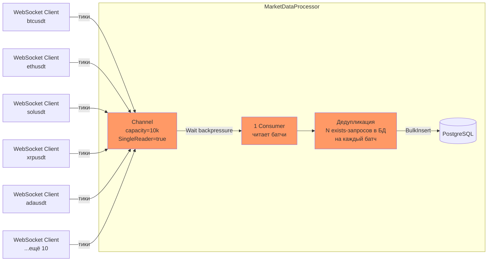
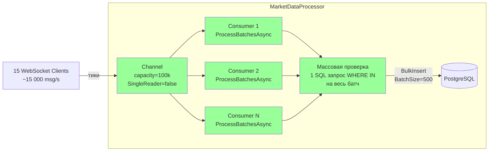
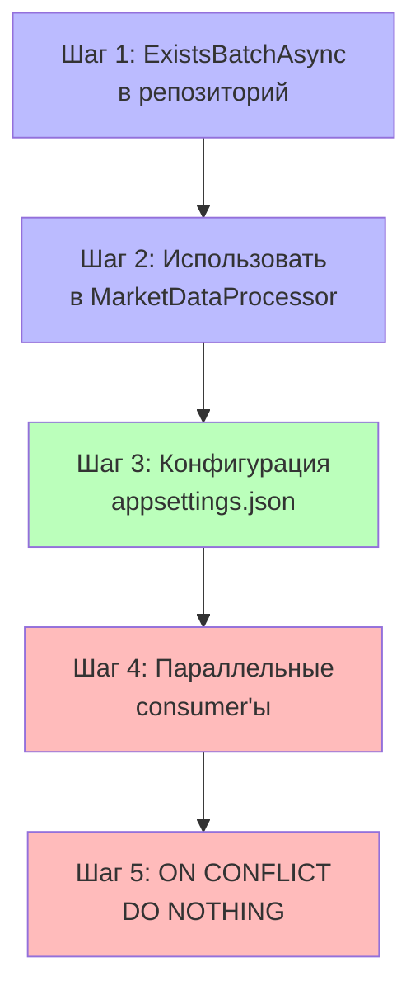

# План повышения производительности MarketDataCollector

> **Задача:** Обеспечить стабильную работу системы с 15 инструментами (вместо текущих 5)
> **Ожидаемая нагрузка:** ~15 000 msg/s входящих тиков от Binance WebSocket

---

## Текущая архитектура (узкие места)



**Критические проблемы:**
1. **🔴 ChannelCapacity = 10k** — заполнится за < 1 секунды при 15k msg/s
2. **🔴 SingleReader = true** — 1 consumer пишет батч в БД, очередь растёт
3. **🔴 N отдельных `ExistsAsync`** — каждый батч делает N SQL-запросов

---

## Целевая архитектура



---

## Todo-лист для реализации

### [ ] Шаг 1: Добавить метод `ExistsBatchAsync` в RawTickRepository

**Файлы:**
- [`IRawTickRepository.cs`](src/MarketDataCollector.Core/Interfaces/IRawTickRepository.cs) — добавить метод в интерфейс
- [`RawTickRepository.cs`](src/MarketDataCollector.Infrastructure/Repositories/RawTickRepository.cs) — реализовать массовый запрос `WHERE IN`

**Суть изменения:**
```csharp
// Вместо N отдельных запросов:
foreach (var tick in ticks)
    await _rawTickRepository.ExistsAsync(tick.Ticker, tick.Exchange, tick.Timestamp, ct);

// Один массовый запрос:
await _rawTickRepository.ExistsBatchAsync(keys, ct);
// SQL: SELECT ticker, exchange, timestamp FROM "RawTicks" 
//      WHERE (ticker, exchange, timestamp) IN (@p0,@p1,@p2), ...
```

### [ ] Шаг 2: Переписать `ProcessBatchAsync` в MarketDataProcessor

**Файл:** [`MarketDataProcessor.cs`](src/MarketDataCollector.Application/Services/MarketDataProcessor.cs)

- Заменить цикл с `ExistsAsync` на один вызов `ExistsBatchAsync`
- **Не удалять** остальную логику (группировка дубликатов в памяти — оставить для оптимизации)

### [ ] Шаг 3: Обновить конфигурацию в appsettings.json

**Файл:** [`appsettings.json`](src/MarketDataCollector.Workers/MarketDataCollector.Worker/appsettings.json)

| Параметр | Было | Стало |
|----------|------|-------|
| `MarketDataProcessor.BatchSize` | 100 | 500 |
| `MarketDataProcessor.ChannelCapacity` | 10000 | 100000 |
| `TickAggregator.ChannelCapacity` | 10000 | 100000 |
| `WebSocketClient.ReceiveBufferSize` | 4096 | 16384 |

### [ ] Шаг 4: Параллельные consumer'ы для Channel

**Файл:** [`MarketDataProcessor.cs`](src/MarketDataCollector.Application/Services/MarketDataProcessor.cs)

- Убрать `SingleReader = true` → `SingleReader = false`
- В `StartProcessingAsync` запускать `Environment.ProcessorCount` параллельных `ProcessBatchesAsync`
- `_processingTask` становится `Task` (не `Task.WhenAll`), т.к. `Task.WhenAll` возвращает `Task`
- В `StopProcessingAsync` дожидаться `_processingTask` как обычно

```csharp
public Task StartProcessingAsync(CancellationToken cancellationToken = default)
{
    var consumerCount = Environment.ProcessorCount; // 4-8 на типичной системе
    var consumers = Enumerable.Range(0, consumerCount)
        .Select(_ => ProcessBatchesAsync(cancellationToken));
    _processingTask = Task.WhenAll(consumers);
    return Task.CompletedTask;
}
```

### [ ] Шаг 5: `INSERT ... ON CONFLICT DO NOTHING` вместо дедупликации

**Файлы:**
- [`IRawTickRepository.cs`](src/MarketDataCollector.Core/Interfaces/IRawTickRepository.cs) — добавить метод
- [`RawTickRepository.cs`](src/MarketDataCollector.Infrastructure/Repositories/RawTickRepository.cs) — реализовать bulk insert с `ON CONFLICT DO NOTHING`
- [`MarketDataProcessor.cs`](src/MarketDataCollector.Application/Services/MarketDataProcessor.cs) — упростить `ProcessBatchAsync`

**SQL для вставки:**
```sql
INSERT INTO "RawTicks" ("Id", "Ticker", "Price", "Volume", "Timestamp", "Exchange", "Normalized", "CreatedAt", ...)
VALUES ...
ON CONFLICT ("Ticker", "Exchange", "Timestamp") DO NOTHING;
```

**После этого шага** можно полностью удалить `GetExistingKeysFromDbAsync` из MarketDataProcessor.

---

## Порядок выполнения



- **Синие шаги (1-2)** — критически важны, без них система не выдержит нагрузку
- **Зелёный шаг (3)** — тривиальное изменение конфига
- **Красные шаги (4-5)** — опциональны, дают дополнительный прирост

---

## Ожидаемые метрики после реализации

| Метрика | Сейчас (5 инстр.) | После шагов 1-3 | После шагов 1-5 |
|---------|:-:|:-:|:-:|
| Инструментов | 5 | 15 | 15 |
| Входящих msg/s | ~5 000 | ~15 000 | ~15 000 |
| Обработано ticks/s | ~3 000 | ~12 000+ | ~15 000 |
| SQL-запросов EXISTS на батч | 100 | 1 | 0 |
| BatchSize | 100 | 500 | 500-1000 |
| Channel capacity | 10 000 | 100 000 | 100 000 |
| Consumer'ов | 1 | 1 | N (CPU count) |
| Запись в БД | AddRangeAsync | AddRangeAsync | BulkInsert ON CONFLICT |
