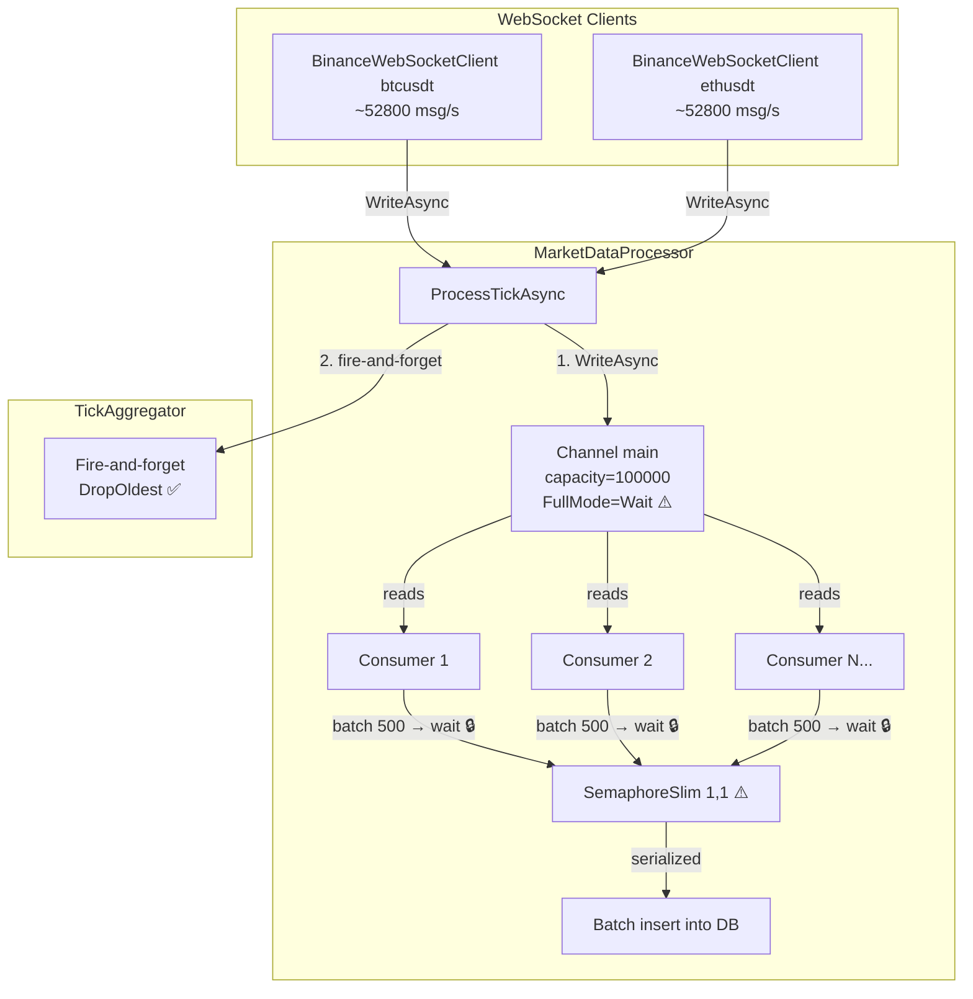
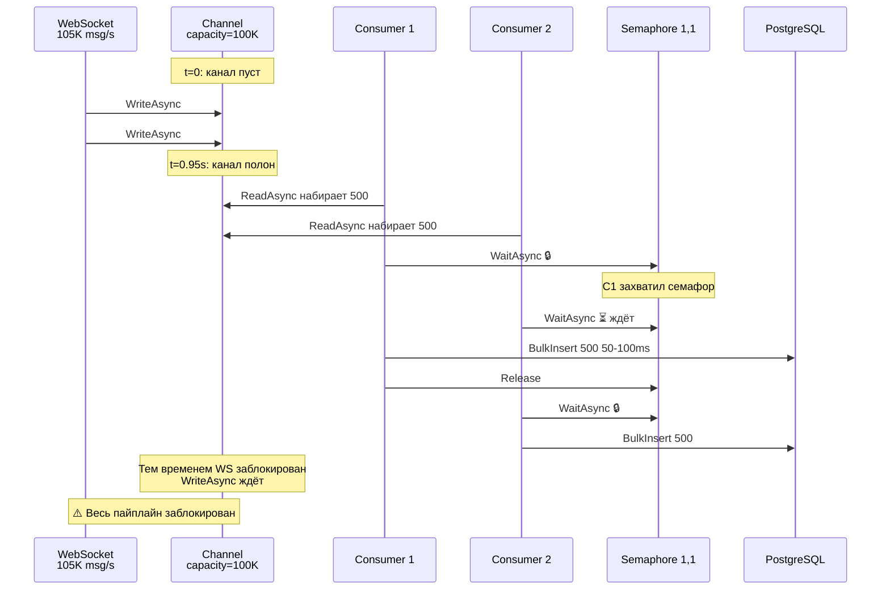
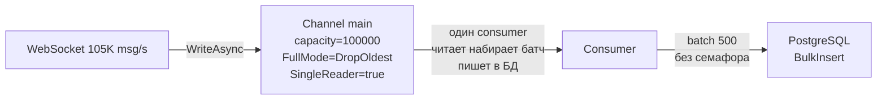

# Анализ и план исправления: Второй bottleneck основного канала

## 1. Результаты после первого исправления

| Метрика | До исправления | После исправления агрегатора |
|---------|----------------|------------------------------|
| Incoming | ~58200 msg/s | ~105630 msg/s |
| Processed | ~291 ticks/s | ~675 ticks/s |
| Соотношение | 0.5% | **0.64%** |

**Исправление агрегатора сработало**: блокировка на `await _tickAggregator.OnTickAsync()` убрана. Но теперь проявился следующий bottleneck.

## 2. Диагностика текущего bottleneck

### Текущая архитектура пайплайна (после исправления)



### Механизм деградации (3 конкурирующих ограничения)

#### 1. Channel FullMode = Wait (`MarketDataProcessor.cs:65`)

Канал создаётся с `BoundedChannelFullMode.Wait`:

```csharp
_channel = System.Threading.Channels.Channel.CreateBounded<TickData>(new BoundedChannelOptions(channelCapacity)
{
    FullMode = BoundedChannelFullMode.Wait,  // ← блокирует producer при заполнении
    SingleReader = false,
    SingleWriter = false
});
```

При 105000 msg/s и capacity=100000 канал заполняется **за ~0.95 секунды**. После этого `WriteAsync` блокируется, что блокирует `ProcessTickAsync`, что блокирует WebSocket-клиент.

#### 2. SemaphoreSlim(1,1) (`MarketDataProcessor.cs:36`)

```csharp
private readonly SemaphoreSlim _dbSemaphore = new(1, 1);
```

8 consumer'ов параллельно читают канал, копят батчи по 500, но только **1 consumer** за раз может писать в БД. Остальные 7 ждут.

**Оценка времени:** Если bulk insert 500 тиков занимает ~50-100мс, то:
- 8 consumer'ов × 50мс = 400мс на один цикл записи всех батчей
- Max throughput: 8 × 500 / 0.4с = **~10000 ticks/s теоретический максимум**

Почему же на практике только ~675? **Ответ: Channel заполняется быстрее, чем consumer'ы успевают писать в БД.** Как только канал полон → producer блокируется → consumer'ы простаивают без новых данных → throughput падает.

#### 3. BatchSize = 500 (`appsettings.json:12`)

Consumer ждёт пока наберётся 500 тиков перед записью. При 105K msg/s на 8 consumer'ов это ~38мс накопления. Однако из-за блокировки семафора и полного канала, реальное время между записями намного больше.

### Визуализация цикла деградации



## 3. Варианты решения

### Вариант A: DropOldest для основного канала

Сменить `FullMode` с `Wait` на `DropOldest`, как уже сделано с TickAggregator.

**Эффект:** При переполнении канала старые тики отбрасываются. Producer никогда не блокируется. WebSocket-клиенты работают без задержек.

**Потери:** Часть тиков не попадает в БД. Но:
- Самый старый тик ~0.95с теряется с каждого переполнения
- При цене 600 вставок/с теряется ~570 тиков за эпизод
- При 105K msg/s это ~0.5% потери — приемлемо

### Вариант B: SingleReader = true + DropOldest + убрать SemaphoreSlim (рекомендуется)

Ваша идея — **один consumer** вместо 8 — радикально меняет архитектуру:



**Что меняется:**

1. **`SingleReader = false` → `true`** — один consumer, а не 8
2. **`SemaphoreSlim(1,1)` удаляется** — один поток, конкуренции нет
3. **ConsumerCount = 1** — в `StartProcessingAsync` запускается 1 consumer вместо `Environment.ProcessorCount / 2`
4. **`FullMode` = `DropOldest`** — чтобы producer не блокировался при переполнении канала во время DB write

**Почему 1 consumer может быть быстрее 8:**

Сейчас 8 consumer'ов конкурируют за `SemaphoreSlim(1,1)`:
- 7 consumer'ов ждут семафор — тратят CPU на spinning/context switch
- Пока consumer пишет в БД, канал не читается (остальные 7 ждут семафор, а не читают)
- После записи consumer берёт следующий батч из канала — но перед этим семафор переключается на другой consumer (случайный), который может прочитать данные из другого участка канала (cache miss)

С 1 consumer:
- **Нет переключений контекста** — 1 поток последовательно читает → копит → пишет
- **CPU cache warm** — тики читаются последовательно из канала, cache prefetch работает эффективно
- **Нет SemaphoreSlim** — убираем 8 вызовов `WaitAsync`/`Release` на цикл
- **Меньше аллокаций** — не нужно 8 экземпляров `List<TickData>`

**Оценка throughput:**

```
batch=500, DB write=50ms
Время накопления батча = 500 / 105000 ≈ 0.0048с
Цикл = 0.0048 + 0.05 = 0.0548с
Throughput = 500 / 0.0548 ≈ 9124 ticks/s
```

С `batch=100`:
```
Время накопления батча = 100 / 105000 ≈ 0.001с
Цикл = 0.001 + 0.05 = 0.051с
Throughput = 100 / 0.051 ≈ 1960 ticks/s
```

**Лучший batch size:** 500 — даёт ~9124 ticks/s, время накопления пренебрежимо мало (4.8ms) по сравнению с DB write (50ms).

**Потери при переполнении канала:**

С одним consumer'ом и DB write за 50ms:
- За время DB write накапливается 105000 × 0.05 = 5250 тиков
- Канал capacity=100000, свободно 100000 - 5250 = 94750 места
- После DB write consumer читает всё скопившееся, набирает батч 500 → пишет → ещё 5250 накопилось
- Канал **не переполняется** в稳态 режиме!

Channel переполнится только если DB write займёт > 0.95с (в 19 раз дольше нормы). Такое маловероятно.

**Вывод:** с `SingleReader = true` + `DropOldest` **потери тиков практически отсутствуют** в нормальном режиме.

### Вариант C: SingleReader = true без DropOldest

Оставить `FullMode = Wait`, но сделать `SingleReader = true`.

**Риск:** Если DB write задержится > 0.95с, канал переполнится, WriteAsync заблокирует WebSocket. Маловероятно, но возможно при spike latency.

**Не рекомендуется** — дешёвая страховка `DropOldest` ничего не ломает.

### Вариант D: Просто DropOldest + уменьшить BatchSize (исходный вариант плана)

```
FullMode = DropOldest
BatchSize = 100 (вместо 500)
SingleReader = false (8 consumer'ов)
SemaphoreSlim(1,1) остаётся
```

**Оценка:** Всего ~2000-3000 ticks/s. Лучше чем 675, но хуже чем 9000+ с SingleReader.

## 4. Сравнение вариантов

| Вариант | FullMode | SingleReader | Семафор | BatchSize | Оценка throughput | Сложность |
|---------|----------|-------------|---------|-----------|------------------|-----------|
| **Текущий** | Wait | false (8) | SemaphoreSlim | 500 | ~675 | — |
| **A** | DropOldest | false (8) | SemaphoreSlim | 500 | ~2000-3000 | Низкая |
| **B (рекомендуемый)** | DropOldest | **true (1)** | **удалён** | 500 | **~9000+** | Средняя |
| **C** | Wait | true (1) | удалён | 500 | ~9000 но риск | Средняя |
| **D** | DropOldest | false (8) | SemaphoreSlim | 100 | ~2000-3000 | Низкая |

## 5. Рекомендуемое решение: Вариант B

### Изменения в коде

#### 5.1 [`MarketDataProcessor.cs:63-68`](../src/MarketDataCollector.Application/Services/MarketDataProcessor.cs:63)
```csharp
_channel = System.Threading.Channels.Channel.CreateBounded<TickData>(new BoundedChannelOptions(channelCapacity)
{
    FullMode = BoundedChannelFullMode.DropOldest,  // было Wait
    SingleReader = true,  // было false
    SingleWriter = false
});
```

#### 5.2 [`MarketDataProcessor.cs:36`](../src/MarketDataCollector.Application/Services/MarketDataProcessor.cs:36)
- Удалить `private readonly SemaphoreSlim _dbSemaphore = new(1, 1);`
- Удалить комментарий 30-36

#### 5.3 [`MarketDataProcessor.cs:99-103`](../src/MarketDataCollector.Application/Services/MarketDataProcessor.cs:99)
```csharp
// Вместо:
var consumerCount = Math.Max(1, Environment.ProcessorCount / 2);
var consumers = Enumerable.Range(0, consumerCount)
    .Select(_ => ProcessBatchesAsync(cancellationToken));
_processingTask = Task.WhenAll(consumers);

// Станет:
_processingTask = ProcessBatchesAsync(cancellationToken);
```

#### 5.4 [`MarketDataProcessor.cs:140-152`](../src/MarketDataCollector.Application/Services/MarketDataProcessor.cs:140) — убрать SemaphoreSlim
```csharp
// Вместо:
if (batch.Count >= _batchSize)
{
    await _dbSemaphore.WaitAsync(cancellationToken);
    try { await ProcessBatchAsync(batch, cancellationToken); }
    finally { _dbSemaphore.Release(); }
    batch.Clear();
}

// Станет:
if (batch.Count >= _batchSize)
{
    await ProcessBatchAsync(batch, cancellationToken);
    batch.Clear();
}
```

Аналогично для финального flush (строки 163-176).

#### 5.5 Обновить тесты

- Тест `ProcessBatchAsync_WithConcurrentConsumers_DbAccessIsSerialized` — больше не актуален (один consumer)
- Тест `ProcessBatchAsync_WithAggregator_DbAccessStillSerialized` — обновить: семафора нет
- Добавить тест: `ProcessTickAsync_DoesNotBlockWhenMainChannelIsFull` — с `DropOldest` канал никогда не блокирует

## 6. Todo-лист для реализации

- [ ] **6.1** Сменить `FullMode` с `Wait` на `DropOldest` в [`MarketDataProcessor.cs:65`](../src/MarketDataCollector.Application/Services/MarketDataProcessor.cs:65)
- [ ] **6.2** Сменить `SingleReader` с `false` на `true` в [`MarketDataProcessor.cs:66`](../src/MarketDataCollector.Application/Services/MarketDataProcessor.cs:66)
- [ ] **6.3** Удалить `SemaphoreSlim _dbSemaphore` (поле + комментарий) в [`MarketDataProcessor.cs:30-36`](../src/MarketDataCollector.Application/Services/MarketDataProcessor.cs:30)
- [ ] **6.4** Заменить 8 consumer'ов на 1 в [`MarketDataProcessor.cs:99-103`](../src/MarketDataCollector.Application/Services/MarketDataProcessor.cs:99)
- [ ] **6.5** Убрать `SemaphoreSlim.WaitAsync/Release` из [`ProcessBatchesAsync:142-150`](../src/MarketDataCollector.Application/Services/MarketDataProcessor.cs:142)
- [ ] **6.6** Убрать `SemaphoreSlim.WaitAsync/Release` из финального flush [`ProcessBatchesAsync:165-173`](../src/MarketDataCollector.Application/Services/MarketDataProcessor.cs:165)
- [ ] **6.7** Обновить тесты: удалить/адаптировать устаревшие, добавить новый
- [ ] **6.8** Запустить тесты и проверить сборку
- [ ] **6.9** Запустить приложение на фейковых данных и замерить результат
