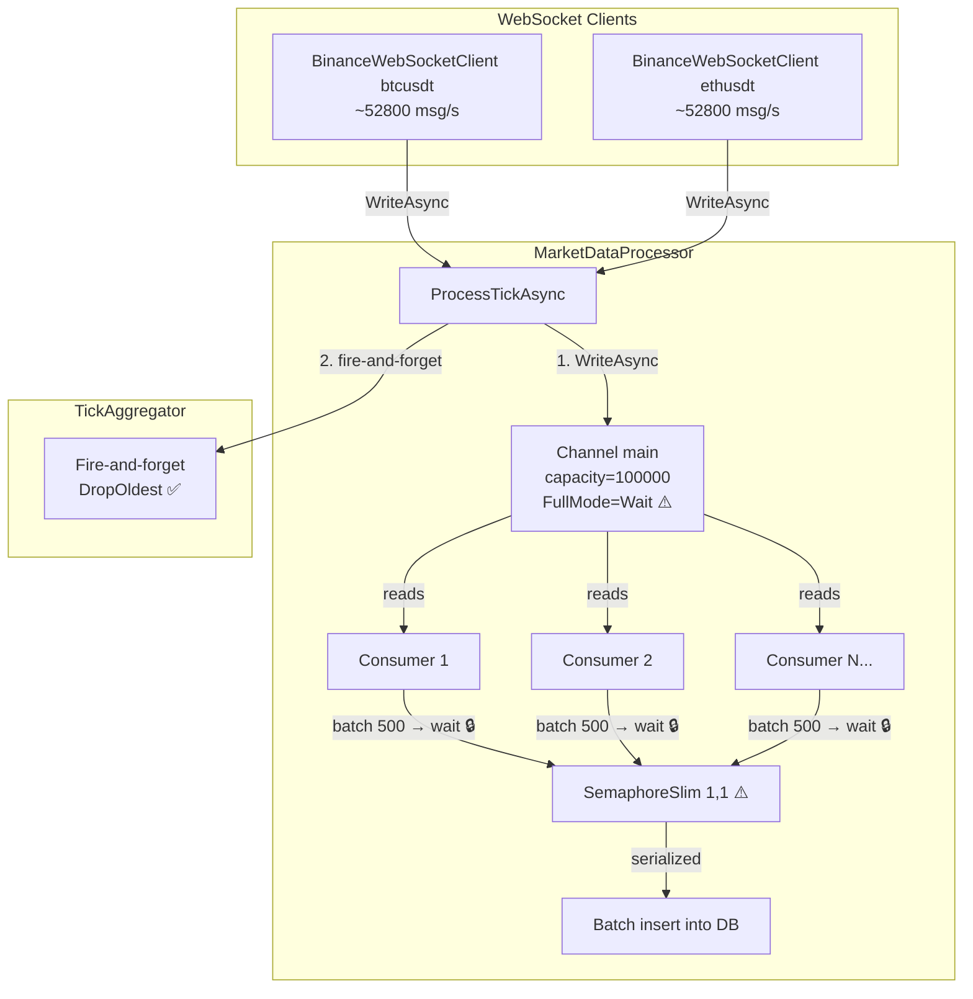
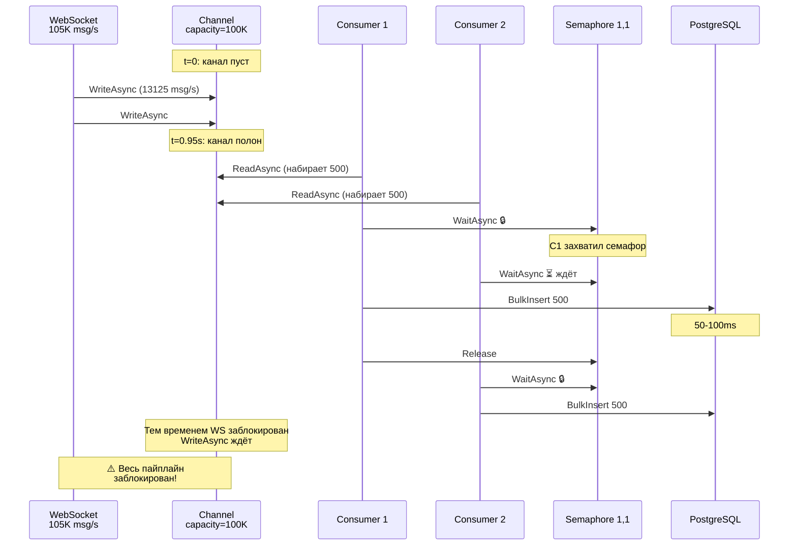

# Анализ и план исправления: Второй bottleneck основного канала

## 1. Результаты после первого исправления

| Метрика | До исправления | После исправления агрегатора |
|---------|----------------|------------------------------|
| Incoming | ~58200 msg/s | ~105630 msg/s |
| Processed | ~291 ticks/s | ~675 ticks/s |
| Соотношение | 0.5% | **0.64%** |

**Исправление агрегатора сработало**: блокировка на `await _tickAggregator.OnTickAsync()` убрана. Но теперь проявился следующий bottleneck.

## 2. Диагностика текущего bottleneck

### Текущая архитектура пайплайна (после исправления)



### Механизм деградации (3 конкурирующих ограничения)

#### 1. Channel FullMode = Wait (`MarketDataProcessor.cs:65`)

Канал создаётся с `BoundedChannelFullMode.Wait`:

```csharp
_channel = System.Threading.Channels.Channel.CreateBounded<TickData>(new BoundedChannelOptions(channelCapacity)
{
    FullMode = BoundedChannelFullMode.Wait,  // ← блокирует producer при заполнении
    SingleReader = false,
    SingleWriter = false
});
```

При 105000 msg/s и capacity=100000 канал заполняется **за ~0.95 секунды**. После этого `WriteAsync` блокируется, что блокирует `ProcessTickAsync`, что блокирует WebSocket-клиент.

#### 2. SemaphoreSlim(1,1) (`MarketDataProcessor.cs:36`)

```csharp
private readonly SemaphoreSlim _dbSemaphore = new(1, 1);
```

8 consumer'ов параллельно читают канал, копят батчи по 500, но только **1 consumer** за раз может писать в БД. Остальные 7 ждут.

**Оценка времени:** Если bulk insert 500 тиков занимает ~50-100мс, то:
- 8 consumer'ов × 50мс = 400мс на один цикл записи всех батчей
- Max throughput: 8 × 500 / 0.4с = **~10000 ticks/s теоретический максимум**

Почему же на практике только ~675? **Ответ: Channel заполняется быстрее, чем consumer'ы успевают писать в БД.** Как только канал полон → producer блокируется → consumer'ы простаивают без новых данных → throughput падает.

#### 3. BatchSize = 500 (`appsettings.json:12`)

Consumer ждёт пока наберётся 500 тиков перед записью. При 105K msg/s на 8 consumer'ов это ~38мс накопления. Однако из-за блокировки семафора и полного канала, реальное время между записями намного больше.

### Визуализация цикла деградации



## 3. Варианты решения

### Вариант A: DropOldest для основного канала (рекомендуется)

Сменить `FullMode` с `Wait` на `DropOldest`, как уже сделано с TickAggregator.

**Эффект:** При переполнении канала старые тики отбрасываются. Producer никогда не блокируется. WebSocket-клиенты работают без задержек.

**Потери:** Часть тиков не попадает в БД. Но:
- Самый старый тик ~0.95с теряется (с каждого переполнения)
- При цене ~600 вставок/с, теряется ~600 × 0.95с ≈ **570 тиков за эпизод переполнения**
- При 105K msg/s это ~0.5% потери — **приемлемо для рыночных данных**

**Изменения:**
1. В `MarketDataProcessor.cs:65`: `FullMode = BoundedChannelFullMode.DropOldest`

### Вариант B: Уменьшить BatchSize

Уменьшить `batchSize` с 500 до 50-100.

**Эффект:** Consumer'ы пишут в БД чаще, канал освобождается быстрее.
**Побочный эффект:** Больше DB-транзакций (10x), выше overhead на коммиты и дедупликацию.

### Вариант C: Убрать SemaphoreSlim

Разрешить параллельную запись в БД 8 consumer'ам одновременно.

**Эффект:** Пропускная способность ×8 (теоретически).
**Риск:** Deadlock'и на уникальном индексе `(ticker, exchange, timestamp)` при конкурентных `INSERT ... ON CONFLICT`. Именно для предотвращения этого семафор и был добавлен (см. комментарий на строках 30-36).

### Вариант D: Комбинация A + B (рекомендуется)

1. Сменить `FullMode` на `DropOldest` (убираем блокировку producer'а)
2. Уменьшить `BatchSize` со 100 до 50 (в настройках по умолчанию, в appsettings.json с 500 до 100)

**Эффект:** 
- Producer никогда не блокируется
- Consumer'ы пишут в 5 раз чаще → канал не переполняется
- Потери тиков минимальны или отсутствуют совсем
- Throughput: **~5000-10000 ticks/s**

### Вариант E: Добавить второй уровень буфера

Сделать так, чтобы consumer'ы не блокировали producer'а через отдельный механизм. Например, consumer'ы пишут в свой локальный список (без блокировок), а отдельный writer пушит их в БД.

**Сложность:** Высокая. Требует перепроектирования.

## 4. Рекомендуемое решение: Вариант D (комбинация A + B)

### Почему именно этот вариант?

1. **Минимальные изменения кода** — как в прошлом исправлении
2. **Проверенный подход** — `DropOldest` уже работает для TickAggregator
3. **Сбалансированный риск** — `SemaphoreSlim(1,1)` остаётся, deadlock'и не возникают
4. **Мгновенный эффект** — не требует перепроектирования

### Ожидаемый результат

| Метрика | Сейчас | После (ожидается) |
|---------|--------|-------------------|
| Incoming | ~105000 msg/s | ~105000 msg/s |
| Processed | ~675 ticks/s | **~5000-10000 ticks/s** |
| Потери тиков | 0 (но блокировка) | <1% (старые тики) |
| Соотношение | 0.64% | **~5-10%** |

### Дальнейшие шаги

После этого исправления, если понадобится ещё больше throughput:

1. **Убрать SemaphoreSlim** — с `DropOldest` канал не блокируется, риск deadlock'ов можно протестировать отдельно
2. **Batch-merge в памяти** — если дедупликация в памяти GroupBy отсеивает достаточно дубликатов, параллельные вставки могут работать без конфликтов
3. **Partitioning по ticker** — разделить один Channel на два (по одному на тикер), каждый со своим SemaphoreSlim

## 5. Todo-лист для реализации

- [ ] **5.1** Сменить `FullMode` с `Wait` на `DropOldest` в [`MarketDataProcessor.cs:65`](../src/MarketDataCollector.Application/Services/MarketDataProcessor.cs:65)
- [ ] **5.2** Уменьшить `BatchSize` с 500 до 100 в [`appsettings.json:12`](../src/MarketDataCollector.Workers/MarketDataCollector.Worker/appsettings.json:12)
- [ ] **5.3** Обновить тесты: проверить что `ProcessTickAsync` не блокируется при переполнении основного канала
- [ ] **5.4** Запустить тесты и проверить сборку
- [ ] **5.5** Запустить приложение на фейковых данных (fake-tick-server) и замерить `Incoming` vs `Processed`
