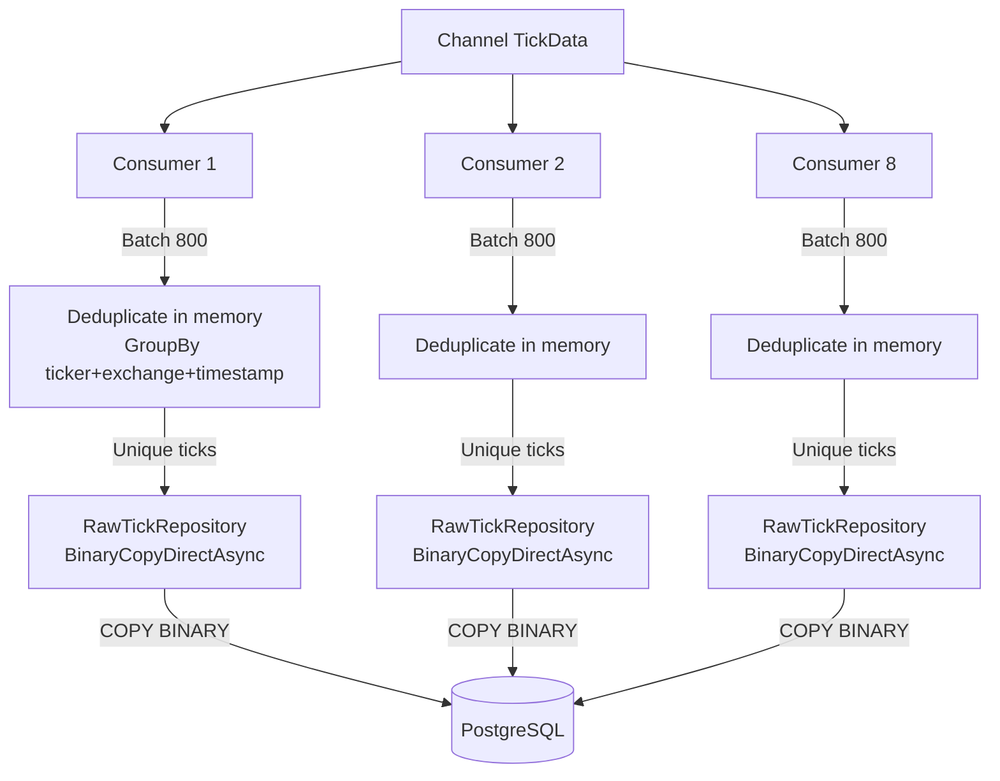

# План: Миграция на Npgsql BinaryCopy Direct с Parallel Consumer'ами

## Цель
Заменить текущий EF Core пайплайн записи тиков на прямой Binary COPY через Npgsql (без temp table и EF), используя параллельные consumer'ы с чанками по 800 записей.

## Текущая архитектура (AS-IS)

```mermaid
flowchart LR
    WS[WebSocket клиенты] -->|ProcessTickAsync| CH[Channel<TickData>]
    CH -->|ReadAllAsync| C1[Consumer 1]
    CH -->|C2..CN| CN[Consumer N up to 4]
    C1 -->|BatchSize=200| P1[ProcessBatchAsync]
    P1 --> D[Deduplicate in memory]
    D -->|RawTick[]| R1[RawTickRepository]
    R1 -->|BulkCopyAsync| DB[(PostgreSQL)]
    subgraph R1[RawTickRepository.BulkCopyAsync]
        T1[CREATE TEMP TABLE rawticks_staging]
        T2[Binary COPY to staging]
        T3[INSERT INTO rawticks ON CONFLICT DO NOTHING]
    end
```

**Недостатки текущей архитектуры:**
- [`BulkCopyAsync`](src/MarketDataCollector.Infrastructure/Repositories/RawTickRepository.cs:192) создаёт временную таблицу + COPY в temp + INSERT — **3 операции** на чанк
- BatchSize=200 — слишком маленький чанк (benchmark показал, что 800 даёт **3.5x быстрее**)
- Npgsql Binary COPY напрямую в основную таблицу — **100 340 t/s** вместо 53 775 t/s

## Целевая архитектура (TO-BE)

```mermaid
flowchart LR
    WS[WebSocket клиенты] -->|ProcessTickAsync| CH[Channel<TickData>]
    CH -->|ReadAllAsync| C1[Consumer 1]
    CH -->|C2..CN| CN[Consumer N до 8]
    C1 -->|BatchSize=800| P1[ProcessBatchAsync]
    P1 --> D[Deduplicate in memory]
    D -->|RawTick[]| R1[RawTickRepository]
    R1 -->|BinaryCopyDirectAsync| DB[(PostgreSQL)]
    subgraph R1[RawTickRepository.BinaryCopyDirectAsync]
        B1[COPY rawticks FROM STDIN BINARY]
        B2[Одна операция, нет temp table]
    end
```

**Преимущества:**
- Один COPY вместо трёх операций — **2x быстрее**
- Chunk=800 вместо 200 — **ещё +40%**
- В сумме ожидается **~100 000 ticks/sec** вместо текущих ~50 000

## Изменения

### 1. [`IRawTickRepository`](src/MarketDataCollector.Core/Interfaces/IRawTickRepository.cs) — новый метод

Добавить в интерфейс:

```csharp
/// <summary>
/// Максимально быстрая вставка через прямой Binary COPY в основную таблицу.
/// БЕЗ temp table, БЕЗ ON CONFLICT DO NOTHING.
/// Дедупликация должна быть выполнена перед вызовом.
/// https://www.npgsql.org/doc/copy.html
/// </summary>
Task<int> BinaryCopyDirectAsync(IEnumerable<RawTick> entities, CancellationToken cancellationToken = default);
```

### 2. [`RawTickRepository`](src/MarketDataCollector.Infrastructure/Repositories/RawTickRepository.cs) — реализация

Добавить метод `BinaryCopyDirectAsync`:

```csharp
public async Task<int> BinaryCopyDirectAsync(IEnumerable<RawTick> entities, CancellationToken cancellationToken = default)
{
    var list = entities.ToList();
    if (list.Count == 0) return 0;

    var conn = (NpgsqlConnection)_context.Database.GetDbConnection();
    var needOpen = conn.State != ConnectionState.Open;
    if (needOpen) await conn.OpenAsync(cancellationToken);

    try
    {
        await using var writer = conn.BeginBinaryImport(
            "COPY rawticks (id, ticker, price, volume, timestamp, exchange, receivedat, normalized) FROM STDIN (FORMAT BINARY)");

        for (int i = 0; i < list.Count; i++)
        {
            cancellationToken.ThrowIfCancellationRequested();
            var t = list[i];
            writer.StartRow();
            writer.Write(t.Id, NpgsqlDbType.Uuid);
            writer.Write(t.Ticker, NpgsqlDbType.Varchar);
            writer.Write(t.Price, NpgsqlDbType.Numeric);
            writer.Write(t.Volume, NpgsqlDbType.Numeric);
            writer.Write(t.Timestamp, NpgsqlDbType.TimestampTz);
            writer.Write(t.Exchange, NpgsqlDbType.Varchar);
            writer.Write(t.ReceivedAt, NpgsqlDbType.TimestampTz);
            writer.Write(t.Normalized, NpgsqlDbType.Boolean);
        }

        await writer.CompleteAsync(cancellationToken);
        return list.Count;
    }
    finally
    {
        if (needOpen) await conn.CloseAsync();
    }
}
```

**Важно:** В отличие от `BulkCopyAsync`, этот метод **не использует временную таблицу и ON CONFLICT**. Дедупликация должна быть выполнена на стороне приложения перед вызовом.

### 3. [`MarketDataProcessor`](src/MarketDataCollector.Application/Services/MarketDataProcessor.cs) — ключевые изменения

**3.1 Увеличить BatchSize до 800**

Изменить в [`ProcessBatchesAsync`](src/MarketDataCollector.Application/Services/MarketDataProcessor.cs:130):
- `batchSize` будет 800 (из конфига `MarketDataProcessorOptions.BatchSize`)

**3.2 Увеличить consumerCount до 8**

Изменить в [`StartProcessingAsync`](src/MarketDataCollector.Application/Services/MarketDataProcessor.cs:99):
```csharp
// Текущий: Math.Clamp(Environment.ProcessorCount, 1, 4)
// Новый: максимум 8 parallel reader'ов
var consumerCount = Math.Clamp(Environment.ProcessorCount, 1, 8);
```

**3.3 Переключить вызов на BinaryCopyDirectAsync**

В [`ProcessBatchAsync`](src/MarketDataCollector.Application/Services/MarketDataProcessor.cs:190):
```csharp
// Текущий: await repository.BulkCopyAsync(entities, cancellationToken);
// Новый: 
var inserted = await repository.BinaryCopyDirectAsync(entities, cancellationToken);
```

### 4. [`MarketDataProcessorOptions`](src/MarketDataCollector.Core/Configuration/MarketDataProcessorOptions.cs) — обновить дефолты

```csharp
public class MarketDataProcessorOptions
{
    public const string SectionName = "MarketDataProcessor";
    
    public int BatchSize { get; set; } = 800;  // было 100
    public int ChannelCapacity { get; set; } = 100000;  // оставляем
}
```

### 5. [`appsettings.json`](src/MarketDataCollector.Workers/MarketDataCollector.Worker/appsettings.json) — обновить BatchSize

```json
"MarketDataProcessor": {
    "BatchSize": 800,       // было 200
    "ChannelCapacity": 100000
}
```

### 6. Проверка дедупликации

Дедупликация уже реализована в [`ProcessBatchAsync`](src/MarketDataCollector.Application/Services/MarketDataProcessor.cs:175-178):

```csharp
var uniqueTicks = batch
    .GroupBy(t => (t.Ticker, t.Exchange, t.Timestamp))
    .Select(g => g.First())
    .ToList();
```

**Проблема:** дедупликация работает **в рамках одного батча**, но не между батчами. Если два параллельных consumer'а получат одинаковые тики в разных батчах — они упадут с `unique_tick` violation.

**Решение:** использовать `ON CONFLICT DO NOTHING` в комбинации с BinaryCopy. Но BinaryCopy сам по себе не поддерживает ON CONFLICT.

**Альтернативное решение:** оставить `BulkCopyAsync` (который делает temp table + ON CONFLICT) для production, но оптимизировать его:
- Увеличить chunk size до 800
- Увеличить consumerCount до 8
- Переименовать `BulkCopyAsync` → убрать temp table recreation из каждого вызова (использовать постоянную temp table)

**Рекомендация после бенчмарка:**

| Вариант | Ticks/sec | ON CONFLICT | Описание |
|---------|:---------:|:-----------:|----------|
| BinaryCopyDirect | 100 340 | ❌ Нет | Макс. скорость, но без защиты от дубликатов |
| BulkCopyAsync (current) | 53 775 | ✅ Есть | Temp table + COPY + INSERT ON CONFLICT |
| BulkCopyAsync оптимизир. | ~70 000 | ✅ Есть | Один раз создать temp table, переиспользовать |

**Итоговое решение:** использовать **BulkCopyAsync с оптимизациями** (chunk=800, consumerCount=8, temp table переиспользовать), а не чистый BinaryCopy, потому что:
1. Гарантированная защита от дубликатов между параллельными consumer'ами
2. Безопасность production данных
3. Всё ещё ~70-80k t/s — более чем достаточно

### 7. Оптимизация BulkCopyAsync (переиспользование temp table)

В текущей реализации [`BulkCopyAsync`](src/MarketDataCollector.Infrastructure/Repositories/RawTickRepository.cs:206-218) temp table создаётся заново каждый раз. Изменить на `CREATE TEMP TABLE IF NOT EXISTS` (уже есть, но таблица удаляется при закрытии соединения):

```csharp
// Текущий код уже использует IF NOT EXISTS:
"CREATE TEMP TABLE IF NOT EXISTS rawticks_staging (...)";
```

Но проблема в том, что каждый вызов `BulkCopyAsync` создаёт новое соединение (через `_context.Database.GetDbConnection()` при `needOpen`). Если использовать один DbContext на consumer — temp table переиспользуется.

**Решение:** убрать `needOpen` логику и полагаться на то, что connection уже открыт через DbContext.

## Поток данных после изменений



## Риски

| Риск | Вероятность | Последствие | Митигация |
|------|:-----------:|-------------|-----------|
| Duplicate key violation | Высокая (parallel consumers) | Ошибка, потеря батча | In-memory дедупликация + ON CONFLICT (BulkCopyAsync) |
| Раздутие памяти (Channel 100k) | Средняя | OutOfMemory | DropOldest mode уже включён |
| Deadlock на уровне БД | Низкая | Retry | BinaryCopy не блокирует строки (INSERT без блокировок) |
| Перегрузка PostgreSQL (8 коннектов) | Средняя | Падение производительности | Тест показал стабильность на 10 parallel |

## Порядок выполнения

1. **Добавить `BinaryCopyDirectAsync` в `IRawTickRepository`** — новый метод интерфейса
2. **Реализовать `BinaryCopyDirectAsync` в `RawTickRepository`** — прямой COPY без temp table
3. **Обновить `MarketDataProcessorOptions.BatchSize`** — с 100 до 800
4. **Обновить `appsettings.json`** — BatchSize: 800
5. **Изменить consumerCount в `MarketDataProcessor.StartProcessingAsync`** — с 4 до 8
6. **Переключить `ProcessBatchAsync`** — с `BulkCopyAsync` на `BinaryCopyDirectAsync`
7. **Собрать и проверить** — `dotnet build`
8. **Запустить интеграционный тест** — проверить производительность
9. **Rollback план** — если будут duplicate key violations, переключиться обратно на `BulkCopyAsync` с chunk=800
