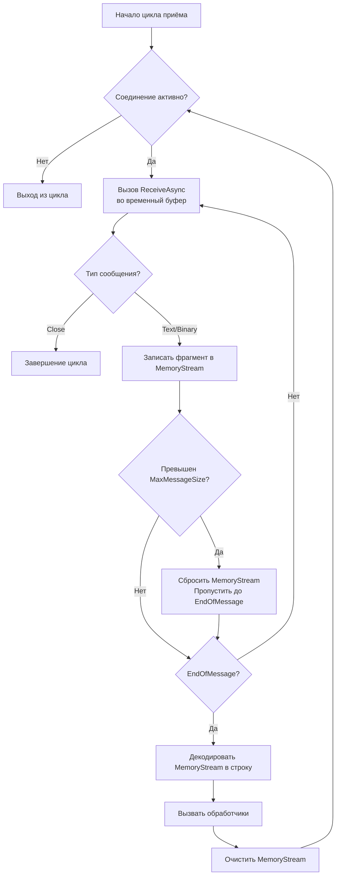

# План рефакторинга WebSocketMessageReceiver для динамического буфера

## Текущая проблема

В классе `WebSocketMessageReceiver` (файл `src/MarketDataCollector.Core/Clients/WebSocketMessageReceiver.cs`) используется фиксированный буфер размера `ReceiveBufferSize` (по умолчанию 4096 байт). Логика приёма сообщений имеет следующие недостатки:

1. **Потеря фрагментов сообщений**: При фрагментированных сообщениях каждый вызов `ReceiveAsync` перезаписывает буфер, так как используется один и тот же массив без смещения. Данные предыдущих фрагментов теряются, что делает невозможным сборку полного сообщения.

2. **Некорректная проверка размера**: Проверка `if (totalReceived > _options.ReceiveBufferSize)` срабатывает только при получении конечного фрагмента (`EndOfMessage`). Если сообщение превышает размер буфера, оно пропускается, но фрагменты уже потеряны.

3. **Отсутствие поддержки больших сообщений**: Нет механизма динамического увеличения буфера для сообщений, размер которых превышает `ReceiveBufferSize`.

## Цель рефакторинга

Изменить логику накопления фрагментов так, чтобы:
- Сохранять все фрагменты сообщения в динамически расширяемом буфере.
- Обрабатывать сообщения любого размера (в пределах разумного лимита).
- Эффективно управлять памятью (использовать `ArrayPool` и `MemoryStream`).

## Предлагаемые изменения

### 1. Добавление конфигурационного параметра `MaxMessageSize`

В класс `WebSocketClientOptions` добавить свойство, определяющее максимальный допустимый размер одного сообщения (в байтах). Это предотвратит потребление неограниченной памяти при получении очень больших сообщений.

```csharp
public class WebSocketClientOptions
{
    // ...
    /// <summary>
    /// Максимальный размер одного сообщения (в байтах).
    /// Если сообщение превышает этот размер, оно отбрасывается.
    /// По умолчанию: 1 МБ (1_048_576 байт).
    /// </summary>
    public int MaxMessageSize { get; set; } = 1_048_576;
}
```

### 2. Рефакторинг метода `StartReceiveLoopAsync`

Заменить текущую логику с фиксированным буфером на использование `MemoryStream` для накопления фрагментов.

#### Алгоритм:



#### Ключевые моменты реализации:

- **Временный буфер**: Использовать `ArrayPool<byte>.Shared` для аренды буфера размера `ReceiveBufferSize`. Это снизит нагрузку на GC.
- **MemoryStream**: Создать `MemoryStream` с начальной ёмкостью `ReceiveBufferSize`. При необходимости ёмкость будет увеличиваться автоматически.
- **Проверка размера**: После записи каждого фрагмента проверять, не превысил ли `MemoryStream.Length` значение `MaxMessageSize`. Если превысил, сбросить `MemoryStream` и игнорировать последующие фрагменты до получения `EndOfMessage`.
- **Декодирование**: После получения `EndOfMessage` преобразовать содержимое `MemoryStream` в строку с помощью `Encoding.UTF8.GetString(stream.GetBuffer(), 0, (int)stream.Length)`.
- **Очистка**: После обработки сообщения очистить `MemoryStream` с помощью `stream.SetLength(0)` для повторного использования (или создать новый экземпляр).

### 3. Обработка ошибок и логирование

- Сохранить существующие обработчики ошибок (`onError`).
- Добавить логирование при отбрасывании слишком большого сообщения.
- Убедиться, что исключения не приводят к утечкам ресурсов (буфер из `ArrayPool` должен быть возвращён).

### 4. Удаление устаревшего кода

Удалить переменную `totalReceived` и связанную с ней проверку размера буфера.

## Зависимости

- **WebSocketClientOptions**: Необходимо обновить конфигурацию и, возможно, файлы `appsettings.json` в проектах, использующих эту библиотеку.
- **Тесты**: Если существуют unit-тесты для `WebSocketMessageReceiver`, их нужно обновить в соответствии с новой логикой.
- **Другие клиенты**: Классы, наследующие `BaseWebSocketClient`, не требуют изменений, так как интерфейс `IWebSocketMessageReceiver` остаётся неизменным.

## План выполнения

1. **Добавить свойство `MaxMessageSize` в `WebSocketClientOptions`**.
   - Файл: `src/MarketDataCollector.Core/Configuration/WebSocketClientOptions.cs`
   - Обновить XML-документацию.

2. **Реализовать новый алгоритм в `WebSocketMessageReceiver.StartReceiveLoopAsync`**.
   - Использовать `ArrayPool<byte>.Shared` для временного буфера.
   - Использовать `MemoryStream` для накопления.
   - Добавить проверку на `MaxMessageSize`.
   - Обеспечить корректную обработку фрагментированных сообщений.

3. **Удалить старую логику**.
   - Убрать переменную `totalReceived`.
   - Убрать проверку `if (totalReceived > _options.ReceiveBufferSize)`.

4. **Протестировать изменения**.
   - Запустить существующие тесты.
   - При необходимости добавить новые тесты для проверки обработки больших и фрагментированных сообщений.

5. **Обновить конфигурацию по умолчанию**.
   - В `appsettings.json` проектов-потребителей можно добавить значение `MaxMessageSize` (опционально).

## Оценка рисков

- **Производительность**: Использование `MemoryStream` и `ArrayPool` должно минимизировать аллокации. Однако динамическое увеличение буфера может привести к фрагментации памяти при очень больших сообщениях. Лимит `MaxMessageSize` предотвратит неконтролируемый рост.
- **Обратная совместимость**: Изменение поведения класса может повлиять на работу существующих клиентов, если они полагались на пропуск больших сообщений. Однако это исправление ошибки, поэтому оно считается корректным.
- **Конфигурация**: Добавление нового параметра не сломает существующую конфигурацию, так как используется значение по умолчанию.

## Заключение

Предложенный рефакторинг устраняет критическую ошибку потери фрагментов сообщений и добавляет поддержку динамического буфера. Реализация сохраняет обратную совместимость на уровне интерфейсов и улучшает надёжность приёма данных через WebSocket.

После утверждения плана можно перейти к реализации в режиме **💻 Code**.