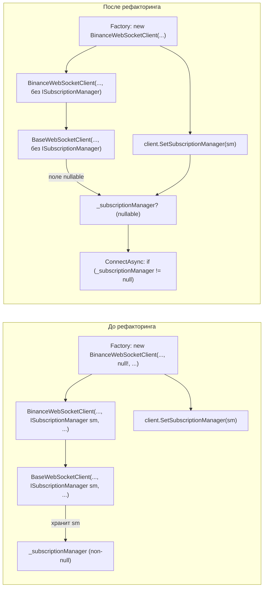

# План рефакторинга: удаление `null!` для `ISubscriptionManager`

## Проблема

В [`WebSocketClientFactory.CreateBinanceClient`](src/MarketDataCollector.Infrastructure/Factories/WebSocketClientFactory.cs:56-67) параметр `subscriptionManager` передаётся как `null!` в конструктор [`BinanceWebSocketClient`](src/MarketDataCollector.Infrastructure/Clients/BinanceWebSocketClient.cs:23-39), который пробрасывает его в [`BaseWebSocketClient`](src/MarketDataCollector.Core/Clients/BaseWebSocketClient.cs:78-102).

**Причина:** циклическая зависимость:
- `BinanceWebSocketClient` требует `ISubscriptionManager` в конструкторе
- `SubscriptionManager` требует делегат `client.SubscribeToTicker` в конструкторе
- Ни один из объектов не может быть создан первым

**Текущее решение:** двухфазная инициализация — `null!` в конструкторе, затем [`SetSubscriptionManager`](src/MarketDataCollector.Core/Clients/BaseWebSocketClient.cs:109-112) после создания обоих объектов.

## План рефакторинга (Вариант B)

Убрать `ISubscriptionManager` из конструкторов, сделать поле nullable, оставить `SetSubscriptionManager` для второй фазы инициализации.

### Изменения по файлам

---

### 1. [`BaseWebSocketClient.cs`](src/MarketDataCollector.Core/Clients/BaseWebSocketClient.cs)

**Строка 31:** Поле `_subscriptionManager` — изменить с `private ISubscriptionManager _subscriptionManager;` на `private ISubscriptionManager? _subscriptionManager;`

**Строки 78-87 (конструктор):** Убрать параметр `ISubscriptionManager subscriptionManager` и вызов `base(...)` для него.

**Строка 92:** Убрать строку `_subscriptionManager = subscriptionManager ?? throw new ArgumentNullException(nameof(subscriptionManager));`

**Строка 129 (`ConnectAsync`):** Добавить null-проверку перед `_subscriptionManager.SubscribeWithRetryAsync(...)`:
```csharp
if (_subscriptionManager != null)
    await _subscriptionManager.SubscribeWithRetryAsync(Symbol, cancellationToken);
```

**Строки 66-77 (XML-документация конструктора):** Убрать упоминание параметра `subscriptionManager`.

---

### 2. [`BinanceWebSocketClient.cs`](src/MarketDataCollector.Infrastructure/Clients/BinanceWebSocketClient.cs)

**Строки 23-35 (конструктор):** Убрать параметр `ISubscriptionManager subscriptionManager` и соответствующий аргумент в вызове `base(...)`.

---

### 3. [`WebSocketClientFactory.cs`](src/MarketDataCollector.Infrastructure/Factories/WebSocketClientFactory.cs)

**Строка 65:** Заменить `null!` на удаление параметра из вызова конструктора.

---

### 4. [`BaseWebSocketClient-refactor.md`](plans/BaseWebSocketClient-refactor.md)

Обновить существующий план рефакторинга, если он ссылается на `ISubscriptionManager` в конструкторе.

---

## Диаграмма изменений



## Риски

| Риск | Вероятность | Митигация |
|------|------------|-----------|
| Забыли вызвать `SetSubscriptionManager` до `ConnectAsync` | Низкая | `ConnectAsync` вызывается только из `RunBackgroundRecoveryLoopAsync`, который запускается после полной инициализации в фабрике |
| Другой наследник `BaseWebSocketClient` тоже передаёт `null!` | Низкая | Сейчас только `BinanceWebSocketClient` наследует `BaseWebSocketClient` |
| `_subscriptionManager` остался `null` при вызове `ConnectAsync` | Средняя | Добавлена null-проверка; если `null` — подписка не выполнится, но соединение установится |

## Проверка после рефакторинга

1. `dotnet build` — без ошибок и предупреждений
2. Убедиться, что `null!` нигде не используется
3. Убедиться, что `SetSubscriptionManager` вызывается до первого `ConnectAsync`