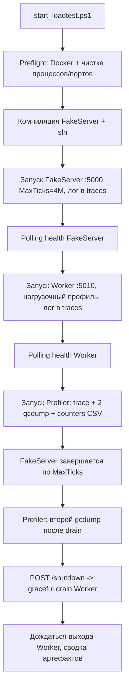

# План: однокнопочный нагрузочный прогон (FakeServer → Worker → Profiler)

## Цель

Свести запуск нагрузочного тестирования с профилированием к **одной кнопке**,
собрать все артефакты (trace, 2× gcdump, counters CSV, логи) и обеспечить
**корректное (graceful) завершение** всех трёх сервисов.

## Выбранный сценарий прогона

1. `FakeTickServer` генерирует тики до достижения `MaxTicks` (по умолчанию 4M),
   затем **сам корректно завершается** (`exit 0`).
2. `MarketDataCollector.Worker` продолжает **дренажить** очередь (копившиеся
   данные) — это и есть фаза «drain» для второго gcdump.
3. Оркестратор по завершении/сигналу останавливает Worker через новый
   HTTP-endpoint `/shutdown`, который триггерит graceful `StopApplication()` →
   `CleanupAsync()` (клиенты → агрегатор → процессор с финальным flush).
4. Все три запуска объединяются в одном мастер-скрипте с редиректом логов.

## Схема

## Задачи реализации

### Задача 1. Мастер-оркестратор `start_loadtest.ps1`

**Файл:** `start_loadtest.ps1` (новый, в корне).

**Поведение:**
- Preflight:
  - Проверка `docker info` (Postgres/Kafka нужны для Worker). Если Docker нет —
    предупреждение и продолжение при `Kafka.Enabled=false`.
  - Очистка остатков: `taskkill /F /IM FakeTickServer.exe`, `MarketDataCollector.Worker.exe`,
    `dotnet-trace` (при необходимости), с паузой `Start-Sleep 2`.
- Компиляция: `dotnet build tests/FakeTickServer`, затем `dotnet build MarketDataCollector.sln`.
  При `$LASTEXITCODE -ne 0` — abort с кодом 1.
- Запуск `FakeTickServer` через `Start-Process` (фоново) с `--port 5000 --rps 25000
  --symbols btcusdt,ethusdt,solusdt --max-ticks 4000000 --dup-percent 3`,
  редирект `stdout/stderr` в `traces/fake_server_out.log` / `fake_server_err.log`.
- Polling готовности FakeServer: GET `http://localhost:5000/health` до «active/idle»
  (до 30с).
- Запуск `Worker` через `Start-Process dotnet run -c Debug` с **нагрузочным профилем
  конфига** (см. Задачу 4), редирект логов в `traces/worker_out.log` / `worker_err.log`.
- Polling готовности Worker: GET `http://localhost:5010/health` до HTTP 200 (до 60с).
- Запуск `run_all_profiler.ps1` (foreground, чтобы дождаться артефактов). Возможна
  передача `-TraceDuration`, `-GcDumpAtPeakSec`, `-OutputDir`.
- После выхода Profiler:
  - Ожидание самозавершения FakeServer (по `MaxTicks`), с таймаутом.
  - POST `http://localhost:5010/shutdown` (graceful drain Worker).
  - `WaitForExit` Worker (таймаут ~60с), при зависании — `taskkill`.
- Итоговая сводка: список файлов в `traces/` (nettrace, speedscope, gcdump×2,
  counters CSV, логи), их размеры, общее время.

**Параметры скрипта** (`param`):
`[int]$MaxTicks = 4000000`, `[int]$Rps = 25000`, `[string]$Symbols = "btcusdt,ethusdt,solusdt"`,
`[int]$DupPercent = 3`, `[string]$TraceProfile = "gc-verbose"`, `[int]$TraceDuration = 90`,
`[int]$GcDumpAtPeakSec = 50`, `[string]$OutputDir = "./traces"`.

**Риски:** Worker без Kafka должен запускаться при `Kafka.Enabled=false` (уже дефолт);
нужен Docker с Postgres на `5433` (см. `docker/docker-compose.yml`).

### Задача 2. HTTP-endpoint `/shutdown` в Worker

**Файл:** `src/MarketDataCollector.Workers/MarketDataCollector.Worker/Program.cs`.

- Инжектнуть `IHostApplicationLifetime` в эндпоинт.
- Добавить `app.MapPost("/shutdown", ...)`, вызывающий `appLifetime.StopApplication()`.
- В Production защитить токеном (внутри уже есть middleware для `/health` и `/metrics`
  — добавить `/shutdown` в `protectedPaths`). В Development токен пустой — доступ открыт.
- Ответ: `202 Accepted` до остановки хоста.
- Механизм: `StopApplication()` отменяет `stoppingToken` в
  [`Worker.ExecuteAsync`](src/MarketDataCollector.Workers/MarketDataCollector.Worker/Worker.cs:25),
  что запускает graceful `CleanupAsync` ([`Worker.cs`](src/MarketDataCollector.Workers/MarketDataCollector.Worker/Worker.cs:123)).

**DoD:** `Invoke-RestMethod -Method Post http://localhost:5010/shutdown` корректно
останавливает Worker, каналы дочитываются, финальный flush в БД выполнен.

### Задача 3. Самозавершение FakeTickServer по MaxTicks

**Файлы:** `tests/FakeTickServer/TickGeneratorService.cs`, `tests/FakeTickServer/Program.cs`.

- В [`ExecuteAsync`](tests/FakeTickServer/TickGeneratorService.cs:166) при достижении
  `_isLimitReached` — вместо «sleep 1с и продолжать» завершить хост:
  `_hostApplicationLifetime.StopApplication()` (или `Environment.Exit(0)`).
- Лучший вариант: в `Program.cs` зарегистрировать `IHostApplicationLifetime` и
  передать сервису сигнал; в `ExecuteAsync` после логирования лимита вызвать
  `StopApplication()` и выйти из цикла.
- Опционально: добавить `app.MapPost("/shutdown", ...)` на FakeServer для
  управляемой остановки из оркестратора (запасной путь, если MaxTicks не задан).

**DoD:** при `--max-ticks 4000000` сервер сам корректно завершается с кодом 0,
WebSocket-клиенты получают NormalClosure, лог содержит «Достигнут лимит тиков».

### Задача 4. Нагрузочный профиль конфига Worker

**Файл:** `src/MarketDataCollector.Workers/MarketDataCollector.Worker/appsettings.LoadTest.json`
(новый) — запускается через `--environment LoadTest` или `dotnet run --environment`.

- `ExchangeOptions.Exchanges`: оба клиента (`binance`, `binance2`) → `ws://localhost:5000/ws/{symbol}@trade`
  (никаких реальных бирж).
- `Readers`: 3 символа (btcusdt, ethusdt, solusdt) на `binance`.
- `Kafka.Enabled=false` (уже дефолт) — свечи напрямую в БД.
- `OpenTelemetry.OtlpEndpoint`: оставить, но проверить, что OTLP-коллектор необязателен
  (иначе `OtlpEndpoint="http://localhost:18889"` вызовет ошибки при его отсутствии —
  при необходимости сделать `OtlpExportProtocol` отключаемым или пометить необязательным).
- Остальное — по текущим значениям производительности (`MarketDataProcessor` батчинг).

**DoD:** прогон полностью идёт на локальный FakeServer без обращений к binance/Kafka.
Запуск: `dotnet run --environment LoadTest`.

### Задача 5. VS Code задача «Run Load Test»

**Файл:** `.vscode/tasks.json` (создать).

- Задача `shell` (PowerShell), команда `.\start_loadtest.ps1`.
- Опции: `presentation.reveal=always`, `problemMatcher=[]`.
- Обеспечивает запуск одной кнопкой (Ctrl+Shift+B / Task Runner).

**DoD:** нажатие «Run Load Test» в VS Code запускает весь прогон.

### Задача 6. Логи и сводка артефактов

- Рекомендуется уже внутри Задачи 1 (режим `Start-Process -RedirectStandardOutput`).
- Файлы логов: `traces/fake_server_out.log`, `fake_server_err.log`,
  `traces/worker_out.log`, `worker_err.log`.
- Сводка печатает пути и размеры: `allocation_trace_*.nettrace`,
  `*.speedscope.json`, `snapshot_peak_*.gcdump`, `snapshot_drained_*.gcdump`,
  `counters_*.csv`, `profiling_report_*.md`, логи.
- Кодировка: `chcp 65001` и обёртка `cmd /c` для кириллицы (правило проекта).

### Задача 7. Документация

**Файлы:** `README.md`, `DEPLOYMENT.md`.

- Раздел «Нагрузочное тестирование одной кнопкой»: запуск, параметры, где
  артефакты, как проанализировать counters (ссылка на skill `metrics-analysis`).

## Порядок выполнения

1. Задача 2 (endpoint Worker) — безопасна, не зависит от остального.
2. Задача 3 (самозавершение FakeServer).
3. Задача 4 (профиль LoadTest).
4. Задача 1 (оркестратор) — использует 2,3,4.
5. Задача 5 (tasks.json).
6. Задача 6 (частично в Задаче 1, проверить).
7. Задача 7 (документация).

## Критерии приёмки

- `.\start_loadtest.ps1` с нуля: Docker → FakeServer → Worker → Profiler → корректное
  завершение всех трёх, код 0.
- `traces/` содержит nettrace, speedscope, gcdump×2, counters CSV, логи.
- Worker завершается graceful (в логе «Worker stopped.», каналы дочитаны).
- Профиль `LoadTest` не обращается к реальной бирже/Kafka.
