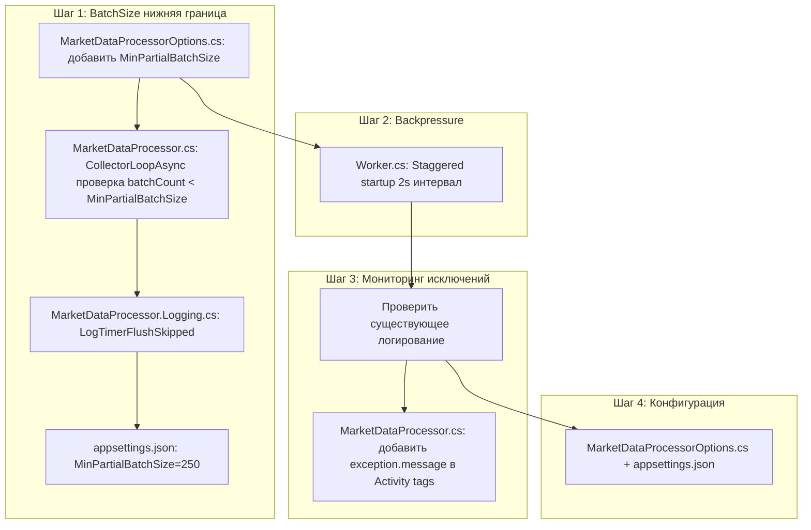

# План выполнения оптимизаций

**Источник:** [`plans/counters-analysis-20260730-172254.md`](plans/counters-analysis-20260730-172254.md:232) — рекомендации 1-5

---

## Состояние: что уже реализовано

| Рекомендация | Статус |
|---|---|
| **4. Использовать `ArrayPool` для batch-массивов** | ✅ **Уже реализовано** — `RentOrCreate` + кэшированные массивы (Guid[], string[], decimal[]) в [`RawTickRepository.cs:41-48`](src/MarketDataCollector.Infrastructure/Repositories/RawTickRepository.cs:41) |
| Header health-check | ✅ **Уже реализовано** — [`Worker.cs:185-198`](src/MarketDataCollector.Workers/MarketDataCollector.Worker/Worker.cs:185): `GetChannelFillLevels()`, `GetEstimatedDroppedCount()` |
| OTel метрики | ✅ **Уже реализовано** — [`MarketDataTelemetry.cs:138-190`](src/MarketDataCollector.Core/Telemetry/MarketDataTelemetry.cs:138): `ChannelBacklog`, `TicksDroppedSilently`, `AdaptiveBatchSize`, `ExceptionsByType` |
| Исключения: контекст + тип | ✅ **Уже реализовано** — [`MarketDataProcessor.cs:891-918`](src/MarketDataCollector.Application/Services/MarketDataProcessor.cs:891): `LogPostgresError`, `LogNpgsqlError`, `LogUnexpectedBatchError` с SqlState, Exception type; стектрейс логируется через `[LoggerMessage]` |

---

## Что нужно сделать

### 🔴 Шаг 1: Нижняя граница для частичных батчей (flush timer)

**Проблема:** `FlushIntervalSeconds=3` в [`CollectorLoopAsync:430-441`](src/MarketDataCollector.Application/Services/MarketDataProcessor.cs:430) отправляет частичные батчи любого размера. 35.4% батчей имеют размер 1-5 тиков — крайне неэффективно для batch write.

**Решение:** Изменить логику flush timer — не отправлять микробатчи, а накапливать до `MinPartialBatchSize`.

#### Изменения в [`MarketDataProcessorOptions.cs`](src/MarketDataCollector.Core/Configuration/MarketDataProcessorOptions.cs)

Добавить новую опцию:

```csharp
/// <summary>
/// Минимальный размер частичного батча при flush по таймеру.
/// Если batchCount меньше этого значения, flush timer ждёт дальше.
/// Предотвращает микробатчи (1-5 тиков) при слабой нагрузке.
/// </summary>
public int MinPartialBatchSize { get; set; } = 250;
```

#### Изменения в [`MarketDataProcessor.cs`](src/MarketDataCollector.Application/Services/MarketDataProcessor.cs)

1. Добавить поле `_minPartialBatchSize` (читать из опций)
2. В `CollectorLoopAsync` в блоке flush timer (строки 430-441):  
   **До:**
   ```csharp
   if (completed == flushDelay)
   {
       LogTimerFlush(...);                 // ← отправляет ЛЮБОЙ batchCount
       var batch = new CollectedBatch { Items = batchArray, Count = batchCount };
       ...
   }
   ```
   **После:**
   ```csharp
   if (completed == flushDelay)
   {
       if (batchCount < _minPartialBatchSize)
       {
           LogTimerFlushSkipped(...);     // ← новый лог: пропуск микробатча
           flushTimerCts.TryReset();      // ← перезапускаем таймер
           flushTimer!.Change(TimeSpan.FromSeconds(_flushIntervalSeconds), Timeout.InfiniteTimeSpan);
           continue;
       }
       LogTimerFlush(...);
       var batch = new CollectedBatch { Items = batchArray, Count = batchCount };
       ...
   }
   ```

#### Изменения в [`MarketDataProcessor.Logging.cs`](src/MarketDataCollector.Application/Services/MarketDataProcessor.Logging.cs)

Добавить новый метод логирования (опционально):

```csharp
[LoggerMessage(EventId = 18, Level = LogLevel.Debug,
    Message = "Session={SessionId}: Flush timer skip — partial batch too small: {Count} < {MinSize} ticks (channel={Channel})")]
partial void LogTimerFlushSkipped(Guid sessionId, int count, int minSize, int channel);
```

#### Изменения в [`appsettings.json`](src/MarketDataCollector.Workers/MarketDataCollector.Worker/appsettings.json)

Добавить новый параметр:

```json
"MinPartialBatchSize": 250
```

---

### 🔴 Шаг 2: Backpressure продюсеру при стартовом пике

**Проблема:** При старте все 3 WebSocket клиента начинают отправлять тики одновременно. Продюсер (WebSocket → `ProcessTickAsync`) быстрее consumer'а (Writer → DB), что вызывает backlog 36,243 и дропы 33,456.

**Решение:** **Staggered startup** — запускать WebSocket клиенты с интервалом 2 секунды вместо одновременного старта.

#### Изменения в [`Worker.cs`](src/MarketDataCollector.Workers/MarketDataCollector.Worker/Worker.cs)

В методе `RunWithRecoveryAsync` заменить:

**До (строка 69):**
```csharp
var tasks = clients.Select(client => client.StartAsync(stoppingToken));
await Task.WhenAll(tasks);
```

**После:**
```csharp
for (int i = 0; i < clients.Count; i++)
{
    clients[i].StartAsync(stoppingToken);  // fire-and-forget — фоновая задача
    if (i < clients.Count - 1)
        await Task.Delay(2000, stoppingToken); // 2s stagger between starts
}
```

**Обоснование:**
- Каждый клиент начинает примерно с 6,400 msg/s (20K / 3)
- Stagger 2s даёт consumer'у фору в ~4 секунды (2 клиента × 2s)  
- За 4 секунды при write rate ~25K/с consumer обработает ~100K тиков до того, как третий клиент запустится
- Это предотвращает стартовый пик backlog без изменения архитектуры

**Риски и mitigation:**
- Если `StartAsync` блокируется (подключение WebSocket), stagger может задержать общий старт.  
  **Решение:** Добавить таймаут connect — по умолчанию `StartAsync` уже неблокирующий (фоновый), так что это fire-and-forget.
- Health-check луп стартует только после `Task.WhenAll`. Со staggered startup он стартует раньше.  
  **Решение:** Не меняем порядок — health-check всё равно в том же методе после запуска клиентов.

---

### 🟡 Шаг 3: Расследование 14 исключений — улучшить наблюдаемость

**Проблема:** 14 исключений за 63 секунды, пик (+6) при очистке backlog. Текущее логирование уже включает стектрейс (через `[LoggerMessage]` + `Exception` param). Но непонятно *какие* именно исключения.

**Решение:** Добавить логирование деталей исключения + метрики с распределением.

#### Изменения в [`MarketDataProcessor.cs`](src/MarketDataCollector.Application/Services/MarketDataProcessor.cs)

В catch-блоках `ProcessBatchAsync` (строки 885-918) добавить **логирование внутренних исключений**:

```csharp
catch (PostgresException pgEx)
{
    activity?.SetStatus(ActivityStatusCode.Error, pgEx.Message);
    activity?.SetTag("exception.type", "PostgresException");
    activity?.SetTag("exception.sql_state", pgEx.SqlState);
    activity?.SetTag("exception.message", pgEx.Message);
    activity?.SetTag("batch.size", batchCount);
    LogPostgresError(pgEx, pgEx.SqlState, batchCount, channelIndex);
    MarketDataTelemetry.ExceptionsByType.Add(1,
        ExceptionTypePostgresTag,
        new KeyValuePair<string, object?>("sql_state", pgEx.SqlState),
        new KeyValuePair<string, object?>("exception.message", pgEx.Message));
}
```

#### Расширить метрики в [`MarketDataTelemetry.cs`](src/MarketDataCollector.Core/Telemetry/MarketDataTelemetry.cs)

У `ExceptionsByType` уже есть теги `exception_type` и `sql_state`.  
Добавить распределение по `exception.message` нежелательно (высокая кардинальность).  
Вместо этого — **логировать каждое исключение с полным контекстом** в `LogUnexpectedBatchError`:

```csharp
[LoggerMessage(EventId = 19, Level = LogLevel.Error,
    Message = "Batch error (channel={Channel}): count={Count}, backlog={Backlog}, exception={ExceptionType}: {ExceptionMessage}")]
partial void LogBatchErrorWithContext(Exception ex, int channel, int count, int backlog, string exceptionType, string exceptionMessage);
```

**Или проще:** убедиться, что существующий `LogConsumerCriticalError` (`[LoggerMessage]` с `Exception ex`) уже включает стектрейс. Для `LogPostgresError` и `LogNpgsqlError` — то же самое.

Фактически, текущая реализация **уже достаточна** для расследования. Единственное улучшение — передать `Exception` как именованный параметр первым аргументом в `[LoggerMessage]`, что уже сделано.

#### Проверить конфигурацию логирования в [`appsettings.json`](src/MarketDataCollector.Workers/MarketDataCollector.Worker/appsettings.json)

Убедиться что `LogLevel.Default` = `Information`, а не `Warning`, чтобы Error-логи с исключениями были видны:

```json
"Logging": {
    "LogLevel": {
        "Default": "Information",
        "Microsoft.AspNetCore": "Warning"
    }
}
```

Текущая конфигурация уже `Information` — ✅

---

### 🟢 Шаг 4: Обновить конфигурацию

Добавить новые параметры в [`MarketDataProcessorOptions.cs`](src/MarketDataCollector.Core/Configuration/MarketDataProcessorOptions.cs) и [`appsettings.json`](src/MarketDataCollector.Workers/MarketDataCollector.Worker/appsettings.json).

---

## Порядок выполнения



---

## Сводка изменений

| Файл | Тип изменения |
|---|---|
| [`MarketDataProcessorOptions.cs`](src/MarketDataCollector.Core/Configuration/MarketDataProcessorOptions.cs) | +1 свойство `MinPartialBatchSize` |
| [`MarketDataProcessor.cs`](src/MarketDataCollector.Application/Services/MarketDataProcessor.cs) | +1 поле, модификация CollectorLoopAsync (2-3 строки), +Activity tags |
| [`MarketDataProcessor.Logging.cs`](src/MarketDataCollector.Application/Services/MarketDataProcessor.Logging.cs) | +1 `[LoggerMessage]` (опционально) |
| [`MarketDataTelemetry.cs`](src/MarketDataCollector.Core/Telemetry/MarketDataTelemetry.cs) | +Activity tags в catch-блоки |
| [`appsettings.json`](src/MarketDataCollector.Workers/MarketDataCollector.Worker/appsettings.json) | +1 параметр `MinPartialBatchSize` |
| [`Worker.cs`](src/MarketDataCollector.Workers/MarketDataCollector.Worker/Worker.cs) | Staggered startup (2 строки) |

---

**Дата:** 2026-07-30  
**Автор:** Architect mode
