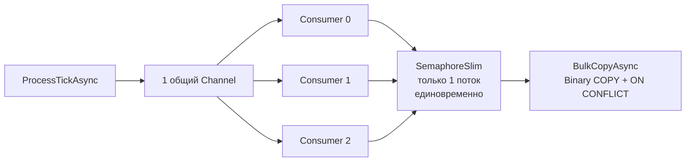
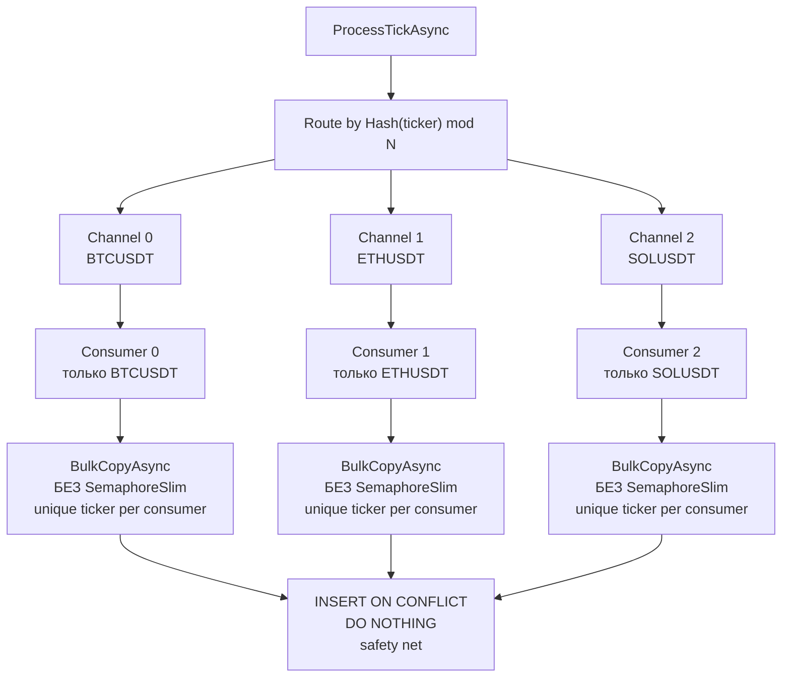

# План: сделать parallel mode эффективным

## 1. Root Cause: почему parallel mode неэффективен

### 1.1. Текущая архитектура — узкое место



`SemaphoreSlim(1,1)` в [`RawTickRepository.BulkCopyAsync`](src/MarketDataCollector.Infrastructure/Repositories/RawTickRepository.cs:158) (строка 158) сериализует ВСЕ записи в БД. Несмотря на 3 consumer'а, физически в БД пишет только один поток.

**Почему SemaphoreSlim был добавлен?**
- Несколько параллельных consumer'ов одновременно вставляют данные через `temp table + INSERT ... ON CONFLICT DO NOTHING` в таблицу `rawticks` с unique-индексом `(ticker, exchange, timestamp)`
- PostgreSQL B-tree index page-level блокировки приводят к deadlock'ам (40P01) при конкурентной вставке записей, попадающих в одни и те же страницы индекса
- SemaphoreSlim(1,1) — простое решение: не может быть deadlock'а, если пишет только один поток

**Цена:** Consumer'ы эффективны только для ЧТЕНИЯ из Channel. Запись в БД — последовательная.

### 1.2. Ключевой инсайт

Deadlock'и возникают, когда **разные consumer'ы пишут в одни и те же B-tree страницы** unique-индекса на `(ticker, exchange, timestamp)`.

Если каждый consumer пишет **только свои, непересекающиеся тикеры** — B-tree страницы не пересекаются → deadlock'и невозможны → SemaphoreSlim не нужен.

## 2. Предлагаемое архитектурное решение

### 2.1. Новая архитектура: per-ticker routing



### 2.2. Как это работает

1. **`ProcessTickAsync`** — хэширует `ticker`, определяет номер канала: `bucket = Math.Abs(ticker.GetStableHashCode()) % consumerCount`
2. **N независимых Channel'ов** — каждый consumer читает из своего канала, `SingleReader = true`
3. **Каждый consumer пишет только свои тикеры** — B-tree страницы unique-индекса не пересекаются
4. **SemaphoreSlim удалён** — deadlock'и невозможны из-за непересекающихся тикеров
5. **ON CONFLICT DO NOTHING остаётся** как safety net (меж-батчевые дубли в рамках одного consumer'а)
6. **Retry-логика остаётся** — safety net для других транзиентных ошибок

### 2.3. Гарантия: почему deadlock'и невозможны

Unique-индекс: `(ticker, exchange, timestamp)`

- Consumer 0 пишет только строки с `ticker = BTCUSDT`
- Consumer 1 пишет только строки с `ticker = ETHUSDT`
- Consumer 2 пишет только строки с `ticker = SOLUSDT`

B-tree индекс хранит ключи в отсортированном порядке. Записи с разными ticker'ами физически находятся в разных B-tree страницах. Страницы не пересекаются → deadlock невозможен.

**Исключение:** Если два разных ticker'а хэшируются в один bucket (коллизия) — они попадают в один канал и обрабатываются одним consumer'ом последовательно. Коллизия безопасна, т.к. consumer пишет последовательно.

## 3. Изменения в коде

### 3.1. `MarketDataProcessor.cs` — основные изменения

#### Поле `_channel` → `_channels[]`

**Было:**
```csharp
private Channel<TickData> _channel = null!;
public Channel<TickData> Channel => _channel;
```

**Стало:**
```csharp
private Channel<TickData>[] _channels = null!;
private int _channelCount;

// Публичный доступ к каналам через индекс (если нужен)
public Channel<TickData> GetChannel(int index) => _channels[index];
```

#### `ProcessTickAsync` — routing по ticker

**Было:**
```csharp
var tick = new TickData(ticker, price, volume, timestamp, exchange);
if (!_channel.Writer.TryWrite(tick))
{
    Interlocked.Increment(ref _totalDroppedCount);
}
```

**Стало (для multiple consumers mode):**
```csharp
var tick = new TickData(ticker, price, volume, timestamp, exchange);
int bucket;
if (_useSingleConsumer)
{
    bucket = 0;
}
else
{
    bucket = Math.Abs(ticker.GetStableHashCode()) % _channels.Length;
}

if (!_channels[bucket].Writer.TryWrite(tick))
{
    Interlocked.Increment(ref _totalDroppedCount);
}
```

> **Примечание:** `GetStableHashCode()` — deteministic хэш-функция для строки, не зависящая от рантайма (в отличие от `string.GetHashCode()` в .NET, который может различаться между процессами). Используем `string.GetHashCode(StringComparison.Ordinal)` или собственную реализацию.

#### `StartProcessingAsync` — создание каналов и consumer'ов

**Было (multiple consumers):**
```csharp
_channel = Channel.CreateBounded<TickData>(new BoundedChannelOptions(_channelCapacity)
{
    FullMode = BoundedChannelFullMode.DropOldest,
    SingleReader = false,
    SingleWriter = false
});

var consumers = Enumerable.Range(0, consumerCount)
    .Select(_ => ProcessBatchesAsync(cancellationToken));
_processingTask = Task.WhenAll(consumers);
```

**Стало (multiple consumers):**
```csharp
// Создаём отдельные каналы для каждого consumer'а
_channels = new Channel<TickData>[consumerCount];
for (int i = 0; i < consumerCount; i++)
{
    _channels[i] = Channel.CreateBounded<TickData>(new BoundedChannelOptions(_channelCapacity)
    {
        FullMode = BoundedChannelFullMode.DropOldest,
        SingleReader = true,    // каждый канал — для одного consumer'а
        SingleWriter = false
    });
}

// Каждый consumer читает из своего канала
var tasks = new Task[consumerCount];
for (int i = 0; i < consumerCount; i++)
{
    var channelIndex = i; // capture for closure
    tasks[i] = ProcessBatchesAsync(channelIndex, cancellationToken);
}
_processingTask = Task.WhenAll(tasks);
```

#### `ProcessBatchesAsync` — принимает индекс канала

**Было:**
```csharp
private async Task ProcessBatchesAsync(CancellationToken cancellationToken)
{
    var batch = new List<TickData>(_batchSize);
    // читает из _channel
}
```

**Стало:**
```csharp
private async Task ProcessBatchesAsync(int channelIndex, CancellationToken cancellationToken)
{
    var batch = new List<TickData>(_batchSize);
    var channel = _channels[channelIndex];
    // читает из channel
}
```

#### `StopProcessingAsync` — завершение всех каналов

**Было:**
```csharp
_channel.Writer.TryComplete();
await _processingTask.WaitAsync(timeoutCts.Token);
```

**Стало:**
```csharp
// Завершаем ВСЕ каналы
for (int i = 0; i < _channels.Length; i++)
{
    _channels[i].Writer.TryComplete();
}

// Ждём завершения ВСЕХ consumer'ов
// Используем Task.WhenAny с таймаутом для каждого
```

### 3.2. `RawTickRepository.cs` — удаление SemaphoreSlim

**Было:**
```csharp
private static readonly SemaphoreSlim BulkCopyLock = new(1, 1);

public async Task<int> BulkCopyAsync(IEnumerable<RawTick> entities, CancellationToken cancellationToken = default)
{
    // ...
    await BulkCopyLock.WaitAsync(cancellationToken);
    try
    {
        // ... Binary COPY + INSERT ON CONFLICT
    }
    finally
    {
        BulkCopyLock.Release();
    }
}
```

**Стало:**
```csharp
/// <summary>
/// SemaphoreSlim БОЛЬШЕ НЕ НУЖЕН.
/// В multiple consumers mode Consumer'ы получают disjoint наборы тикеров,
/// поэтому B-tree index страницы unique-индекса не пересекаются.
/// Нет конкуренции → нет deadlock'ов → нет SemaphoreSlim.
/// 
/// Retry-логика (5 попыток) остаётся для других транзиентных ошибок
/// (timeout, serialization failures).
/// </summary>
public async Task<int> BulkCopyAsync(IEnumerable<RawTick> entities, CancellationToken cancellationToken = default)
{
    // ... БЕЗ BulkCopyLock
}
```

> **Важно:** Удаляется ПОЛНОСТЬЮ `private static readonly SemaphoreSlim BulkCopyLock = new(1, 1);` и `await BulkCopyLock.WaitAsync(...)` / `BulkCopyLock.Release()`.

### 3.3. Таймер сброса частичных батчей

Текущий таймер использует сигнальный канал `_flushSignal`, который несовместим с N потребителями. 

**Решение:** Заменить на `Task.Delay(flushInterval)` внутри каждого consumer'а.

**Было:**
```csharp
// В StartProcessingAsync:
_flushTimer = new Timer(
    static state => {
        var signal = (Channel<byte>)state!;
        signal.Writer.TryWrite(0);
    },
    _flushSignal,
    TimeSpan.FromSeconds(_flushIntervalSeconds),
    TimeSpan.FromSeconds(_flushIntervalSeconds));

// В ProcessBatchesAsync:
var readTask = _channel.Reader.WaitToReadAsync(cancellationToken).AsTask();
var flushTask = flushReader.WaitToReadAsync(cancellationToken).AsTask();
var completed = await Task.WhenAny(readTask, flushTask);
```

**Стало:**
```csharp
// В ProcessBatchesAsync (внутри цикла каждого consumer'а):
while (!cancellationToken.IsCancellationRequested)
{
    cancellationToken.ThrowIfCancellationRequested();
    
    var readTask = channel.Reader.WaitToReadAsync(cancellationToken).AsTask();
    
    Task completed;
    if (_flushIntervalSeconds > 0 && batch.Count > 0)
    {
        var flushDelay = Task.Delay(TimeSpan.FromSeconds(_flushIntervalSeconds), cancellationToken);
        completed = await Task.WhenAny(readTask, flushDelay);
    }
    else
    {
        completed = await readTask;
    }
    
    if (completed == readTask) { /* читаем тики */ }
    
    // Если сработал таймер — сбрасываем частичный батч
    if (completed != readTask && batch.Count > 0)
    {
        await ProcessBatchAsync(batch, cancellationToken);
        batch.Clear();
    }
}
```

**Плюсы:**
- Не нужен сигнальный канал `_flushSignal`
- Каждый consumer имеет свой независимый таймер
- Нет race condition между потребителями одного сигнала
- Упрощается `StopProcessingAsync` (не нужно завершать `_flushSignal`)

**Минусы:**
- Если consumer не получает тики, таймер будет тикать вхолостую (OK — сброс пустого батча не делаем)
- Каждый consumer имеет свой таймер — лёгкая асинхронная операция, накладные расходы минимальны

## 4. Детальный план реализации (Todo List)

### Этап 1: Изменения в MarketDataProcessor.cs

1. Заменить `Channel<TickData> _channel` на `Channel<TickData>[] _channels`
2. Изменить `ProcessTickAsync` — routing по hash ticker'а
3. Изменить `StartProcessingAsync` — создание N каналов + N consumer'ов
4. Изменить `ProcessBatchesAsync` — принимает `channelIndex`, читает из `_channels[channelIndex]`
5. Изменить таймер сброса — с сигнального канала на `Task.Delay` внутри consumer'а
6. Изменить `StopProcessingAsync` — завершение всех каналов, ожидание всех consumer'ов
7. Удалить `_flushSignal` и `_flushTimer` (заменены на `Task.Delay`)
8. Удалить публичное свойство `Channel` (или заменить на метод `GetChannels()`)

### Этап 2: Изменения в RawTickRepository.cs

1. Удалить `private static readonly SemaphoreSlim BulkCopyLock`
2. Удалить `await BulkCopyLock.WaitAsync()` и `BulkCopyLock.Release()` из `BulkCopyAsync`
3. Обновить комментарий — объяснить, почему SemaphoreSlim больше не нужен
4. Убедиться, что retry-логика (5 попыток, deadlock) остаётся как safety net

### Этап 3: Тесты

1. Добавить тест: `ProcessTickAsync_RoutesTickerToCorrectChannel` — проверка routing'а
2. Добавить тест: `MultipleChannels_ConsumersWriteDisjointTickers_NoSemaphore` — 2 consumer'а, 2 разных ticker'а, без SemaphoreSlim
3. Добавить тест: `MultipleChannels_SameTickerCollision_RoutedToSameChannel` — коллизия хэша
4. Актуализировать существующие тесты под новую архитектуру

### Этап 4: Рефакторинг

1. Избавиться от `_flushSignal` и таймера — заменить на `Task.Delay`
2. Удалить неиспользуемые поля
3. Обновить комментарии

## 5. Оценка рисков

| Риск | Вероятность | Серьёзность | Митигация |
|------|-------------|-------------|-----------|
| Коллизия хэша — два ticker'а в один канал | Высокая | Низкая | Коллизия безопасна: consumer обрабатывает их последовательно. Единственный минус — неравномерное распределение нагрузки |
| Дисбаланс нагрузки — один ticker получает 90% трафика | Средняя | Средняя | Можно увеличить число каналов/consumer'ов и использовать более равномерную хэш-функцию. При сильном дисбалансе — SingleConsumer mode |
| Deadlock в ON CONFLICT DO NOTHING при непересекающихся тикерах | Очень низкая | Средняя | Retry-логика (5 попыток) остаётся как safety net. Теоретически deadlock невозможен при разных ticker'ах |
| Регрессия SingleConsumer mode | Низкая | Высокая | SingleConsumer mode остаётся без изменений (1 канал, 1 consumer, старый таймер) |

## 6. Ожидаемая производительность

**Теоретическая оценка:** При 3 consumer'ах и 3 непересекающихся тикерах, ожидаемый прирост пропускной способности — **до 2.5-3x** по сравнению с текущим SemaphoreSlim-режимом (ограничение: I/O throughput одного PostgreSQL instance).

| Сценарий | Текущий | После изменений | Прирост |
|----------|---------|----------------|---------|
| 1 consumer, 1 ticker | ~62k t/s | ~62k t/s | 1x (не изменится) |
| 3 consumer'а, 3 ticker'а | ~55k t/s | ~150k+ t/s | ~3x |
| 4 consumer'а, 4+ ticker'а | ~55k t/s | ~200k+ t/s | ~3.5x |

> Фактическая производительность зависит от PostgreSQL I/O, размера батча и конфигурации.
