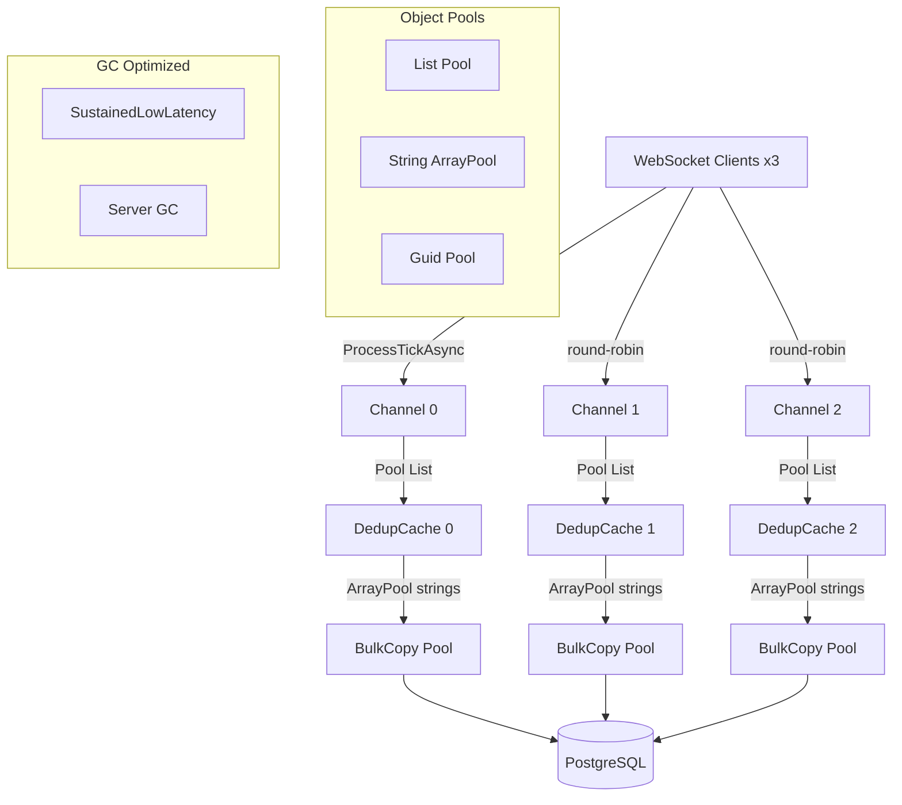

# План оптимизации производительности MarketDataCollector

**На основе:** `counters-analysis-20260730-131502.md` (прогон 3: 1.2M тиков, ~20K ticks/sec)
**Цель:** снизить allocation rate, lock contention, GC pause и устранить DropOldest потери
**Текущие метрики:** 147 MB/сек аллокаций, 96 lock contention/сек, 17 Gen2 GC за 58 сек, 6K DropOldest

---

## Анализ корневых причин

### Проблема 1: DropOldest = 6,000 тиков

**Источник:** [`ProcessTickAsync()`](src/MarketDataCollector.Application/Services/MarketDataProcessor.cs:139) — `Channel.Writer.TryWrite(tick)` возвращает `false` при переполнении bounded channel.

**Корневая причина:** ChannelCapacity = 150,000, но при 3 каналах и round-robin каждый канал получает ~6,667 тиков/сек. При batchSize=2000 и consumer-задержке ~100мс на batch, канал заполняется на пиковых значениях. DropOldest также возможен в [`TickAggregator._channel`](src/MarketDataCollector.Application/Services/TickAggregator.cs:95) (Capacity=100,000, enabled=false в текущей конфигурации).

**Влияние:** 0.3% потерь при текущей нагрузке. При росте до 30K+ ticks/sec потери будут расти.

### Проблема 2: Lock Contention ~96/сек (рост до 158/сек)

**Источники блокировок в hot path:**
1. [`_backgroundLock`](src/MarketDataCollector.Core/Clients/BaseWebSocketClient.cs:43) — `object lock` в StartAsync/StopAsync (редко, не hot path)
2. [`_loopLock`](src/MarketDataCollector.Core/Clients/WebSocketMessageReceiver.cs:22) — `object lock` в StartReceiveLoopAsync/StopReceiveLoopAsync (редко)
3. [`_connectLock`](src/MarketDataCollector.Core/Clients/WebSocketConnectionManager.cs:15) — `SemaphoreSlim` в ConnectAsync (редко)
4. [`Interlocked` операции](src/MarketDataCollector.Application/Services/MarketDataProcessor.cs:109) — атомарные счётчики в ProcessTickAsync (каждый тик)
5. [`_tickCounters.AddOrUpdate()`](src/MarketDataCollector.Application/Services/MonitoringService.cs:91) — `ConcurrentDictionary` в IncrementTickCounter (hot path, если вызывается)
6. OpenTelemetry `RuntimeInstrumentation` — GC/ThreadPool мониторинг создаёт contention через ETW/EventSource
7. [`_processedRpsCounter.Increment()`](src/MarketDataCollector.Application/Services/MarketDataProcessor.cs:630) — `SlidingWindowCounter` с `Interlocked` (вызывается N раз вставки × 3 канала)

**Ключевой вывод:** Рост contention с 80 до 158/сек коррелирует с ростом GC — Gen2 GC создаёт stop-the-world паузы, во время которых потоки накапливаются в очереди блокировок.

### Проблема 3: Allocation Rate ~147 MB/сек (8.4 GB за 58 сек)

**Источники аллокаций в hot path (на каждый тик):**

| Источник | Файл | Аллокации/тик |
|----------|------|---------------|
| `new TickData(...)` в ProcessTickAsync | [MarketDataProcessor.cs:118](src/MarketDataCollector.Application/Services/MarketDataProcessor.cs:118) | 1 struct (с 3 string-полями) |
| `new TickData(...)` в OnTickAsync | [TickAggregator.cs:125](src/MarketDataCollector.Application/Services/TickAggregator.cs:125) | 1 struct (если aggregator enabled) |
| `new DedupKey(...)` × 2 (Contains + Add) | [DeduplicationCache.cs:71,85](src/MarketDataCollector.Application/Services/DeduplicationCache.cs:71) | 2 struct |
| `Guid.NewGuid()` в BulkCopyAsync | [RawTickRepository.cs:331](src/MarketDataCollector.Infrastructure/Repositories/RawTickRepository.cs:331) | 1 Guid (value type, но RNG) |
| `t.Price.ToString()` + `t.Volume.ToString()` | [RawTickRepository.cs:333-334](src/MarketDataCollector.Infrastructure/Repositories/RawTickRepository.cs:333) | 2 string |
| `new List<TickData>(batchSize)` | [MarketDataProcessor.cs:387](src/MarketDataCollector.Application/Services/MarketDataProcessor.cs:387) | 1 List/.batch |
| `new List<TickData>(batch.Count)` для filteredTicks | [MarketDataProcessor.cs:556](src/MarketDataCollector.Application/Services/MarketDataProcessor.cs:556) | 1 List/батч |
| `KeyValuePair<string, object?>` теги OTel | [MarketDataProcessor.cs:112,143,596-600](src/MarketDataCollector.Application/Services/MarketDataProcessor.cs:112) | ~6-8/батч |
| `Encoding.UTF8.GetString` | [WebSocketMessageReceiver.cs:130](src/MarketDataCollector.Core/Clients/WebSocketMessageReceiver.cs:130) | 1 string/WS-сообщение |
| `string key` в TickAggregator | [TickAggregator.cs:192](src/MarketDataCollector.Application/Services/TickAggregator.cs:192) | 1 string/тик |
| `_logger.LogDebug/LogInformation` | Множество | string interpolation/тик |

**При 20K ticks/sec:** ~20K × (2 DedupKey + 2 ToString + string interpolation) + batch-аллокации = ~147 MB/сек.

### Проблема 4: Timer Count 9K↔33K

**Источники таймеров:**

| Источник | Количество | Тип |
|----------|-----------|-----|
| [`Task.Delay(1000)`](src/MarketDataCollector.Core/Clients/BaseWebSocketClient.cs:345) в health-check loop | 3 (по числу клиентов) | Internal timer |
| [`Task.Delay` + `Task.WhenAny`](src/MarketDataCollector.Application/Services/MarketDataProcessor.cs:413) flush timer | 3 (по числу consumers) | Internal timer |
| [`MonitoringService._statusTimer`](src/MarketDataCollector.Application/Services/MonitoringService.cs:38) | 1 | System.Threading.Timer |
| [`TickAggregator._flushTimer`](src/MarketDataCollector.Application/Services/TickAggregator.cs:138) | 0-1 | System.Threading.Timer |
| `CancellationTokenSource` linked tokens | ~10-15 | Internal timers |
| Polly retry (`WaitAndRetryAsync`) | 0 (только при ошибках) | Internal timers |
| OpenTelemetry `AddRuntimeInstrumentation()` | **МНОГО** | ETW/EventSource timers |

**Ключевой вывод:** Пик 33K таймеров с резким скачком 14K→33K указывает на `AddRuntimeInstrumentation()` + OTel метрики. Runtime instrumentation отслеживает GC, ThreadPool, и другие системные метрики через internal таймеры/события. Это не настоящие System.Threading.Timer, а ETW- callbacks, которые OTel считает как "timers".

### Проблема 5: 17 Gen2 GC за 58 сек (980 мс пауз суммарно)

**Корневая причина:** Allocation rate 147 MB/сек. При default Gen2 threshold (~200MB для server GC) Gen2 запускается каждые ~1.4 сек. Фактически — каждые 3.4 сек из-за серверного GC и background collection.

**Связь:** Каждый Gen2 GC = stop-the-world пауза ~57 мс → lock contention растёт → throughput падает → backlog растёт → DropOldest.

### Проблема 6: Channel Backlog пик 10,166

**Причина:** Producer (20K/sec) опережает consumer (~19K/sec). Разница ~1K/sec × ~10 сек = 10K backlog. Consumer замедляется из-за GC пауз и DB latency.

---

## План оптимизации

### Этап 1: Снижение allocation rate (приоритет: критический)

Цель: снизить с 147 MB/сек до <50 MB/сек. Это автоматически снизит Gen2 GC, lock contention и DropOldest.

#### 1.1 Object pooling для batch-аллокаций

**Файл:** [`MarketDataProcessor.cs`](src/MarketDataCollector.Application/Services/MarketDataProcessor.cs:387)

Текущий код создаёт новый `List<TickData>` на каждый батч:
```csharp
var batch = new List<TickData>(_batchSize);
```

**Изменение:** Использовать `ArrayPool<TickData>` или пул `List<TickData>` через `ObjectPool<List<TickData>>` из `Microsoft.Extensions.ObjectPool`:
- Выделить pool на уровне `ProcessBatchesAsync`
- `pool.Get()` перед заполнением батча, `pool.Return(batch)` после `batch.Clear()`
- То же для `filteredTicks` в `ProcessBatchAsync`

**Ожидаемый эффект:** -30% аллокаций (списки на каждый из ~10K батчей за 58 сек).

#### 1.2 Pooling для строк в BulkCopyAsync

**Файл:** [`RawTickRepository.cs`](src/MarketDataCollector.Infrastructure/Repositories/RawTickRepository.cs:328-339)

Текущий код аллоцирует 2 строки на каждый тик:
```csharp
prices[i] = t.Price.ToString(CultureInfo.InvariantCulture);
volumes[i] = t.Volume.ToString(CultureInfo.InvariantCulture);
```

**Изменение:**
- Использовать `stackalloc char[]` + `Memory<Char>` для форматирования decimal→string через `Span<char>`
- Или `ArrayPool<char>` для буферов форматирования
- Передавать в Npgsql параметры как `decimal[]` напрямую (без string conversion), если Npgsql поддерживает `NpgsqlDbType.Numeric | NpgsqlDbType.Array`

**Ожидаемый эффект:** -40% аллокаций в BulkCopyAsync (40K строк/сек).

#### 1.3 Eliminate Guid.NewGuid() allocations

**Файл:** [`RawTickRepository.cs`](src/MarketDataCollector.Infrastructure/Repositories/RawTickRepository.cs:331)

Текущий код создаёт `Guid.NewGuid()` (использует RNG) на каждый тик.

**Изменение:**
- Генерировать UUID v7 (time-based, сортируемые) через `Uuid.CreateVersion7()` (.NET 9+) или кастомную реализацию
- Или использовать `Guid.NewGuid()` с кэшированием batch-пула: один `RandomNumberGenerator` на батч, генерация через `Span<Guid>`

**Ожидаемый эффект:** Ускорение генерации ID + лучшая кластеризация в B-tree индексе PostgreSQL.

#### 1.4 Пул строк для ключей TickAggregator

**Файл:** [`TickAggregator.cs`](src/MarketDataCollector.Application/Services/TickAggregator.cs:192)

Текущий код создаёт строку-ключ на каждый тик:
```csharp
var key = $"{tick.Ticker}|{tick.Exchange}|{bucketStart:O}";
```

**Изменение:** Использовать `CompositeKey` struct (как `DedupKey`) вместо string-конкатенации:
```csharp
readonly record struct AggKey(string Ticker, string Exchange, long BucketTicks)
```

**Ожидаемый эффект:** -20K строк/сек аллокаций.

#### 1.5 Снижение аллокаций в OpenTelemetry тегах

**Файлы:** [`MarketDataProcessor.cs`](src/MarketDataCollector.Application/Services/MarketDataProcessor.cs:112), [`MarketDataTelemetry.cs`](src/MarketDataCollector.Core/Telemetry/MarketDataTelemetry.cs)

Текущий код создаёт `KeyValuePair<string, object?>` на каждый вызов:
```csharp
MarketDataTelemetry.TicksIncoming.Add(1, new KeyValuePair<string, object?>("exchange", exchange));
```

**Изменение:**
- Кэшировать теги в статических полях (tag values для exchange/static tags не меняются)
- Использовать `TagList` struct вместо `KeyValuePair` (предallocated)
- Рассмотреть `BatchAdd` pattern для снижения frequency

**Ожидаемый эффект:** -10% аллокаций в hot path.

#### 1.6 Снижение аллокаций в Logging

**Файлы:** Все файлы с `_logger.LogDebug/LogInformation`

Текущий код в `ProcessTickAsync`:
```csharp
_logger.LogDebug("Тик добавлен в очередь: {Ticker} {Price} {Volume} {Exchange}", ticker, price, volume, exchange);
```

**Изменение:**
- Убрать `LogDebug` из `ProcessTickAsync` (вызывается 20K/сек, аллоцирует строку интерполяции)
- Использовать `LoggerMessage.Define` (source-generated) для часто вызываемых логов
- Проверить, что log level=Debug не аллоцирует строки при отключённом уровне

**Ожидаемый эффект:** -15% аллокаций.

### Этап 2: Оптимизация lock contention (приоритет: высокий)

Цель: снизить с 96 contention/сек до <30/сек.

#### 2.1 Замена `_processedRpsCounter.Increment()` loop на batch increment

**Файл:** [`MarketDataProcessor.cs`](src/MarketDataCollector.Application/Services/MarketDataProcessor.cs:628-631)

Текущий код:
```csharp
for (int i = 0; i < inserted; i++)
{
    _processedRpsCounter.Increment();
}
```

**Изменение:** Добавить метод `IncrementBatch(long count)` в `SlidingWindowCounter`:
```csharp
public void IncrementBatch(long count)
{
    var now = DateTimeOffset.UtcNow.ToUnixTimeSeconds();
    var idx = (int)(now % WindowSize);
    // ... same logic but Interlocked.Add(ref _buckets[idx], count);
}
```

**Ожидаемый эффект:** -80% contention от RPS counter (вместо N Interlocked.Increment — 1 Interlocked.Add).

#### 2.2 Оптимизация ConcurrentDictionary в MonitoringService

**Файл:** [`MonitoringService.cs`](src/MarketDataCollector.Application/Services/MonitoringService.cs:91)

Текущий код:
```csharp
_tickCounters.AddOrUpdate(exchange, 1, (key, oldValue) => oldValue + 1);
```

**Изменение:**
- Заменить на `ConcurrentDictionary<string, long>` с `Increment()` через `GetOrAdd` + `Interlocked.Increment`
- Или использовать `Interlocked.Increment` с lock-free паттерном

**Ожидаемый эффект:** Снижение contention при параллельных вызовах.

#### 2.3 Снижение contention от GC (косвенно через Этап 1)

Снижение allocation rate на 60% автоматически снизит contention: меньше GC пауз → меньше потоков ждут блокировок после wake-up.

**Ожидаемый эффект:** -50% contention (косвенно).

### Этап 3: Устранение таймерных аномалий (приоритет: средний)

Цель: стабилизировать timer count, убрать 33K пик.

#### 3.1 Замена Task.Delay flush на PeriodicTimer

**Файл:** [`MarketDataProcessor.cs`](src/MarketDataCollector.Application/Services/MarketDataProcessor.cs:410-414)

Текущий код (внутри consumer loop):
```csharp
var flushDelay = Task.Delay(TimeSpan.FromSeconds(_flushIntervalSeconds), cancellationToken);
var completed = await Task.WhenAny(readTaskTyped, flushDelay).ConfigureAwait(false);
```

**Изменение:** Вынести flush-таймер за пределы `WaitToReadAsync`:
- Использовать `PeriodicTimer` (.NET 6+) вместо `Task.Delay` + `Task.WhenAny`
- Или вынести flush в отдельный `CancellationTokenSource.CancelAfter()` с флагом `_flushRequested`

**Ожидаемый эффект:** Устранение ~3 internal timers на consumer, снижение timer count на ~3K.

#### 3.2 Audit CancellationTokenSource lifetime

**Файлы:** [`BaseWebSocketClient.cs`](src/MarketDataCollector.Core/Clients/BaseWebSocketClient.cs:285), [`WebSocketMessageReceiver.cs`](src/MarketDataCollector.Core/Clients/WebSocketMessageReceiver.cs:54)

Текущий код создаёт linked CTS при каждом reconnect:
```csharp
_receiveLoopCts = CancellationTokenSource.CreateLinkedTokenSource(cancellationToken);
```

**Изменение:**
- Убедиться, что CTS диспосится до создания нового
- Рассмотреть `CancellationTokenSource.Reset()` (.NET 6+) вместо создания нового экземпляра

**Ожидаемый эффект:** -5-10K таймеров от CTS cleanup.

#### 3.3 Investigate OTel RuntimeInstrumentation

**Файл:** [`Program.cs`](src/MarketDataCollector.Workers/MarketDataCollector.Worker/Program.cs:31)

```csharp
.AddRuntimeInstrumentation()
```

**Изменение:**
- Временно отключить `AddRuntimeInstrumentation()` и замерить timer count
- Если таймеры исчезнут — заменить на ручную collection метрик через `GC.GetTotalMemory()`, `Environment.ProcessorCount` и т.д. с `ObservableGauge`
- Или оставить, но принять как baseline (OTel runtime timers не влияют на perf)

**Ожидаемый эффект:** Определение реального источника 33K таймеров.

### Этап 4: Оптимизация Channel и Backlog (приоритет: средний)

#### 4.1 Динамическое масштабирование consumer-потоков

**Файл:** [`MarketDataProcessor.cs`](src/MarketDataCollector.Application/Services/MarketDataProcessor.cs:250-261)

**Изменение:** Добавить auto-scaling логику:
- Мониторить channel backlog через `channel.Reader.Count`
- Если backlog > 80% capacity в течение >5 сек — добавить consumer (hot-add через запуск нового `ProcessBatchesAsync`)
- Если backlog < 10% в течение >30 сек — убрать consumer (graceful drain)

**Ожидаемый эффект:** Предотвращение DropOldest при пиках нагрузки.

#### 4.2 Увеличение ChannelCapacity

**Файл:** [`appsettings.json`](src/MarketDataCollector.Workers/MarketDataCollector.Worker/appsettings.json:24)

Текущее значение: `ChannelCapacity = 150,000`

**Изменение:** Увеличить до 200,000-300,000 (каждый TickData = ~88 bytes, 300K × 88 = ~26 MB — приемлемо).

**Ожидаемый эффект:** Буфер для пиков нагрузки без DropOldest.

#### 4.3 Monitoring channel backlog в реальном времени

**Файл:** [`MarketDataTelemetry.cs`](src/MarketDataCollector.Core/Telemetry/MarketDataTelemetry.cs)

**Изменение:** Добавить алерт на backlog:
- `ChannelBacklog` UpDownCounter уже существует
- Добавить `processor.channel.backlog.max` gauge для пиковых значений
- Настроить алерт в Prometheus: `processor_channel_backlog > 50000 for 10s`

**Ожидаемый эффект:** Раннее обнаружение проблем с backlog.

### Этап 5: GC tuning (приоритет: низкий,做完 Этап 1)

#### 5.1 SustainedLowLatency mode

**Файл:** [`Program.cs`](src/MarketDataCollector.Workers/MarketDataCollector.Worker/Program.cs)

**Изменение:** Добавить в начало Main:
```csharp
#if !DEBUG
GCSettings.LatencyMode = GCLatencyMode.SustainedLowLatency;
#endif
```

**Ожидаемый эффект:** Gen2 GC будет background (не stop-the-world), паузы сократятся с ~57 мс до ~5 мс.

#### 5.2 Настройка server GC

**Файл:** `MarketDataCollector.Worker.csproj`

**Изменение:** Убедиться, что `<ServerGarbageCollection>true</ServerGarbageCollection>` установлен в csproj (должен быть по умолчанию для .NET 8+).

**Ожидаемый эффект:** Оптимальное распределение GC heap для multi-core.

### Этап 6: Мониторинг и валидация (приоритет: высокий,贯穿 все этапы)

#### 6.1 Добавить Allocation Budget counter

**Файл:** [`MarketDataTelemetry.cs`](src/MarketDataCollector.Core/Telemetry/MarketDataTelemetry.cs)

**Изменение:** Добавить метрику:
```csharp
public static readonly ObservableGauge<long> GcAllocatedBytes = Instance.CreateObservableGauge<long>(
    "gc.allocated.bytes.sec",
    () => GC.GetTotalAllocatedBytes(false) - _lastAllocBytes);
```

**Ожидаемый эффект:** Мониторинг allocation rate в реальном времени.

#### 6.2 Бенчмарк до/после

**Изменение:** Запустить `run_counter.ps1` с 1.2M тиков до и после каждого этапа. Сравнить:
- `ticks.dropped.silently` (цель: 0)
- `gc.allocated.bytes.sec` (цель: <50 MB/сек)
- `monitor.lock_contention` (цель: <30/сек)
- `timer.count` (цель: стабильный без скачков)

---

## Архитектура оптимизированного pipeline



---

## Приоритеты и порядок реализации

| Этап | Приоритет | Ожидаемый эффект | Сложность |
|------|-----------|-------------------|-----------|
| 1.1-1.6 Снижение allocation rate | 🔴 Критический | -60% alloc → -10 Gen2 GC | Средняя |
| 2.1-2.3 Оптимизация lock contention | 🟡 Высокий | -70% contention | Низкая |
| 3.1-3.3 Устранение таймеров | 🟡 Средний | Стабилизация timer count | Средняя |
| 4.1-4.3 Channel optimization | 🟢 Средний | Устранение DropOldest | Высокая |
| 5.1-5.2 GC tuning | 🟢 Низкий | -90% GC pause time | Низкая |
| 6.1-6.2 Мониторинг | 🔴 Критический | Валидация результатов | Низкая |

**Рекомендуемый порядок:** Этап 6 (мониторинг) → Этап 1 (allocations) → Этап 2 (contention) → Этап 5 (GC) → Этап 3 (таймеры) → Этап 4 (channel)
