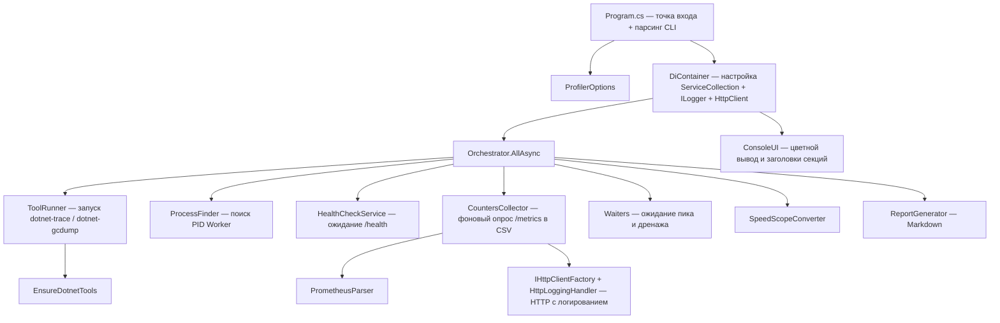

# План: перенос run_all_metrics.ps1 на C#

## Цель

Полностью воспроизвести поведение PowerShell-цепочки профилирования
`run_all_metrics.ps1` → `scripts/collect-all.ps1` → `scripts/common-functions.ps1`
в виде отдельного C#-консольного приложения. Приложение выполняет:
health-check → counters + trace + 2x gcdump + конвертация в SpeedScope +
Markdown-отчёт. Код строится на внедрении зависимостей (DI), фабрике
`IHttpClientFactory` и логировании через `ILogger<T>` (включая логирование
HTTP-запросов), как в основном решении `MarketDataCollector.Worker`.

## Решение

- Создаётся автономный C#-проект в `tools/Profiler/` (НЕ добавляется в
  `MarketDataCollector.sln` — утилита профилирования не часть основного решения).
- Общая структура повторяет логику PS1: утилитарные сервисы, сервис запуска
  внешних инструментов, парсер Prometheus, фоновый сборщик counters,
  оркестратор, генератор отчёта.

## Требования и зависимости

- .NET 8 SDK.
- Внешние глобальные инструменты: `dotnet-trace`, `dotnet-gcdump`
  (приложение само проверяет и устанавливает при отсутствии).
- NuGet-пакеты для DI, фабрики HttpClient и логирования:
  - `Microsoft.Extensions.Hosting` (контейнер DI, `HostApplicationBuilder`);
  - `Microsoft.Extensions.Http` (`AddHttpClient`, `IHttpClientFactory`);
  - `Microsoft.Extensions.Logging` (`ILogger<T>`);
  - `Microsoft.Extensions.Logging.Console` (консольный провайдер логов).
  Команда добавления: `dotnet add tools/Profiler package Microsoft.Extensions.Hosting`
  (остальные тянутся транзитивно; при необходимости — явно).
- Прочие компоненты — только BCL: `System.Diagnostics`, `System.Management`,
  `System.Text`, `System.Net.Http`.
- Кодировка консоли — UTF-8 (вывод кириллицы).

## Архитектура приложения



## Структура файлов

```
tools/Profiler/
├── Profiler.csproj
├── Program.cs                     — точка входа, парсинг CLI, сборка DI
├── README.md                      — описание запуска и CLI
├── Options/
│   └── ProfilerOptions.cs         — DTO параметров (record)
├── Cli/
│   ├── CommandLineParser.cs       — разбор args -> ProfilerOptions
│   └── DiContainer.cs             — ServiceCollection, ILogger, IHttpClientFactory
├── Core/
│   ├── Interfaces/                — SOLID: все интерфейсы (DIP/ISP)
│   │   ├── IConsoleUI.cs
│   │   ├── IEnsureDotnetTools.cs
│   │   ├── IProcessFinder.cs, IProcessIdSource.cs (стратегии поиска PID)
│   │   ├── IToolRunner.cs
│   │   ├── ITraceCollector.cs
│   │   ├── IGcDumpCollector.cs
│   │   ├── ISpeedScopeConverter.cs
│   │   ├── IPeakLoadWaiter.cs, IDrainWaiter.cs   (ISP: вместо IWaiters)
│   │   ├── IHealthCheckService.cs
│   │   ├── IPrometheusParser.cs
│   │   ├── ICountersCollector.cs
│   │   ├── IReportGenerator.cs
│   │   └── IProfilerOrchestrator.cs
│   ├── ConsoleUI.cs               — цветной вывод, Write-SectionHeader
│   ├── EnsureDotnetTools.cs       — проверка/установка dotnet-trace, dotnet-gcdump
│   ├── ProcessFinder.cs           — координатор стратегий поиска PID
│   ├── ProcessIdSources/          — SRP/OCP: по стратегии на источник
│   │   ├── TracePsSource.cs       — dotnet-trace ps
│   │   ├── TargetProcessSource.cs — Process.GetProcessesByName
│   │   └── WmiProcessSource.cs    — Win32_Process (System.Management)
│   ├── ToolRunner.cs              — запуск внешних exe, чтение stdout/stderr
│   ├── TraceCollector.cs          — StartTraceCollection/StopTraceCollection
│   ├── GcDumpCollector.cs         — Collect-GcDump
│   ├── SpeedScopeConverter.cs     — Convert-TraceToSpeedScope
│   ├── Waiters/
│   │   ├── PeakLoadWaiter.cs      — IPeakLoadWaiter (countdown)
│   │   └── DrainWaiter.cs         — IDrainWaiter (опрос /metrics)
│   ├── HealthCheckService.cs      — ожидание healthy у /health
│   ├── HttpLoggingHandler.cs      — DelegatingHandler: логирование HTTP
│   └── PrometheusParser.cs        — Parse-PrometheusMetrics
├── Services/
│   ├── CountersCollector.cs       — фоновый сбор counters в CSV
│   └── ProfilerOrchestrator.cs    — оркестрация all-режима
└── Reporting/
    └── ReportGenerator.cs         — генерация profiling_report.md
```

## Принципы SOLID

Проектирование утилиты следует SOLID (как и основное решение, см. `.roo/rules/architect/rules.md`):

- **S — Single Responsibility (единственная ответственность).** Каждый класс
  решает одну задачу: `ConsoleUI` — только вывод, `ToolRunner` — только запуск
  внешних процессов, `TraceCollector` — только управление dotnet-trace,
  `GcDumpCollector` — только gcdump, `PrometheusParser` — только парсинг,
  `ReportGenerator` — только генерация отчёта. `ProfilerOrchestrator`
  занимается только координацией шагов, не владея деталями реализации.
- **O — Open/Closed (открытость/закрытость).** Поведение расширяется через
  добавление новых реализаций интерфейсов, а не правкой существующих.
  Пример: новый формат конвертации trace → новый `IConverter`, новый способ
  поиска PID → новая реализация `IProcessFinder`, оркестратор не меняется.
- **L — Liskov Substitution (подстановка Лисков).** Все реализации интерфейсов
  взаимозаменяемы: `IProcessFinder` может вернуть PID из любого источника,
  `IWaiters` — любой стратегии ожидания, вызывающий код не знает о конкретном
  типе.
- **I — Interface Segregation (разделение интерфейсов).** Интерфейсы узкие и
  ролевые. `IWaiters` разбит на `IPeakLoadWaiter` и `IDrainWaiter` (см. секцию
  `Waiters`). `IProfilerOrchestrator` не экспонирует методы запуска внешних
  инструментов — для этого отдельный `IToolRunner`. Потребитель зависит только
  от нужных ему методов.
- **D — Dependency Inversion (инверсия зависимостей).** Высокоуровневые
  модули (`ProfilerOrchestrator`) зависят от абстракций (`IHealthCheckService`,
  `ITraceCollector`, `ICountersCollector`, ...), а не от конкретных классов.
  Конкретные реализации поставляются через DI-контейнер
  (`DiContainer`). Все интерфейсы — в `Core/Interfaces/`, реализации — в
  `Core/` и `Services/`.

SOLID применяется к каждому компоненту ниже; раздел «Критерии готовности»
содержит проверку на соблюдение принципов.

## Детализация компонентов

### 1. `ProfilerOptions.cs` (record)

Параметры — объединение CLI `run_all_metrics.ps1` и `collect-all.ps1`:

| Параметр | По умолчанию | Назначение |
|----------|--------------|------------|
| `TraceProfile` | `gc-verbose` | Профиль dotnet-trace: `gc-verbose`, `cpu-sampling`, `contention`, `contention-cpu` |
| `TraceDuration` | `90` | Длительность trace, сек |
| `GcDumpAtPeakSec` | `50` | Момент первого gcdump (пик), сек |
| `DrainWaitSec` | `30` | Ожидание дренажа перед вторым gcdump, сек |
| `WorkerProcessName` | `MarketDataCollector.Worker` | Имя процесса Worker |
| `MetricsUrl` | `http://localhost:5010/metrics` | Prometheus endpoint |
| `HealthUrl` | `http://localhost:5010/health` | Health-check endpoint Worker'а |
| `HealthTimeoutSec` | `30` | Таймаут ожидания healthy, сек |
| `OutputDir` | `./traces` | Директория результатов |
| `RefreshSeconds` | `5` | Интервал опроса метрик, сек |
| `HttpLogLevel` | `Debug` | Уровень логирования HTTP-запросов (`Trace`/`Debug`/`Information`/`None`) |

### 2. `CommandLineParser.cs`

- Парсит аргументы вида `--name value` и `--name=value`.
- Имена в camelCase/kebab-case (регистронезависимо), напр. `--traceProfile`, `--trace-duration`.
- Для `TraceProfile` — валидация допустимых значений.
- При неизвестном/некорректном аргументе — вывод справки и `Environment.Exit(1)`.
- Справка через `--help` / `-h`.

### 3. `DiContainer.cs`

Настройка контейнера DI и логирования (аналог тонкого `Program.cs` Worker'а,
где регистрации вынесены в extension-методы):

- Используется `Microsoft.Extensions.Hosting.HostApplicationBuilder` либо
  ручной `ServiceCollection` + `ServiceProvider`. Для консольной утилиты
  достаточно `ServiceCollection` с явной сборкой провайдера.
- Регистрация провайдера логов:
  ```csharp
  services.AddLogging(b => b
      .AddSimpleConsole(o => { o.SingleLine = true; })
      .SetMinimumLevel(LogLevel.Debug));
  ```
- Регистрация `IHttpClientFactory`:
  ```csharp
  services.AddHttpClient("Metrics", c => { c.Timeout = TimeSpan.FromSeconds(10); })
      .AddHttpMessageHandler<HttpLoggingHandler>();
  services.AddHttpClient("Health", c => { c.Timeout = TimeSpan.FromSeconds(3); })
      .AddHttpMessageHandler<HttpLoggingHandler>();
  ```
  Два именованных клиента: `Metrics` (опрос `/metrics`) и `Health` (проверка `/health`).
- Регистрация сервисов через интерфейсы (папка `Core/Interfaces/`),
  по принципу DIP — каждый интерфейс мапится на конкретную реализацию:
  `IConsoleUI → ConsoleUI`, `IEnsureDotnetTools → EnsureDotnetTools`,
  `IProcessFinder → ProcessFinder`, `IToolRunner → ToolRunner`,
  `ITraceCollector → TraceCollector`, `IGcDumpCollector → GcDumpCollector`,
  `ISpeedScopeConverter → SpeedScopeConverter`,
  `IPeakLoadWaiter → PeakLoadWaiter`, `IDrainWaiter → DrainWaiter`
  (ISP: `IWaiters` не используется, роли разделены),
  `IHealthCheckService → HealthCheckService`,
  `IPrometheusParser → PrometheusParser`,
  `ICountersCollector → CountersCollector`,
  `IReportGenerator → ReportGenerator`,
  `IProfilerOrchestrator → ProfilerOrchestrator`.
- `AddSingleton<ProfilerOptions>(options)` — параметры как singleton.
- Разрешение корневого `IProfilerOrchestrator` через `provider.GetRequiredService`.
- Все сервисы регистрируются как `Singleton` (утилита — одноразовый консольный
  запуск, состояние не требуется пересоздавать между scope'ами).

### 4. `ConsoleUI.cs`

- Цветной вывод через `Console.ForegroundColor` с восстановлением цвета.
- `SectionHeader(title)` — аналог `Write-SectionHeader` (рамка из `=`).
- Методы `Info/Warn/Ok/Error/Detail` для уровней логов, аналогичных цветам PS1.
- **Интеграция с `ILogger`**: конструктор принимает `ILogger<ConsoleUI>` и
  `ProfilerOptions.HttpLogLevel`; каждый метод (`Info/Warn/Ok/Error/Detail`)
  дублирует вывод в консольный лог-провайдер на соответствующем уровне
  (`Debug`/`Warning`/`Information`/`Error`). Это даёт единый поток логов
  для шагов оркестратора и HTTP-запросов.

### 5. `EnsureDotnetTools.cs`

- Вызов `dotnet tool list --global`, поиск `dotnet-trace` и `dotnet-gcdump`.
- Для отсутствующих — `dotnet tool install --global <tool>`.
- Аналог `Ensure-DotnetTools` из `common-functions.ps1`.

### 6. `ProcessFinder.cs` — поиск PID Worker

**SOLID-подход (SRP + OCP + DIP):** поиск PID реализуется как цепочка
независимых стратегий (`IProcessIdSource`), каждая решает одну задачу и может
быть добавлена без изменения существующего кода:

- `ITracePsSource` — `dotnet-trace ps`, парсинг строк `PID  NAME`, ищем имя.
- `ITargetProcessSource` — `Process.GetProcessesByName(name)` — прямое
  совпадение по имени.
- `IWmiProcessSource` — WMI `Win32_Process` через `System.Management` — поиск
  `dotnet.exe`, у которого в `CommandLine` встречается имя Worker; отдельная
  ветка для `dotnet run` (проверка загруженных модулей процесса).

`IProcessFinder` (координатор) принимает `IEnumerable<IProcessIdSource>` из DI,
перебирает стратегии по приоритету. Если ни одна не нашла PID — понятное
сообщение со списком методов и `Environment.Exit(1)`. Порядок стратегий
задаётся регистрацией в `DiContainer`, что делает расширение тривиальным (OCP).

`System.Management` — встроенный Windows-сборщик, добавляется `<PackageReference Include="System.Management" />` или `<Reference Include="System.Management" />`. Выбор за исполнителем: использовать `System.Management` (проще, кроссплатформенно на Windows) либо `Microsoft.VisualBasic` fallback не требуется.

### 7. `ToolRunner.cs`

- `RunAsync(exe, args, cancel)` — `ProcessStartInfo` с `UseShellExecute=false`,
  `CreateNoWindow=true`, редиректом stdout/stderr.
- **Обязательно** асинхронное чтение stdout/stderr (`ReadToEndAsync`), чтобы
  избежать deadlock при заполнении pipe-буфера (важный момент, вынесенный в PS1).
- Возвращает объект с `Process`, `Task` чтения stdout/stderr, `OutputPath`.
- `WaitForExitAsync` с таймаутом.

### 8. `TraceCollector.cs`

- `Start(pid, durationSec, outputPath, profile)`:
  - создание директории, удаление старого файла;
  - аргументы в зависимости от профиля:
    - `cpu-sampling` → `--profile cpu-sampling`
    - `contention` → `--providers Microsoft-Windows-DotNETRuntime:0x4000:5`
    - `contention-cpu` → `--providers Microsoft-Windows-DotNETRuntime:0x4000:5,Microsoft-DotNETCore-SampleProfiler:0:5`
    - default → `--profile gc-verbose`
  - **длительность в формате `hh:mm:ss`**, т.к. голое число dotnet-trace
    трактует как дни (зафиксированный баг в PS1).
- `Stop(trace)`:
  - ожидание естественного завершения `WaitForExit(15s)` (trace с `--duration`
    финализирует .nettrace сам);
  - фолбэк `taskkill /PID` → `Kill()`;
  - диагностика `ExitCode` + stdout/stderr + наличие файла.
  - **НЕ** использовать AttachConsole/FreeConsole/GenerateConsoleCtrlEvent
    (вызывало крах pwsh) — в C# естественно не используются.

### 9. `GcDumpCollector.cs`

- `Collect(pid, outputPath, label)`:
  - создание директории, удаление старого файла;
  - проверка живости PID (аналог `Get-Process -Id`);
  - `dotnet-gcdump collect --process-id <pid> --output "<path>"`;
  - ожидание до 120 сек, фолбэк `Kill()`;
  - диагностика `ExitCode` + размер файла + размер строки вывода.

### 10. `SpeedScopeConverter.cs`

- `Convert(traceFile)`:
  - `dotnet-trace convert --format speedscope "<trace>" --output "<base>"`,
    где `base` — имя без расширения (dotnet-trace сам добавляет `.speedscope.json`);
  - нормализация: если создан файл с задвоенным суффиксом — переименовать
    в ожидаемое имя `ChangeExtension(".speedscope.json")`;
  - диагностика наличия файла и размера; сообщение о битом (не финализированном)
    trace при ошибке.

### 11. `Waiters.cs`

**ISP (разделение интерфейсов):** `IWaiters` разбит на два ролевых интерфейса,
чтобы потребитель зависел только от нужной стратегии ожидания:

- `IPeakLoadWaiter` → метод `WaitForPeakLoad(seconds)` — простой countdown с
  выводом каждые 5 сек (аналог `WaitFor-PeakLoad`).
- `IDrainWaiter` → метод `WaitForDrain(timeoutSec, metricsUrl)`:
  - опрос `/metrics` через `IHttpClientFactory.CreateClient("Metrics")`, поиск
    `processor_channel_backlog_count{...} <число>`;
  - при `backlog == 0` → дренаж завершён;
  - при недоступности `/metrics` → фолбэк на простой countdown;
  - общий таймаут `timeoutSec`.

Реализации `PeakLoadWaiter` и `DrainWaiter` — отдельные классы (SRP + ISP),
регистрируются в DI раздельно. `ProfilerOrchestrator` принимает оба интерфейса,
но каждый использует по назначению.

### 12. `HttpLoggingHandler.cs`

`DelegatingHandler`, подключаемый ко всем именованным HttpClient через
`AddHttpMessageHandler<HttpLoggingHandler>()`. Логирует каждый HTTP-запрос
через `ILogger<HttpLoggingHandler>`:

- **Запрос**: метод, URL, время выполнения (`Stopwatch`).
- **Ответ**: `StatusCode`, размер тела, категория (ok/warn/error).
- Уровень логирования зависит от `ProfilerOptions.HttpLogLevel`
  (`Trace`/`Debug`/`Information`) или полностью отключается при `None`.
- Время и `StatusCode` нечувствительные данные — выводятся всегда (при
  включённом логировании); само тело (метрики/health JSON) не пишется в лог,
  чтобы не засорять консоль большими Prometheus-выборками.
- `ILogger` внедряется в конструктор через DI (как и в остальных сервисах).

### 13. `HealthCheckService.cs`

Аналог ожидания готовности Worker перед стартом сбора (у Worker уже есть
эндпоинт `/health`, реализованный в
[`Program.cs`](src/MarketDataCollector.Workers/MarketDataCollector.Worker/Program.cs:145)):

- `WaitForHealthy(healthUrl, timeoutSec, ct)`:
  - опрос `/health` через `IHttpClientFactory.CreateClient("Health")` каждые 2 сек;
  - HTTP 200 и `status == "healthy"` → готово;
  - HTTP 503 / `status == "degraded"` → Worker жив, но деградировал — выдаёт
    предупреждение и продолжает (как в PS1 отсутствовала жёсткая блокировка);
  - недоступность / таймаут → повторные попытки до `HealthTimeoutSec`;
  - по истечении таймаута — понятное сообщение об ошибке и `Environment.Exit(1)`
    (нет смысла профилировать нездоровый/неработающий Worker).
- Интегрируется в `ProfilerOrchestrator` перед поиском PID и стартом trace.

### 14. `PrometheusParser.cs`

Аналог `Parse-PrometheusMetrics` + встроенного парсера из job-блока `collect-all.ps1`:

- Разбор строк: `# HELP`, `# TYPE`, комментарии.
- Формат: `metric_name{labels} value`, `metric_name value`.
- Labels: `key="value"` через regex, склеиваются через `; `.
- Результат: `record MetricSample(string Timestamp, string Metric, string Labels, string Type, string Value, string Description)`.
- Обработка значений `NaN`, `Inf`, `+Inf`, `-Inf`, экспоненциальной записи.

### 15. `CountersCollector.cs`

Фоновый сборщик (аналог `Start-Job` в `collect-all.ps1`):

- Зависимости через DI: `IHttpClientFactory`, `IPrometheusParser`,
  `ILogger<CountersCollector>`, `ProfilerOptions`.
- Проверка доступности `/metrics` (до 6 попыток с паузой 3 сек) через
  `IHttpClientFactory.CreateClient("Metrics")`.
- Запись заголовка CSV: `Timestamp,Metric,Labels,Type,Value,Description`.
- Цикл опроса каждые `RefreshSeconds`:
  - `HttpClient.GetStringAsync(metricsUrl)`;
  - парсинг через `PrometheusParser`;
  - запись строк CSV (экранирование `"` в Description через `""`);
  - логирование `[COUNTERS] Sample #N | M metrics | ...s elapsed` через
    `ILogger<CountersCollector>`;
  - продолжается, пока оркестратор не остановит через `CancellationToken`.
- Используется `StreamWriter` с `UTF8` (без BOM/с BOM — по образцу PS1,
  PS1 использовал UTF8; уточнить не критично, главное совместимость с
  существующим `analyze_counters.ps1`/`metrics-analysis`).

### 16. `ProfilerOrchestrator.cs` — последовательность all-режима

Точная последовательность `collect-all.ps1`:

1. `EnsureDotnetTools`.
2. `HealthCheckService.WaitForHealthy(HealthUrl, HealthTimeoutSec)` — убедиться,
   что Worker жив и здоров до начала сбора (новый шаг; в PS1 отдельной проверки
   не было, опора была на `Find-ProcessId` и доступность `/metrics`).
3. Создание `OutputDir`, формирование имён файлов с таймстампом `yyyyMMdd_HHmmss`:
   `allocation_trace_<ts>.nettrace`, `snapshot_peak_<ts>.gcdump`,
   `snapshot_drained_<ts>.gcdump`, `counters_<ts>.csv`, `profiling_report_<ts>.md`.
4. `FindProcessId(WorkerProcessName)`.
5. Старт `TraceCollector.Start` (trace в фоне).
6. Старт `CountersCollector` (фон).
7. `WaitForPeakLoad(GcDumpAtPeakSec)` → `GcDumpCollector.Collect(PEAK)`.
8. Ожидание завершения trace (оставшиеся `TraceDuration - GcDumpAtPeakSec` сек,
   ранний выход при `HasExited`).
9. `TraceCollector.Stop` + проверка наличия .nettrace.
10. `WaitForDrain(DrainWaitSec, MetricsUrl)` → `GcDumpCollector.Collect(DRAINED)`.
11. Пауза 2 сек → `SpeedScopeConverter.Convert`.
12. Остановка `CountersCollector`.
13. `ReportGenerator.Generate`.
14. Вывод итоговой сводки с путями.

Все зависимости (`IHealthCheckService`, `ITraceCollector`, `ICountersCollector`,
`IGcDumpCollector`, `IWaiters`, `ISpeedScopeConverter`, `IReportGenerator`)
внедряются в конструктор `ProfilerOrchestrator` через DI.

### 17. `ReportGenerator.cs`

Генерирует `profiling_report_<ts>.md` (по шаблону `collect-all.ps1`):

- Заголовок с датой/временем.
- Таблица `Configuration`: Mode=all, Trace Profile, Trace Duration,
  GcDump at Peak, Drain Wait.
- Таблица `Output Files` с размерами файлов (в MB/KB).
- Секция `Предупреждения сбора` (если nettrace/speedscope не созданы).
- Секция `Анализ` (dotnet-trace + dotnet-gcdump инструкции).
- Секция `Next Steps`.

## Программный интерфейс (Program.cs)

- Точка входа `async Task<int> Main(string[] args)`.
- `Console.OutputEncoding = Encoding.UTF8` (кириллица).
- Парсинг аргументов → `ProfilerOptions`.
- Построение контейнера DI через `DiContainer.Build(options)`:
  - `ServiceCollection` + `ServiceProvider`;
  - `AddLogging` (консольный провайдер, `MinimumLevel = Debug`);
  - `AddHttpClient` с двумя именованными клиентами `Metrics` и `Health`,
    каждый с `HttpLoggingHandler`;
  - регистрация всех сервисов и интерфейсов.
- Разрешение `IProfilerOrchestrator` из провайдера, `ConsoleUI` печатает баннер
  и параметры запуска.
- `ProfilerOrchestrator.AllAsync(cts.Token)` (параметры берутся из DI).
- Обработка `Ctrl+C` через `CancellationTokenSource` для корректной остановки
  фонового counters-сборщика; в `finally` — `provider.Dispose()`.

## CLI-примеры

```bash
# Полное профилирование с дефолтами (аналог .\run_all_metrics.ps1)
dotnet run --project tools/Profiler

# С явными параметрами
dotnet run --project tools/Profiler -- --traceProfile contention-cpu --traceDuration 90 --gcDumpAtPeakSec 50 --healthUrl http://localhost:5010/health

# Справка
dotnet run --project tools/Profiler -- --help
```

## Примечания и риски

- `System.Management` (WMI) — Windows-only сборщик; на Linux поиск PID
  запасными методами (dotnet-trace ps + Process). Для текущей среды (Windows 10)
  достаточно.
- Кодировка CSV: PS1 использовал UTF8. Для совместимости с существующим
  `scripts/analyze_counters.ps1` (который читает `-Encoding UTF8`) важно
  сохранить UTF8-кодировку. Фоновый сборщик в `collect-all.ps1` тоже писал UTF8.
- Скорость конвертации SpeedScope для больших trace — время ожидания такое же,
  как в PS1.
- Формат длительности `hh:mm:ss` обязателен для корректной работы dotnet-trace.
- Проект автономный, без ссылок на основные проекты решения, но повторяет
  DI-подход основного решения: `IHttpClientFactory`, `ILogger<T>`,
  интерфейсы в `Core/Interfaces/`, реализации в `Core/` и `Services/`.
- Health-check опционален: если `/health` недоступен (например, старый Worker),
  оркестратор выдаёт предупреждение и продолжает (как раньше полагался только
  на `Find-ProcessId`), жёсткая остановка — только при явном `--healthTimeoutSec`.
- Уровень HTTP-логирования регулируется через `--httpLogLevel` (`None`
  полностью отключает вывод HTTP-запросов).

## Критерии готовности

- `dotnet build tools/Profiler` — успешно, без предупреждений.
- `dotnet run --project tools/Profiler -- --help` — корректная справка.
- DI работает: сервисы резолвятся через `ServiceProvider`, HTTP-запросы идут
  через `IHttpClientFactory` с логированием через `ILogger<T>`.
- Health-check корректно отрабатывает: healthy → продолжение; недоступен →
  предупреждение/остановка по таймауту.
- Логика воспроизводит последовательность `collect-all.ps1`: создаются все
  артефакты (nettrace, 2 gcdump, counters.csv, speedscope.json, отчёт).
- **SOLID:**
  - SRP — каждый класс отвечает за одну задачу, нет классов-«богов»
    (в частности `ProfilerOrchestrator` не содержит логику запуска процессов
    или парсинга метрик);
  - OCP — новые стратегии (`IProcessIdSource`, `IConverter`, реализация
    `IDrainWaiter`) добавляются без правки существующих классов;
  - ISP — `IWaiters` отсутствует, вместо него `IPeakLoadWaiter` и
    `IDrainWaiter`; интерфейсы узкие;
  - DIP — высокоуровневые модули зависят только от интерфейсов
    (`Core/Interfaces/`), реализации поставляются через `DiContainer`.
- `dotnet format tools/Profiler` — код отформатирован.
