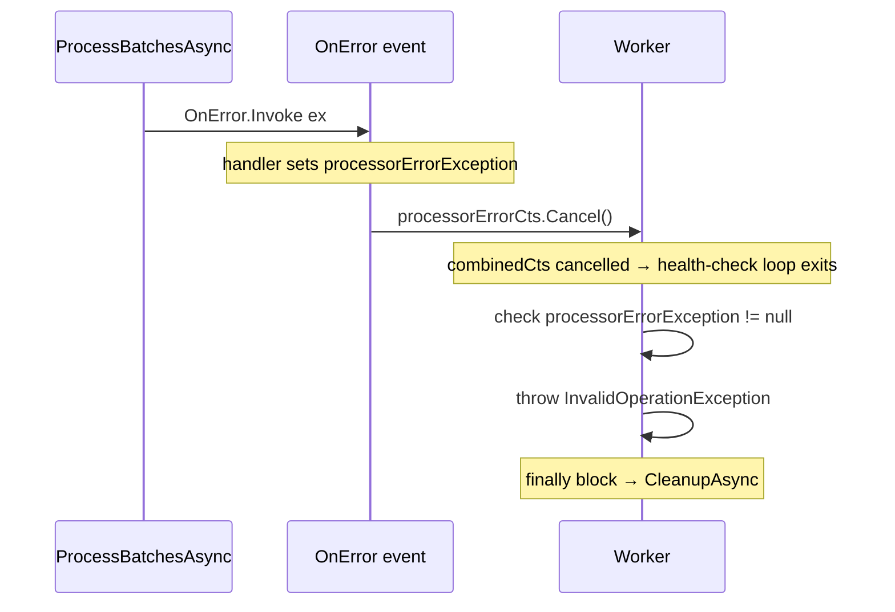
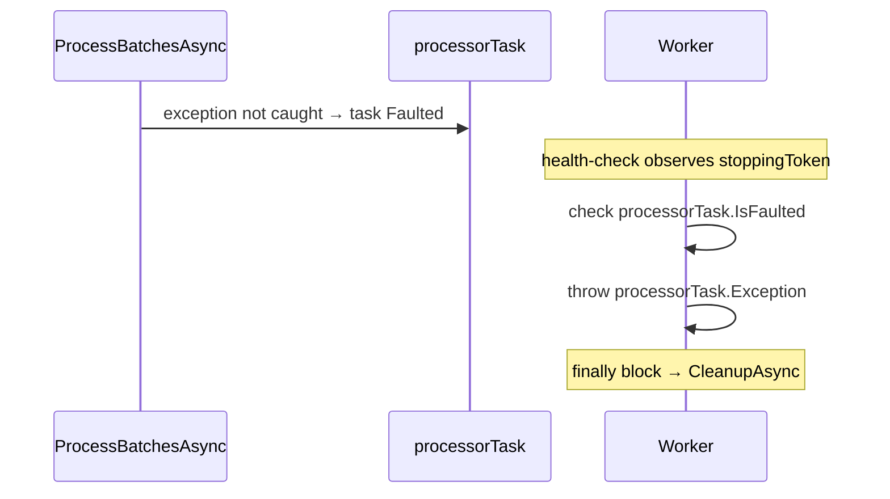

# План: Рефакторинг механизма ошибок MarketDataProcessor

## Проблема

Текущий паттерн `OnError` event в [`IMarketDataProcessor`](src/MarketDataCollector.Core/Interfaces/IMarketDataProcessor.cs:13) создаёт лишнюю сложность:

1. **`ProcessBatchAsync`** (строка 624) вызывает `OnError` при временной ошибке БД, но consumer **продолжает работать** → Worker умирает зря
2. **`ProcessBatchesAsync`** (строка 494) вызывает `OnError` при фатальной ошибке consumer'а — это единственное реальное применение
3. Worker использует сложную конструкцию: `processorErrorCts` + `processorErrorException` + `combinedCts` + `CreateLinkedTokenSource` — всё ради одного event'а
4. `processorTask.IsFaulted` проверка **никогда не срабатывает**, т.к. исключения перехватываются

## Решение

Заменить event-based паттерн на стандартный .NET task faulting:

- **Фатальные ошибки** (consumer loop упал) → exception пробрасывается → `processorTask.IsFaulted = true`
- **Временные ошибки** (ошибка БД в батче) → логируются, consumer продолжает → `processorTask` остаётся healthy
- Worker просто observe'ит `processorTask.IsFaulted` и throw'ит → cleanup в `finally`

## Схема до/после

### До



### После



## Изменения по файлам

### 1. [`IMarketDataProcessor.cs`](src/MarketDataCollector.Core/Interfaces/IMarketDataProcessor.cs)

- Удалить `event EventHandler<Exception>? OnError` (строка 13)
- Обновить XML-dокомментацию `StartProcessingAsync`: указать что фатальные ошибки пробрасываются через Task (IsFaulted)

### 2. [`MarketDataProcessor.cs`](src/MarketDataCollector.Application/Services/MarketDataProcessor.cs)

**ProcessBatchesAsync** (строки 489-500):
- Убрать `catch (Exception ex)` блок, который вызывает `OnError?.Invoke`
- Исключение пробрасывается через `finally` (финальный flush) → task becomes Faulted

**ProcessBatchAsync** (строки 619-625):
- Убрать `OnError?.Invoke(this, ex)`
- Оставить только `_logger.LogError(...)` — consumer продолжает работать

**Класс в целом:**
- Удалить `public event EventHandler<Exception>? OnError;` (строка 46)

### 3. [`Worker.cs`](src/MarketDataCollector.Workers/MarketDataCollector.Worker/Worker.cs)

**Упростить `RunWithRecoveryAsync`:**
- Удалить `processorErrorCts` (строка 48)
- Удалить `processorErrorException` (строка 49)
- Удалить подписку `marketDataProcessor.OnError += ...` (строки 59-64)
- Удалить `combinedCts` и `CreateLinkedTokenSource` (строка 82)
- Health-check loop использовать `stoppingToken` напрямую
- После health-check: проверить `processorTask.IsFaulted` → throw

**Итоговая структура `RunWithRecoveryAsync`:**
```csharp
try
{
    var processorTask = marketDataProcessor.StartProcessingAsync(stoppingToken);
    var aggregatorTask = tickAggregator.StartAsync(stoppingToken);

    // Запускаем WebSocket-клиентов
    await Task.WhenAll(clients.Select(c => c.StartAsync(stoppingToken)));

    // Health-check с прямым stoppingToken
    await RunHealthCheckAsync(clients, marketDataProcessor, stoppingToken);

    // Проверяем faulted task'ы
    if (processorTask.IsFaulted)
        throw new InvalidOperationException("MarketDataProcessor failed", processorTask.Exception?.InnerException);

    if (aggregatorTask.IsFaulted)
        throw new InvalidOperationException("TickAggregator failed", aggregatorTask.Exception?.InnerException);
}
catch (OperationCanceledException) { /* graceful shutdown */ }
catch (Exception ex) { _logger.LogCritical(ex, "..."); throw; }
finally { await CleanupAsync(...); }
```

### 4. Тесты [`MarketDataProcessorTests.cs`](tests/MarketDataCollector.Tests/Application/Services/MarketDataProcessorTests.cs)

**Тест 1: `ProcessBatchAsync_WhenRepositoryThrows_LogsErrorAndRaisesEvent`** (строка 418)
- Переименовать в `ProcessBatchAsync_WhenRepositoryThrows_LogsErrorAndConsumerContinues`
- Убрать проверку `OnError` event
- Проверять что логируется `LogError` с "Критическая ошибка"
- Проверять что consumer продолжает (следующий батч обрабатывается успешно)

**Тест 2: Тест с `errorCount`** (строка 652)
- Убрать `processor.OnError += (_, _) => Interlocked.Increment(ref errorCount)`
- Заменить проверку `errorCount.Should().Be(2)` на Verify логов `LogError`

**Тест 3: `ProcessBatchesAsync_RepeatedErrors_OnErrorFiredAndTaskCompletes`** (строка 1364)
- Переименовать в `ProcessBatchesAsync_ConsumerError_TaskFaulted`
- Убрать `OnError` subscription
- Проверять что `processorTask.IsFaulted == true`
- `StopProcessingAsync` может выбросить исключение (task Faulted) — обработать

## Порядок выполнения

1. Удалить `OnError` из [`IMarketDataProcessor`](src/MarketDataCollector.Core/Interfaces/IMarketDataProcessor.cs:13)
2. Удалить `OnError` из [`MarketDataProcessor`](src/MarketDataCollector.Application/Services/MarketDataProcessor.cs:46)
3. Изменить catch-блок в [`ProcessBatchesAsync`](src/MarketDataCollector.Application/Services/MarketDataProcessor.cs:489) — убрать OnError, пробросить исключение
4. Изменить catch-блок в [`ProcessBatchAsync`](src/MarketDataCollector.Application/Services/MarketDataProcessor.cs:619) — убрать OnError, оставить LogError
5. Упростить [`Worker.cs`](src/MarketDataCollector.Workers/MarketDataCollector.Worker/Worker.cs:31) — убрать CTS/event machinery
6. Обновить тесты в [`MarketDataProcessorTests.cs`](tests/MarketDataCollector.Tests/Application/Services/MarketDataProcessorTests.cs)
7. Запустить тесты
