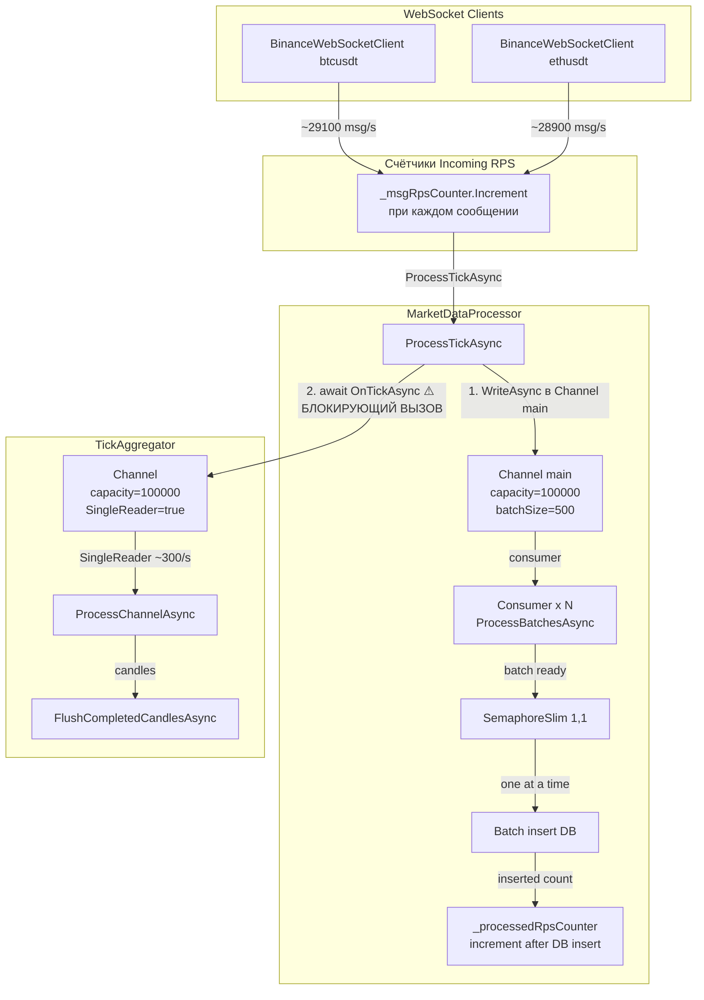

# Анализ и план исправления: Разрыв Incoming vs Processed RPS

## 1. Диагностика проблемы

### Наблюдение

```
Incoming=58200.0 msg/s, Processed=291.1 ticks/s
```

### Архитектура пайплайна



### Первопричина: блокировка в `MarketDataProcessor.ProcessTickAsync`

Файл: [`src/MarketDataCollector.Application/Services/MarketDataProcessor.cs:76-79`](../src/MarketDataCollector.Application/Services/MarketDataProcessor.cs:76)

```csharp
// Передаём тик в агрегатор (если он подключён)
if (_tickAggregator != null)
{
    await _tickAggregator.OnTickAsync(ticker, price, volume, timestamp, exchange);
}
```

Агрегатор TickAggregator создан с настройками:
- `SingleReader = true` — **только 1 consumer**
- `FullMode = BoundedChannelFullMode.Wait` — **блокируется при заполнении**

Файл: [`src/MarketDataCollector.Application/Services/TickAggregator.cs:101-106`](../src/MarketDataCollector.Application/Services/TickAggregator.cs:101)

```csharp
_channel = Channel.CreateBounded<TickData>(new BoundedChannelOptions(options.Value.ChannelCapacity)
{
    FullMode = BoundedChannelFullMode.Wait,
    SingleReader = true,
    SingleWriter = false
});
```

### Механизм деградации (пошагово)

1. WebSocket'ы отправляют **58200 msg/s** в `ProcessTickAsync`.
2. **Канал агрегатора** (capacity=100000) наполняется за ~1.7 секунды.
3. Как только он полон, `_tickAggregator.OnTickAsync(...)` блокируется на `WriteAsync`.
4. Это блокирует **весь** `ProcessTickAsync` → WebSocket-клиент не может принять следующее сообщение.
5. Consumer'ы основного канала простаивают (нет новых тиков).
6. Агрегатор с `SingleReader=true` перерабатывает ~300 msg/s.
7. Системный throughput = throughput самого медленного звена ≈ **300 ticks/s**.

### Почему Incoming показывает 58200?

Счётчик `_msgRpsCounter` в `BaseWebSocketClient` инкрементируется в `OnMessageReceived` (строка 366) **до вызова `ProcessMessageAsync`**, то есть до того как сообщение попадает в пайплайн. Он считает WebSocket-сообщения на уровне транспорта — они всё ещё приходят от биржи, но пайплайн их уже не успевает обрабатывать.

---

## 2. Варианты решения

### Вариант A: Fire-and-forget для TickAggregator (рекомендуемый)

Отвязать агрегатор от основного пайплайна, убрав `await`. Тики всё равно будут записываться в канал агрегатора, но блокировки не произойдёт.

**Плюсы:**
- Минимальные изменения кода
- Полностью устраняет блокировку
- Агрегатор будет получать тики с задержкой (graceful degradation)

**Минусы:**
- При переполнении канала агрегатора тики будут теряться (нужно использовать `DropNewest` или `DropOldest` вместо `Wait`)
- Нет гарантии, что все тики дойдут до агрегатора

**Изменения:**
1. Убрать `await` перед `_tickAggregator.OnTickAsync(...)`.
2. В конфигурации агрегатора сменить `FullMode` на `BoundedChannelFullMode.DropOldest`.
3. Заменить `SingleReader = true` на `SingleReader = false` для увеличения пропускной способности.

### Вариант B: Разделение пайплайнов (рекомендуемый)

Агрегатор и основной пайплайн получают данные параллельно без блокировок. Агрегатор подписывается как дополнительный reader на Channel.

**Плюсы:**
- Полная развязка компонентов
- Нет потери данных
- Агрегатор не влияет на throughput основного пайплайна

**Минусы:**
- Больше изменений кода
- TickAggregator начинает получать данные только после того как они прочитаны из Channel

**Суть:**
1. Убрать вызов `_tickAggregator.OnTickAsync()` из `ProcessTickAsync()`.
2. В `ProcessBatchesAsync()` передавать каждый прочитанный тик агрегатору **до** накопления батча.
3. Т.к. `ProcessBatchesAsync` выполняется параллельно в N потоках, агрегатор получает данные параллельно.

### Вариант C: Ограничение входящего потока (backpressure)

Добавить ограничение на количество тиков, передаваемых в `ProcessTickAsync` за секунду, либо использовать `DropOldest` на основном канале.

**Плюсы:**
- Контролируемая нагрузка
- Предсказуемое поведение

**Минусы:**
- Потеря данных
- Сложная настройка лимитов
- Не решает корневую причину

---

## 3. Рекомендуемое решение: Комбинация A + B

### Шаг 1 (Вариант A): Отвязать TickAggregator от блокировки

- В `ProcessTickAsync`: убрать `await`, использовать `_ = _tickAggregator.OnTickAsync(...)` или `Task.Run`.
- В конфигурации агрегатора: `FullMode = DropOldest`, `SingleReader = false`.

### Шаг 2 (Вариант B): Дополнительно — передача тиков через consumer'ов

- Убрать вызов `OnTickAsync` из `ProcessTickAsync` полностью.
- В `ProcessBatchesAsync` при чтении каждого тика из Channel вызывать `_tickAggregator.OnTickAsync(...)` **без await** (fire-and-forget).

### Шаг 3 (Опционально): Увеличить пропускную способность агрегатора

- Увеличить `ChannelCapacity` для агрегатора (например, с 100000 до 500000).
- Увеличить число reader'ов (`SingleReader = false`).

---

## 4. Todo-лист для реализации

- [ ] **4.1** Изменить `FullMode` канала TickAggregator с `Wait` на `DropOldest` в конфигурации [`TickAggregatorOptions`](../src/MarketDataCollector.Core/Configuration/TickAggregatorOptions.cs)
- [ ] **4.2** Изменить `SingleReader` с `true` на `false` в конструкторе [`TickAggregator.cs:104`](../src/MarketDataCollector.Application/Services/TickAggregator.cs:104)
- [ ] **4.3** Убрать блокирующий `await` перед `_tickAggregator.OnTickAsync()` в [`MarketDataProcessor.cs:78`](../src/MarketDataCollector.Application/Services/MarketDataProcessor.cs:78):
  - Вариант: перейти на fire-and-forget: `_ = _tickAggregator.OnTickAsync(ticker, price, volume, timestamp, exchange);`
- [ ] **4.4** (Опционально) Увеличить `ChannelCapacity` в `TickAggregatorOptions` для большей буферизации
- [ ] **4.5** (Опционально) Увеличить `ChannelCapacity` в `MarketDataProcessorOptions` для основного канала
- [ ] **4.6** Запустить тесты: `dotnet test`
- [ ] **4.7** Запустить приложение и проверить, что `Processed ~= Incoming / dedup_ratio`
