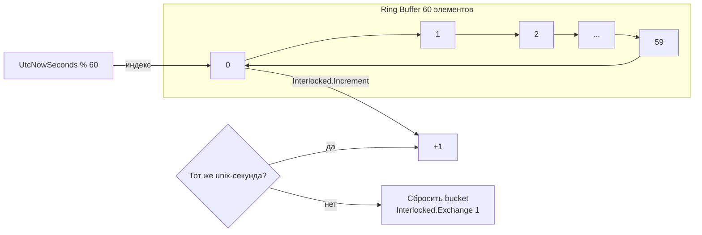

# План: Счётчик RPS (Requests Per Second)

## Цель

Добавить мониторинг производительности на двух уровнях:
1. **Входящие WebSocket сообщения/с** — количество полных сообщений, полученных от биржи
2. **Обработанные тики/с** — количество тиков, успешно сохранённых в БД (real throughput)

## Архитектура решения

### 1. SlidingWindowCounter (новый класс)

**Расположение:** `src/MarketDataCollector.Core/Utilities/SlidingWindowCounter.cs`

**Принцип работы:**
- Кольцевой буфер из 60 `long[]` элементов (1 элемент = 1 секунда)
- Индекс: `DateTimeOffset.UtcNow.ToUnixTimeSeconds() % 60`
- `Increment()` — `Interlocked.Increment` на текущий bucket, с авто-сбросом stale bucket
- `GetRps(int lastSeconds = 10)` — среднее за последние N секунд
- **Lock-free**, без таймеров, без аллокаций



### 2. Изменения в BaseWebSocketClient

**Файл:** `src/MarketDataCollector.Core/Clients/BaseWebSocketClient.cs`

- Добавить поле: `private readonly SlidingWindowCounter _msgRpsCounter = new();`
- В методе `OnMessageReceived(string message)` (строки ~359-362) — добавить `_msgRpsCounter.Increment();`
- В `IExchangeWebSocketClient` добавить метод `double GetMessagesPerSecond()`
- Реализация в `BaseWebSocketClient`: `return _msgRpsCounter.GetRps();`

### 3. Изменения в MarketDataProcessor

**Файл:** `src/MarketDataCollector.Application/Services/MarketDataProcessor.cs`

- Добавить поле: `private readonly SlidingWindowCounter _processedRpsCounter = new();`
- В методе `ProcessBatchAsync(...)`, **после успешного сохранения в БД** (строка ~179: `Interlocked.Add`), добавить цикл инкремента на каждый сохранённый тик:
  ```csharp
  for (int i = 0; i < entities.Count; i++)
      _processedRpsCounter.Increment();
  ```
- В `IMarketDataProcessor` добавить метод `double GetProcessedRps()`
- Реализация: `return _processedRpsCounter.GetRps();`

### 4. Изменения в Worker

**Файл:** `src/MarketDataCollector.Workers/MarketDataCollector.Worker/Worker.cs`

- В методе `RunHealthCheckAsync(...)`, внутри цикла `while (!stoppingToken...)`:
  - Собрать RPS с каждого клиента и суммарный RPS всех клиентов
  - Собрать processed RPS с `marketDataProcessor`
  - Записать в лог, например:
  ```
  RPS: Incoming=350.2 msg/s | Processed=345.8 ticks/s | Clients: binance_btcusdt=120.5, binance_ethusdt=115.3, ...
  ```

## Файлы для изменения/создания

| # | Действие | Файл | Описание |
|---|----------|------|----------|
| 1 | **NEW** | `src/MarketDataCollector.Core/Utilities/SlidingWindowCounter.cs` | Lock-free счётчик со скользящим окном |
| 2 | **MODIFY** | `src/MarketDataCollector.Core/Interfaces/IExchangeWebSocketClient.cs` | Добавить `double GetMessagesPerSecond()` |
| 3 | **MODIFY** | `src/MarketDataCollector.Core/Clients/BaseWebSocketClient.cs` | Добавить счётчик, инкремент в OnMessageReceived |
| 4 | **MODIFY** | `src/MarketDataCollector.Core/Interfaces/IMarketDataProcessor.cs` | Добавить `double GetProcessedRps()` |
| 5 | **MODIFY** | `src/MarketDataCollector.Application/Services/MarketDataProcessor.cs` | Добавить счётчик, инкремент после batch save |
| 6 | **MODIFY** | `src/MarketDataCollector.Workers/MarketDataCollector.Worker/Worker.cs` | Логирование RPS в health-check |

## Критерии готовности

- [ ] `SlidingWindowCounter` создан, корректно считает RPS (можно протестировать unit-тестом)
- [ ] `BaseWebSocketClient.OnMessageReceived` инкрементирует счётчик
- [ ] `BinanceWebSocketClient` (наследник) наследует функциональность без изменений
- [ ] `MarketDataProcessor.ProcessBatchAsync` инкрементирует счётчик после DB save
- [ ] В логах Worker появляется строка с RPS каждые 10 секунд
