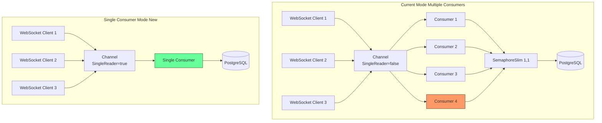

# Single Consumer Mode для MarketDataProcessor

## Проблема

В `MarketDataProcessor.cs` используется `Channel<TickData>` с `SingleReader = false` и запускается несколько (`consumerCount = 2-4`) параллельных consumer'ов. Каждый consumer читает из общего канала, набирает батч и вызывает `RawTickRepository.BulkCopyAsync()`.

Хотя `BulkCopyAsync` уже имеет `SemaphoreSlim(1,1)` для сериализации вставок, deadlock'и (PostgreSQL error 40P01) всё ещё возникают. Root cause: даже при сериализованной вставке, retry-логика + закрытие/открытие соединений + конкуренция за подключение к БД могут приводить к взаимоблокировкам.

## Решение

Добавить опциональный **Single Consumer Mode**, при котором запускается ровно 1 consumer с `SingleReader = true`. Это полностью исключает конкуренцию потоков за ресурсы и, как следствие, deadlock'и.

## Изменения

### 1. [`MarketDataProcessorOptions`](src/MarketDataCollector.Core/Configuration/MarketDataProcessorOptions.cs)

Добавить свойство:

```csharp
/// <summary>
/// Режим Single Consumer: использует ровно 1 consumer вместо N параллельных.
/// Полностью исключает deadlock'и за счёт отсутствия конкуренции потоков.
///
/// По результатам бенчмарка: Sequential mode c batch size 700 даёт ~62 680 ticks/sec,
/// что достаточно для текущей нагрузки.
/// </summary>
public bool UseSingleConsumer { get; set; } = false;
```

По умолчанию `false` — сохраняем текущее поведение.

### 2. [`MarketDataProcessor`](src/MarketDataCollector.Application/Services/MarketDataProcessor.cs)

**Изменения в конструкторе:**
- Добавить параметр `MarketDataProcessorOptions options` (вместо отдельных `batchSize`, `channelCapacity`)
- Либо передавать `bool useSingleConsumer` отдельно
- Сохранить `_useSingleConsumer` поле

**Изменения в `StartProcessingAsync()`:**
```csharp
if (_useSingleConsumer)
{
    // Single consumer mode — 1 consumer, SingleReader=true
    // Полностью исключает конкуренцию за семафор BulkCopyLock
    _channel = Channel.CreateBounded<TickData>(new BoundedChannelOptions(_channelCapacity)
    {
        FullMode = BoundedChannelFullMode.DropOldest,
        SingleReader = true,
        SingleWriter = false
    });
    _processingTask = ProcessBatchesAsync(cancellationToken);
}
else
{
    // Multiple consumers — как сейчас
    var consumerCount = Math.Clamp((int)Math.Ceiling(Environment.ProcessorCount / 2.0), 1, 4);
    var consumers = Enumerable.Range(0, consumerCount)
        .Select(_ => ProcessBatchesAsync(cancellationToken));
    _processingTask = Task.WhenAll(consumers);
}
```

**Важно:** Channel уже создаётся в конструкторе, поэтому нужно либо:
- Создавать Channel в `StartProcessingAsync()` (перенести инициализацию), либо
- Создавать Channel в конструкторе с правильными параметрами на основе `_useSingleConsumer`

**Рекомендуемый подход:** перенести создание Channel из конструктора в `StartProcessingAsync()`, чтобы параметры канала соответствовали режиму.

### 3. [`Program.cs`](src/MarketDataCollector.Workers/MarketDataCollector.Worker/Program.cs)

Передавать `MarketDataProcessorOptions` в конструктор `MarketDataProcessor`:

```csharp
builder.Services.AddSingleton<IMarketDataProcessor>(sp =>
{
    var scopeFactory = sp.GetRequiredService<IServiceScopeFactory>();
    var logger = sp.GetRequiredService<ILogger<MarketDataProcessor>>();
    var timeService = sp.GetRequiredService<ITimeService>();
    var options = sp.GetRequiredService<IOptions<MarketDataProcessorOptions>>().Value;
    var tickAggregator = sp.GetService<ITickAggregator>();
    
    return new MarketDataProcessor(
        scopeFactory,
        logger,
        timeService,
        options,          // весь объект опций вместо отдельных параметров
        tickAggregator
    );
});
```

### 4. [`appsettings.json`](src/MarketDataCollector.Workers/MarketDataCollector.Worker/appsettings.json)

Добавить настройку:

```json
"MarketDataProcessor": {
    "BatchSize": 800,
    "ChannelCapacity": 100000,
    "UseSingleConsumer": true
}
```

### 5. [`RawTickRepository.BulkCopyAsync()`](src/MarketDataCollector.Infrastructure/Repositories/RawTickRepository.cs)

**Важно:** `SemaphoreSlim(1,1)` остаётся как safety net на случай, если кто-то ещё вызывает `BulkCopyAsync` из другого места. Но с Single Consumer mode семафор никогда не будет contended.

## Диаграмма потоков



## План тестирования

1. **Unit test**: проверить, что `StartProcessingAsync()` с `UseSingleConsumer=true` запускает один consumer.
2. **Integration test**: проверить, что Single Consumer mode корректно обрабатывает тики через `ProcessTickAsync`.
3. **Benchmark**: сравнить пропускную способность single vs multiple consumers с текущей конфигурацией.

## Список файлов для изменений

| Файл | Изменение |
|------|-----------|
| `src/MarketDataCollector.Core/Configuration/MarketDataProcessorOptions.cs` | Добавить `UseSingleConsumer` |
| `src/MarketDataCollector.Application/Services/MarketDataProcessor.cs` | Реализовать single consumer mode |
| `src/MarketDataCollector.Workers/MarketDataCollector.Worker/Program.cs` | Передавать `MarketDataProcessorOptions` |
| `src/MarketDataCollector.Workers/MarketDataCollector.Worker/appsettings.json` | Добавить `UseSingleConsumer: true` |
| `tests/MarketDataCollector.Tests/Application/Services/MarketDataProcessorTests.cs` | Добавить тесты для single consumer |
