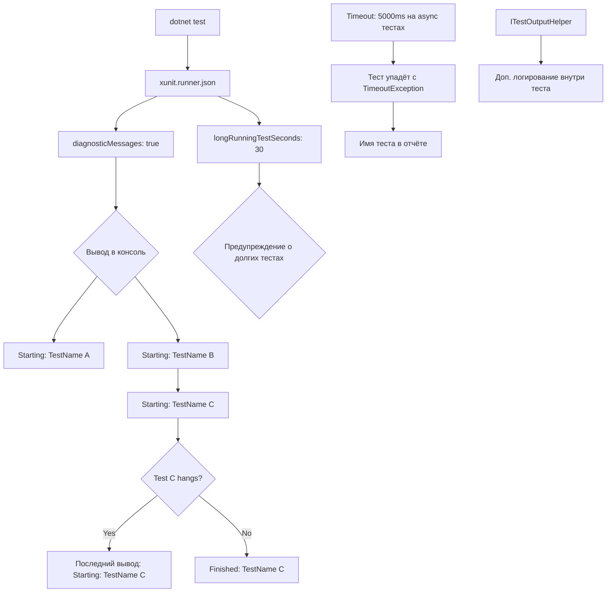

# План: Ограничение времени тестов и диагностика висящих тестов

## Проблема
Один из тестов в проекте `MarketDataCollector.Tests` зависает без какого-либо вывода. Невозможно определить, какой именно тест вызывает зависание.

## Решение (Вариант C — Комбинированный)

План включает **3 компонента**, работающие вместе:

---

### 1. xunit.runner.json — глобальная диагностика выполнения тестов

**Файл:** `tests/MarketDataCollector.Tests/xunit.runner.json`

Включит диагностический режим xUnit, который выводит в консоль имя **каждого теста в момент его старта**. Когда тест зависнет, последнее выведенное имя укажет на висящий тест.

```json
{
  "$schema": "https://xunit.net/schema/current/xunit.runner.schema.json",
  "diagnosticMessages": true,
  "longRunningTestSeconds": 30
}
```

- `diagnosticMessages: true` — выводит `Starting: TestName`, `Finished: TestName` в консоль
- `longRunningTestSeconds: 30` — предупреждает о тестах, выполняющихся дольше 30 секунд

---

### 2. ITestOutputHelper — логирование из тестов

Добавить `ITestOutputHelper` в конструкторы **всех тестовых классов** и выводить имя теста при старте через `_output.WriteLine($"=== Running: {nameof(TestMethod)} ===")`.

**Затрагиваемые файлы (9 классов):**

| # | Файл | Тестовый класс | Риск зависания |
|---|------|---------------|----------------|
| 1 | `Core/Clients/BaseWebSocketClientTests.cs` | `BaseWebSocketClientTests` | 🔴 Высокий |
| 2 | `Core/Clients/WebSocketMessageReceiverTests.cs` | `WebSocketMessageReceiverTests` | 🔴 Высокий |
| 3 | `Core/Clients/SubscriptionManagerTests.cs` | `SubscriptionManagerTests` | 🟡 Средний |
| 4 | `Core/Clients/WebSocketConnectionManagerTests.cs` | `WebSocketConnectionManagerTests` | 🟡 Средний |
| 5 | `Infrastructure/Clients/BinanceWebSocketClientTests.cs` | `BinanceWebSocketClientTests` | 🔴 Высокий |
| 6 | `Application/Services/MarketDataProcessorTests.cs` | `MarketDataProcessorTests` | 🟡 Средний |
| 7 | `Application/Services/MonitoringServiceTests.cs` | `MonitoringServiceTests` | 🟡 Средний |
| 8 | `Infrastructure/Factories/WebSocketClientFactoryTests.cs` | `WebSocketClientFactoryTests` | 🟡 Средний |
| 9 | `Infrastructure/Repositories/RawTickRepositoryTests.cs` | `RawTickRepositoryTests` | 🟢 Низкий |

**Пример изменений в классе:**
```csharp
public class BaseWebSocketClientTests
{
    private readonly ITestOutputHelper _output;
    
    public BaseWebSocketClientTests(ITestOutputHelper output)
    {
        _output = output;
        // ... existing code ...
    }
    
    [Fact]
    public async Task ConnectAsync_WhenNotConnected_CallsConnectionManager()
    {
        _output.WriteLine($"=== Running: {nameof(ConnectAsync_WhenNotConnected_CallsConnectionManager)} ===");
        // ... existing test code ...
    }
}
```

---

### 3. Timeout на async-тестах

xUnit поддерживает параметр `[Fact(Timeout = <ms>)]`. Если тест превышает таймаут, он прерывается и падает с `TimeoutException`, что позволяет сразу определить висящий тест по его имени в отчёте.

**Рекомендуемый таймаут:** `5000` мс (5 секунд) для async-тестов.
Для синхронных тестов таймаут не требуется — они мгновенные.

#### Полный список тестов для таймаута:

**BaseWebSocketClientTests (6 тестов):**
- `ConnectAsync_WhenAlreadyConnected_DoesNothing` — async
- `ConnectAsync_WhenNotConnected_CallsConnectionManagerAndStartsReceiveLoop` — async
- `ConnectAsync_WithSubscriptionManager_CallsSubscribeWithRetryAsync` — async
- `StopAsync_StopsBackgroundRecoveryLoop` — async (содержит `Task.Delay(100)`)
- `DisconnectAsync_WhenConnected_ClosesConnection` — async
- `DisconnectAsync_WhenNotConnected_DoesNothing` — async
- `DisposeAsync_DisposesResources` — async

**WebSocketMessageReceiverTests (6 тестов):**
- `StartReceiveLoopAsync_ReceivesCompleteMessage_CallsProcessMessage` — async
- `StartReceiveLoopAsync_ConnectionLost_BreaksLoop` — async
- `StartReceiveLoopAsync_MessageExceedsMaxSize_SkipsMessage` — async
- `StartReceiveLoopAsync_ReceiveThrowsException_CallsOnError` — async
- `StartReceiveLoopAsync_ProcessMessageThrows_CallsOnError` — async
- `StartReceiveLoopAsync_ReceiveCloseMessage_BreaksLoop` — async
- `StartReceiveLoopAsync_CancellationTokenRequested_StopsLoop` — async

**SubscriptionManagerTests (5 тестов):**
- `SubscribeWithRetryAsync_Success_NoRetries` — async
- `SubscribeWithRetryAsync_ThrowsException_RetriesUpToMax` — async
- `SubscribeWithRetryAsync_AllRetriesExhausted_Throws` — async
- `SubscribeWithRetryAsync_RetryDelayIsExponential` — async
- `SubscribeWithRetryAsync_SymbolPassedToAction` — async

**WebSocketConnectionManagerTests (7 тестов):**
- `ConnectAsync_WhenNotConnected_CreatesNewWebSocketAndConnects` — async
- `ConnectAsync_WhenAlreadyConnected_DoesNothing` — async
- `DisconnectAsync_WhenOpen_ClosesGracefully` — async
- `DisconnectAsync_WhenClosed_DoesNothing` — async
- `DisconnectAsync_WhenCloseThrows_LogsWarning` — async
- `SendAsync_WhenNotOpen_ThrowsInvalidOperationException` — async
- `SendAsync_WhenOpen_SendsMessage` — async
- `ReceiveAsync_WhenNotOpen_ThrowsInvalidOperationException` — async
- `ReceiveAsync_WhenOpen_ReturnsResult` — async

**BinanceWebSocketClientTests (все async тесты, ~10+ тестов):**
- Все тесты, помеченные `async Task` — HIGH RISK

**MarketDataProcessorTests (все async тесты, ~5+ тестов):**
- Тесты с `ProcessTickAsync`, `FlushAsync` и т.д. — MEDIUM RISK

**WebSocketClientFactoryTests (все async тесты, ~3+ теста):**
- Тесты с `CreateClientsAsync` — MEDIUM RISK

**RawTickRepositoryTests (все async тесты, ~10+ тестов):**
- Тесты с EF Core InMemory — от 5 до 10 секунд

---

### 4. Обновление скрипта run.ps1

Добавить флаг `--verbosity detailed` (или `-v d`) для более подробного вывода:

```powershell
dotnet test MarketDataCollector.Tests.csproj --no-build --verbosity detailed
```

---

## Итоговая схема работы



## Порядок реализации

1. Создать `tests/MarketDataCollector.Tests/xunit.runner.json`
2. Добавить `ITestOutputHelper` во все 9 тестовых классов (только в конструктор, с сохранением в поле)
3. Добавить `_output.WriteLine(...)` перед каждым **async** тестом
4. Добавить `[Fact(Timeout = 5000)]` на все async-тесты в **высокорисковых классах**
5. Добавить `[Fact(Timeout = 10000)]` на async-тесты в **среднерисковых классах**
6. Обновить `tests/run_test.ps1`
