# План: Отслеживание потери тиков в MarketDataCollector

## Проблема

В логах观察到 разрыв: `_processedCount=18814` на останове vs `_totalReceived=19200` в последнем периодическом логе.
Невозможно точно определить, сколько тиков потеряно и где, из-за отсутствия ключевых счётчиков.

## Точки потери (выявленные при анализе кода)

### 🔴 Точка 1: Channel `DropOldest` (MarketDataProcessor.cs:87)
Канал `_channel` создаётся с `FullMode = BoundedChannelFullMode.DropOldest`.
Когда канал заполнен (100 000 элементов), `WriteAsync` **молча** удаляет самый старый тик.
Нет логирования, нет счётчика дропов.

**Симптом**: Если `Incoming RPS > Processed RPS` продолжительное время, канал переполняется.
У нас `Incoming=1335 msg/s`, `Processed=1376 ticks/s` — всё OK при равномерной нагрузке,
но при bursts (deadlock retry, GC пауза) возможны дропы.

### 🟡 Точка 2: Нет счётчика входящих на входе ProcessTickAsync (MarketDataProcessor.cs:93)
`_totalReceivedCount` инкрементируется ТОЛЬКО в `ProcessBatchAsync` после чтения из канала.
Если тик дропнут в канале, он не учтён нигде.

### 🟡 Точка 3: Race condition при остановке (MarketDataProcessor.cs:191-219)
- Worker может отменить `combinedCts.Token` через `processorErrorCts` (Worker.cs:60)
- Это может прервать `ProcessBatchesAsync` до полного опустошения канала
- Финальный flush в `finally` блока `ProcessBatchesAsync` может не успеть

### 🟡 Точка 4: Нет логирования остатка в канале при остановке
При `_channel.Writer.TryComplete()` в канале может оставаться N необработанных тиков.
Мы не знаем, сколько.

## План доработок

### 1. Добавить счётчик входящих в `ProcessTickAsync`

**Файл**: `src/MarketDataCollector.Application/Services/MarketDataProcessor.cs`

Добавить поле `_totalIncomingCount` (Interlocked), которое инкрементируется при каждом входе в `ProcessTickAsync` ДО записи в канал.

```csharp
private int _totalIncomingCount;   // сколько тиков поступило в ProcessTickAsync
```

В `ProcessTickAsync` перед `_channel.Writer.WriteAsync`:
```csharp
Interlocked.Increment(ref _totalIncomingCount);
```

### 2. Добавить логирование дропнутых тиков из Channel

**Вариант A (простой)**: После остановки обработчика сравнить `_totalIncomingCount` и `_totalReceivedCount`. Разница = количество дропнутых каналом.

**Вариант B (продвинутый)**: Использовать `Channel<T>.Reader.Completion` + кастомный счётчик через обёртку над Channel, но это сложнее.

Рекомендуется **Вариант A** — достаточно для диагностики.

### 3. Логирование остатка в канале при TryComplete

Перед `_channel.Writer.TryComplete()` в `StopProcessingAsync`:
```csharp
var remaining = _channel.Reader.Count;
_logger.LogInformation("Остаток в канале данных перед завершением: {Count}", remaining);
```

### 4. Расширить финальное сообщение остановки

Вместо:
```csharp
_logger.LogInformation("Обработчик рыночных данных остановлен. Всего обработано: {Count}", _processedCount);
```

Сделать:
```csharp
var dropped = _totalIncomingCount - _totalReceivedCount;
var remaining = _channel?.Reader.Count ?? 0;
_logger.LogInformation(
    "Обработчик рыночных данных остановлен. " +
    "Всего входящих: {Incoming}, получено из канала: {Received}, вставлено: {Inserted}, " +
    "дропнуто каналом: {Dropped}, остаток в канале: {Remaining}",
    _totalIncomingCount, _totalReceivedCount, _processedCount, dropped, remaining);
```

### 5. Расширить health-check для сравнения потоков

В `Worker.cs` в `RunHealthCheckAsync` (строка 178) добавить:
```csharp
var incomingTotal = clients.Sum(c => c.GetTotalMessagesCount()); // новое свойство
var channelDropped = marketDataProcessor.GetTotalIncoming() - marketDataProcessor.GetTotalReceived();
```

Для этого в [`SlidingWindowCounter`](src/MarketDataCollector.Core/Utilities/SlidingWindowCounter.cs) — он уже считает RPS, но не total. Нужно добавить TotalCount.

### 6. Добавить `GetTotalMessagesCount()` в интерфейс

В [`IExchangeWebSocketClient`](src/MarketDataCollector.Core/Interfaces/IExchangeWebSocketClient.cs) и `BaseWebSocketClient`:
```csharp
long GetTotalMessagesCount();
```

В `BaseWebSocketClient._msgRpsCounter` уже есть `Increment()`, нужно добавить Total-счётчик.

### 7. Добавить идентификатор сессии

Добавить `Guid SessionId` в `MarketDataProcessor`, который генерируется при старте и логируется во все сообщения. Это позволит связать логи разных компонентов.

## Mermaid-диаграмма точек потерь

```mermaid
flowchart LR
    WS[WebSocket] -->|message| BWC[BinanceWebSocketClient.ProcessMessageAsync]
    BWC -->|parsed tick| PT[MarketDataProcessor.ProcessTickAsync]
    PT -->|_totalIncomingCount++| CH[Channel Writer.WriteAsync]
    CH -->|DropOldest если канал полон| DROP[DROP - без логирования]
    CH -->|успешно| CHQ[Channel Queue]
    CHQ -->|TryRead| PB[ProcessBatchAsync]
    PB -->|_totalReceivedCount += batch.Count| DEDUP[Дедупликация]
    DEDUP -->|uniqueTicks| BC[BulkCopyAsync]
    BC -->|_processedCount += inserted| DB[(PostgreSQL)]
    
    style DROP fill:#f96,stroke:#333,color:#000
    style PT fill:#ff9,stroke:#333,color:#000
```



## Ожидаемые логи после внедрения

```
info: MarketDataProcessor[0]
      Health-check: Incoming=7425 total, Channel received=7200 total, DB inserted=6601,
      Channel dropped=225, Remaining in channel=0
      
info: MarketDataProcessor[0]
      Обработчик рыночных данных остановлен. 
      Session={SessionId}, Всего входящих: 19850, Получено из канала: 19200, 
      Вставлено в БД: 18814, Дропнуто каналом: 650, Остаток в канале: 0
```

## Приоритет выполнения

| № | Задача | Сложность | Эффект |
|---|--------|-----------|--------|
| 1 | Счётчик `_totalIncomingCount` в ProcessTickAsync | ★☆☆ | Увидим разницу incoming vs received |
| 2 | Логирование остатка канала при остановке | ★☆☆ | Увидим, не успел ли дочитаться канал |
| 3 | Расширенное финальное сообщение | ★☆☆ | Полная картина в одном логе |
| 4 | Total-счётчик в WebSocket клиент | ★★☆ | Сравнение message от WS vs in channel |
| 5 | Health-check с Total счётчиками | ★★★ | Real-time мониторинг потерь |
