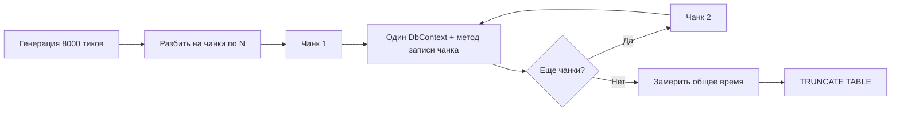
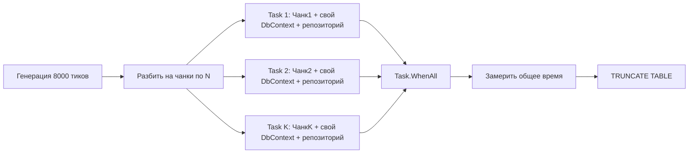
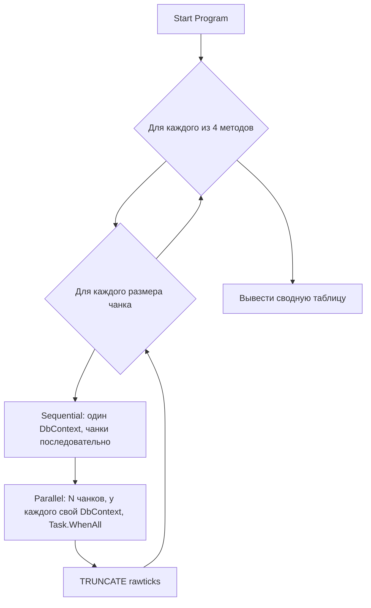

# План: Бенчмарк скорости записи тиков в PostgreSQL

## Цель
Создать отдельный консольный проект для тестирования скорости записи тиков в текущую БД (PostgreSQL 16, `MarketDataDb`) четырьмя разными методами, в sequential и parallel режимах, с варьированием размера чанков. Все тесты работают **пакетно** — весь чанк передаётся одним вызовом (один `SaveChangesAsync` / один SQL batch / одна Binary COPY).

## Тестируемые методы записи

| Метод | Описание | Механизм |
|-------|----------|----------|
| `AddAsync` | Пакетная вставка через EF Core | Для каждого тика в чанке вызывается `AddAsync()`, затем **один** `SaveChangesAsync()` на весь чанк |
| `AddRangeAsync` | Пакетная вставка через EF Core | `dbSet.AddRangeAsync()` + один `SaveChangesAsync()` на чанк |
| `BulkInsertIgnoreConflictsAsync` | Массовая вставка raw SQL | `INSERT INTO ... VALUES (...), (...), ... ON CONFLICT DO NOTHING` (весь чанк одним запросом) |
| `BulkCopyAsync` | Binary COPY protocol | Временная temp table -> Binary COPY -> INSERT INTO ... ON CONFLICT DO NOTHING (весь чанк одной пачкой) |

## Размеры чанков для каждого теста
- 100, 250, 500, 800 записей на чанк

## Фиксированное общее количество тиков
- **8000 записей** на каждый тест (одинаково для sequential и parallel, чтобы результаты были сравнимы)
- Sequential: чанки по N записей пишутся последовательно, общее время = сумма времени всех чанков
- Parallel: чанки по N записей пишутся одновременно, общее время = от запуска до завершения всех

## Параллельный режим (Parallel)
- Каждый чанк пишется в **отдельном DbContext** (свой `MarketDataDbContext` + свой `RawTickRepository`)
- Запуск через `Task.WhenAll(chunks.Select(chunk => Task.Run(() => WriteMethod(chunk, ownDbContext))))`
- Итого: допустим, чанк = 800, тогда 10 параллельных Task'ов, каждый со своим DbContext

## Структура проекта

```
tests/TickWriteBenchmark/
├── TickWriteBenchmark.csproj
├── Program.cs                       # Точка входа, orchestrator тестов
├── BenchmarkConfig.cs               # Конфигурация (connection string, chunk sizes)
├── BenchmarkRunner.cs               # Запуск тестов, сбор метрик
├── TickDataGenerator.cs             # Генератор тестовых RawTick
├── ResultsFormatter.cs              # Форматирование и вывод результатов
└── TableCleaner.cs                  # TRUNCATE TABLE после каждого теста
```

### Схема потоков выполнения

#### Sequential тест


#### Parallel тест


### Маршрут выполнения всех тестов



## Детали реализации

### 1. TickWriteBenchmark.csproj
- TargetFramework: `net8.0`
- Project References:
  - `MarketDataCollector.Domain` (для RawTick entity, ITimeService)
  - `MarketDataCollector.Infrastructure` (для RawTickRepository, MarketDataDbContext, SystemTimeService)
- Package References:
  - `Microsoft.Extensions.Logging.Abstractions` - для подавления логов

### 2. BenchmarkConfig.cs
- ConnectionString: `"Host=localhost;Port=5433;Database=MarketDataDb;Username=marketdata_user;Password=StrongPassword123!;sslmode=Disable;No Reset On Close=true;Keepalive=30"`
- ChunkSizes: `[100, 250, 500, 800]`
- TotalTicks: `8000`
- Получить ChunksCount: `TotalTicks / ChunkSize` (для каждого размера чанка своё)

### 3. TickDataGenerator.cs
- Статический метод `GenerateTicks(int count)` — возвращает `List<RawTick>`
- Параметры: ticker = "BENCHTEST", exchange = "BENCH", timestamp = UTC now с инкрементом на 100ns
- Использует `SystemTimeService`

### 4. BenchmarkRunner.cs - orchestrator

Основной метод `RunAllBenchmarks()`:
```
var results = new List<BenchmarkResult>();

foreach (var method in methods)       // 4 метода
    foreach (var chunkSize in chunkSizes)  // 4 чанка
    {
        // Sequential
        var seqResult = RunSequential(method, chunkSize);
        results.Add(seqResult);
        
        // Clean table
        await cleaner.TruncateAsync();
        
        // Parallel
        var parResult = RunParallel(method, chunkSize);
        results.Add(parResult);
        
        // Clean table
        await cleaner.TruncateAsync();
    }
```

**Sequential реализация:**
- Создаётся один DbContext
- Генерируется 8000 тиков, разбиваются на чанки
- Каждый чанк передаётся в соответствующий метод репозитория
- Замеряется общее время Stopwatch

**Parallel реализация:**
- Генерируется 8000 тиков, разбиваются на чанки
- Для каждого чанка создаётся свой DbContext и RawTickRepository
- Все чанки запускаются через `Task.WhenAll(...)` + `Task.Run()`
- Замеряется общее время от старта до завершения WhenAll

### 5. Метрики на каждый тест (BenchmarkResult)
- Method name: string
- Mode: "Sequential" | "Parallel"
- ChunkSize: int
- TotalTicks: 8000
- ChunksCount: int
- ElapsedMs: double (общее время)
- TicksPerSec: double (TotalTicks / ElapsedMs * 1000)

### 6. TableCleaner.cs
- `TRUNCATE TABLE rawticks;`
- Выполняется через `_context.Database.ExecuteSqlRawAsync()`
- После каждого теста (sequential и parallel)

### 7. ResultsFormatter.cs
- Принимает `List<BenchmarkResult>`
- Выводит в консоль таблицу:

```
================================================================================
TICK WRITE BENCHMARK RESULTS  (8000 ticks per test)
================================================================================
Method                    Mode       ChunkSize   Chunks   Time(ms)   Ticks/sec
--------------------------------------------------------------------------------
AddAsync                 Sequential     100       80       12345       648.0
AddAsync                 Sequential     250       32       10000       800.0
AddAsync                 Parallel       100       80        9876       810.0
...                      ...            ...       ...       ...         ...
BulkCopyAsync            Parallel       800       10         345     23188.4
--------------------------------------------------------------------------------
```

- Сортировка: сначала группировка по методу, внутри сначала sequential, потом parallel
- От меньшего чанка к большему

### 8. Program.cs
```csharp
var config = new BenchmarkConfig();
var generator = new TickDataGenerator();
var cleaner = new TableCleaner(config.ConnectionString);
var runner = new BenchmarkRunner(config, generator, cleaner);
var results = await runner.RunAllBenchmarks();
ResultsFormatter.Print(results);
Console.ReadKey();
```

### 9. run_benchmark.ps1
```powershell
$projectDir = "tests/TickWriteBenchmark"
$project = "$projectDir/TickWriteBenchmark.csproj"
dotnet run --project $project -c Release
```

## Порядок выполнения (Todo list)

1. **Создать проект `tests/TickWriteBenchmark/TickWriteBenchmark.csproj`**
   - Project References на Domain и Infrastructure

2. **Добавить проект в solution** (`dotnet sln add`)

3. **Создать `BenchmarkConfig.cs`** — connection string, chunk sizes, total ticks

4. **Создать `TickDataGenerator.cs`** — генерация 8000 тиков с уникальными timestamp

5. **Создать `TableCleaner.cs`** — TRUNCATE TABLE rawticks

6. **Создать `BenchmarkRunner.cs`** — orchestrator:
   - `RunAllBenchmarksAsync()` — цикл по методам / чанкам
   - `RunSequentialAsync(Method, ChunkSize)` — один DbContext, чанки последовательно
   - `RunParallelAsync(Method, ChunkSize)` — свой DbContext на чанк, Task.WhenAll

7. **Создать `ResultsFormatter.cs`** — вывод сводной таблицы

8. **Создать `Program.cs`** — точка входа

9. **Создать `run_benchmark.ps1`** — скрипт запуска

10. **Проверить сборку и запуск**
