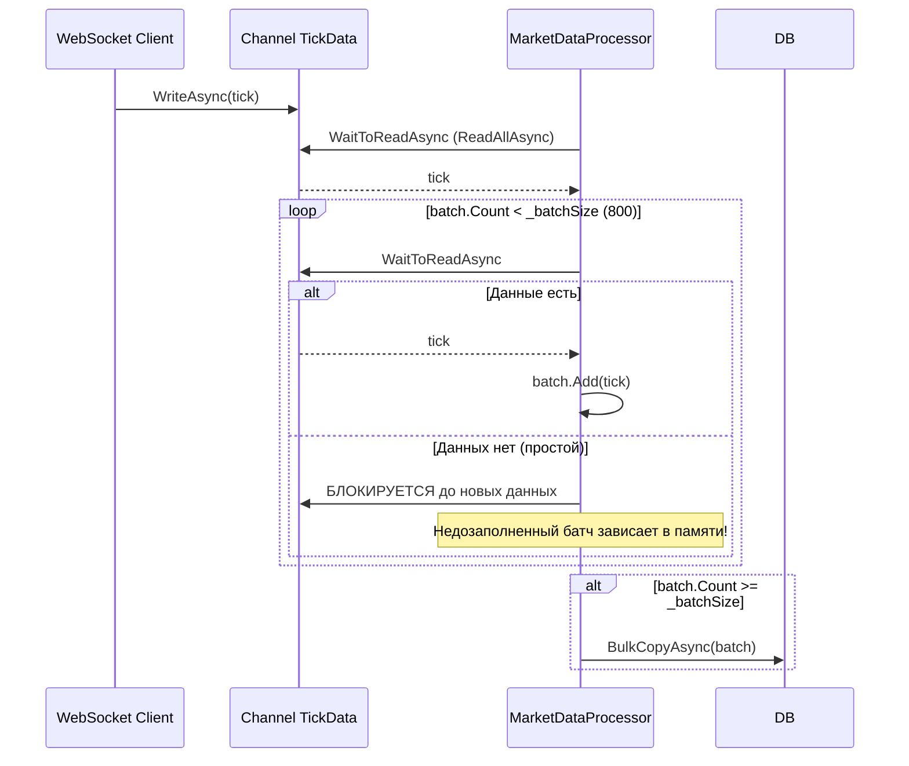
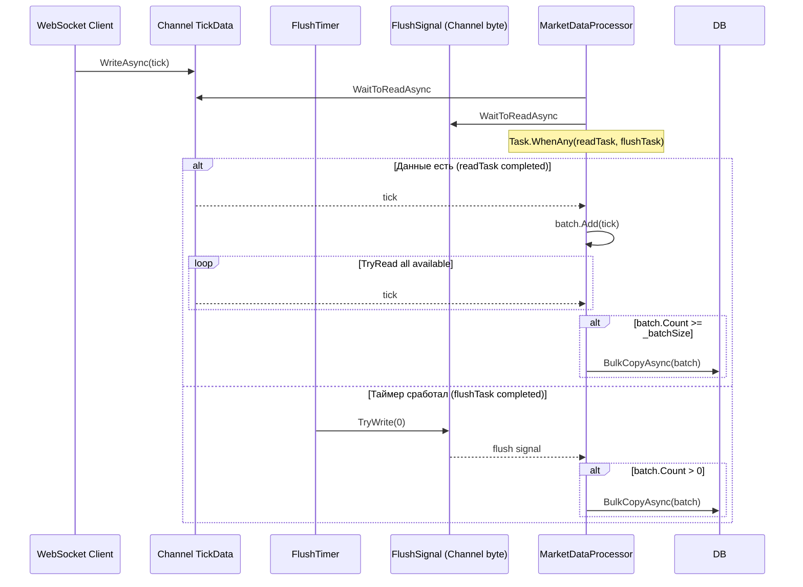

# План: Таймерный сброс частичных батчей при простое

## Проблема

В текущей реализации [`MarketDataProcessor.ProcessBatchesAsync`](src/MarketDataCollector.Application/Services/MarketDataProcessor.cs:172) батч сбрасывается в БД только при достижении `_batchSize` (800 тиков). Если поток данных прерывается (WebSocket отключён, внешний сервер недоступен), недозаполненный батч остаётся в памяти на неопределённое время, пока:

- Не придёт достаточно новых тиков (сервер переподключится)
- Или не будет остановлен Worker (финальный flush в `finally`)

Это приводит к задержкам в появлении данных в БД при переподключениях.

## Архитектура решения

Добавить таймерный сброс частичных батчей — аналогично тому, как это сделано в [`TickAggregator`](src/MarketDataCollector.Application/Services/TickAggregator.cs:129) (свойство `FlushIntervalSeconds`).

### Текущий код: бесконечное ожидание новых тиков



### Целевой код: таймерный сброс



## Детальный план изменений

### 1. [`MarketDataProcessorOptions`](src/MarketDataCollector.Core/Configuration/MarketDataProcessorOptions.cs)

Добавить свойство `FlushIntervalSeconds`:

```csharp
/// <summary>
/// Интервал принудительного сброса неполных батчей в БД (в секундах).
/// Если за это время не набрался полный батч (BatchSize), 
/// частичный батч сбрасывается принудительно.
/// 0 = отключено (только полные батчи, как сейчас).
/// </summary>
public int FlushIntervalSeconds { get; set; } = 5;
```

### 2. [`MarketDataProcessor`](src/MarketDataCollector.Application/Services/MarketDataProcessor.cs)

#### 2.1 Новые поля

```csharp
private readonly int _flushIntervalSeconds;
private readonly Channel<byte> _flushSignal;
private Timer? _flushTimer;
```

Где `_flushSignal` — специальный канал-сигнал ёмкостью 1 с `DropOldest`. Таймер пишет в него 1 байт, процессор читает и сбрасывает частичный батч.

#### 2.2 Изменения в конструкторе

- Сохранить `_flushIntervalSeconds` из опций
- Создать `_flushSignal = Channel.CreateBounded<byte>(new BoundedChannelOptions(1) { FullMode = DropOldest, SingleReader = true, SingleWriter = false })`

#### 2.3 Изменения в [`StartProcessingAsync`](src/MarketDataCollector.Application/Services/MarketDataProcessor.cs:92)

После запуска `_processingTask` запустить таймер:

```csharp
if (_flushIntervalSeconds > 0)
{
    _flushTimer = new Timer(
        _ => _flushSignal.Writer.TryWrite(0),
        null,
        TimeSpan.FromSeconds(_flushIntervalSeconds),
        TimeSpan.FromSeconds(_flushIntervalSeconds));
}
```

#### 2.4 Изменения в [`StopProcessingAsync`](src/MarketDataCollector.Application/Services/MarketDataProcessor.cs:153)

Перед завершением канала:

```csharp
_flushTimer?.Dispose();
_flushTimer = null;
_flushSignal.Writer.TryComplete();
```

#### 2.5 Изменения в [`ProcessBatchesAsync`](src/MarketDataCollector.Application/Services/MarketDataProcessor.cs:172)

Заменить блокирующий `await foreach (var tick in _channel.Reader.ReadAllAsync(...))` на цикл с `Task.WhenAny` для двух сигналов:

```csharp
private async Task ProcessBatchesAsync(CancellationToken cancellationToken)
{
    var batch = new List<TickData>(_batchSize);
    var flushReader = _flushSignal.Reader;

    try
    {
        while (!cancellationToken.IsCancellationRequested)
        {
            // Ждём либо новый тик, либо сигнал сброса от таймера
            var readTask = _channel.Reader.WaitToReadAsync(cancellationToken).AsTask();
            var flushTask = flushReader.WaitToReadAsync(cancellationToken).AsTask();
            var completed = await Task.WhenAny(readTask, flushTask);

            cancellationToken.ThrowIfCancellationRequested();

            if (completed == readTask && readTask.Result)
            {
                // Вычитываем все доступные тики из канала
                while (_channel.Reader.TryRead(out var tick))
                {
                    batch.Add(tick);
                    if (batch.Count >= _batchSize)
                    {
                        await ProcessBatchAsync(batch, cancellationToken);
                        batch.Clear();
                    }
                }
            }

            // Сброс частичного батча по таймеру или при завершении канала
            if (batch.Count > 0 && 
                (completed == flushTask || (completed == readTask && !readTask.Result)))
            {
                await ProcessBatchAsync(batch, cancellationToken);
                batch.Clear();
            }

            // Потребляем сигнал сброса, если он был триггером
            if (completed == flushTask)
            {
                while (flushReader.TryRead(out _)) { }
            }
        }
    }
    catch (OperationCanceledException) when (cancellationToken.IsCancellationRequested) { }
    catch (ChannelClosedException) { }
    finally
    {
        if (batch.Count > 0)
            await ProcessBatchAsync(batch, CancellationToken.None);
    }
}
```

**Важные моменты:**

- `Task.WhenAny` не отменяет проигравшую задачу — она остаётся in-flight. Но это безопасно:
  - Для `WaitToReadAsync`: следующая итерация создаст новый `ValueTask`
  - Для `flushReader.WaitToReadAsync`: сигнал уже потреблён, следующий вызов будет ждать нового
  
  **UPDATE**: У `ChannelReader.WaitToReadAsync` есть особенность — если `ValueTask` не consumed (не await'ed), `TryRead` может не работать. Нужно быть осторожнее. После `Task.WhenAny` для проигравшей задачи нужно вызвать `.AsTask()` `.GetAwaiter()`... или использовать отдельный `CancellationTokenSource` подход.

  **Принятое решение**: Использовать `CancellationTokenSource` для сигнала сброса (как альтернатива `Channel<byte>`). Это проще и надёжнее:

```csharp
private Timer _flushTimer;
private CancellationTokenSource _flushCts = new();

// Timer callback:
void OnFlushTimer(object? state)
{
    var oldCts = Interlocked.Exchange(ref _flushCts, new CancellationTokenSource());
    oldCts?.Cancel();
    oldCts?.Dispose();
}

public async Task StopProcessingAsync(CancellationToken cancellationToken = default)
{
    _flushTimer?.Dispose();
    _flushCts.Cancel(); // финальный сигнал
    // ... rest of existing code
}
```

А в `ProcessBatchesAsync`:

```csharp
while (!cancellationToken.IsCancellationRequested)
{
    var localCts = Volatile.Read(ref _flushCts);
    using var linkedCts = CancellationTokenSource.CreateLinkedTokenSource(
        cancellationToken, localCts.Token);
    
    try
    {
        await foreach (var tick in _channel.Reader.ReadAllAsync(linkedCts.Token))
        {
            batch.Add(tick);
            if (batch.Count >= _batchSize)
            {
                await ProcessBatchAsync(batch, cancellationToken);
                batch.Clear();
            }
        }
        break; // Channel completed normally
    }
    catch (OperationCanceledException) when (!cancellationToken.IsCancellationRequested)
    {
        // Flush signal received
        if (batch.Count > 0)
        {
            await ProcessBatchAsync(batch, cancellationToken);
            batch.Clear();
        }
        // Continue to outer while, get new flushCts
    }
}
```

**НО** этот подход создаёт новый `linkedCts` на каждой итерации и использует `ReadAllAsync` повторно — это допустимо, т.к. `ReadAllAsync` возвращает новый энумератор при каждом вызове, продолжая с того места, где остановился `ChannelReader`.

Однако есть нюанс: `ReadAllAsync` возвращает `IAsyncEnumerable`, и при повторном вызове после `OperationCanceledException` внутренний энумератор продолжает читать канал с того же места. **Это корректно.**

Но есть **проблема производительности**: на каждый флаш мы создаём новый `CancellationTokenSource` и `linkedCts`, плюс заново запускаем `ReadAllAsync`. Для высоконагруженной системы это может быть дорого.

**ОКОНЧАТЕЛЬНОЕ РЕШЕНИЕ**: Использовать `Channel<byte>` с `Task.WhenAny`, так как:
- Нет аллокаций `CancellationTokenSource` на каждый флаш
- Таймер просто пишет в канал — минимальный overhead
- `Task.WhenAny` создаёт `Task` из `ValueTask`, но это не проблема — GC-friendly

```csharp
private async Task ProcessBatchesAsync(CancellationToken cancellationToken)
{
    var batch = new List<TickData>(_batchSize);
    var flushReader = _flushSignal.Reader;

    try
    {
        while (true)
        {
            cancellationToken.ThrowIfCancellationRequested();

            var readTask = _channel.Reader.WaitToReadAsync(cancellationToken);
            var flushTask = flushReader.WaitToReadAsync(cancellationToken);

            // Ожидаем первый завершившийся сигнал
            // NOTE: WaitToReadAsync возвращает ValueTask<bool>,
            // преобразуем в Task для Task.WhenAny
            var completed = await Task.WhenAny(readTask.AsTask(), flushTask.AsTask());

            if (completed == readTask.AsTask() && readTask.Result)
            {
                // Есть данные — вычитываем всё доступное
                while (_channel.Reader.TryRead(out var tick))
                {
                    batch.Add(tick);
                    if (batch.Count >= _batchSize)
                    {
                        await ProcessBatchAsync(batch, cancellationToken);
                        batch.Clear();
                    }
                }
            }

            // Сброс: если есть частичный батч И (таймер сработал ИЛИ канал завершён)
            if (batch.Count > 0)
            {
                bool shouldFlush = false;

                if (completed == flushTask.AsTask() && flushTask.Result)
                {
                    // Сигнал от таймера
                    flushReader.TryRead(out _); // потребляем сигнал
                    shouldFlush = true;
                }
                else if (completed == readTask.AsTask() && !readTask.Result)
                {
                    // Канал завершён (TryComplete вызван)
                    shouldFlush = true;
                }

                if (shouldFlush)
                {
                    await ProcessBatchAsync(batch, cancellationToken);
                    batch.Clear();
                }
            }

            // Если канал завершён — выходим
            if (completed == readTask.AsTask() && !readTask.Result)
                break;
        }
    }
    catch (OperationCanceledException) when (cancellationToken.IsCancellationRequested) { }
    catch (ChannelClosedException) { }
    finally
    {
        if (batch.Count > 0)
            await ProcessBatchAsync(batch, CancellationToken.None);
    }
}
```

### 3. [`appsettings.json`](src/MarketDataCollector.Workers/MarketDataCollector.Worker/appsettings.json)

Добавить в секцию `MarketDataProcessor`:

```json
"MarketDataProcessor": {
  "BatchSize": 800,
  "ChannelCapacity": 100000,
  "UseSingleConsumer": true,
  "FlushIntervalSeconds": 5
}
```

### 4. Тесты

#### 4.1 Обновить существующие тесты

В тестах, где создаётся `MarketDataProcessorOptions`, будет нужно добавить `FlushIntervalSeconds = 0` (по умолчанию), чтобы таймер не влиял на существующие тесты.

#### 4.2 Добавить новый тест

Создать тест "FlushTimer_FlushesPartialBatch_OnTimerTick" в [`MarketDataProcessorTests.cs`](tests/MarketDataCollector.Tests/Application/Services/MarketDataProcessorTests.cs):

```csharp
[Fact]
public async Task FlushTimer_FlushesPartialBatch_OnTimerTick()
{
    // Arrange
    var options = new MarketDataProcessorOptions
    {
        BatchSize = 100,       // большой batch
        ChannelCapacity = 1000,
        FlushIntervalSeconds = 1, // таймер каждую секунду
        UseSingleConsumer = true
    };
    
    var processor = new MarketDataProcessor(...);
    await processor.StartProcessingAsync(cts.Token);
    
    // Act: отправляем 5 тиков (меньше BatchSize)
    for (int i = 0; i < 5; i++)
        await processor.ProcessTickAsync(...);
    
    // Ждём срабатывания таймера
    await Task.Delay(1500);
    
    // Assert: частичный батч должен быть сброшен
    var count = await processor.GetProcessedCountAsync();
    Assert.Equal(5, count);
}
```

## Риски и замечания

1. **Multi-consumer mode**: При `UseSingleConsumer = false` несколько потоков конкурируют за данные из одного `Channel`. `_flushSignal` ёмкостью 1 с `DropOldest` корректно работает только для single-consumer. Для multi-consumer режима рекомендуется использовать `UseSingleConsumer = true`. При желании поддержать multi-consumer — увеличить ёмкость `_flushSignal` до 4 и на каждый тик таймера писать `consumerCount` сигналов.

2. **Производительность**: `Task.WhenAny` с `AsTask()` создаёт аллокации. Для high-frequency trading это может быть заметно. Альтернатива — polling-based подход с `WaitToReadAsync(timeout)`, но текущее API `ChannelReader` не поддерживает timeout напрямую.

3. **Гонка таймера с естественным заполнением батча**: Если таймер срабатывает в момент, когда батч уже заполнен до `_batchSize` и `ProcessBatchAsync` выполняется, сигнал сброса будет проигнорирован (batch.Count == 0 после clear). Это корректное поведение.

4. **Deadlock с BulkcopyLock**: Вызов `ProcessBatchAsync` внутри цикла может конкурировать с `BulkCopyLock` семафором в `RawTickRepository`. Это не новая проблема — она уже решена существующим семафором. Таймерный сброс не усугубляет ситуацию.

## Связанные файлы

| Файл | Изменения |
|------|-----------|
| [`MarketDataProcessorOptions.cs`](src/MarketDataCollector.Core/Configuration/MarketDataProcessorOptions.cs) | + свойство `FlushIntervalSeconds` |
| [`MarketDataProcessor.cs`](src/MarketDataCollector.Application/Services/MarketDataProcessor.cs) | + таймер, сигнальный канал, модификация циклов |
| [`appsettings.json`](src/MarketDataCollector.Workers/MarketDataCollector.Worker/appsettings.json) | + `FlushIntervalSeconds: 5` |
| [`MarketDataProcessorTests.cs`](tests/MarketDataCollector.Tests/Application/Services/MarketDataProcessorTests.cs) | + новый тест, обновление конструкторов |
